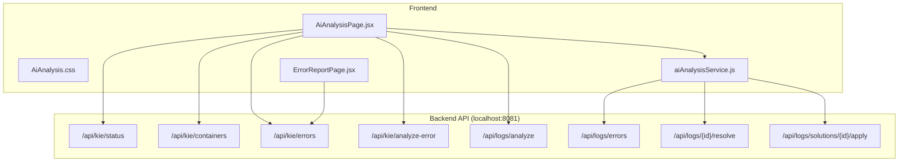
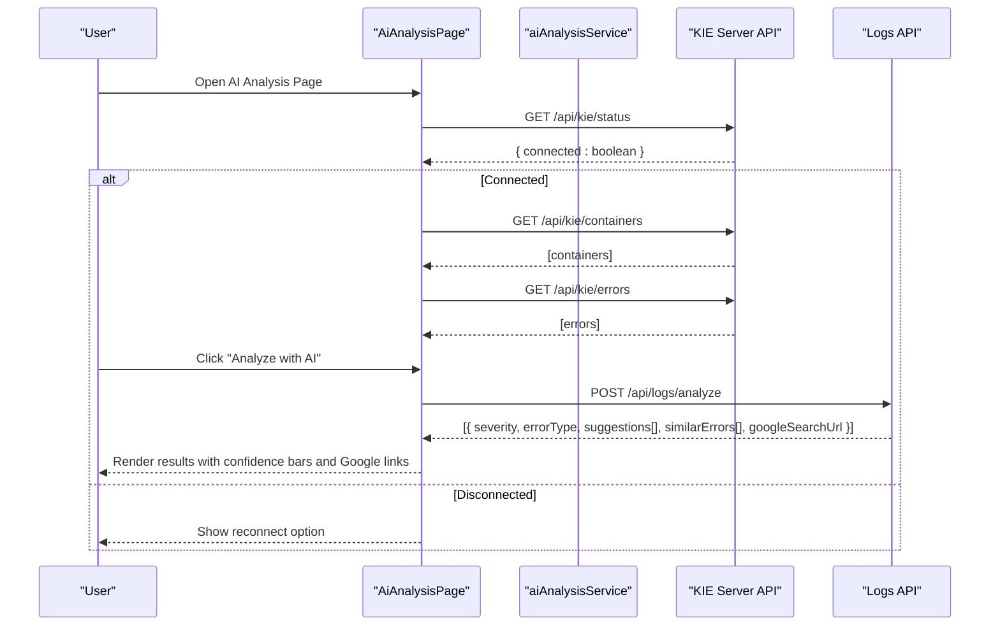
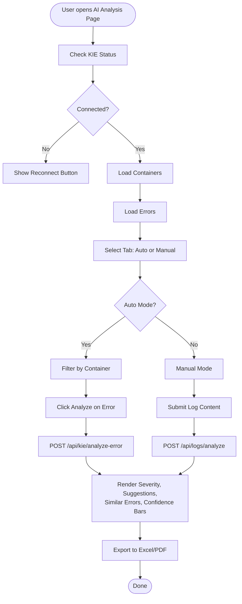
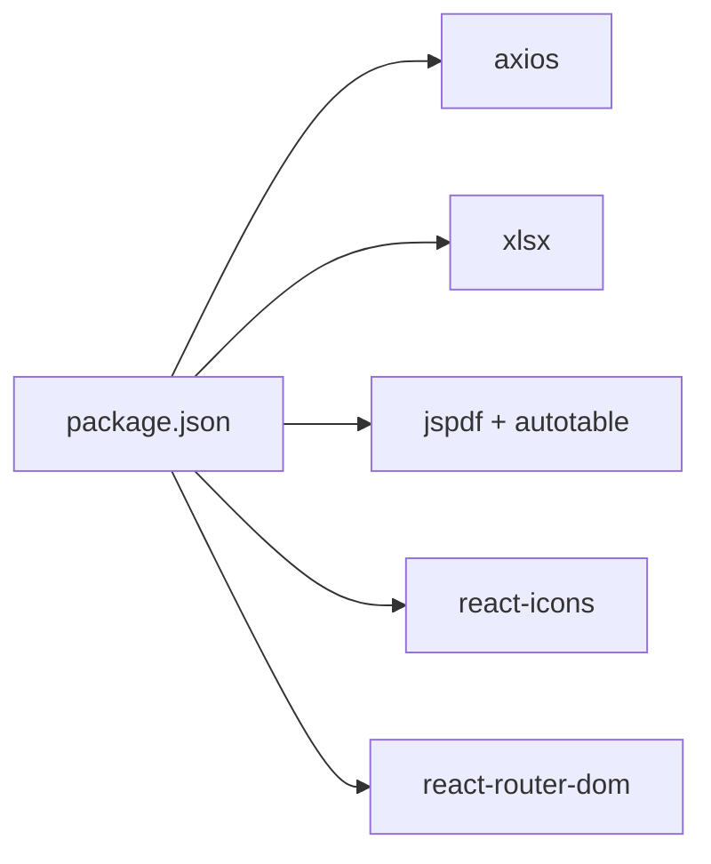

# AI Analysis Engine

<cite>
**Referenced Files in This Document**
- [AiAnalysisPage.jsx](file://src/components/AiAnalysisPage.jsx)
- [AiAnalysis.css](file://src/components/AiAnalysis.css)
- [aiAnalysisService.js](file://src/services/aiAnalysisService.js)
- [ErrorReportPage.jsx](file://src/components/ErrorReportPage.jsx)
- [package.json](file://package.json)
- [README.md](file://README.md)
</cite>

## Table of Contents
1. [Introduction](#introduction)
2. [Project Structure](#project-structure)
3. [Core Components](#core-components)
4. [Architecture Overview](#architecture-overview)
5. [Detailed Component Analysis](#detailed-component-analysis)
6. [Dependency Analysis](#dependency-analysis)
7. [Performance Considerations](#performance-considerations)
8. [Troubleshooting Guide](#troubleshooting-guide)
9. [Conclusion](#conclusion)

## Introduction
This document describes the SmartPorta AI analysis engine frontend implementation for jBPM/KIE Server log error detection and classification. It covers the AI-powered error analysis page, integration with external search engines, automated solution recommendation rendering, historical pattern analysis, confidence scoring visualization, and reporting workflows. The system supports both automatic retrieval of jBPM errors and manual log analysis, with export capabilities to Excel and PDF.

## Project Structure
The AI analysis engine resides in the frontend React application and integrates with a backend API exposed on localhost port 8081. Key areas:
- AI analysis page with tabs for automatic jBPM error analysis and manual log analysis
- Services for API communication
- Styles for UI components and result visualization
- Error reporting page for exporting jBPM error reports

**Diagram sources**
- [AiAnalysisPage.jsx:382-449](file://src/components/AiAnalysisPage.jsx#L382-L449)
- [aiAnalysisService.js:7-34](file://src/services/aiAnalysisService.js#L7-L34)
- [ErrorReportPage.jsx:359-384](file://src/components/ErrorReportPage.jsx#L359-L384)

**Section sources**
- [README.md:1-71](file://README.md#L1-L71)
- [package.json:1-49](file://package.json#L1-L49)

## Core Components
- AiAnalysisPage: Main AI analysis interface with two tabs (automatic jBPM errors and manual log analysis), KIE server connectivity checks, filters, and result rendering.
- aiAnalysisService: Axios-based service encapsulating backend API calls for log analysis, error retrieval, resolution marking, and solution application.
- AiAnalysis.css: Styles for cards, badges, confidence bars, suggestion blocks, similar errors, and Google search links.
- ErrorReportPage: Export-focused page for generating PDF and Excel reports from jBPM errors.

Key responsibilities:
- Automatic mode: Fetches KIE containers, retrieves jBPM errors, triggers AI analysis per error, renders suggestions and similar historical errors, and provides Google search links.
- Manual mode: Accepts user-provided log content, process ID, and workflow type, sends to backend for AI analysis, and displays results.
- Reporting: Builds filtered datasets by period and exports to Excel/PDF.

**Section sources**
- [AiAnalysisPage.jsx:363-860](file://src/components/AiAnalysisPage.jsx#L363-L860)
- [aiAnalysisService.js:5-37](file://src/services/aiAnalysisService.js#L5-L37)
- [AiAnalysis.css:1-682](file://src/components/AiAnalysis.css#L1-L682)
- [ErrorReportPage.jsx:337-673](file://src/components/ErrorReportPage.jsx#L337-L673)

## Architecture Overview
The AI analysis engine follows a client-server architecture:
- Frontend (React): Renders UI, manages state, handles user interactions, and calls backend APIs.
- Backend API (localhost:8081): Provides endpoints for KIE server status, containers, errors, and AI analysis; also exposes log analysis endpoints for manual input.

**Diagram sources**
- [AiAnalysisPage.jsx:382-462](file://src/components/AiAnalysisPage.jsx#L382-L462)
- [aiAnalysisService.js:7-14](file://src/services/aiAnalysisService.js#L7-L14)

## Detailed Component Analysis

### AiAnalysisPage Component
Responsibilities:
- Manage UI state for logs, process IDs, workflow types, KIE connection, error lists, and analysis results.
- Integrate with KIE server: check status, fetch containers, fetch errors, and trigger error analysis.
- Support manual analysis via a form with process ID, workflow type, and log content.
- Render analysis results with severity badges, error type badges, confidence bars, suggestions, similar errors, and Google search links.
- Build reports for selected periods and export to Excel/PDF.

User interaction patterns:
- Tab switching between automatic and manual modes.
- Container filtering and refresh button for jBPM errors.
- Per-error analysis initiation with loading indicators.
- Manual submission with validation and loading feedback.
- Period selection for reports and export actions.

Result interpretation mechanisms:
- Severity classification mapped to colored badges.
- Confidence scores rendered as percentage bars with numeric labels.
- Suggestions include source attribution and optional Google search URLs.
- Similar errors show similarity scores and applied solutions when available.

Integration points:
- KIE server endpoints for status, containers, errors, and error analysis.
- Logs analysis endpoint for manual log input.
- External Google search links embedded in suggestions and top-level results.

**Diagram sources**
- [AiAnalysisPage.jsx:382-557](file://src/components/AiAnalysisPage.jsx#L382-L557)

**Section sources**
- [AiAnalysisPage.jsx:363-860](file://src/components/AiAnalysisPage.jsx#L363-L860)
- [AiAnalysis.css:531-682](file://src/components/AiAnalysis.css#L531-L682)

### aiAnalysisService
Responsibilities:
- Encapsulate backend API calls for log analysis, error retrieval, resolution marking, and solution application.
- Provide a clean interface for the UI to consume and update state accordingly.

Endpoints used:
- POST /api/logs/analyze: Analyze manual log content.
- GET /api/logs/errors: Retrieve all logs.
- GET /api/logs/errors/process/{processId}: Retrieve logs by process ID.
- PUT /api/logs/{logEntryId}/resolve: Mark a log entry as resolved.
- PUT /api/logs/solutions/{solutionId}/apply: Mark a solution as applied.

**Section sources**
- [aiAnalysisService.js:5-37](file://src/services/aiAnalysisService.js#L5-L37)

### ErrorReportPage
Responsibilities:
- Fetch jBPM errors within a date range and filter by type.
- Calculate statistics (total, resolved, pending, average resolution time).
- Export reports to PDF and Excel with summaries and details.

Integration:
- Uses the same backend base URL to retrieve errors and generate reports.

**Section sources**
- [ErrorReportPage.jsx:337-673](file://src/components/ErrorReportPage.jsx#L337-L673)

### Result Visualization Components
- Severity badges: warn, info, error mapped to distinct styles.
- Confidence bars: horizontal bars with percentage labels for suggestion confidence.
- Suggestions: structured cards with source, confidence, and optional Google search link.
- Similar errors: cards showing process ID, similarity score, applied solution, and message.
- Google search links: integrated buttons/icons for quick external research.

**Section sources**
- [AiAnalysis.css:200-420](file://src/components/AiAnalysis.css#L200-L420)
- [AiAnalysisPage.jsx:566-656](file://src/components/AiAnalysisPage.jsx#L566-L656)

## Dependency Analysis
External libraries used:
- axios: HTTP client for API requests.
- xlsx: Excel export functionality.
- jspdf + jspdf-autotable: PDF export with tables.
- react-icons: Google icon for search links.
- react-router-dom: Navigation support.

**Diagram sources**
- [package.json:5-22](file://package.json#L5-L22)

**Section sources**
- [package.json:1-49](file://package.json#L1-L49)

## Performance Considerations
- Debounce or batch API calls when refreshing jBPM errors to avoid excessive network traffic.
- Virtualize long error lists to improve rendering performance.
- Cache recent analysis results per error ID to prevent redundant calls.
- Optimize confidence bar rendering by avoiding unnecessary reflows.
- Lazy-load heavy components (e.g., PDF/Excel generation) until export is triggered.

## Troubleshooting Guide
Common issues and resolutions:
- KIE Server disconnected: The UI shows a disconnected card with a reconnect button. Verify backend availability on localhost:8081 and ensure jBPM/KIE Server is running.
- Empty error list: Confirm the selected container and date range; use the refresh button to reload data.
- Manual analysis failures: Ensure log content is not empty and the process ID/workflow type are valid; check network connectivity to the backend.
- Export failures: Validate selected period and confirm there is data to export; retry after correcting invalid selections.

**Section sources**
- [AiAnalysisPage.jsx:382-408](file://src/components/AiAnalysisPage.jsx#L382-L408)
- [AiAnalysisPage.jsx:450-462](file://src/components/AiAnalysisPage.jsx#L450-L462)
- [AiAnalysisPage.jsx:529-557](file://src/components/AiAnalysisPage.jsx#L529-L557)

## Conclusion
The SmartPorta AI analysis engine provides a robust frontend for integrating with jBPM/KIE Server to detect, classify, and recommend solutions for process errors. It supports both automatic and manual analysis modes, visualizes confidence scores, links to external search resources, and offers comprehensive reporting. The modular design with dedicated UI components and service abstractions enables maintainability and extensibility for future enhancements.