# AI Analysis Interface

<cite>
**Referenced Files in This Document**
- [AiAnalysisPage.jsx](file://src/components/AiAnalysisPage.jsx)
- [AiAnalysis.css](file://src/components/AiAnalysis.css)
- [aiAnalysisService.js](file://src/services/aiAnalysisService.js)
- [App.js](file://src/App.js)
- [ErrorReportPage.jsx](file://src/components/ErrorReportPage.jsx)
</cite>

## Table of Contents
1. [Introduction](#introduction)
2. [Project Structure](#project-structure)
3. [Core Components](#core-components)
4. [Architecture Overview](#architecture-overview)
5. [Detailed Component Analysis](#detailed-component-analysis)
6. [Dependency Analysis](#dependency-analysis)
7. [Performance Considerations](#performance-considerations)
8. [Troubleshooting Guide](#troubleshooting-guide)
9. [Conclusion](#conclusion)

## Introduction
The AI Analysis Interface is a React-based component designed to provide intelligent analysis of jBPM process logs. It offers two distinct analysis modes: automatic detection and analysis of jBPM errors, and manual log analysis. The interface integrates with backend services to fetch real-time error data, perform AI-powered analysis, and present actionable insights including suggested solutions and similar historical error patterns.

The component follows modern React patterns with comprehensive state management, responsive design using CSS modules, and a cohesive theming system based on NetWatch brand guidelines. It provides both automated error detection from jBPM and manual log analysis capabilities, making it a versatile tool for process monitoring and troubleshooting.

## Project Structure
The AI Analysis Interface is organized within the components directory alongside other application features. The structure demonstrates clear separation of concerns with dedicated styling, service integration, and routing configuration.

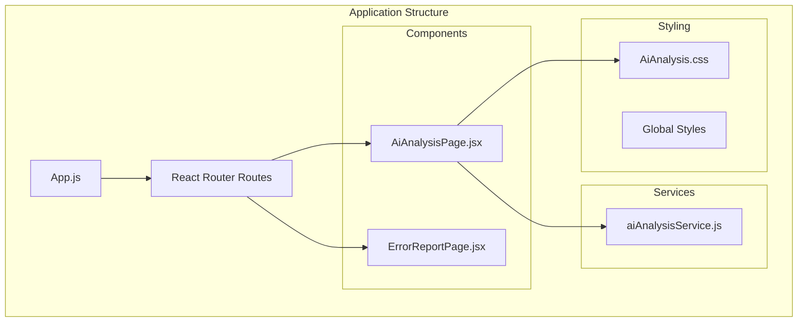

**Diagram sources**
- [App.js:48](file://src/App.js#L48)
- [AiAnalysisPage.jsx:363](file://src/components/AiAnalysisPage.jsx#L363)
- [aiAnalysisService.js:5](file://src/services/aiAnalysisService.js#L5)

**Section sources**
- [App.js:48](file://src/App.js#L48)
- [AiAnalysisPage.jsx:363](file://src/components/AiAnalysisPage.jsx#L363)

## Core Components

### Dual-Tab System Architecture
The interface implements a sophisticated dual-tab system that seamlessly switches between automatic jBPM error analysis and manual log analysis modes. Each tab maintains its own state management and user interaction patterns while sharing common styling and theming.

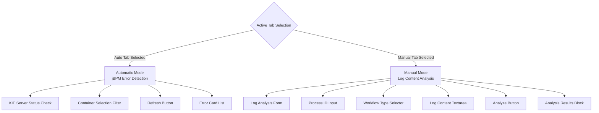

**Diagram sources**
- [AiAnalysisPage.jsx:683](file://src/components/AiAnalysisPage.jsx#L683)
- [AiAnalysisPage.jsx:804](file://src/components/AiAnalysisPage.jsx#L804)

### State Management Architecture
The component manages extensive state through React hooks, implementing a comprehensive state machine that handles user interactions, loading states, and data persistence across different analysis modes.

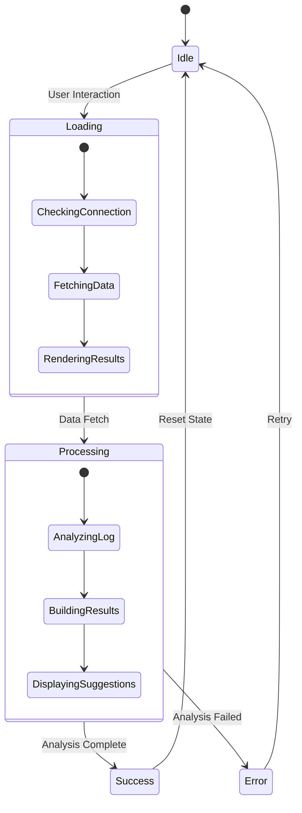

**Diagram sources**
- [AiAnalysisPage.jsx:364](file://src/components/AiAnalysisPage.jsx#L364)
- [AiAnalysisPage.jsx:450](file://src/components/AiAnalysisPage.jsx#L450)

**Section sources**
- [AiAnalysisPage.jsx:364](file://src/components/AiAnalysisPage.jsx#L364)
- [AiAnalysisPage.jsx:450](file://src/components/AiAnalysisPage.jsx#L450)

## Architecture Overview

### Component State Management
The AI Analysis Interface employs a centralized state management approach using React's useState hook to coordinate multiple data streams and user interactions.

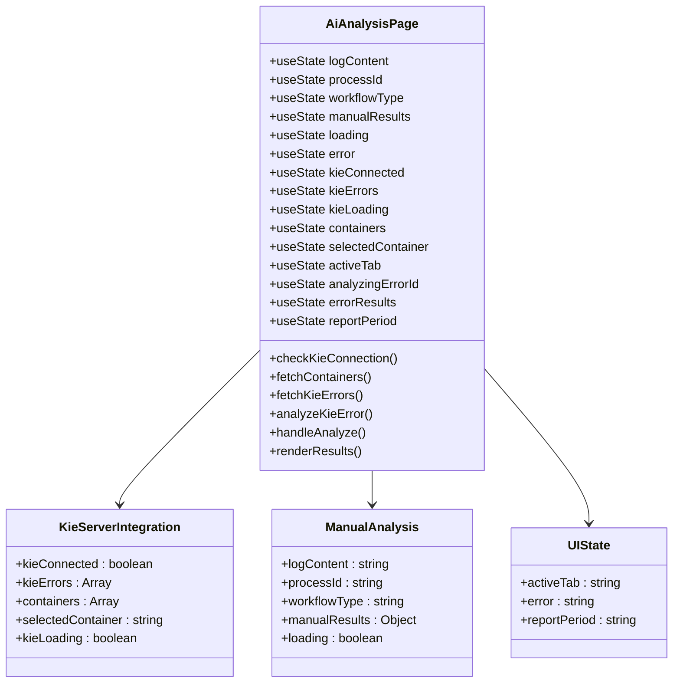

**Diagram sources**
- [AiAnalysisPage.jsx:363](file://src/components/AiAnalysisPage.jsx#L363)
- [AiAnalysisPage.jsx:382](file://src/components/AiAnalysisPage.jsx#L382)

### Data Flow Architecture
The component implements a unidirectional data flow pattern that ensures predictable state updates and efficient rendering performance.

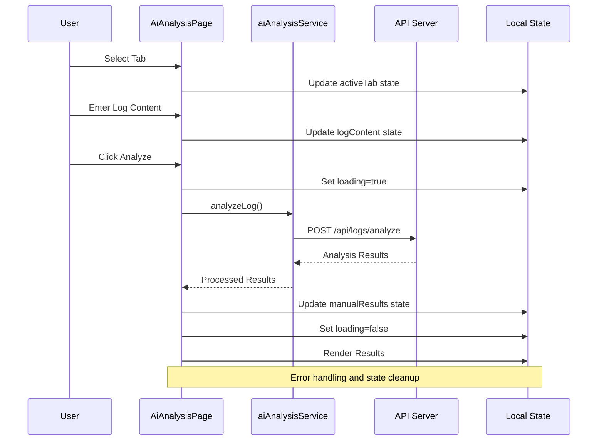

**Diagram sources**
- [AiAnalysisPage.jsx:450](file://src/components/AiAnalysisPage.jsx#L450)
- [aiAnalysisService.js:7](file://src/services/aiAnalysisService.js#L7)

**Section sources**
- [AiAnalysisPage.jsx:363](file://src/components/AiAnalysisPage.jsx#L363)
- [aiAnalysisService.js:5](file://src/services/aiAnalysisService.js#L5)

## Detailed Component Analysis

### Automatic Error Analysis Mode
The automatic mode provides seamless integration with jBPM's KIE server, offering real-time error detection and analysis capabilities.

#### KIE Server Integration
The component establishes bidirectional communication with the jBPM KIE server, implementing robust connection management and error handling.

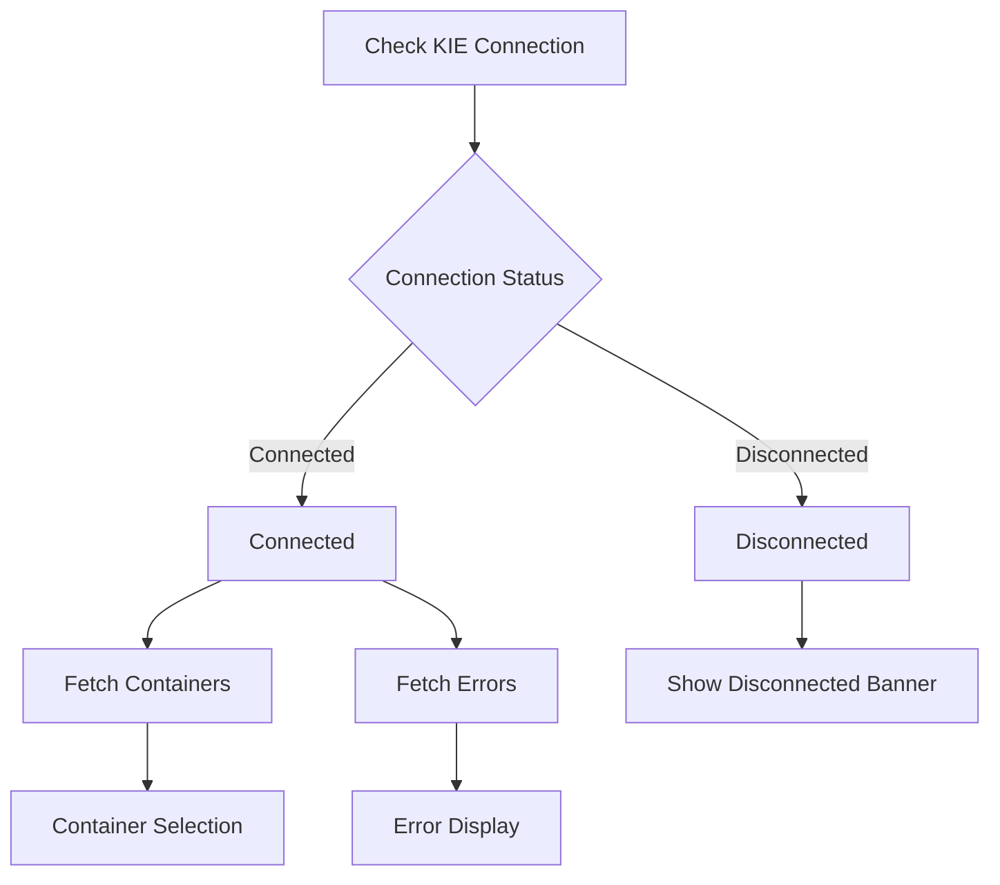

**Diagram sources**
- [AiAnalysisPage.jsx:382](file://src/components/AiAnalysisPage.jsx#L382)
- [AiAnalysisPage.jsx:391](file://src/components/AiAnalysisPage.jsx#L391)

#### Error Card Display System
Each detected error is presented in a comprehensive card format that displays essential information and provides analysis controls.

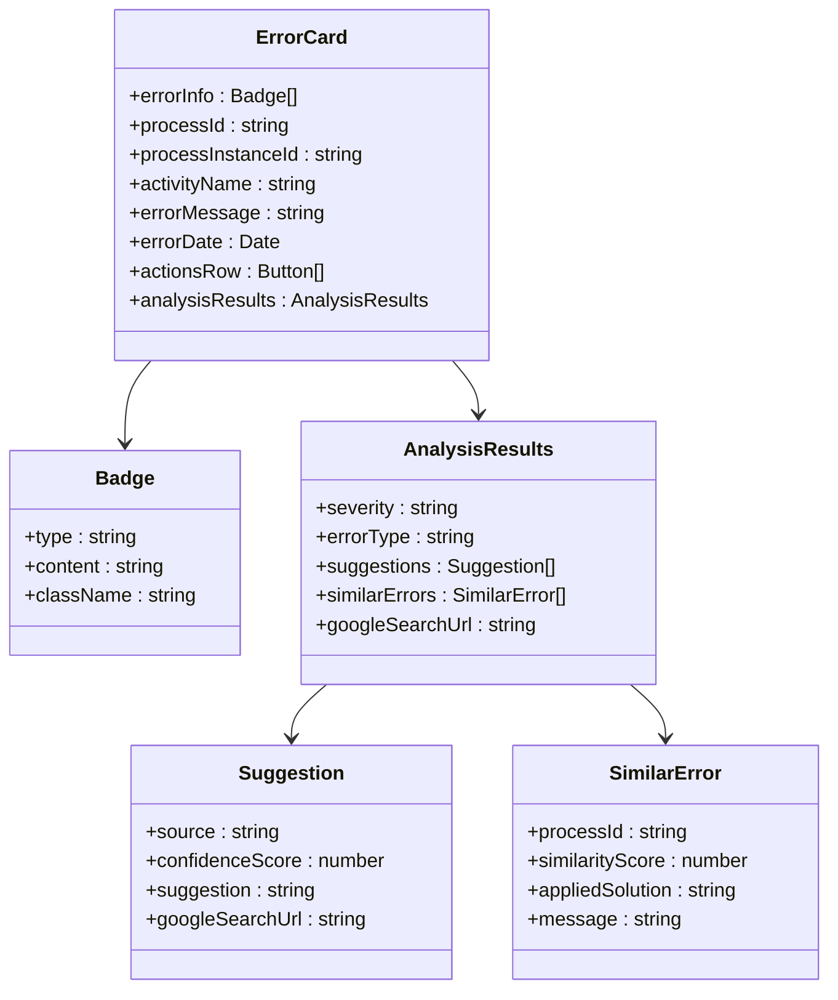

**Diagram sources**
- [AiAnalysisPage.jsx:763](file://src/components/AiAnalysisPage.jsx#L763)
- [AiAnalysisPage.jsx:566](file://src/components/AiAnalysisPage.jsx#L566)

**Section sources**
- [AiAnalysisPage.jsx:382](file://src/components/AiAnalysisPage.jsx#L382)
- [AiAnalysisPage.jsx:763](file://src/components/AiAnalysisPage.jsx#L763)

### Manual Log Analysis Mode
The manual analysis mode provides flexibility for analyzing arbitrary log content with customizable process identification and workflow type selection.

#### Interactive Analysis Workflow
The manual analysis workflow implements a structured approach to log processing with comprehensive validation and feedback mechanisms.

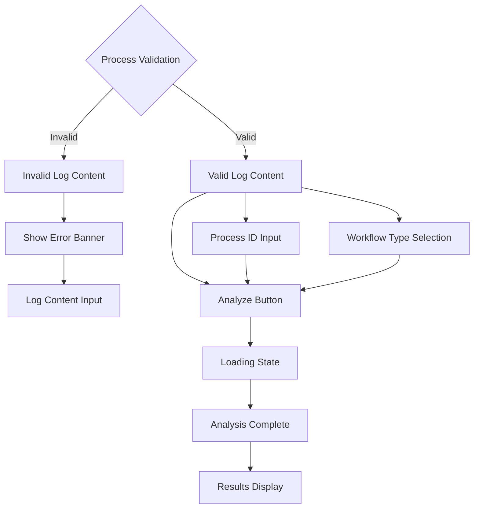

**Diagram sources**
- [AiAnalysisPage.jsx:804](file://src/components/AiAnalysisPage.jsx#L804)
- [AiAnalysisPage.jsx:450](file://src/components/AiAnalysisPage.jsx#L450)

#### Report Generation System
The component includes comprehensive reporting capabilities that export analysis results in multiple formats with configurable time periods.

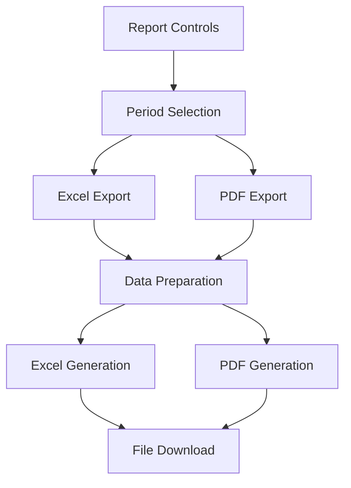

**Diagram sources**
- [AiAnalysisPage.jsx:501](file://src/components/AiAnalysisPage.jsx#L501)
- [AiAnalysisPage.jsx:529](file://src/components/AiAnalysisPage.jsx#L529)

**Section sources**
- [AiAnalysisPage.jsx:804](file://src/components/AiAnalysisPage.jsx#L804)
- [AiAnalysisPage.jsx:501](file://src/components/AiAnalysisPage.jsx#L501)

### Styling Architecture and Theming
The component implements a comprehensive styling architecture using CSS modules with a consistent theming system based on NetWatch brand guidelines.

#### CSS Module Organization
The styling system is organized into logical modules that separate concerns and maintain consistency across the interface.

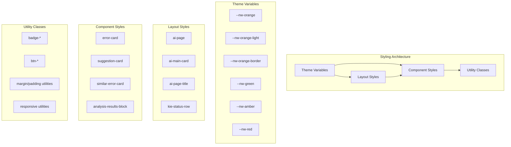

**Diagram sources**
- [AiAnalysis.css:5](file://src/components/AiAnalysis.css#L5)
- [AiAnalysis.css:12](file://src/components/AiAnalysis.css#L12)

#### Color System Implementation
The color system follows NetWatch branding guidelines with carefully selected color palettes for different UI states and emphasis levels.

```mermaid
flowchart TD
ColorSystem[NetWatch Color System]
PrimaryColors[Primary Colors]
SecondaryColors[Secondary Colors]
SemanticColors[Semantic Colors]
UtilityColors[Utility Colors]
Orange[Orange: #E8611A]
LightOrange[Light Orange: rgba(232,97,26,0.12)]
BorderOrange[Orange Border: rgba(232,97,26,0.35)]
Green[Green: #1D9E75]
Amber[Amber: #BA7517]
Red[Red: #E24B4A]
SeverityColors[Severity Badges]
ErrorBadge[Error Badge: #c0392b]
WarningBadge[Warning Badge: #92580a]
InfoBadge[Info Badge: #185fa5]
ColorSystem --> PrimaryColors
ColorSystem --> SecondaryColors
ColorSystem --> SemanticColors
ColorSystem --> UtilityColors
PrimaryColors --> Orange
PrimaryColors --> Green
PrimaryColors --> Amber
PrimaryColors --> Red
SecondaryColors --> LightOrange
SecondaryColors --> BorderOrange
SemanticColors --> SeverityColors
SeverityColors --> ErrorBadge
SeverityColors --> WarningBadge
SeverityColors --> InfoBadge
```

**Diagram sources**
- [AiAnalysis.css:5](file://src/components/AiAnalysis.css#L5)
- [AiAnalysis.css:201](file://src/components/AiAnalysis.css#L201)

**Section sources**
- [AiAnalysis.css:5](file://src/components/AiAnalysis.css#L5)
- [AiAnalysis.css:201](file://src/components/AiAnalysis.css#L201)

## Dependency Analysis

### Component Dependencies
The AI Analysis Interface has well-defined dependencies that support modularity and maintainability.

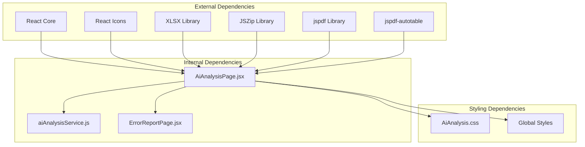

**Diagram sources**
- [AiAnalysisPage.jsx:1](file://src/components/AiAnalysisPage.jsx#L1)
- [aiAnalysisService.js:1](file://src/services/aiAnalysisService.js#L1)

### Service Layer Integration
The component integrates with a dedicated service layer that abstracts API communication and provides clean interfaces for data operations.

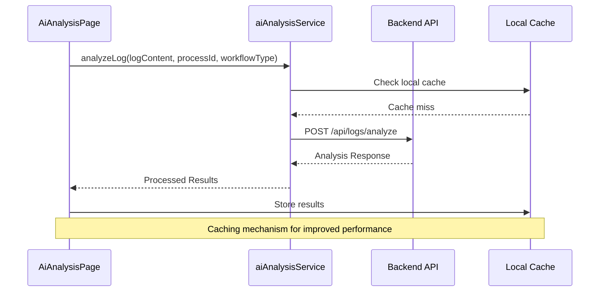

**Diagram sources**
- [aiAnalysisService.js:7](file://src/services/aiAnalysisService.js#L7)
- [AiAnalysisPage.jsx:450](file://src/components/AiAnalysisPage.jsx#L450)

**Section sources**
- [AiAnalysisPage.jsx:1](file://src/components/AiAnalysisPage.jsx#L1)
- [aiAnalysisService.js:5](file://src/services/aiAnalysisService.js#L5)

## Performance Considerations

### State Optimization Strategies
The component implements several performance optimization techniques to ensure smooth user experience during intensive operations.

#### Efficient State Updates
The component uses targeted state updates to minimize unnecessary re-renders and optimize rendering performance.

#### Lazy Loading Patterns
Error analysis results are loaded asynchronously with proper loading states and caching mechanisms to prevent redundant API calls.

#### Memory Management
The component implements proper cleanup of event listeners and timers to prevent memory leaks during extended usage sessions.

### Rendering Performance
The interface employs virtualization techniques for large datasets and implements efficient diffing algorithms to minimize DOM manipulation overhead.

## Troubleshooting Guide

### Common Issues and Solutions

#### KIE Server Connection Problems
- **Issue**: KIE server appears disconnected despite proper setup
- **Solution**: Verify network connectivity and port accessibility
- **Diagnostic Steps**: Check firewall settings and server availability

#### Analysis Timeout Errors
- **Issue**: Analysis requests timeout or fail unexpectedly
- **Solution**: Implement retry logic with exponential backoff
- **Prevention**: Monitor server health and resource utilization

#### Data Formatting Issues
- **Issue**: Log content fails validation or produces unexpected results
- **Solution**: Implement comprehensive input sanitization and validation
- **Best Practices**: Use structured logging formats and standardized error patterns

#### Performance Degradation
- **Issue**: Component becomes slow with large datasets
- **Solution**: Implement pagination, virtualization, and lazy loading
- **Monitoring**: Track rendering performance and memory usage metrics

**Section sources**
- [AiAnalysisPage.jsx:382](file://src/components/AiAnalysisPage.jsx#L382)
- [AiAnalysisPage.jsx:450](file://src/components/AiAnalysisPage.jsx#L450)

## Conclusion

The AI Analysis Interface represents a comprehensive solution for jBPM process monitoring and troubleshooting. Its dual-mode architecture provides flexibility for both automated error detection and manual log analysis, while the sophisticated state management ensures reliable operation across various scenarios.

The component's modular design, comprehensive styling system, and robust error handling make it a valuable asset for process monitoring teams. The integration with external services and reporting capabilities extends its utility beyond basic analysis to full lifecycle management of process troubleshooting workflows.

Future enhancements could include advanced filtering capabilities, collaborative analysis features, and integration with additional monitoring systems to further expand its analytical capabilities and operational value.