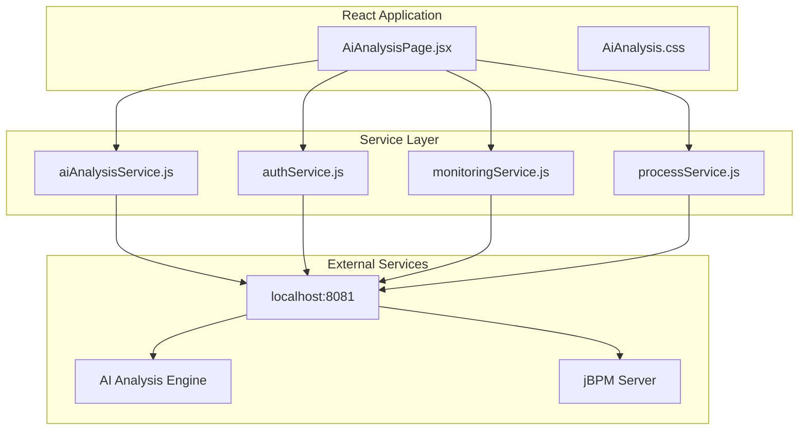
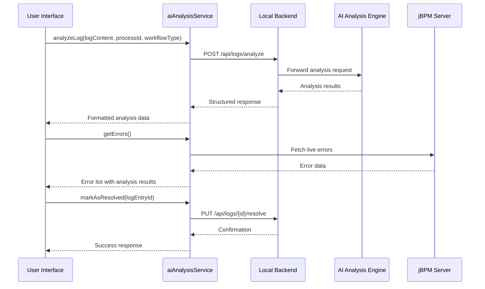
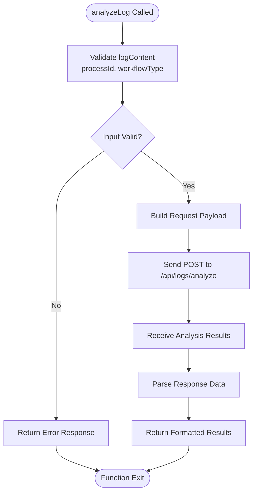
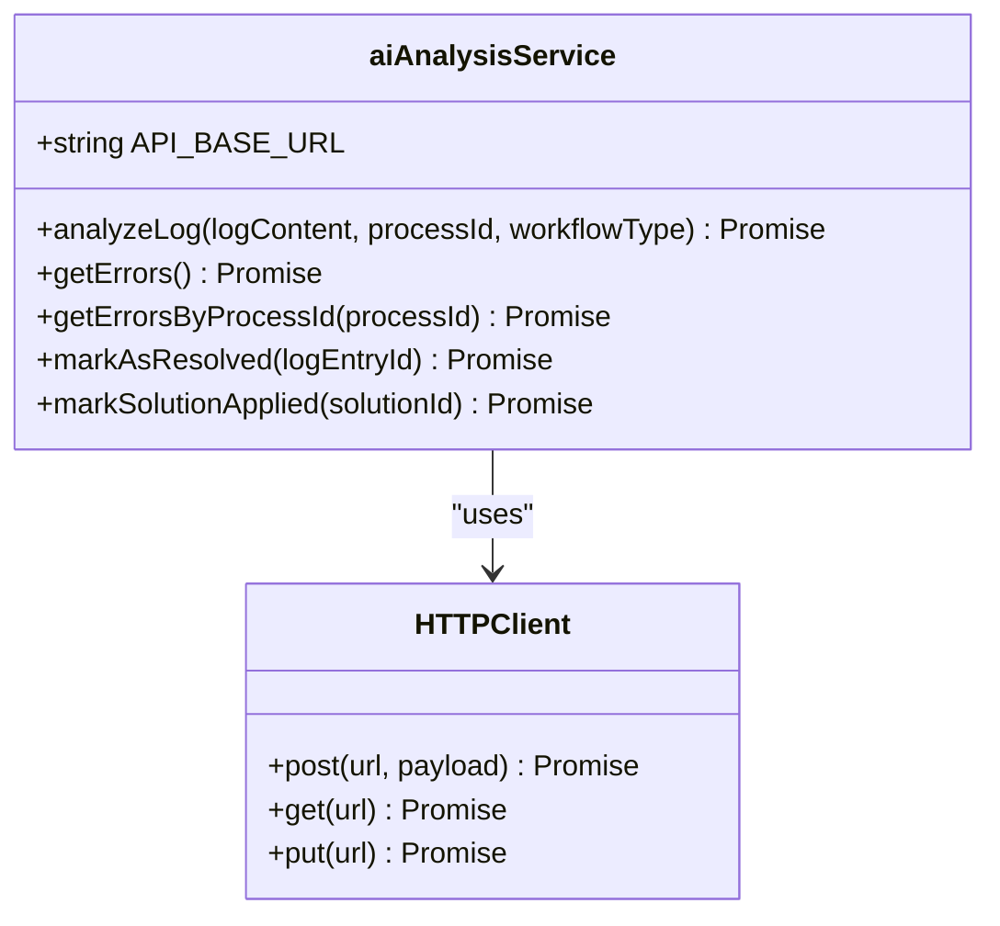
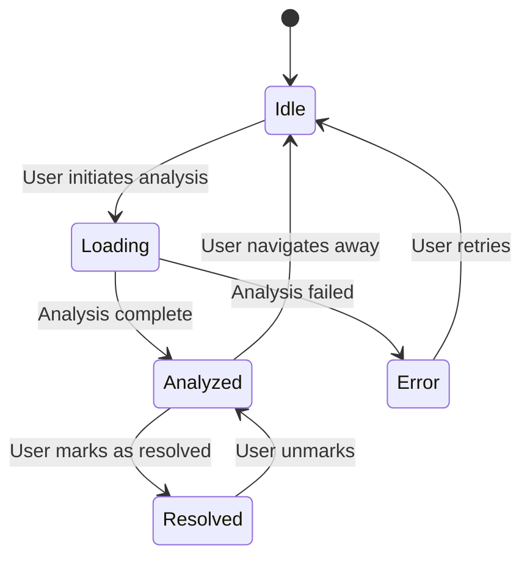
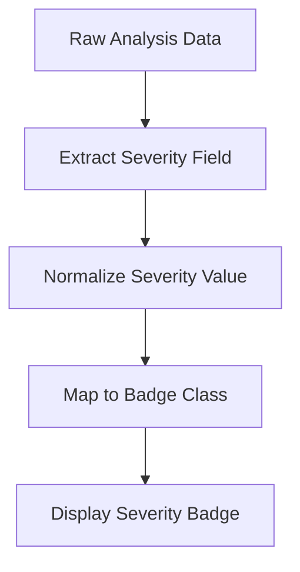
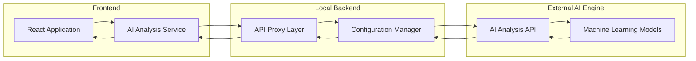

# AI Analysis Service

<cite>
**Referenced Files in This Document**
- [aiAnalysisService.js](file://src/services/aiAnalysisService.js)
- [AiAnalysisPage.jsx](file://src/components/AiAnalysisPage.jsx)
- [AiAnalysis.css](file://src/components/AiAnalysis.css)
- [authService.js](file://src/services/authService.js)
- [monitoringService.js](file://src/services/monitoringService.js)
- [processService.js](file://src/services/processService.js)
- [package.json](file://package.json)
</cite>

## Table of Contents
1. [Introduction](#introduction)
2. [Project Structure](#project-structure)
3. [Core Components](#core-components)
4. [Architecture Overview](#architecture-overview)
5. [Detailed Component Analysis](#detailed-component-analysis)
6. [Service Implementation](#service-implementation)
7. [UI Integration Patterns](#ui-integration-patterns)
8. [Error Handling Strategies](#error-handling-strategies)
9. [Data Transformation Utilities](#data-transformation-utilities)
10. [Integration with External APIs](#integration-with-external-apis)
11. [Performance Considerations](#performance-considerations)
12. [Troubleshooting Guide](#troubleshooting-guide)
13. [Conclusion](#conclusion)

## Introduction

The AI Analysis Service layer provides intelligent error analysis capabilities for jBPM process monitoring. This service integrates with external AI-powered analysis engines to provide automated log analysis, error detection, and solution recommendations. The implementation consists of a dedicated service module that handles HTTP communication with backend analysis APIs and a comprehensive UI component that presents analysis results to users.

The service operates on a local development server (localhost:8081) and provides methods for log analysis requests, jBPM error fetching, result processing, and error resolution management. It serves as a bridge between the frontend React application and the backend AI analysis engine.

## Project Structure

The AI Analysis Service is organized within the React application's service architecture:

**Diagram sources**
- [aiAnalysisService.js:1-37](file://src/services/aiAnalysisService.js#L1-L37)
- [AiAnalysisPage.jsx:1-903](file://src/components/AiAnalysisPage.jsx#L1-L903)

**Section sources**
- [aiAnalysisService.js:1-37](file://src/services/aiAnalysisService.js#L1-L37)
- [AiAnalysisPage.jsx:1-903](file://src/components/AiAnalysisPage.jsx#L1-L903)

## Core Components

The AI Analysis Service layer consists of several key components working together:

### Service Module (`aiAnalysisService.js`)
- **Primary Purpose**: Handles all AI-powered error analysis operations
- **HTTP Client**: Uses Axios for API communication
- **Base URL**: Configured to `http://localhost:8081`
- **Methods**: Five primary service methods for different analysis operations

### UI Component (`AiAnalysisPage.jsx`)
- **Primary Purpose**: Provides user interface for AI analysis operations
- **Features**: Tabbed interface for automatic and manual analysis modes
- **Capabilities**: Real-time error monitoring, analysis result visualization, export functionality
- **Integration**: Connects with jBPM server for live error data

### Supporting Services
- **Authentication Service**: Handles user authentication with backend
- **Monitoring Service**: Manages process monitoring and search operations
- **Process Service**: Provides process lifecycle management

**Section sources**
- [aiAnalysisService.js:5-35](file://src/services/aiAnalysisService.js#L5-L35)
- [AiAnalysisPage.jsx:386-903](file://src/components/AiAnalysisPage.jsx#L386-L903)

## Architecture Overview

The AI Analysis Service follows a layered architecture pattern with clear separation of concerns:

**Diagram sources**
- [aiAnalysisService.js:7-34](file://src/services/aiAnalysisService.js#L7-L34)
- [AiAnalysisPage.jsx:434-473](file://src/components/AiAnalysisPage.jsx#L434-L473)

The architecture ensures loose coupling between components while maintaining clear data flow patterns. The service layer abstracts HTTP communication details from the UI layer, providing a clean interface for analysis operations.

## Detailed Component Analysis

### AI Analysis Service Implementation

The service provides five primary methods for different analysis scenarios:

#### Log Analysis Method

**Diagram sources**
- [aiAnalysisService.js:7-14](file://src/services/aiAnalysisService.js#L7-L14)

#### Error Retrieval Methods
The service includes methods for fetching errors from different sources:

- `getErrors()`: Retrieves all available errors
- `getErrorsByProcessId(processId)`: Filters errors by specific process identifier

These methods support the automatic analysis tab in the UI component, enabling real-time monitoring of jBPM errors.

**Section sources**
- [aiAnalysisService.js:16-24](file://src/services/aiAnalysisService.js#L16-L24)

### UI Component Integration

The `AiAnalysisPage.jsx` component serves as the primary interface for AI analysis operations:

#### Automatic Analysis Mode
- **Live Error Monitoring**: Connects to jBPM server for real-time error data
- **Container Filtering**: Supports filtering by jBPM containers
- **Analysis Caching**: Maintains analysis results in component state
- **Resolution Tracking**: Manages error resolution status

#### Manual Analysis Mode
- **Log Input**: Text area for manual log content entry
- **Process Configuration**: Dropdown for process ID selection
- **Workflow Type Selection**: Options for different workflow types
- **Analysis Execution**: Button to trigger AI-powered analysis

**Section sources**
- [AiAnalysisPage.jsx:386-903](file://src/components/AiAnalysisPage.jsx#L386-L903)

## Service Implementation

### HTTP Client Configuration

The service utilizes Axios for HTTP communication with configurable base URL:

**Diagram sources**
- [aiAnalysisService.js:1-37](file://src/services/aiAnalysisService.js#L1-L37)

### API Endpoint Integration

The service communicates with the following backend endpoints:

| Method | Endpoint | HTTP Method | Description |
|--------|----------|-------------|-------------|
| `analyzeLog` | `/api/logs/analyze` | POST | Analyzes log content with AI engine |
| `getErrors` | `/api/logs/errors` | GET | Retrieves all available errors |
| `getErrorsByProcessId` | `/api/logs/errors/process/{processId}` | GET | Filters errors by process ID |
| `markAsResolved` | `/api/logs/{logEntryId}/resolve` | PUT | Marks error as resolved |
| `markSolutionApplied` | `/api/logs/solutions/{solutionId}/apply` | PUT | Marks solution as applied |

**Section sources**
- [aiAnalysisService.js:3-34](file://src/services/aiAnalysisService.js#L3-L34)

### Data Transformation Utilities

The service includes several utility functions for data processing:

#### Date Formatting Functions
- `formatDate(timestamp)`: Converts timestamps to localized date strings
- `formatShortDate(timestamp)`: Formats dates for reporting periods
- `getPeriodBounds(period)`: Calculates date range boundaries for filtering

#### Analysis Result Processing
- **Severity Classification**: Maps analysis results to severity badges
- **Confidence Scoring**: Processes confidence scores for suggestions
- **Similarity Analysis**: Compares error patterns for historical context

**Section sources**
- [AiAnalysisPage.jsx:488-523](file://src/components/AiAnalysisPage.jsx#L488-L523)

## UI Integration Patterns

### Component State Management

The AI Analysis Page maintains comprehensive state for different operational modes:

**Diagram sources**
- [AiAnalysisPage.jsx:387-402](file://src/components/AiAnalysisPage.jsx#L387-L402)

### Asynchronous Operations

The service handles multiple concurrent operations:

- **Real-time Error Updates**: Periodic polling for jBPM error data
- **Analysis Requests**: Individual requests for log analysis
- **Export Operations**: Background processing for report generation
- **Resolution Status**: Real-time updates for error resolution tracking

**Section sources**
- [AiAnalysisPage.jsx:406-432](file://src/components/AiAnalysisPage.jsx#L406-L432)

## Error Handling Strategies

### Frontend Error Management

The service implements comprehensive error handling strategies:

#### Input Validation
- **Log Content Validation**: Ensures non-empty log content before analysis
- **Process ID Validation**: Provides fallback values when missing
- **Workflow Type Validation**: Validates against supported workflow types

#### Network Error Handling
- **Connection Failure Detection**: Handles backend service unavailability
- **Timeout Management**: Implements graceful timeout handling
- **Retry Logic**: Provides user-friendly retry mechanisms

#### UI Error Presentation
- **Error Banner Display**: Shows user-friendly error messages
- **Loading States**: Provides visual feedback during operations
- **Disabled States**: Prevents invalid operations during processing

**Section sources**
- [AiAnalysisPage.jsx:474-486](file://src/components/AiAnalysisPage.jsx#L474-L486)

### Backend Integration Error Handling

The service coordinates with multiple backend systems:

#### Authentication Errors
- **Session Validation**: Checks user authentication status
- **Token Refresh**: Handles authentication token expiration
- **Access Control**: Manages user permissions for analysis operations

#### jBPM Integration Errors
- **Server Connectivity**: Monitors jBPM server availability
- **Container Status**: Validates jBPM container health
- **Process Instance Errors**: Handles invalid process identifiers

**Section sources**
- [authService.js:1-19](file://src/services/authService.js#L1-L19)

## Data Transformation Utilities

### Analysis Result Processing

The service transforms raw AI analysis results into user-friendly formats:

#### Severity Classification

**Diagram sources**
- [AiAnalysisPage.jsx:592-597](file://src/components/AiAnalysisPage.jsx#L592-L597)

#### Confidence Score Processing
- **Score Normalization**: Converts raw confidence scores to percentages
- **Visual Representation**: Creates progress bars for confidence indicators
- **Threshold Validation**: Ensures confidence scores fall within expected ranges

#### Similarity Analysis
- **Pattern Matching**: Compares error messages for historical context
- **Similarity Calculation**: Computes similarity scores between errors
- **Historical Reference**: Provides links to previously resolved similar errors

**Section sources**
- [AiAnalysisPage.jsx:615-644](file://src/components/AiAnalysisPage.jsx#L615-L644)

## Integration with External APIs

### AI Analysis Engine Integration

The service integrates with external AI analysis APIs through the backend proxy:

**Diagram sources**
- [aiAnalysisService.js:3](file://src/services/aiAnalysisService.js#L3)
- [package.json:10](file://package.json#L10)

### jBPM Server Integration

The service maintains real-time connectivity with jBPM servers:

#### Connection Management
- **Status Monitoring**: Regular health checks for jBPM server connectivity
- **Automatic Reconnection**: Graceful handling of connection interruptions
- **Container Discovery**: Dynamic discovery of available jBPM containers

#### Error Synchronization
- **Live Error Streaming**: Real-time synchronization of jBPM error events
- **Error Categorization**: Automatic classification of error types
- **Process Correlation**: Links errors to specific process instances

**Section sources**
- [AiAnalysisPage.jsx:406-432](file://src/components/AiAnalysisPage.jsx#L406-L432)

## Performance Considerations

### Asynchronous Operation Management

The service implements efficient asynchronous operation patterns:

#### Concurrent Request Handling
- **Promise Chaining**: Sequential processing of dependent operations
- **Parallel Execution**: Simultaneous processing of independent operations
- **Request Cancellation**: Ability to cancel pending operations

#### Memory Management
- **State Cleanup**: Proper cleanup of component state on unmount
- **Cache Management**: Efficient caching of analysis results
- **Resource Deallocation**: Automatic cleanup of event listeners

### UI Performance Optimization

The React component implements several performance optimization strategies:

#### Rendering Optimization
- **Conditional Rendering**: Only renders components when data is available
- **Memoization**: Caches computed values to prevent unnecessary re-renders
- **Virtual Scrolling**: Handles large datasets efficiently

#### Network Optimization
- **Request Debouncing**: Prevents rapid successive requests
- **Response Caching**: Stores recent responses for quick access
- **Batch Operations**: Groups multiple operations into single requests

**Section sources**
- [AiAnalysisPage.jsx:434-473](file://src/components/AiAnalysisPage.jsx#L434-L473)

## Troubleshooting Guide

### Common Issues and Solutions

#### Backend Service Unavailable
**Symptoms**: Analysis requests fail with network errors
**Causes**: Backend server not running or unreachable
**Solutions**:
- Verify backend service is running on localhost:8081
- Check firewall settings and network connectivity
- Monitor backend logs for startup errors

#### AI Engine Integration Failures
**Symptoms**: Analysis results return empty or incomplete data
**Causes**: AI engine not responding or processing errors
**Solutions**:
- Verify AI engine health and availability
- Check AI model loading status
- Review AI engine logs for processing errors

#### jBPM Server Connectivity Issues
**Symptoms**: Error lists show connection failures
**Causes**: jBPM server not running or misconfigured
**Solutions**:
- Verify jBPM server is running on localhost:8080
- Check jBPM container deployment status
- Validate jBPM server configuration

### Debugging Strategies

#### Service Layer Debugging
- Enable Axios interceptors for request/response logging
- Implement service method tracing for debugging
- Use browser developer tools for network inspection

#### UI Component Debugging
- Utilize React Developer Tools for component state inspection
- Implement console logging for key state transitions
- Monitor component lifecycle events for timing issues

**Section sources**
- [AiAnalysisPage.jsx:406-413](file://src/components/AiAnalysisPage.jsx#L406-L413)

## Conclusion

The AI Analysis Service layer provides a comprehensive solution for AI-powered error analysis in jBPM environments. The implementation demonstrates strong architectural principles with clear separation of concerns, robust error handling, and efficient UI integration patterns.

Key strengths of the implementation include:

- **Modular Design**: Clean separation between service logic and UI presentation
- **Robust Error Handling**: Comprehensive error management across all operational layers
- **Performance Optimization**: Efficient handling of asynchronous operations and data transformations
- **Extensible Architecture**: Well-defined patterns for adding new analysis capabilities
- **User Experience Focus**: Intuitive interface with real-time feedback and responsive design

The service successfully bridges the gap between complex AI analysis capabilities and user-friendly interface design, making sophisticated error analysis accessible to monitoring teams. The implementation provides a solid foundation for future enhancements and extensions to the AI analysis ecosystem.