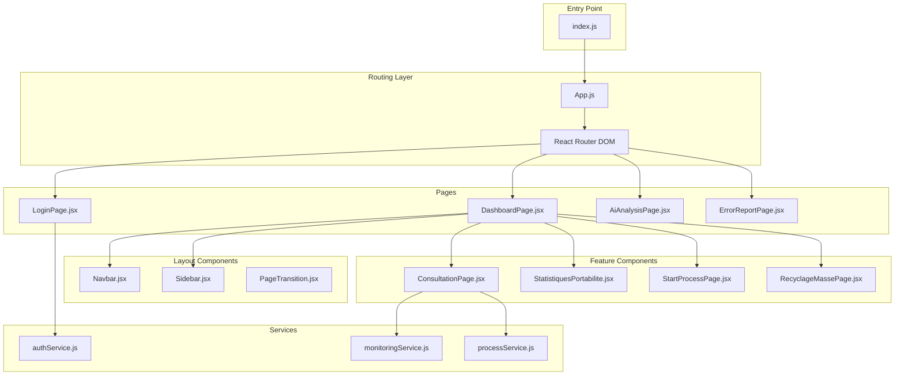
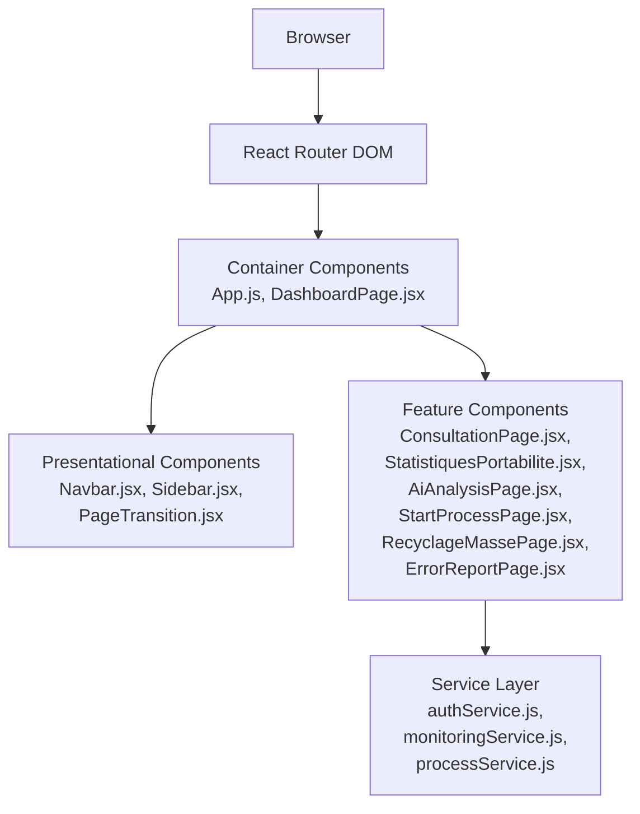
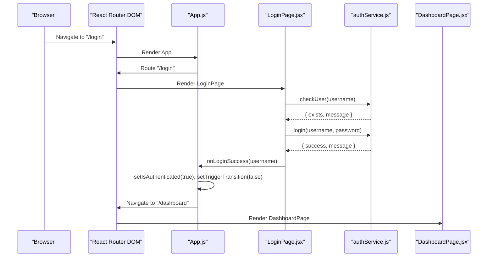
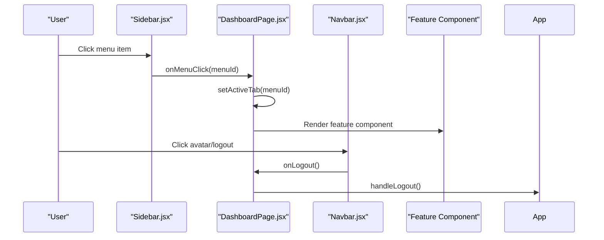
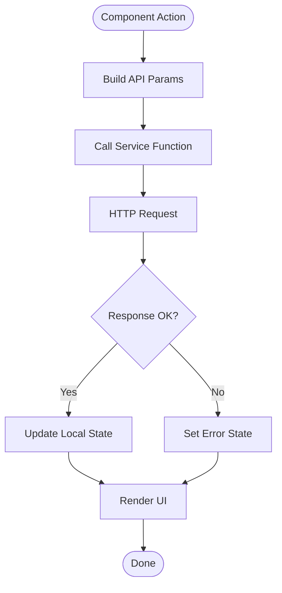
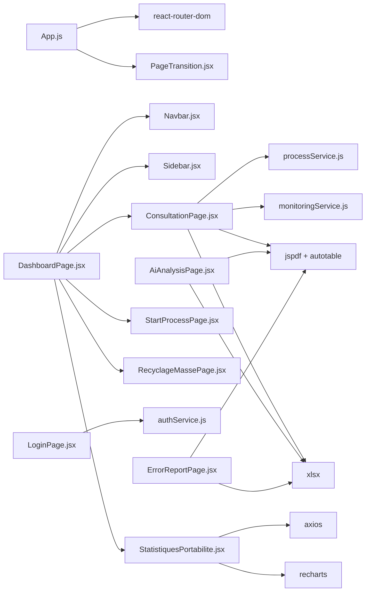

# Application Architecture

<cite>
**Referenced Files in This Document**
- [App.js](file://src/App.js)
- [index.js](file://src/index.js)
- [package.json](file://package.json)
- [DashboardPage.jsx](file://src/pages/DashboardPage.jsx)
- [LoginPage.jsx](file://src/components/login/LoginPage.jsx)
- [Navbar.jsx](file://src/components/layout/Navbar.jsx)
- [Sidebar.jsx](file://src/components/layout/Sidebar.jsx)
- [PageTransition.jsx](file://src/components/PageTransition.jsx)
- [ConsultationPage.jsx](file://src/components/ConsultationPage.jsx)
- [StatistiquesPortabilite.jsx](file://src/components/StatistiquesPortabilite.jsx)
- [AiAnalysisPage.jsx](file://src/components/AiAnalysisPage.jsx)
- [StartProcessPage.jsx](file://src/components/StartProcessPage.jsx)
- [RecyclageMassePage.jsx](file://src/components/RecyclageMassePage.jsx)
- [ErrorReportPage.jsx](file://src/components/ErrorReportPage.jsx)
- [authService.js](file://src/services/authService.js)
- [monitoringService.js](file://src/services/monitoringService.js)
- [processService.js](file://src/services/processService.js)
</cite>

## Table of Contents
1. [Introduction](#introduction)
2. [Project Structure](#project-structure)
3. [Core Components](#core-components)
4. [Architecture Overview](#architecture-overview)
5. [Detailed Component Analysis](#detailed-component-analysis)
6. [Dependency Analysis](#dependency-analysis)
7. [Performance Considerations](#performance-considerations)
8. [Troubleshooting Guide](#troubleshooting-guide)
9. [Conclusion](#conclusion)

## Introduction
This document describes the SmartPorta application architecture. It focuses on the React-based component hierarchy, client-side routing using React Router DOM, and the service layer architecture. It explains the main application flow from App.js routing to page-level components, state management patterns using React hooks, and component composition strategies. It also documents the separation between presentational components and container components, data flow patterns, and integration with external services. System boundaries, architectural decisions, and technology stack rationale are addressed, along with component relationships, prop drilling solutions, and state container patterns used throughout the application.

## Project Structure
SmartPorta follows a feature-based structure under src/, with clear separation between pages, components, and services:
- Pages: Top-level page containers (e.g., DashboardPage)
- Components: Reusable UI building blocks (layout, login steps, feature pages)
- Services: External API integration modules
- Root entry: index.js renders App, which orchestrates routing and global state

**Diagram sources**
- [index.js:1-19](file://src/index.js#L1-L19)
- [App.js:1-74](file://src/App.js#L1-L74)
- [DashboardPage.jsx:1-51](file://src/pages/DashboardPage.jsx#L1-L51)
- [LoginPage.jsx:1-94](file://src/components/login/LoginPage.jsx#L1-L94)
- [Navbar.jsx:1-124](file://src/components/layout/Navbar.jsx#L1-L124)
- [Sidebar.jsx:1-167](file://src/components/layout/Sidebar.jsx#L1-L167)
- [PageTransition.jsx:1-61](file://src/components/PageTransition.jsx#L1-L61)
- [ConsultationPage.jsx:1-419](file://src/components/ConsultationPage.jsx#L1-L419)
- [StatistiquesPortabilite.jsx:1-301](file://src/components/StatistiquesPortabilite.jsx#L1-L301)
- [AiAnalysisPage.jsx:1-860](file://src/components/AiAnalysisPage.jsx#L1-L860)
- [StartProcessPage.jsx:1-268](file://src/components/StartProcessPage.jsx#L1-L268)
- [RecyclageMassePage.jsx:1-382](file://src/components/RecyclageMassePage.jsx#L1-L382)
- [ErrorReportPage.jsx:1-673](file://src/components/ErrorReportPage.jsx#L1-L673)
- [authService.js:1-19](file://src/services/authService.js#L1-L19)
- [monitoringService.js:1-24](file://src/services/monitoringService.js#L1-L24)
- [processService.js:1-38](file://src/services/processService.js#L1-L38)

**Section sources**
- [index.js:1-19](file://src/index.js#L1-L19)
- [App.js:1-74](file://src/App.js#L1-L74)
- [package.json:1-49](file://package.json#L1-L49)

## Core Components
- App.js: Central orchestration of routing, authentication state, and page transitions. Manages isAuthenticated, username, transition triggers, and default page selection. Uses React Router DOM for route guards and navigation.
- DashboardPage.jsx: Container page that composes Navbar, Sidebar, and content area. Owns activeTab state and delegates rendering to feature components based on menu selection.
- LoginPage.jsx: Multi-step login flow composed of StepUsername and StepPassword, integrating authService for user validation and authentication.
- Layout components: Navbar.jsx and Sidebar.jsx encapsulate presentation and navigation logic, receiving callbacks and state from parents.
- Feature components: ConsultationPage.jsx, StatistiquesPortabilite.jsx, AiAnalysisPage.jsx, StartProcessPage.jsx, RecyclageMassePage.jsx, ErrorReportPage.jsx implement domain-specific UI and data fetching.
- Services: authService.js, monitoringService.js, processService.js abstract HTTP integrations and expose typed functions for consumption by components.

**Section sources**
- [App.js:9-31](file://src/App.js#L9-L31)
- [DashboardPage.jsx:10-34](file://src/pages/DashboardPage.jsx#L10-L34)
- [LoginPage.jsx:9-57](file://src/components/login/LoginPage.jsx#L9-L57)
- [Navbar.jsx:7-32](file://src/components/layout/Navbar.jsx#L7-L32)
- [Sidebar.jsx:4-17](file://src/components/layout/Sidebar.jsx#L4-L17)
- [authService.js:3-19](file://src/services/authService.js#L3-L19)
- [monitoringService.js:5-24](file://src/services/monitoringService.js#L5-L24)
- [processService.js:3-38](file://src/services/processService.js#L3-L38)

## Architecture Overview
SmartPorta employs a layered architecture:
- Presentation Layer: React functional components with hooks manage UI state and lifecycle.
- Routing Layer: React Router DOM routes map URLs to page components with authentication guards.
- Service Layer: Plain functions encapsulate HTTP requests and parameterization.
- Data Layer: External APIs exposed via localhost endpoints (auth, monitoring, KIE, SOAP).

**Diagram sources**
- [App.js:33-71](file://src/App.js#L33-L71)
- [DashboardPage.jsx:36-50](file://src/pages/DashboardPage.jsx#L36-L50)
- [Navbar.jsx:36-123](file://src/components/layout/Navbar.jsx#L36-L123)
- [Sidebar.jsx:19-166](file://src/components/layout/Sidebar.jsx#L19-L166)
- [PageTransition.jsx:3-60](file://src/components/PageTransition.jsx#L3-L60)
- [ConsultationPage.jsx:7-70](file://src/components/ConsultationPage.jsx#L7-L70)
- [StatistiquesPortabilite.jsx:12-63](file://src/components/StatistiquesPortabilite.jsx#L12-L63)
- [AiAnalysisPage.jsx:363-408](file://src/components/AiAnalysisPage.jsx#L363-L408)
- [StartProcessPage.jsx:80-148](file://src/components/StartProcessPage.jsx#L80-L148)
- [RecyclageMassePage.jsx:6-86](file://src/components/RecyclageMassePage.jsx#L6-L86)
- [ErrorReportPage.jsx:337-384](file://src/components/ErrorReportPage.jsx#L337-L384)
- [authService.js:1-19](file://src/services/authService.js#L1-L19)
- [monitoringService.js:1-24](file://src/services/monitoringService.js#L1-L24)
- [processService.js:1-38](file://src/services/processService.js#L1-L38)

## Detailed Component Analysis

### Routing and Authentication Flow
The routing layer manages authentication state and guards:
- App.js initializes authentication state and transition flags.
- Login route conditionally renders LoginPage or redirects to dashboard.
- Dashboard route conditionally renders DashboardPage or redirects to login.
- PageTransition provides animated transitions during login success.

**Diagram sources**
- [App.js:33-68](file://src/App.js#L33-L68)
- [LoginPage.jsx:21-50](file://src/components/login/LoginPage.jsx#L21-L50)
- [authService.js:3-19](file://src/services/authService.js#L3-L19)
- [DashboardPage.jsx:10-15](file://src/pages/DashboardPage.jsx#L10-L15)

**Section sources**
- [App.js:9-31](file://src/App.js#L9-L31)
- [LoginPage.jsx:9-57](file://src/components/login/LoginPage.jsx#L9-L57)
- [authService.js:1-19](file://src/services/authService.js#L1-L19)

### Dashboard Composition and Navigation
DashboardPage.jsx composes layout and content:
- Navbar receives logout handler and agent name.
- Sidebar controls activeTab and dispatches menu selections.
- Content area switches between feature components based on activeTab.

**Diagram sources**
- [DashboardPage.jsx:13-34](file://src/pages/DashboardPage.jsx#L13-L34)
- [Sidebar.jsx:11-17](file://src/components/layout/Sidebar.jsx#L11-L17)
- [Navbar.jsx:112-117](file://src/components/layout/Navbar.jsx#L112-L117)
- [App.js:26-31](file://src/App.js#L26-L31)

**Section sources**
- [DashboardPage.jsx:10-34](file://src/pages/DashboardPage.jsx#L10-L34)
- [Sidebar.jsx:4-17](file://src/components/layout/Sidebar.jsx#L4-L17)
- [Navbar.jsx:7-32](file://src/components/layout/Navbar.jsx#L7-L32)

### Data Fetching Patterns and Service Layer
- ConsultationPage.jsx uses processService.searchProcesses to query monitoring endpoints with dynamic query parameters and pagination.
- monitoringService.js builds query parameters for monitoring search.
- AiAnalysisPage.jsx integrates with KIE server endpoints for error retrieval and analysis.
- StartProcessPage.jsx performs SOAP requests to initiate portability processes.
- RecyclageMassePage.jsx queries task endpoints and supports bulk recycling actions.
- ErrorReportPage.jsx fetches error reports from KIE and supports exports.

**Diagram sources**
- [ConsultationPage.jsx:34-70](file://src/components/ConsultationPage.jsx#L34-L70)
- [processService.js:4-37](file://src/services/processService.js#L4-L37)
- [monitoringService.js:5-24](file://src/services/monitoringService.js#L5-L24)
- [AiAnalysisPage.jsx:382-408](file://src/components/AiAnalysisPage.jsx#L382-L408)
- [StartProcessPage.jsx:95-148](file://src/components/StartProcessPage.jsx#L95-L148)
- [RecyclageMassePage.jsx:69-86](file://src/components/RecyclageMassePage.jsx#L69-L86)
- [ErrorReportPage.jsx:359-384](file://src/components/ErrorReportPage.jsx#L359-L384)

**Section sources**
- [ConsultationPage.jsx:7-70](file://src/components/ConsultationPage.jsx#L7-L70)
- [processService.js:1-38](file://src/services/processService.js#L1-L38)
- [monitoringService.js:1-24](file://src/services/monitoringService.js#L1-L24)
- [AiAnalysisPage.jsx:363-408](file://src/components/AiAnalysisPage.jsx#L363-L408)
- [StartProcessPage.jsx:80-148](file://src/components/StartProcessPage.jsx#L80-L148)
- [RecyclageMassePage.jsx:6-86](file://src/components/RecyclageMassePage.jsx#L6-L86)
- [ErrorReportPage.jsx:337-384](file://src/components/ErrorReportPage.jsx#L337-L384)

### State Management Patterns
- App.js: Global authentication and transition state managed with useState; passed down to child components.
- DashboardPage.jsx: Active tab state local to dashboard; menu changes update content.
- LoginPage.jsx: Multi-step form state with validation and messaging.
- Feature components: Local state for forms, loading, errors, pagination, and selection sets.

Prop drilling mitigation:
- App.js centralizes authentication and transition state, minimizing prop drilling to essential props (username, onLogout, defaultPage).
- DashboardPage.jsx encapsulates activeTab and menu handlers, reducing props passed to feature components.

**Section sources**
- [App.js:10-13](file://src/App.js#L10-L13)
- [DashboardPage.jsx:11-15](file://src/pages/DashboardPage.jsx#L11-L15)
- [LoginPage.jsx:10-14](file://src/components/login/LoginPage.jsx#L10-L14)
- [ConsultationPage.jsx:17-23](file://src/components/ConsultationPage.jsx#L17-L23)

### Component Composition Strategies
- Container vs Presentational:
  - Container: App.js, DashboardPage.jsx, LoginPage.jsx manage state and orchestrate navigation.
  - Presentational: Navbar.jsx, Sidebar.jsx, PageTransition.jsx focus on UI and user interactions.
- Feature components encapsulate domain logic and integrate with services.
- Shared utilities: Icons, export helpers, and formatting functions are embedded within components or imported as needed.

**Section sources**
- [Navbar.jsx:36-123](file://src/components/layout/Navbar.jsx#L36-L123)
- [Sidebar.jsx:19-166](file://src/components/layout/Sidebar.jsx#L19-L166)
- [PageTransition.jsx:3-60](file://src/components/PageTransition.jsx#L3-L60)

## Dependency Analysis
External dependencies relevant to architecture:
- react-router-dom: Client-side routing and navigation.
- axios: HTTP client for monitoringService.js.
- jspdf, jspdf-autotable, xlsx: Export capabilities for reports and CSV.
- recharts: Visualization for statistics.
- react-icons: UI icons.

**Diagram sources**
- [package.json:14-22](file://package.json#L14-L22)
- [App.js:2-8](file://src/App.js#L2-L8)
- [DashboardPage.jsx:2-8](file://src/pages/DashboardPage.jsx#L2-L8)
- [ConsultationPage.jsx:4-5](file://src/components/ConsultationPage.jsx#L4-L5)
- [monitoringService.js:1](file://src/services/monitoringService.js#L1)
- [processService.js:1](file://src/services/processService.js#L1)
- [LoginPage.jsx:4](file://src/components/login/LoginPage.jsx#L4)
- [StatistiquesPortabilite.jsx:2-5](file://src/components/StatistiquesPortabilite.jsx#L2-L5)
- [AiAnalysisPage.jsx:2-6](file://src/components/AiAnalysisPage.jsx#L2-L6)
- [ErrorReportPage.jsx:4-6](file://src/components/ErrorReportPage.jsx#L4-L6)

**Section sources**
- [package.json:1-49](file://package.json#L1-L49)

## Performance Considerations
- Pagination: ConsultationPage.jsx and RecyclageMassePage.jsx implement client-side pagination to limit rendered rows and reduce DOM overhead.
- Lazy loading: AiAnalysisPage.jsx and StatistiquesPortabilite.jsx load data on mount; consider debouncing or caching for repeated filters.
- Export operations: PDF and Excel generation occur in-memory; large datasets may impact responsiveness—consider worker threads or server-side generation.
- Network efficiency: processService.js and monitoringService.js construct query parameters dynamically; avoid redundant requests by memoizing parameters and results.

## Troubleshooting Guide
Common issues and remedies:
- Authentication failures: Verify authService endpoints and network connectivity; inspect onLoginSuccess flow and redirect logic.
- Monitoring data not loading: Check processService.js URL construction and response.ok handling; confirm backend ports and CORS.
- KIE server connectivity: Validate AiAnalysisPage.jsx KIE status checks and error fetching; ensure jBPM endpoints are reachable.
- SOAP requests: Confirm StartProcessPage.jsx SOAP envelopes and endpoint; handle DOMParser faults and HTTP errors.
- Export failures: Validate jspdf and xlsx usage; ensure sufficient memory and correct MIME types.

**Section sources**
- [authService.js:3-19](file://src/services/authService.js#L3-L19)
- [processService.js:28-37](file://src/services/processService.js#L28-L37)
- [AiAnalysisPage.jsx:382-408](file://src/components/AiAnalysisPage.jsx#L382-L408)
- [StartProcessPage.jsx:119-148](file://src/components/StartProcessPage.jsx#L119-L148)
- [ErrorReportPage.jsx:397-522](file://src/components/ErrorReportPage.jsx#L397-L522)

## Conclusion
SmartPorta’s architecture leverages React’s component model with clear separation of concerns:
- Routing and authentication are centralized in App.js with guarded routes.
- DashboardPage.jsx composes layout and feature components, managing active navigation state.
- Services abstract HTTP integrations, enabling reusable data access across components.
- State management relies on React hooks with minimal prop drilling through container/presentational separation.
- Integration with external systems (auth, monitoring, KIE, SOAP) is explicit and testable.

This structure supports maintainability, scalability, and modularity while keeping the UI responsive and user-friendly.