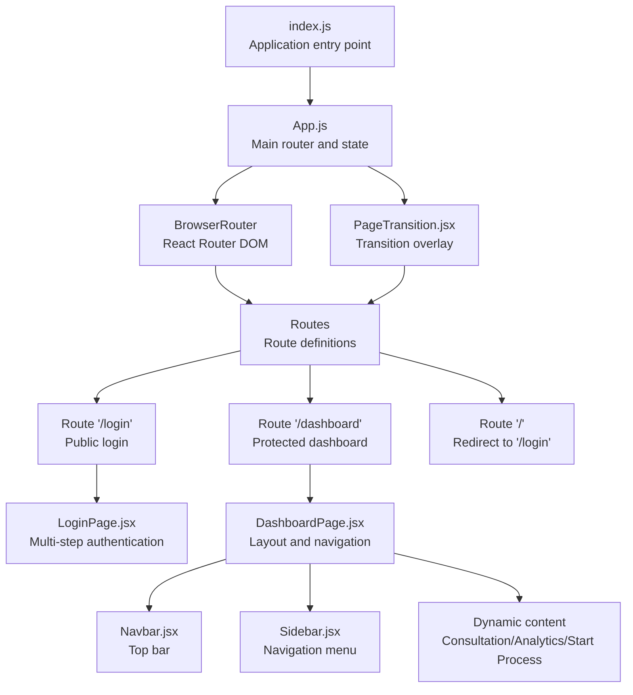
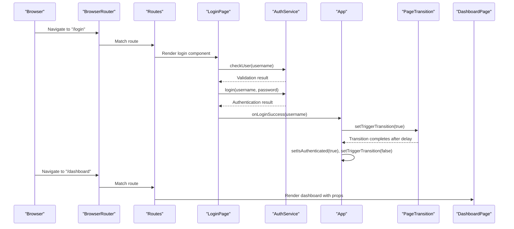
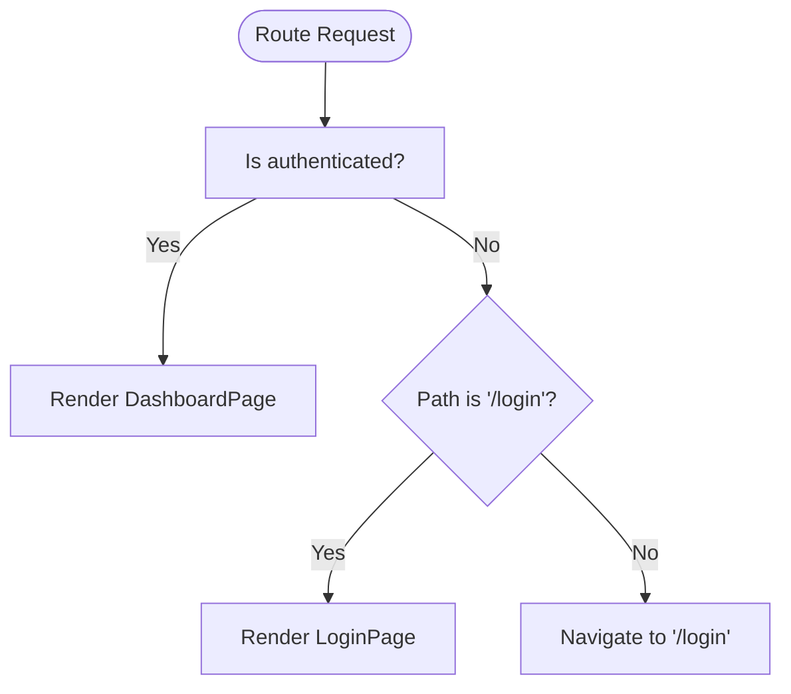
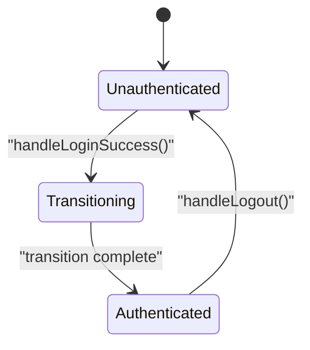
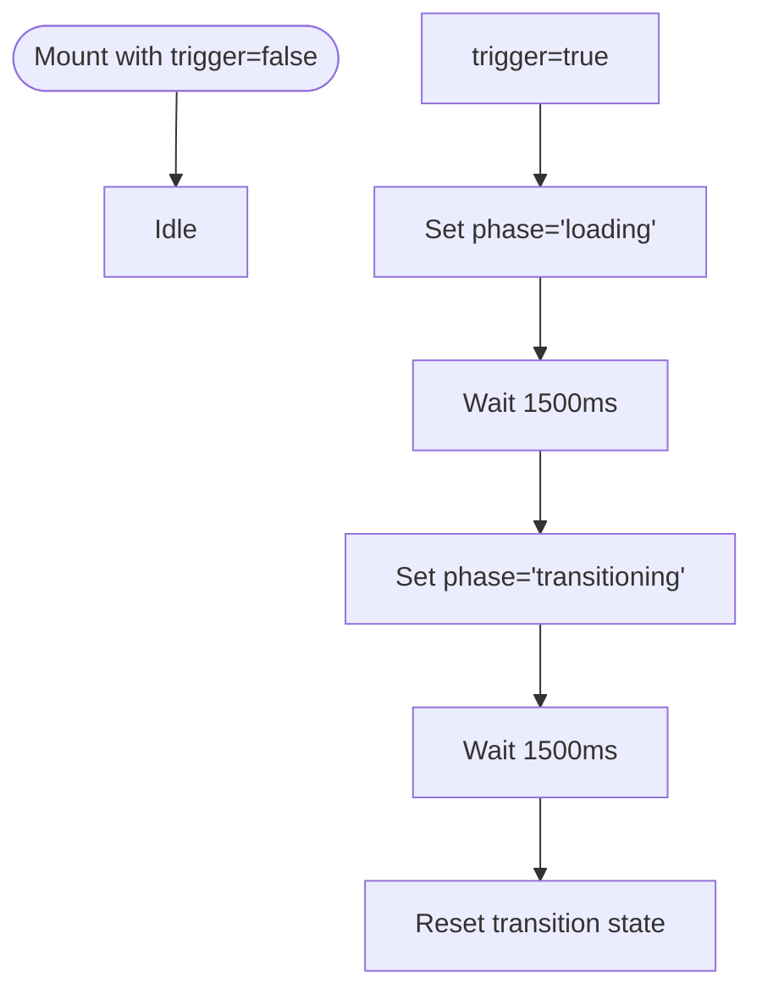
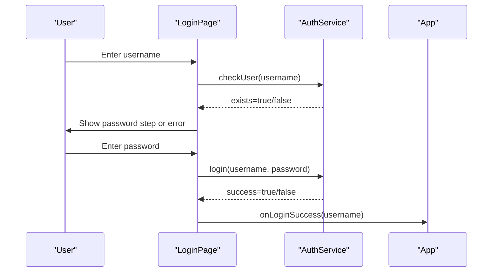
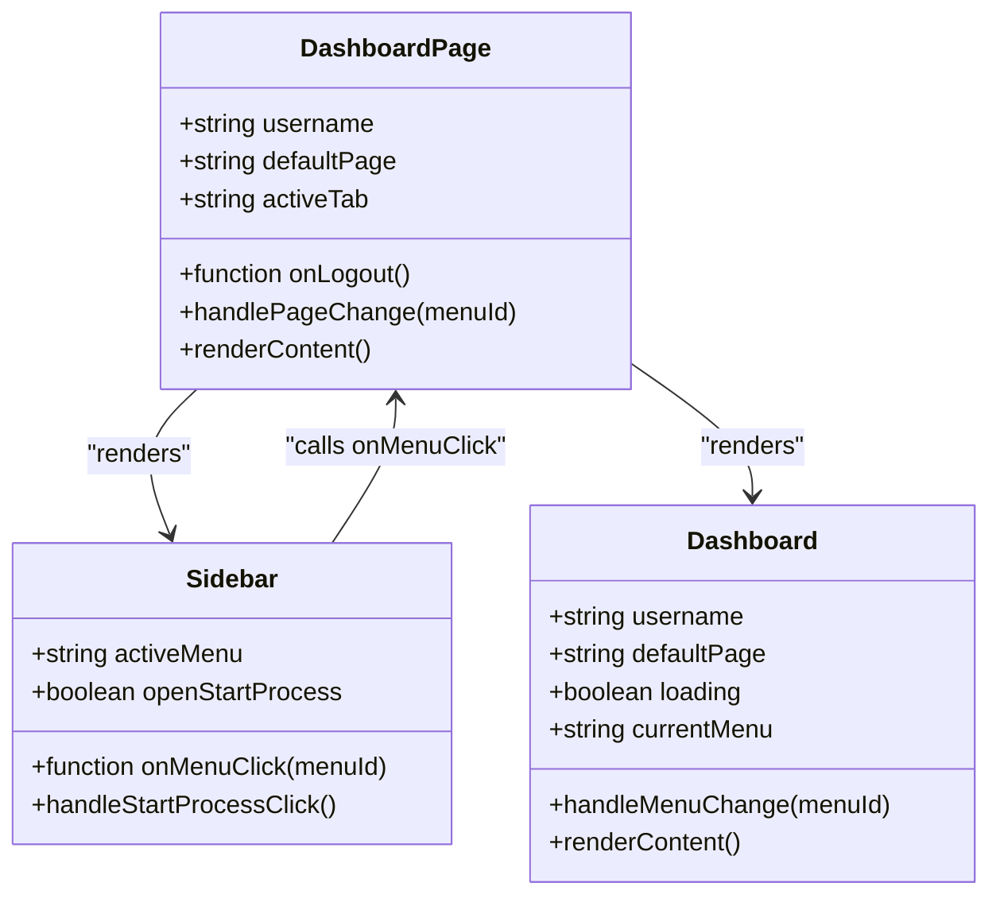
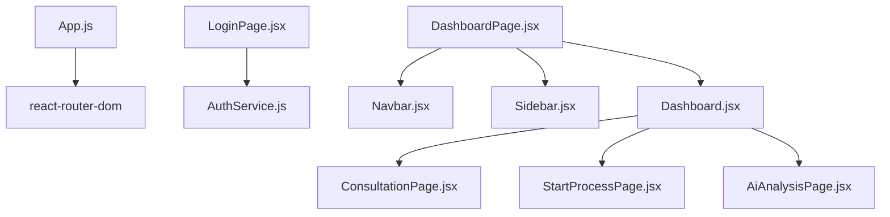

# Client-Side Routing Architecture

<cite>
**Referenced Files in This Document**
- [App.js](file://src/App.js)
- [PageTransition.jsx](file://src/components/PageTransition.jsx)
- [LoginPage.jsx](file://src/components/login/LoginPage.jsx)
- [DashboardPage.jsx](file://src/pages/DashboardPage.jsx)
- [Dashboard.jsx](file://src/components/dashboard/Dashboard.jsx)
- [Navbar.jsx](file://src/components/layout/Navbar.jsx)
- [Sidebar.jsx](file://src/components/layout/Sidebar.jsx)
- [AuthService.js](file://src/services/authService.js)
- [StartProcessPage.jsx](file://src/components/StartProcessPage.jsx)
- [ConsultationPage.jsx](file://src/components/ConsultationPage.jsx)
- [AiAnalysisPage.jsx](file://src/components/AiAnalysisPage.jsx)
- [index.js](file://src/index.js)
- [package.json](file://package.json)
</cite>

## Table of Contents
1. [Introduction](#introduction)
2. [Project Structure](#project-structure)
3. [Core Components](#core-components)
4. [Architecture Overview](#architecture-overview)
5. [Detailed Component Analysis](#detailed-component-analysis)
6. [Dependency Analysis](#dependency-analysis)
7. [Performance Considerations](#performance-considerations)
8. [Troubleshooting Guide](#troubleshooting-guide)
9. [Conclusion](#conclusion)

## Introduction
This document explains the client-side routing architecture built with React Router DOM. It covers route configuration in the main application, authentication state management, protected routes, public login route, default redirects, and the PageTransition component that provides smooth navigation between routes. It also documents the authentication flow, state management for transitions, and navigation patterns used across the application.

## Project Structure
The routing system centers around a single-page application with React Router DOM managing routes inside the main App component. Authentication state is maintained at the application root and controls access to protected routes. The PageTransition component wraps route rendering to provide animated transitions during login success.

**Diagram sources**
- [index.js:1-19](file://src/index.js#L1-L19)
- [App.js:33-71](file://src/App.js#L33-L71)
- [LoginPage.jsx:9-94](file://src/components/login/LoginPage.jsx#L9-L94)
- [DashboardPage.jsx:10-51](file://src/pages/DashboardPage.jsx#L10-L51)
- [Navbar.jsx:7-124](file://src/components/layout/Navbar.jsx#L7-L124)
- [Sidebar.jsx:4-167](file://src/components/layout/Sidebar.jsx#L4-L167)
- [PageTransition.jsx:3-61](file://src/components/PageTransition.jsx#L3-L61)

**Section sources**
- [index.js:1-19](file://src/index.js#L1-L19)
- [App.js:33-71](file://src/App.js#L33-L71)

## Core Components
- App.js: Defines routes, manages authentication state, and coordinates the PageTransition wrapper.
- PageTransition.jsx: Provides animated overlay during transitions triggered by authentication events.
- LoginPage.jsx: Implements a two-step login flow using AuthService to validate users and authenticate.
- DashboardPage.jsx: Renders the authenticated layout with Navbar, Sidebar, and dynamic content areas.
- AuthService.js: Encapsulates authentication API calls for user validation and login.

Key responsibilities:
- Route protection: Protected routes redirect unauthenticated users to the login page.
- Public route: Login route renders conditionally based on authentication state.
- Default redirect: Root path redirects to the login page.
- State management: Authentication state, username, transition triggers, and default page selection are managed in App.js.

**Section sources**
- [App.js:9-31](file://src/App.js#L9-L31)
- [App.js:39-66](file://src/App.js#L39-L66)
- [PageTransition.jsx:3-25](file://src/components/PageTransition.jsx#L3-L25)
- [LoginPage.jsx:9-51](file://src/components/login/LoginPage.jsx#L9-L51)
- [AuthService.js:3-19](file://src/services/authService.js#L3-L19)
- [DashboardPage.jsx:10-34](file://src/pages/DashboardPage.jsx#L10-L34)

## Architecture Overview
The routing architecture uses React Router DOM with a central App component that:
- Initializes authentication state and transition flags
- Defines three primary routes: login, dashboard, and default redirect
- Wraps route rendering with PageTransition for visual feedback during transitions
- Passes authentication callbacks and state down to child components

**Diagram sources**
- [App.js:15-24](file://src/App.js#L15-L24)
- [PageTransition.jsx:7-25](file://src/components/PageTransition.jsx#L7-L25)
- [LoginPage.jsx:36-51](file://src/components/login/LoginPage.jsx#L36-L51)
- [AuthService.js:3-19](file://src/services/authService.js#L3-L19)
- [DashboardPage.jsx:10-34](file://src/pages/DashboardPage.jsx#L10-L34)

## Detailed Component Analysis

### Route Configuration and Guards
The App component defines three routes:
- Public login route: Renders LoginPage when not authenticated; otherwise redirects to dashboard.
- Protected dashboard route: Renders DashboardPage when authenticated; otherwise redirects to login.
- Default redirect: Redirects root path to login.

Route guards are implemented using conditional rendering within Route elements and the Navigate component for redirects.

**Diagram sources**
- [App.js:39-66](file://src/App.js#L39-L66)

**Section sources**
- [App.js:39-66](file://src/App.js#L39-L66)

### Authentication Flow and State Management
Authentication state is managed at the App level:
- isAuthenticated: Controls access to protected routes
- username: Passed to dashboard for display
- triggerTransition: Triggers PageTransition during login success
- defaultPage: Sets initial dashboard content

The login success callback sets the username, triggers the transition, waits for completion, then marks the user as authenticated. Logout resets all state and defaults.

**Diagram sources**
- [App.js:15-31](file://src/App.js#L15-L31)
- [PageTransition.jsx:13-25](file://src/components/PageTransition.jsx#L13-L25)

**Section sources**
- [App.js:15-31](file://src/App.js#L15-L31)
- [PageTransition.jsx:13-25](file://src/components/PageTransition.jsx#L13-L25)

### PageTransition Component
The PageTransition component:
- Receives a trigger prop to initiate transitions
- Manages internal state for transition phases
- Renders an overlay with progress indicators while transitioning
- Returns children when not transitioning

The transition lifecycle:
- Trigger received → startTransition()
- Set phase to loading → show initial messages
- After delay → set phase to transitioning
- After delay → reset transition state

**Diagram sources**
- [PageTransition.jsx:7-25](file://src/components/PageTransition.jsx#L7-L25)

**Section sources**
- [PageTransition.jsx:3-61](file://src/components/PageTransition.jsx#L3-L61)

### Login Component and Multi-Step Authentication
The LoginPage component:
- Uses AuthService.checkUser to validate usernames
- Uses AuthService.login to authenticate credentials
- Manages step-based flow (username → password)
- Displays server errors and avatar selection based on username

**Diagram sources**
- [LoginPage.jsx:16-51](file://src/components/login/LoginPage.jsx#L16-L51)
- [AuthService.js:3-19](file://src/services/authService.js#L3-L19)
- [App.js:15-24](file://src/App.js#L15-L24)

**Section sources**
- [LoginPage.jsx:9-51](file://src/components/login/LoginPage.jsx#L9-L51)
- [AuthService.js:3-19](file://src/services/authService.js#L3-L19)

### Dashboard Navigation Patterns
The DashboardPage component:
- Renders Navbar and Sidebar
- Switches content based on activeTab/defaultPage
- Supports dynamic submenus for process initiation

Navigation patterns:
- Sidebar menu items update activeTab
- DashboardPage passes activeTab to Dashboard component
- Dashboard component renders appropriate content based on currentMenu

**Diagram sources**
- [DashboardPage.jsx:10-34](file://src/pages/DashboardPage.jsx#L10-L34)
- [Sidebar.jsx:4-167](file://src/components/layout/Sidebar.jsx#L4-L167)
- [Dashboard.jsx:8-70](file://src/components/dashboard/Dashboard.jsx#L8-L70)

**Section sources**
- [DashboardPage.jsx:10-34](file://src/pages/DashboardPage.jsx#L10-L34)
- [Sidebar.jsx:4-167](file://src/components/layout/Sidebar.jsx#L4-L167)
- [Dashboard.jsx:8-70](file://src/components/dashboard/Dashboard.jsx#L8-L70)

### Additional Routes and Pages
- AI Analysis route: "/ai-analysis" renders AiAnalysisPage
- Start Process pages: Dynamic content based on props (isOut) passed from Sidebar
- Consultation page: Central data exploration with filters, pagination, and exports

These routes integrate seamlessly with the existing authentication and navigation patterns.

**Section sources**
- [App.js:48](file://src/App.js#L48)
- [AiAnalysisPage.jsx:363-860](file://src/components/AiAnalysisPage.jsx#L363-L860)
- [StartProcessPage.jsx:80-268](file://src/components/StartProcessPage.jsx#L80-L268)
- [ConsultationPage.jsx:7-419](file://src/components/ConsultationPage.jsx#L7-L419)

## Dependency Analysis
External dependencies relevant to routing and navigation:
- react-router-dom: Provides BrowserRouter, Routes, Route, and Navigate
- React: Component model and hooks for state management
- Optional: react-icons, jspdf, xlsx for dashboard features

**Diagram sources**
- [App.js:1-8](file://src/App.js#L1-L8)
- [LoginPage.jsx:4](file://src/components/login/LoginPage.jsx#L4)
- [DashboardPage.jsx:2-8](file://src/pages/DashboardPage.jsx#L2-L8)
- [AuthService.js:1](file://src/services/authService.js#L1)

**Section sources**
- [package.json:18](file://package.json#L18)
- [App.js:1-8](file://src/App.js#L1-L8)

## Performance Considerations
- Route transitions: PageTransition introduces a fixed delay; ensure animations remain lightweight to avoid blocking navigation.
- Conditional rendering: Using Navigate components prevents unnecessary component mounts for unauthenticated users.
- Lazy loading: Consider lazy-loading heavy route components (e.g., AiAnalysisPage) to improve initial load performance.
- State updates: Batch state updates during login to minimize re-renders.

## Troubleshooting Guide
Common issues and resolutions:
- Login fails silently: Verify AuthService endpoints and network connectivity; check error messages returned by AuthService.
- Protected route shows login repeatedly: Ensure authentication state is persisted and not reset unintentionally.
- Transition overlay does not appear: Confirm triggerTransition is set to true on login success and reset on logout.
- Dashboard content not updating: Verify activeTab/currentMenu updates propagate correctly from Sidebar to Dashboard components.

**Section sources**
- [AuthService.js:3-19](file://src/services/authService.js#L3-L19)
- [App.js:15-31](file://src/App.js#L15-L31)
- [PageTransition.jsx:7-25](file://src/components/PageTransition.jsx#L7-L25)
- [Sidebar.jsx:11-17](file://src/components/layout/Sidebar.jsx#L11-L17)

## Conclusion
The client-side routing architecture leverages React Router DOM with centralized authentication state and a transition overlay for smooth navigation. Route guards protect sensitive areas, while the login flow integrates with backend services through a dedicated service module. The dashboard navigation pattern enables flexible content switching via a sidebar-driven menu system. This design supports scalability and maintainability for future enhancements.