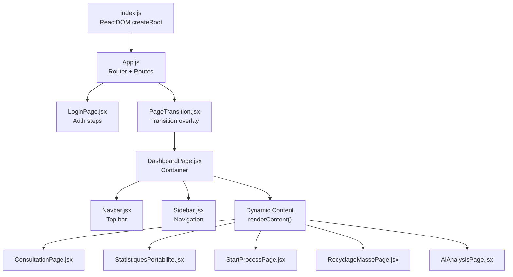
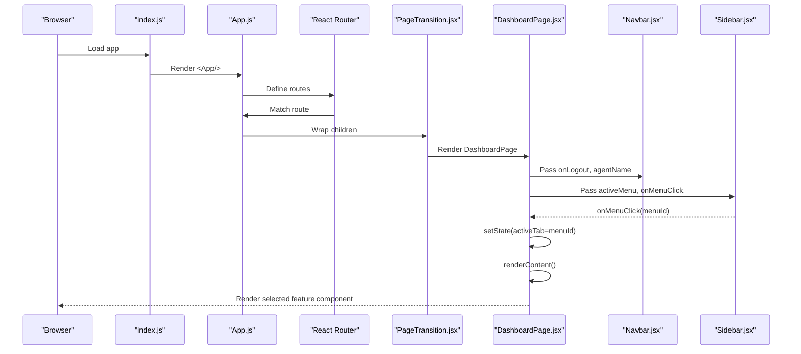
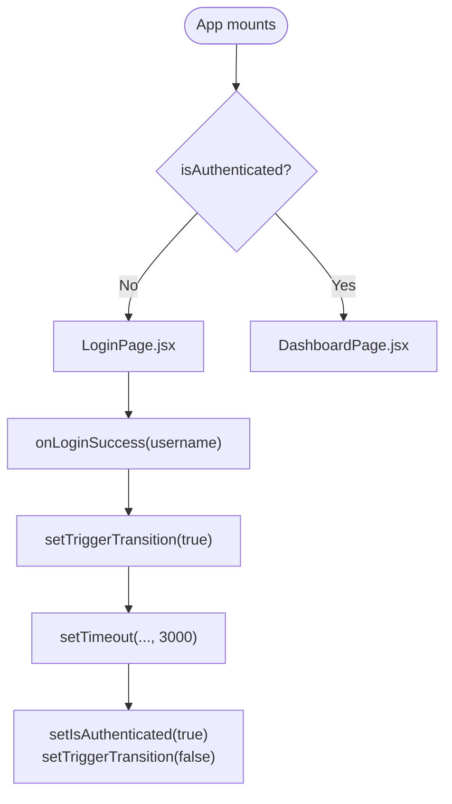
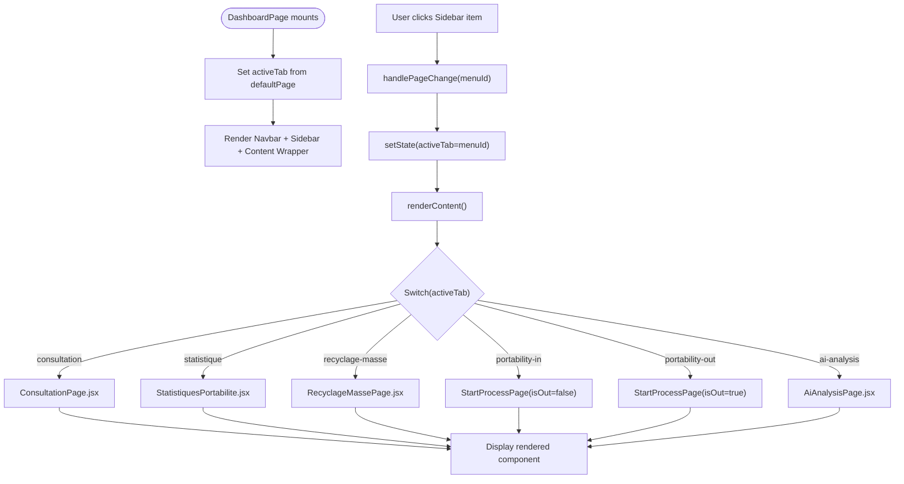
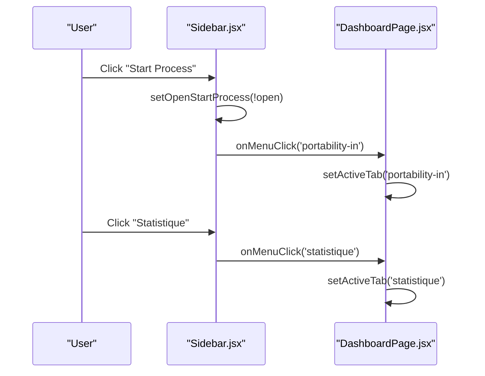
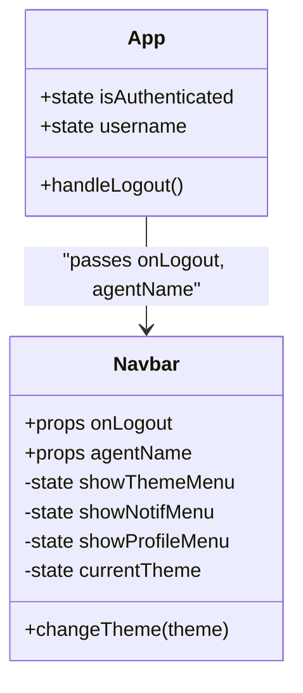
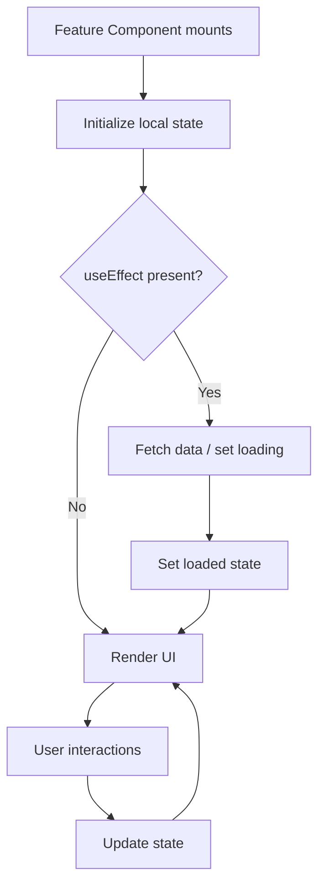
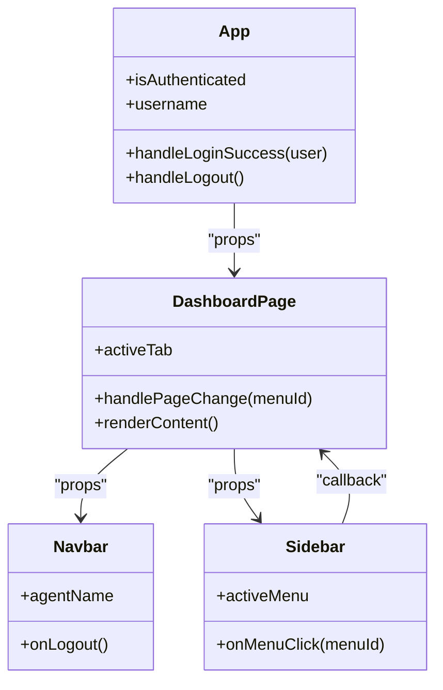
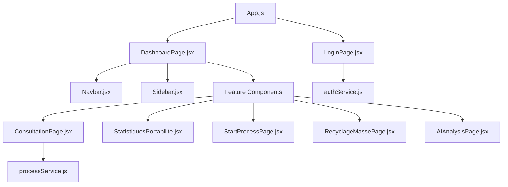

# Component Hierarchy and Composition

<cite>
**Referenced Files in This Document**
- [App.js](file://src/App.js)
- [index.js](file://src/index.js)
- [DashboardPage.jsx](file://src/pages/DashboardPage.jsx)
- [Navbar.jsx](file://src/components/layout/Navbar.jsx)
- [Sidebar.jsx](file://src/components/layout/Sidebar.jsx)
- [ConsultationPage.jsx](file://src/components/ConsultationPage.jsx)
- [StatistiquesPortabilite.jsx](file://src/components/StatistiquesPortabilite.jsx)
- [StartProcessPage.jsx](file://src/components/StartProcessPage.jsx)
- [RecyclageMassePage.jsx](file://src/components/RecyclageMassePage.jsx)
- [AiAnalysisPage.jsx](file://src/components/AiAnalysisPage.jsx)
- [PageTransition.jsx](file://src/components/PageTransition.jsx)
- [LoginPage.jsx](file://src/components/login/LoginPage.jsx)
- [authService.js](file://src/services/authService.js)
- [processService.js](file://src/services/processService.js)
</cite>

## Table of Contents
1. [Introduction](#introduction)
2. [Project Structure](#project-structure)
3. [Core Components](#core-components)
4. [Architecture Overview](#architecture-overview)
5. [Detailed Component Analysis](#detailed-component-analysis)
6. [Dependency Analysis](#dependency-analysis)
7. [Performance Considerations](#performance-considerations)
8. [Troubleshooting Guide](#troubleshooting-guide)
9. [Conclusion](#conclusion)

## Introduction
This document explains the component hierarchy and composition patterns in SmartPorta. It focuses on the main App component structure, the DashboardPage container, and the relationships between layout components (Navbar, Sidebar) and feature components. It also covers component composition strategies, prop passing patterns, dynamic content rendering based on user selection, lifecycle management, state sharing, and the factory pattern used for dynamic component rendering.

## Project Structure
SmartPorta follows a feature-based structure with clear separation between:
- Application bootstrap and routing in App.js
- Pages (DashboardPage) and layout components (Navbar, Sidebar)
- Feature components (Consultation, Statistics, Start Process, AI Analysis, Mass Recycling)
- Services for authentication and process data
- A page transition wrapper for smooth navigation

**Diagram sources**
- [index.js:8-13](file://src/index.js#L8-L13)
- [App.js:33-71](file://src/App.js#L33-L71)
- [DashboardPage.jsx:36-50](file://src/pages/DashboardPage.jsx#L36-L50)
- [Navbar.jsx:36-123](file://src/components/layout/Navbar.jsx#L36-L123)
- [Sidebar.jsx:19-166](file://src/components/layout/Sidebar.jsx#L19-L166)

**Section sources**
- [index.js:8-13](file://src/index.js#L8-L13)
- [App.js:33-71](file://src/App.js#L33-L71)

## Core Components
- App.js orchestrates routing, authentication state, and page transitions. It conditionally renders LoginPage or DashboardPage and manages authentication lifecycle props passed down to DashboardPage.
- DashboardPage.jsx acts as a container component that:
  - Receives username, logout handler, and default page from App.js
  - Maintains activeTab state and delegates menu changes to Sidebar
  - Implements a factory-like renderContent() that dynamically renders feature components based on activeTab
- Navbar.jsx handles theme switching, notifications, and profile actions, receiving onLogout and agentName props.
- Sidebar.jsx controls navigation, maintains submenu visibility, and triggers page changes via onMenuClick.

**Section sources**
- [App.js:9-31](file://src/App.js#L9-L31)
- [DashboardPage.jsx:10-34](file://src/pages/DashboardPage.jsx#L10-L34)
- [Navbar.jsx:7-32](file://src/components/layout/Navbar.jsx#L7-L32)
- [Sidebar.jsx:4-17](file://src/components/layout/Sidebar.jsx#L4-L17)

## Architecture Overview
The application uses React Router for navigation and a central DashboardPage container to manage layout and dynamic content. The composition pattern relies on:
- Props drilling: App.js passes authentication and user info to DashboardPage; DashboardPage passes activeTab and handlers to Navbar and Sidebar; Sidebar passes menu selections back to DashboardPage.
- Factory pattern: renderContent() selects the appropriate feature component based on activeTab.
- Service layer: AuthService and processService encapsulate API interactions.

**Diagram sources**
- [index.js:8-13](file://src/index.js#L8-L13)
- [App.js:33-71](file://src/App.js#L33-L71)
- [PageTransition.jsx:3-25](file://src/components/PageTransition.jsx#L3-L25)
- [DashboardPage.jsx:13-34](file://src/pages/DashboardPage.jsx#L13-L34)
- [Navbar.jsx:36-123](file://src/components/layout/Navbar.jsx#L36-L123)
- [Sidebar.jsx:19-166](file://src/components/layout/Sidebar.jsx#L19-L166)

## Detailed Component Analysis

### App Component and Authentication Flow
- Manages authentication state (isAuthenticated, username) and transition state (triggerTransition).
- Provides onLoginSuccess to LoginPage and onLogout to DashboardPage.
- Uses PageTransition to provide a smooth transition after successful login.

**Diagram sources**
- [App.js:9-31](file://src/App.js#L9-L31)
- [LoginPage.jsx:9-51](file://src/components/login/LoginPage.jsx#L9-L51)
- [PageTransition.jsx:7-25](file://src/components/PageTransition.jsx#L7-L25)

**Section sources**
- [App.js:9-31](file://src/App.js#L9-L31)
- [LoginPage.jsx:9-51](file://src/components/login/LoginPage.jsx#L9-L51)
- [PageTransition.jsx:3-25](file://src/components/PageTransition.jsx#L3-L25)

### DashboardPage Container and Dynamic Rendering
- Holds activeTab state and exposes handlePageChange to Sidebar.
- Implements renderContent() as a factory that returns the appropriate feature component based on activeTab.
- Renders Navbar and Sidebar, and a content wrapper that displays the selected feature component.

**Diagram sources**
- [DashboardPage.jsx:10-34](file://src/pages/DashboardPage.jsx#L10-L34)
- [DashboardPage.jsx:17-34](file://src/pages/DashboardPage.jsx#L17-L34)

**Section sources**
- [DashboardPage.jsx:10-34](file://src/pages/DashboardPage.jsx#L10-L34)

### Sidebar Navigation and State Propagation
- Tracks openStartProcess locally to toggle the Start Process submenu.
- Calls onMenuClick('portability-in') when toggling the Start Process button.
- Applies active class based on activeMenu prop.

**Diagram sources**
- [Sidebar.jsx:11-17](file://src/components/layout/Sidebar.jsx#L11-L17)
- [Sidebar.jsx:42-53](file://src/components/layout/Sidebar.jsx#L42-L53)
- [DashboardPage.jsx:13-15](file://src/pages/DashboardPage.jsx#L13-L15)

**Section sources**
- [Sidebar.jsx:4-17](file://src/components/layout/Sidebar.jsx#L4-L17)
- [DashboardPage.jsx:13-15](file://src/pages/DashboardPage.jsx#L13-L15)

### Navbar Theme, Notifications, and Profile
- Manages theme state and applies body classes for light/dark themes.
- Controls dropdown visibility for theme, notifications, and profile menus.
- Receives onLogout callback and agentName for display.

**Diagram sources**
- [Navbar.jsx:7-32](file://src/components/layout/Navbar.jsx#L7-L32)
- [App.js:26-31](file://src/App.js#L26-L31)

**Section sources**
- [Navbar.jsx:7-32](file://src/components/layout/Navbar.jsx#L7-L32)
- [App.js:26-31](file://src/App.js#L26-L31)

### Feature Components and Lifecycle Patterns
- ConsultationPage.jsx
  - Uses useEffect to load initial data on mount.
  - Manages search form state, pagination, and export to CSV/PDF.
  - Integrates with processService for data fetching.
- StatistiquesPortabilite.jsx
  - Fetches statistics and monthly data via HTTP requests.
  - Implements drilldown and CSV export for "not ok" instances.
- StartProcessPage.jsx
  - Builds SOAP envelopes and parses responses.
  - Supports both IN and OUT portability flows via isOut prop.
- RecyclageMassePage.jsx
  - Handles filtering, selection, and mass recycling actions.
  - Implements pagination and toast notifications.
- AiAnalysisPage.jsx
  - Manages tabs, KIE server connection, error lists, and report generation (Excel/PDF).

**Diagram sources**
- [ConsultationPage.jsx:29-70](file://src/components/ConsultationPage.jsx#L29-L70)
- [StatistiquesPortabilite.jsx:28-63](file://src/components/StatistiquesPortabilite.jsx#L28-L63)
- [StartProcessPage.jsx:95-148](file://src/components/StartProcessPage.jsx#L95-L148)
- [RecyclageMassePage.jsx:24-86](file://src/components/RecyclageMassePage.jsx#L24-L86)
- [AiAnalysisPage.jsx:404-432](file://src/components/AiAnalysisPage.jsx#L404-L432)

**Section sources**
- [ConsultationPage.jsx:29-70](file://src/components/ConsultationPage.jsx#L29-L70)
- [StatistiquesPortabilite.jsx:28-63](file://src/components/StatistiquesPortabilite.jsx#L28-L63)
- [StartProcessPage.jsx:95-148](file://src/components/StartProcessPage.jsx#L95-L148)
- [RecyclageMassePage.jsx:24-86](file://src/components/RecyclageMassePage.jsx#L24-L86)
- [AiAnalysisPage.jsx:404-432](file://src/components/AiAnalysisPage.jsx#L404-L432)

### Component Composition Strategies and Prop Passing
- Parent-to-child props:
  - App.js → DashboardPage: username, onLogout, defaultPage
  - DashboardPage → Navbar: onLogout, agentName
  - DashboardPage → Sidebar: activeMenu, onMenuClick, username
- Child-to-parent callbacks:
  - Sidebar → DashboardPage: onMenuClick(menuId) updates activeTab
  - LoginPage → App: onLoginSuccess(username) sets authentication state
- Dynamic rendering:
  - DashboardPage.renderContent() acts as a factory, returning the appropriate feature component based on activeTab.

**Diagram sources**
- [App.js:56-60](file://src/App.js#L56-L60)
- [DashboardPage.jsx:38-44](file://src/pages/DashboardPage.jsx#L38-L44)
- [DashboardPage.jsx:13-15](file://src/pages/DashboardPage.jsx#L13-L15)
- [Sidebar.jsx:4-7](file://src/components/layout/Sidebar.jsx#L4-L7)

**Section sources**
- [App.js:56-60](file://src/App.js#L56-L60)
- [DashboardPage.jsx:38-44](file://src/pages/DashboardPage.jsx#L38-L44)
- [DashboardPage.jsx:13-15](file://src/pages/DashboardPage.jsx#L13-L15)
- [Sidebar.jsx:4-7](file://src/components/layout/Sidebar.jsx#L4-L7)

### State Sharing Between Components
- Authentication state is centralized in App.js and shared with child components via props.
- DashboardPage holds the activeTab state and shares it with Navbar and Sidebar to reflect the current selection.
- Feature components maintain their own internal state (e.g., search forms, loading flags, selections) and coordinate through props/callbacks.

**Section sources**
- [App.js:10-13](file://src/App.js#L10-L13)
- [DashboardPage.jsx:11](file://src/pages/DashboardPage.jsx#L11)
- [Sidebar.jsx:24-29](file://src/components/layout/Sidebar.jsx#L24-L29)

### Factory Pattern for Dynamic Component Rendering
- The renderContent() method in DashboardPage serves as a factory, selecting and instantiating the appropriate feature component based on activeTab.
- This pattern allows easy extension by adding new cases to the switch statement and importing the corresponding component.

**Section sources**
- [DashboardPage.jsx:17-34](file://src/pages/DashboardPage.jsx#L17-L34)

## Dependency Analysis
- Runtime dependencies include react-router-dom for routing, recharts for charts, and libraries for PDF/Excel exports.
- Service dependencies:
  - AuthService provides checkUser and login for authentication.
  - processService encapsulates monitoring API calls for process search.

**Diagram sources**
- [App.js:3-8](file://src/App.js#L3-L8)
- [authService.js:1-19](file://src/services/authService.js#L1-L19)
- [processService.js:1-38](file://src/services/processService.js#L1-L38)

**Section sources**
- [package.json:5-22](file://package.json#L5-L22)
- [authService.js:1-19](file://src/services/authService.js#L1-L19)
- [processService.js:1-38](file://src/services/processService.js#L1-L38)

## Performance Considerations
- Avoid unnecessary re-renders by keeping heavy computations inside useEffect and memoizing derived values.
- Debounce or throttle frequent API calls (e.g., search filters) to reduce network overhead.
- Use pagination in data-heavy components (ConsultationPage, StatistiquesPortabilite, RecyclageMassePage) to limit DOM size and memory usage.
- Lazy-load feature components if the number of routes grows significantly.

## Troubleshooting Guide
- Authentication failures:
  - Verify AuthService endpoints and credentials. Check network tab for 4xx/5xx responses.
- Dashboard not rendering:
  - Confirm activeTab values match keys in renderContent() switch.
  - Ensure Sidebar.onMenuClick properly invokes handlePageChange.
- Data loading issues:
  - Check processService URL construction and response handling.
  - Inspect monitoring backend availability on configured ports.

**Section sources**
- [authService.js:3-18](file://src/services/authService.js#L3-L18)
- [processService.js:25-37](file://src/services/processService.js#L25-L37)

## Conclusion
SmartPorta’s component hierarchy centers around a container-like DashboardPage that composes layout and feature components through explicit props and callbacks. The factory pattern in renderContent() enables dynamic, scalable content rendering. Authentication state is managed centrally in App.js, while feature components encapsulate their own lifecycle and data concerns. This structure supports clear separation of concerns, predictable data flow, and extensibility for future features.