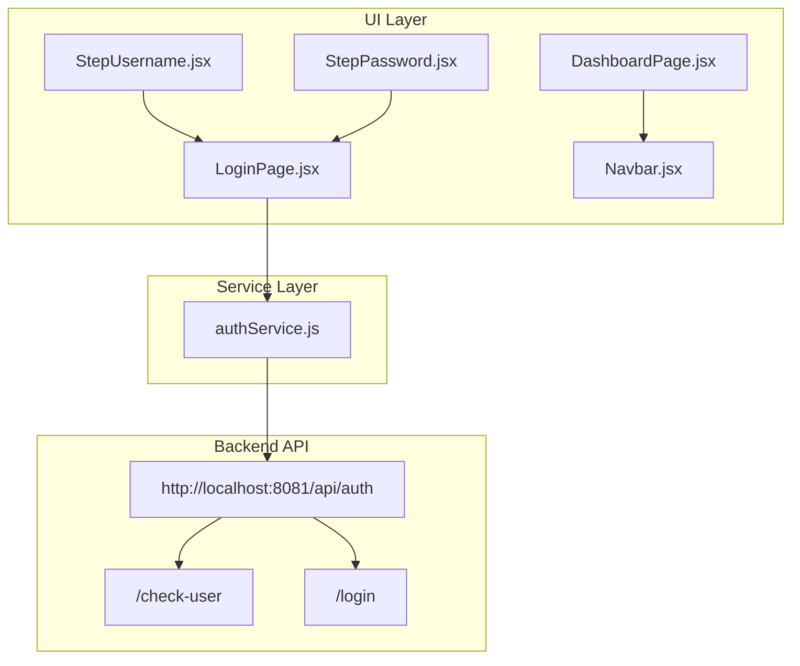
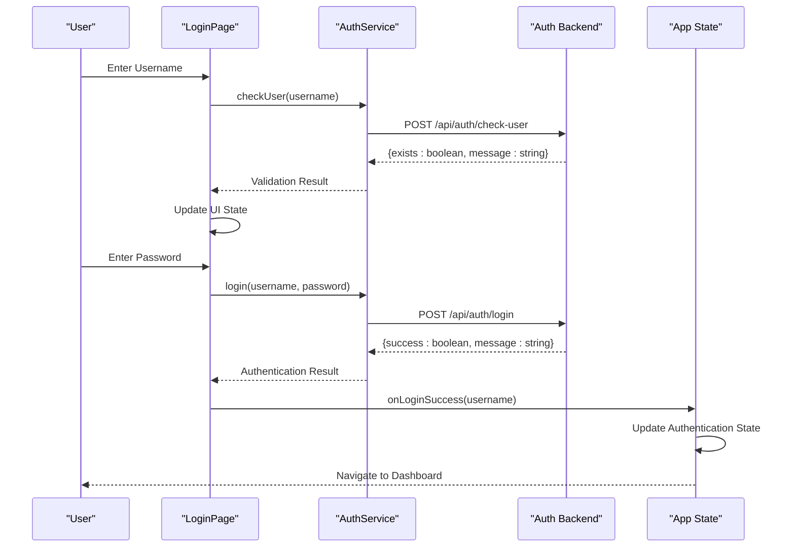
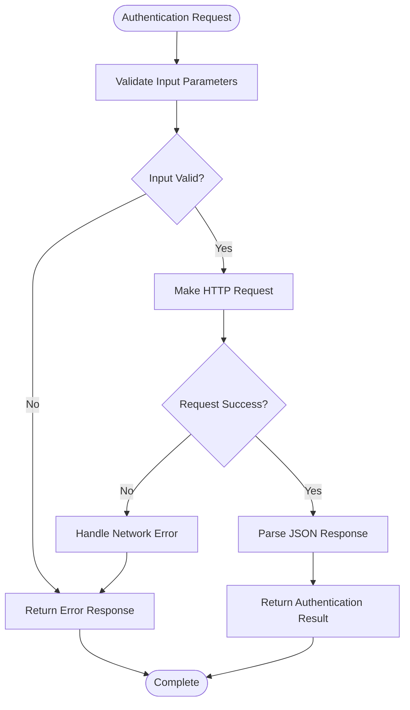
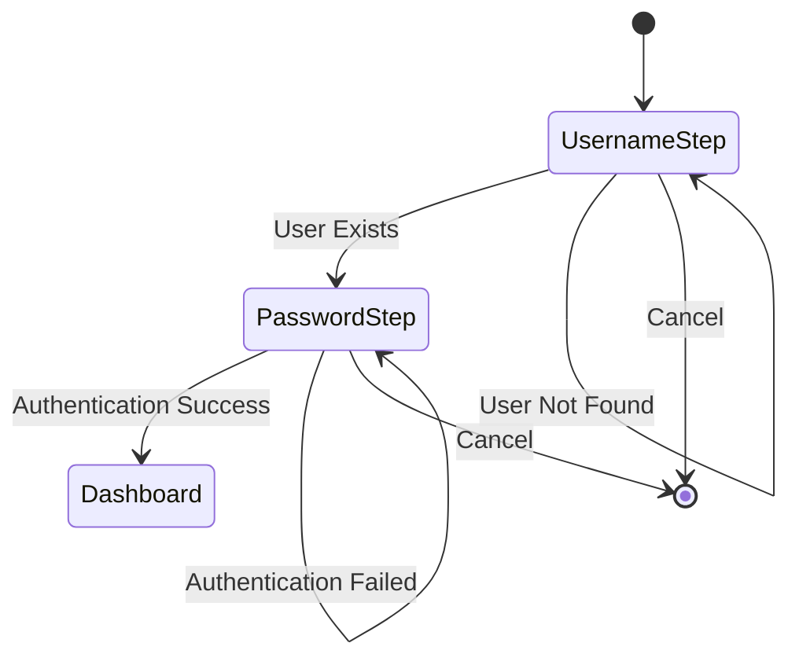
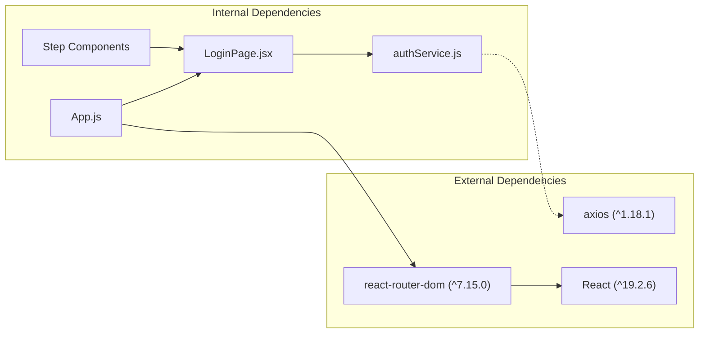

# Authentication Service Layer

<cite>
**Referenced Files in This Document**
- [authService.js](file://src/services/authService.js)
- [LoginPage.jsx](file://src/components/login/LoginPage.jsx)
- [StepUsername.jsx](file://src/components/login/StepUsername.jsx)
- [StepPassword.jsx](file://src/components/login/StepPassword.jsx)
- [App.js](file://src/App.js)
- [DashboardPage.jsx](file://src/pages/DashboardPage.jsx)
- [Navbar.jsx](file://src/components/layout/Navbar.jsx)
- [package.json](file://package.json)
</cite>

## Table of Contents
1. [Introduction](#introduction)
2. [Project Structure](#project-structure)
3. [Core Components](#core-components)
4. [Architecture Overview](#architecture-overview)
5. [Detailed Component Analysis](#detailed-component-analysis)
6. [Dependency Analysis](#dependency-analysis)
7. [Performance Considerations](#performance-considerations)
8. [Troubleshooting Guide](#troubleshooting-guide)
9. [Conclusion](#conclusion)

## Introduction
This document provides comprehensive documentation for the authentication service layer implementation. It covers the API communication patterns used for user validation and authentication, service functions for checkUser and login operations, request/response handling, error management, integration with backend authentication endpoints, token handling mechanisms, and user state persistence strategies. The service layer abstracts authentication logic from UI components, enabling clean separation of concerns and maintainable code architecture.

## Project Structure
The authentication service layer is organized around a dedicated service module that encapsulates all authentication-related network operations, complemented by UI components that handle user interaction and state management.

**Diagram sources**
- [authService.js:1-19](file://src/services/authService.js#L1-L19)
- [LoginPage.jsx:1-94](file://src/components/login/LoginPage.jsx#L1-L94)
- [DashboardPage.jsx:1-51](file://src/pages/DashboardPage.jsx#L1-L51)

**Section sources**
- [authService.js:1-19](file://src/services/authService.js#L1-L19)
- [LoginPage.jsx:1-94](file://src/components/login/LoginPage.jsx#L1-L94)
- [App.js:1-74](file://src/App.js#L1-L74)

## Core Components
The authentication service layer consists of three primary components:

### Authentication Service Module
The service module provides two core functions for user authentication:
- `checkUser(username)`: Validates user existence and availability
- `login(username, password)`: Authenticates users with credentials

### UI Authentication Components
The UI layer comprises three interactive components:
- `LoginPage`: Orchestrates the authentication flow with step-based progression
- `StepUsername`: Handles username input and validation
- `StepPassword`: Manages password input with show/hide functionality

### State Management Integration
The application maintains authentication state through React hooks, coordinating navigation and user interface updates.

**Section sources**
- [authService.js:3-19](file://src/services/authService.js#L3-L19)
- [LoginPage.jsx:9-57](file://src/components/login/LoginPage.jsx#L9-L57)
- [StepUsername.jsx:3-23](file://src/components/login/StepUsername.jsx#L3-L23)
- [StepPassword.jsx:3-57](file://src/components/login/StepPassword.jsx#L3-L57)

## Architecture Overview
The authentication architecture follows a layered approach with clear separation between presentation, service, and data layers.

**Diagram sources**
- [authService.js:3-19](file://src/services/authService.js#L3-L19)
- [LoginPage.jsx:16-51](file://src/components/login/LoginPage.jsx#L16-L51)
- [App.js:15-24](file://src/App.js#L15-L24)

## Detailed Component Analysis

### Authentication Service Implementation
The authentication service encapsulates all network communication logic with the backend authentication endpoints.

#### Service Functions
The service provides two primary asynchronous functions:

**checkUser Function**
- Purpose: Validates user existence before proceeding to password authentication
- Request Method: POST
- Endpoint: `/api/auth/check-user`
- Request Body: `{ username: string }`
- Response Format: `{ exists: boolean, message: string }`

**login Function**
- Purpose: Authenticates users with provided credentials
- Request Method: POST
- Endpoint: `/api/auth/login`
- Request Body: `{ username: string, password: string }`
- Response Format: `{ success: boolean, message: string }`

#### Error Handling Strategy
The service implements robust error handling through:
- Network request validation
- JSON parsing with fallback error messages
- Consistent response structure regardless of authentication outcome

**Diagram sources**
- [authService.js:3-19](file://src/services/authService.js#L3-L19)

**Section sources**
- [authService.js:1-19](file://src/services/authService.js#L1-L19)

### Login Page Component
The LoginPage component orchestrates the complete authentication flow with step-based progression and state management.

#### State Management
The component maintains several key state variables:
- `step`: Controls which authentication step is currently displayed
- `username`: Stores the entered username
- `password`: Stores the entered password
- `message`: Manages feedback messages for user guidance
- `currentAvatar`: Determines avatar display based on username

#### Authentication Flow Control
The component implements a two-step authentication process:
1. **Username Validation Step**: Uses `checkUser()` to verify user existence
2. **Password Authentication Step**: Uses `login()` to authenticate credentials

#### Error Handling Implementation
The component provides comprehensive error handling:
- Input validation for empty fields
- Network error handling with user-friendly messages
- Backend response interpretation and user feedback

**Diagram sources**
- [LoginPage.jsx:16-51](file://src/components/login/LoginPage.jsx#L16-L51)

**Section sources**
- [LoginPage.jsx:9-94](file://src/components/login/LoginPage.jsx#L9-L94)

### Step-Based UI Components
The authentication interface is divided into specialized components for optimal user experience.

#### StepUsername Component
Handles username input with:
- Real-time validation
- Keyboard navigation support (Enter key)
- Auto-focus functionality
- Icon integration for visual cues

#### StepPassword Component
Manages password input with:
- Toggle visibility functionality
- "Remember me" checkbox
- Password recovery placeholder
- Enhanced security features

**Section sources**
- [StepUsername.jsx:3-23](file://src/components/login/StepUsername.jsx#L3-L23)
- [StepPassword.jsx:3-57](file://src/components/login/StepPassword.jsx#L3-L57)

### Application State Integration
The authentication service integrates seamlessly with the application's global state management.

#### Authentication State Management
The App component manages:
- `isAuthenticated`: Global authentication state
- `username`: Currently logged-in user
- Navigation routing based on authentication status
- Smooth page transitions during authentication

#### Route Protection
The application implements route protection:
- Unauthenticated users are redirected to login
- Authenticated users access protected routes
- Automatic redirection prevents unauthorized access

**Section sources**
- [App.js:10-31](file://src/App.js#L10-L31)
- [App.js:39-63](file://src/App.js#L39-L63)

### Dashboard Integration
The authentication service seamlessly integrates with the dashboard interface.

#### Navbar Integration
The Navbar component receives authentication state:
- Displays current user information
- Shows appropriate avatar based on username
- Provides logout functionality
- Maintains consistent theming

#### Content Routing
The DashboardPage component manages:
- Multiple content areas (consultation, statistics, processes)
- Active tab management
- Dynamic content rendering based on user selection

**Section sources**
- [DashboardPage.jsx:10-51](file://src/pages/DashboardPage.jsx#L10-L51)
- [Navbar.jsx:7-124](file://src/components/layout/Navbar.jsx#L7-L124)

## Dependency Analysis
The authentication service layer has minimal external dependencies, relying primarily on React's built-in capabilities.

**Diagram sources**
- [package.json:14-22](file://package.json#L14-L22)
- [authService.js:1-19](file://src/services/authService.js#L1-L19)
- [LoginPage.jsx:4](file://src/components/login/LoginPage.jsx#L4)

### Internal Dependencies
The authentication system demonstrates excellent modularity with clear dependency relationships:
- UI components depend on the authentication service
- Service module has no external dependencies
- State management is centralized in the App component
- No circular dependencies exist

**Section sources**
- [package.json:1-49](file://package.json#L1-L49)
- [authService.js:1-19](file://src/services/authService.js#L1-L19)

## Performance Considerations
The authentication service layer is designed for optimal performance and user experience:

### Network Optimization
- Minimal API calls (only 2 requests per authentication flow)
- Efficient JSON serialization/deserialization
- No unnecessary data transfer

### UI Responsiveness
- Asynchronous operations prevent UI blocking
- Immediate user feedback for all actions
- Optimized state updates

### Memory Management
- Proper cleanup of event handlers
- Efficient component unmounting
- Minimal memory footprint

## Troubleshooting Guide

### Common Authentication Issues

#### Network Connectivity Problems
**Symptoms**: "Erreur de connexion au serveur" messages
**Causes**: 
- Backend server unavailable
- Network connectivity issues
- Incorrect base URL configuration

**Solutions**:
- Verify backend service is running
- Check network connectivity
- Confirm BASE_URL matches backend deployment

#### Authentication Failure Scenarios
**Symptoms**: Backend returns failure responses
**Causes**:
- Invalid username/password combination
- Account locked or disabled
- Backend validation errors

**Solutions**:
- Verify credential correctness
- Check account status
- Review backend error logs

#### UI State Management Issues
**Symptoms**: Incorrect state transitions or UI glitches
**Causes**:
- State synchronization problems
- Event handler conflicts
- Component lifecycle issues

**Solutions**:
- Implement proper state cleanup
- Use React DevTools for debugging
- Add console logging for state changes

### Debugging Strategies
1. **Network Monitoring**: Use browser developer tools to inspect API requests
2. **State Inspection**: Monitor React component state changes
3. **Error Logging**: Implement comprehensive error handling and logging
4. **Backend Verification**: Test API endpoints independently

**Section sources**
- [LoginPage.jsx:17-33](file://src/components/login/LoginPage.jsx#L17-L33)
- [LoginPage.jsx:37-50](file://src/components/login/LoginPage.jsx#L37-L50)

## Conclusion
The authentication service layer provides a robust, modular, and maintainable solution for user authentication. Its design emphasizes separation of concerns, with clear boundaries between UI presentation, service logic, and state management. The implementation demonstrates best practices in error handling, user experience, and code organization.

Key strengths of the implementation include:
- Clean abstraction of authentication logic from UI components
- Comprehensive error handling and user feedback
- Efficient state management with React hooks
- Modular component architecture
- Minimal external dependencies

The service layer successfully abstracts authentication complexity while maintaining flexibility for future enhancements, such as token-based authentication, multi-factor authentication, or integration with external identity providers.