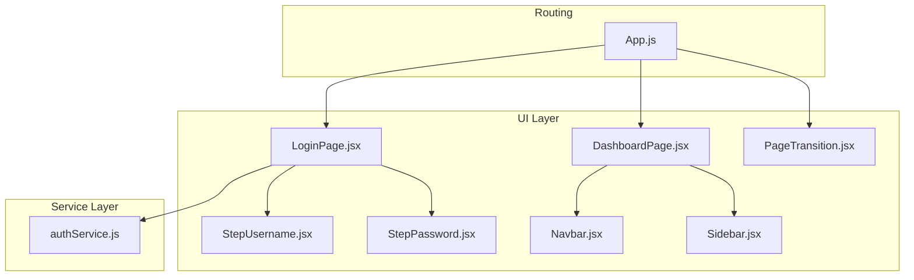
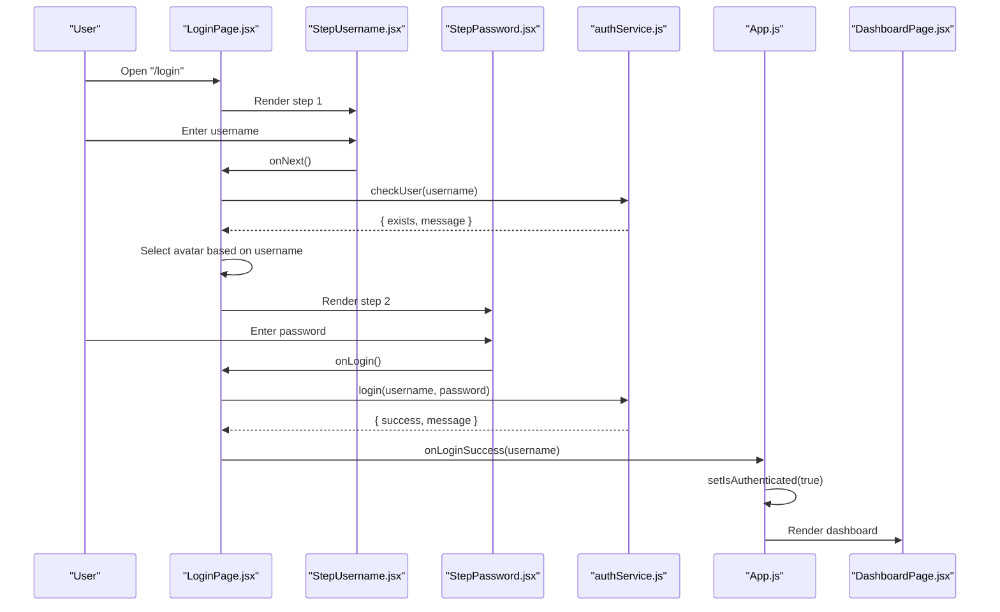
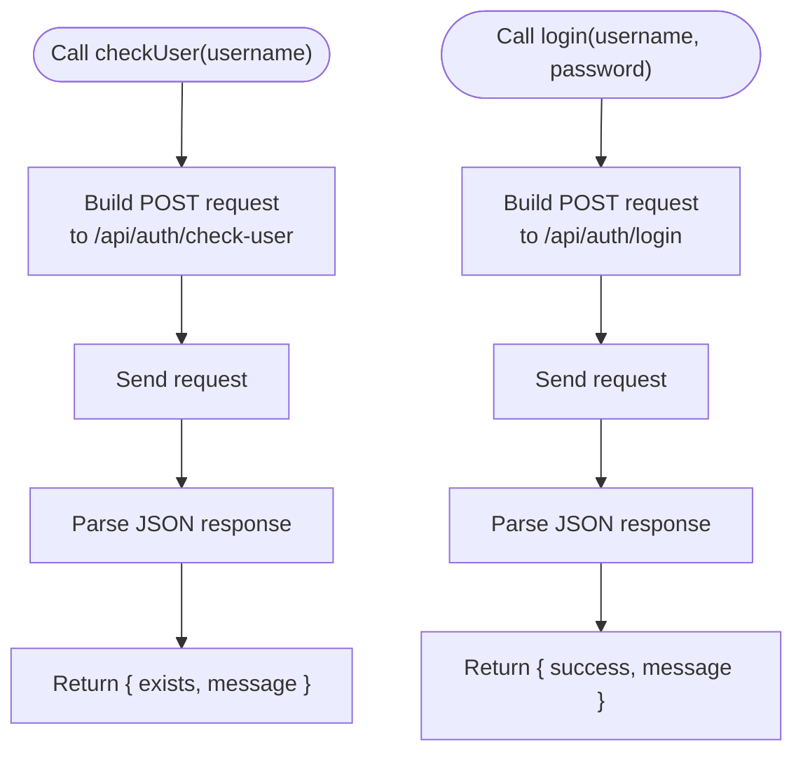
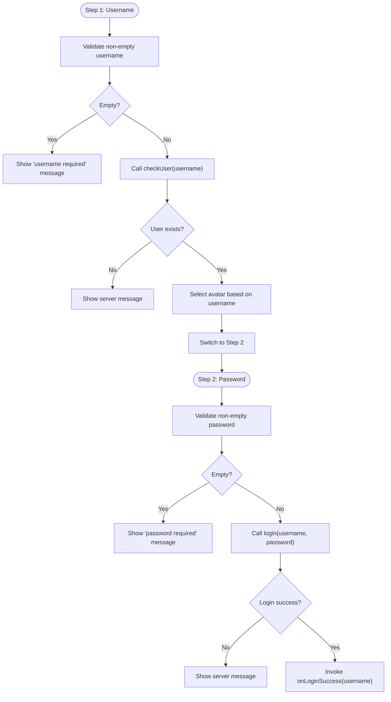
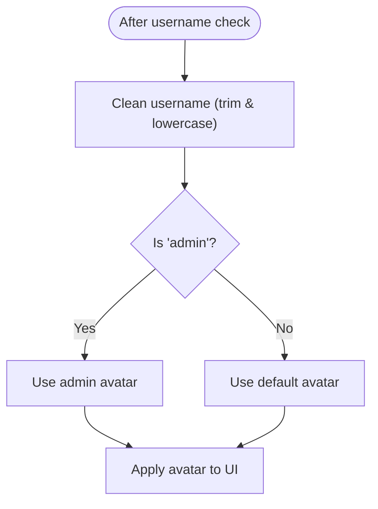
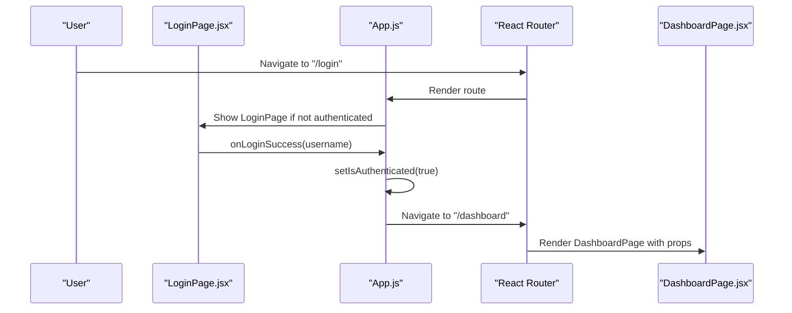
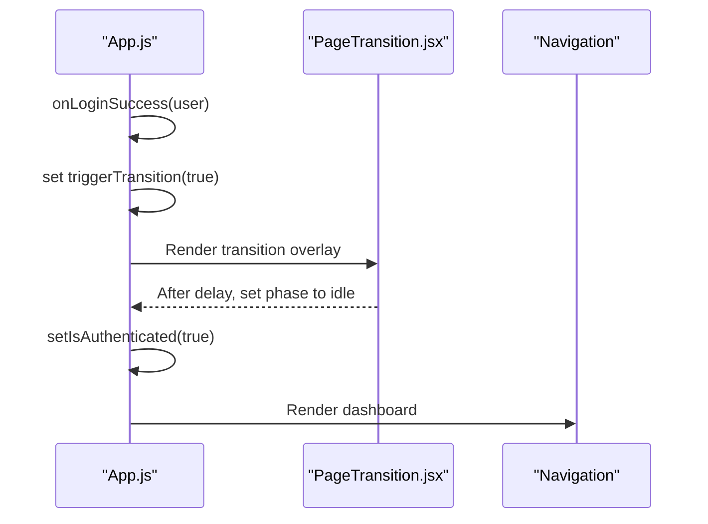
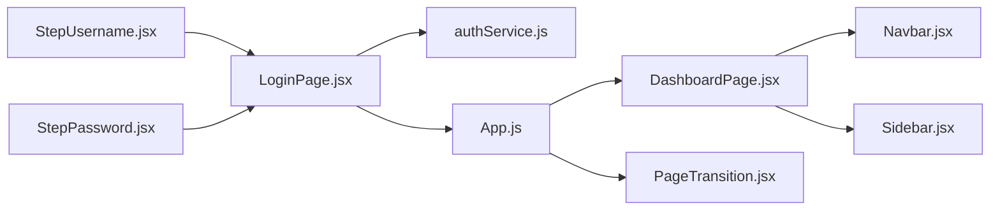

# Authentication System

<cite>
**Referenced Files in This Document**
- [authService.js](file://src/services/authService.js)
- [LoginPage.jsx](file://src/components/login/LoginPage.jsx)
- [StepUsername.jsx](file://src/components/login/StepUsername.jsx)
- [StepPassword.jsx](file://src/components/login/StepPassword.jsx)
- [App.js](file://src/App.js)
- [DashboardPage.jsx](file://src/pages/DashboardPage.jsx)
- [Navbar.jsx](file://src/components/layout/Navbar.jsx)
- [Sidebar.jsx](file://src/components/layout/Sidebar.jsx)
- [PageTransition.jsx](file://src/components/PageTransition.jsx)
</cite>

## Table of Contents
1. [Introduction](#introduction)
2. [Project Structure](#project-structure)
3. [Core Components](#core-components)
4. [Architecture Overview](#architecture-overview)
5. [Detailed Component Analysis](#detailed-component-analysis)
6. [Dependency Analysis](#dependency-analysis)
7. [Performance Considerations](#performance-considerations)
8. [Troubleshooting Guide](#troubleshooting-guide)
9. [Conclusion](#conclusion)

## Introduction
This document describes the SmartPorta authentication system, focusing on the two-step login process, user role-based avatar selection, and authentication state management. It explains the end-to-end flow from username validation through password authentication, error handling strategies, and session management. It also documents the service layer for API communication, token handling, user state persistence, security considerations, form validation patterns, user feedback mechanisms, and integration with protected routes.

## Project Structure
The authentication system spans several React components and a dedicated service module:
- Service layer: API client for authentication endpoints
- Login UI: Two-step wizard with username and password steps
- Routing and state: Global authentication state and protected route guards
- Dashboard UI: Protected area with navigation and role-aware avatar

**Diagram sources**
- [LoginPage.jsx:1-94](file://src/components/login/LoginPage.jsx#L1-L94)
- [StepUsername.jsx:1-23](file://src/components/login/StepUsername.jsx#L1-L23)
- [StepPassword.jsx:1-57](file://src/components/login/StepPassword.jsx#L1-L57)
- [DashboardPage.jsx:1-51](file://src/pages/DashboardPage.jsx#L1-L51)
- [Navbar.jsx:1-124](file://src/components/layout/Navbar.jsx#L1-L124)
- [Sidebar.jsx:1-167](file://src/components/layout/Sidebar.jsx#L1-L167)
- [PageTransition.jsx:1-61](file://src/components/PageTransition.jsx#L1-L61)
- [authService.js:1-19](file://src/services/authService.js#L1-L19)
- [App.js:1-74](file://src/App.js#L1-L74)

**Section sources**
- [authService.js:1-19](file://src/services/authService.js#L1-L19)
- [LoginPage.jsx:1-94](file://src/components/login/LoginPage.jsx#L1-L94)
- [App.js:1-74](file://src/App.js#L1-L74)

## Core Components
- Authentication service: Provides asynchronous functions to check user existence and perform login via HTTP requests.
- Login page: Implements a two-step wizard with username validation and password submission.
- Form components: Encapsulate input handling, validation, and user feedback.
- Application shell: Manages global authentication state, protected routes, and page transitions.
- Dashboard and navigation: Consume authentication state and present role-aware UI.

Key responsibilities:
- Username validation: Ensures non-empty input and queries backend to confirm user presence.
- Password authentication: Submits credentials to backend and handles success/failure.
- State management: Tracks authentication status, username, and transition state.
- UI feedback: Displays messages and manages avatar selection based on username.

**Section sources**
- [authService.js:1-19](file://src/services/authService.js#L1-L19)
- [LoginPage.jsx:1-94](file://src/components/login/LoginPage.jsx#L1-L94)
- [StepUsername.jsx:1-23](file://src/components/login/StepUsername.jsx#L1-L23)
- [StepPassword.jsx:1-57](file://src/components/login/StepPassword.jsx#L1-L57)
- [App.js:1-74](file://src/App.js#L1-L74)

## Architecture Overview
The authentication flow integrates UI components, a service layer, and routing to manage user sessions and protected access.

**Diagram sources**
- [LoginPage.jsx:16-51](file://src/components/login/LoginPage.jsx#L16-L51)
- [StepUsername.jsx:3-20](file://src/components/login/StepUsername.jsx#L3-L20)
- [StepPassword.jsx:3-54](file://src/components/login/StepPassword.jsx#L3-L54)
- [authService.js:3-18](file://src/services/authService.js#L3-L18)
- [App.js:15-23](file://src/App.js#L15-L23)
- [DashboardPage.jsx:10-34](file://src/pages/DashboardPage.jsx#L10-L34)

## Detailed Component Analysis

### Authentication Service Layer
The service layer encapsulates HTTP calls to the authentication endpoints:
- Endpoint for username existence check
- Endpoint for credential verification

Implementation highlights:
- Uses fetch with JSON payload and appropriate headers
- Returns parsed JSON responses for downstream handling
- Exposes two pure async functions for consumption by UI components

**Diagram sources**
- [authService.js:3-18](file://src/services/authService.js#L3-L18)

**Section sources**
- [authService.js:1-19](file://src/services/authService.js#L1-L19)

### Two-Step Login Wizard
The login wizard consists of two distinct steps:
- Step 1: Username input with validation and server-side existence check
- Step 2: Password input with optional visibility toggle and remember-me option

Validation and feedback:
- Username must be non-empty; otherwise an error message is shown
- After successful existence check, avatar selection is performed based on username
- Password must be non-empty; otherwise an error message is shown
- On login failure, the returned message is displayed

**Diagram sources**
- [LoginPage.jsx:16-51](file://src/components/login/LoginPage.jsx#L16-L51)
- [StepUsername.jsx:3-20](file://src/components/login/StepUsername.jsx#L3-L20)
- [StepPassword.jsx:3-54](file://src/components/login/StepPassword.jsx#L3-L54)
- [authService.js:3-18](file://src/services/authService.js#L3-L18)

**Section sources**
- [LoginPage.jsx:1-94](file://src/components/login/LoginPage.jsx#L1-L94)
- [StepUsername.jsx:1-23](file://src/components/login/StepUsername.jsx#L1-L23)
- [StepPassword.jsx:1-57](file://src/components/login/StepPassword.jsx#L1-L57)

### Role-Based Avatar Selection
Avatar selection is driven by the username:
- If the cleaned username equals a specific admin identifier, a designated avatar is selected
- Otherwise, a default avatar is used

This logic appears in both the login wizard and the navigation bar to maintain consistency across the application.

**Diagram sources**
- [LoginPage.jsx:23-25](file://src/components/login/LoginPage.jsx#L23-L25)
- [Navbar.jsx:34-34](file://src/components/layout/Navbar.jsx#L34-L34)

**Section sources**
- [LoginPage.jsx:23-25](file://src/components/login/LoginPage.jsx#L23-L25)
- [Navbar.jsx:34-34](file://src/components/layout/Navbar.jsx#L34-L34)

### Authentication State Management and Protected Routes
Global authentication state is managed in the application shell:
- Tracks authentication status and username
- Triggers a page transition upon successful login
- Guards protected routes so unauthenticated users are redirected to the login page

Protected route behavior:
- "/login" is accessible only when not authenticated
- "/dashboard" requires authentication and renders the dashboard with navigation and sidebar

**Diagram sources**
- [App.js:39-66](file://src/App.js#L39-L66)
- [LoginPage.jsx:44-44](file://src/components/login/LoginPage.jsx#L44-L44)
- [DashboardPage.jsx:10-34](file://src/pages/DashboardPage.jsx#L10-L34)

**Section sources**
- [App.js:10-31](file://src/App.js#L10-L31)
- [App.js:39-66](file://src/App.js#L39-L66)
- [DashboardPage.jsx:10-34](file://src/pages/DashboardPage.jsx#L10-L34)

### Session Management and Page Transitions
Upon successful login, the application triggers a page transition animation before rendering the dashboard. This provides a polished user experience while the authentication state updates.

**Diagram sources**
- [App.js:15-23](file://src/App.js#L15-L23)
- [PageTransition.jsx:7-25](file://src/components/PageTransition.jsx#L7-L25)

**Section sources**
- [App.js:15-23](file://src/App.js#L15-L23)
- [PageTransition.jsx:1-61](file://src/components/PageTransition.jsx#L1-L61)

### Security Considerations
- Input sanitization: Passwords are trimmed before submission to reduce trivial errors.
- Client-side checks: Non-empty validation prevents empty submissions and displays immediate feedback.
- Endpoint separation: Username existence check and login are separate endpoints to minimize information leakage.
- Role-based avatar: Avatar selection is client-side and does not imply role enforcement; server-side checks remain authoritative.

Recommendations:
- Enforce HTTPS for all authentication endpoints.
- Add rate limiting and account lockout policies on the server.
- Consider CSRF protection for forms.
- Store tokens securely (e.g., HttpOnly cookies) if tokens are issued.
- Implement secure password policies and multi-factor authentication as needed.

**Section sources**
- [authService.js:16-16](file://src/services/authService.js#L16-L16)
- [LoginPage.jsx:17-19](file://src/components/login/LoginPage.jsx#L17-L19)
- [LoginPage.jsx:37-39](file://src/components/login/LoginPage.jsx#L37-L39)

### Form Validation Patterns and User Feedback
- Real-time validation: Immediate feedback for empty fields during both steps.
- Keyboard support: Enter key triggers actions for quick navigation.
- Visual feedback: Messages are styled and displayed conditionally based on type.
- Toggle visibility: Password masking can be toggled for usability.

Best practices observed:
- Centralize validation logic in handlers to keep components declarative.
- Use semantic messages aligned with server responses.
- Provide clear affordances for navigation between steps.

**Section sources**
- [StepUsername.jsx:17-19](file://src/components/login/StepUsername.jsx#L17-L19)
- [StepPassword.jsx:49-51](file://src/components/login/StepPassword.jsx#L49-L51)
- [LoginPage.jsx:17-19](file://src/components/login/LoginPage.jsx#L17-L19)
- [LoginPage.jsx:37-39](file://src/components/login/LoginPage.jsx#L37-L39)

### Examples of Authentication State Changes
- Successful login: Username stored, transition triggered, authentication flag set, dashboard rendered.
- Logout: Authentication flag cleared, username reset, transition stopped, default page restored.

Integration with protected routes:
- Unauthenticated users are redirected from protected routes to the login page.
- Authenticated users gain access to the dashboard and its subpages.

**Section sources**
- [App.js:15-31](file://src/App.js#L15-L31)
- [App.js:55-61](file://src/App.js#L55-L61)

## Dependency Analysis
The authentication system exhibits clear separation of concerns:
- UI components depend on the service layer for network operations
- Application shell coordinates state and routing
- Navigation and dashboard consume authentication state

**Diagram sources**
- [LoginPage.jsx:1-94](file://src/components/login/LoginPage.jsx#L1-L94)
- [authService.js:1-19](file://src/services/authService.js#L1-L19)
- [App.js:1-74](file://src/App.js#L1-L74)
- [DashboardPage.jsx:1-51](file://src/pages/DashboardPage.jsx#L1-L51)
- [Navbar.jsx:1-124](file://src/components/layout/Navbar.jsx#L1-L124)
- [Sidebar.jsx:1-167](file://src/components/layout/Sidebar.jsx#L1-L167)
- [PageTransition.jsx:1-61](file://src/components/PageTransition.jsx#L1-L61)

**Section sources**
- [LoginPage.jsx:1-94](file://src/components/login/LoginPage.jsx#L1-L94)
- [authService.js:1-19](file://src/services/authService.js#L1-L19)
- [App.js:1-74](file://src/App.js#L1-L74)

## Performance Considerations
- Network latency: Debounce or disable submit buttons during fetch operations to avoid duplicate requests.
- Rendering: Keep UI updates minimal; avoid unnecessary re-renders by passing memoized callbacks.
- Images: Preload or lazy-load avatars to improve perceived performance.
- Transitions: Keep transition durations reasonable to balance UX and responsiveness.

## Troubleshooting Guide
Common issues and resolutions:
- Empty username/password: Ensure validation messages are visible and actionable.
- Server connectivity errors: Catch exceptions and display user-friendly messages.
- Redirect loops: Verify authentication state and route guards.
- Avatar mismatch: Confirm username normalization logic and image paths.

Debugging tips:
- Log service responses to inspect server-provided messages.
- Inspect browser network tab for failed requests.
- Verify route guards and state updates in the application shell.

**Section sources**
- [LoginPage.jsx:31-33](file://src/components/login/LoginPage.jsx#L31-L33)
- [LoginPage.jsx:48-50](file://src/components/login/LoginPage.jsx#L48-L50)
- [App.js:42-44](file://src/App.js#L42-L44)
- [App.js:60-61](file://src/App.js#L60-L61)

## Conclusion
The SmartPorta authentication system implements a robust two-step login process with clear user feedback, role-based avatar presentation, and secure state management. The service layer cleanly abstracts API interactions, while the application shell ensures protected access and smooth transitions. By following the documented patterns and recommendations, developers can extend and maintain the authentication flow effectively.