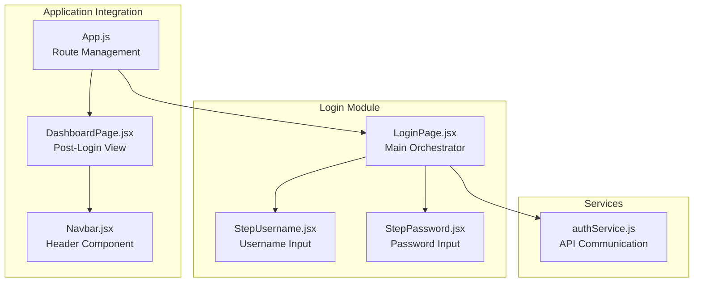
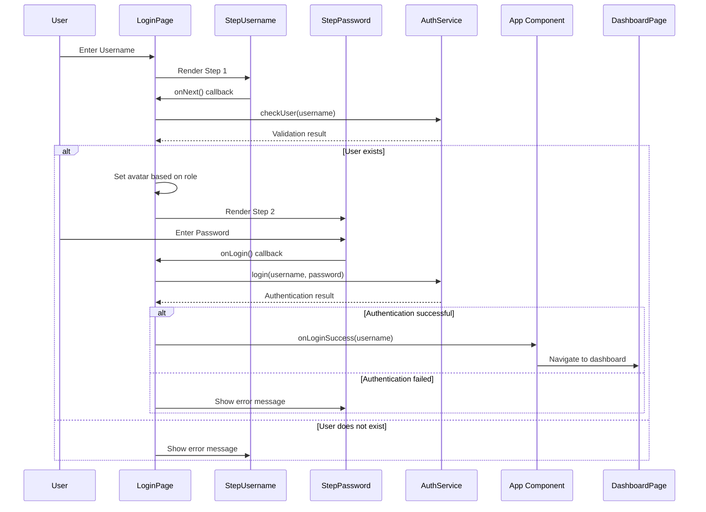
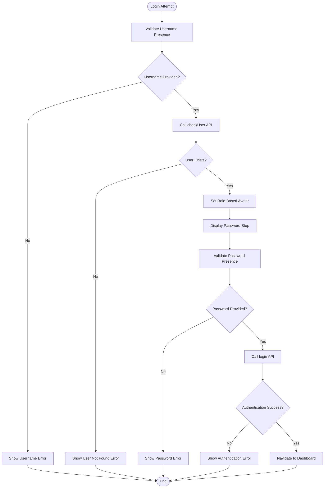
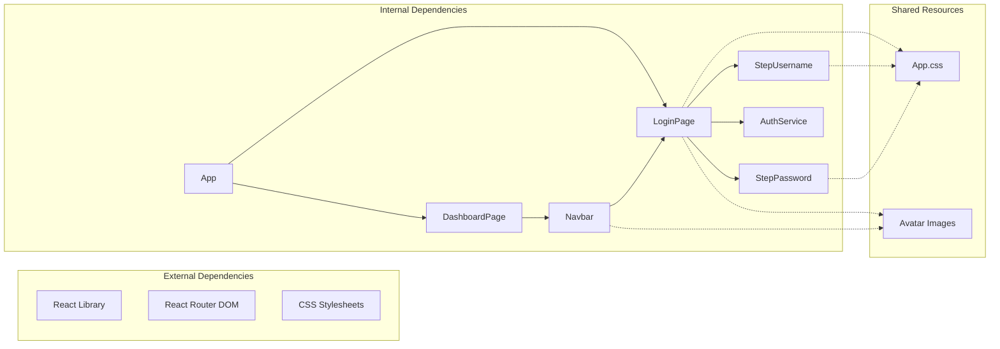

# Login Flow Implementation

<cite>
**Referenced Files in This Document**
- [LoginPage.jsx](file://src/components/login/LoginPage.jsx)
- [StepUsername.jsx](file://src/components/login/StepUsername.jsx)
- [StepPassword.jsx](file://src/components/login/StepPassword.jsx)
- [authService.js](file://src/services/authService.js)
- [App.js](file://src/App.js)
- [DashboardPage.jsx](file://src/pages/DashboardPage.jsx)
- [Navbar.jsx](file://src/components/layout/Navbar.jsx)
- [App.css](file://src/App.css)
</cite>

## Table of Contents
1. [Introduction](#introduction)
2. [Project Structure](#project-structure)
3. [Core Components](#core-components)
4. [Architecture Overview](#architecture-overview)
5. [Detailed Component Analysis](#detailed-component-analysis)
6. [Dependency Analysis](#dependency-analysis)
7. [Performance Considerations](#performance-considerations)
8. [Troubleshooting Guide](#troubleshooting-guide)
9. [Conclusion](#conclusion)

## Introduction
This document provides comprehensive documentation for the SmartPorta login flow implementation. The system implements a two-step authentication process with username validation followed by password authentication. The login flow is designed as a modular component system where LoginPage orchestrates StepUsername and StepPassword components while managing state transitions, form validation, user feedback, and avatar selection logic based on user roles.

## Project Structure
The login flow is organized within a clear component hierarchy with dedicated files for each authentication step and shared services:

**Diagram sources**
- [LoginPage.jsx:1-94](file://src/components/login/LoginPage.jsx#L1-L94)
- [authService.js:1-19](file://src/services/authService.js#L1-L19)
- [App.js:1-74](file://src/App.js#L1-L74)

**Section sources**
- [LoginPage.jsx:1-94](file://src/components/login/LoginPage.jsx#L1-L94)
- [authService.js:1-19](file://src/services/authService.js#L1-L19)
- [App.js:1-74](file://src/App.js#L1-L74)

## Core Components
The login flow consists of several interconnected components that work together to provide a seamless authentication experience:

### LoginPage Component
The main orchestrator that manages the entire authentication process, including state management, step transitions, and user feedback mechanisms.

### StepUsername Component
Handles the initial username input phase with real-time validation and navigation controls.

### StepPassword Component
Manages the password authentication phase with secure input handling, remember me functionality, and password visibility toggle.

### Authentication Service
Provides API communication for user validation and authentication against the backend server.

**Section sources**
- [LoginPage.jsx:9-94](file://src/components/login/LoginPage.jsx#L9-L94)
- [StepUsername.jsx:3-23](file://src/components/login/StepUsername.jsx#L3-L23)
- [StepPassword.jsx:3-57](file://src/components/login/StepPassword.jsx#L3-L57)
- [authService.js:3-19](file://src/services/authService.js#L3-L19)

## Architecture Overview
The login flow follows a component-based architecture with clear separation of concerns and well-defined data flow patterns:

**Diagram sources**
- [LoginPage.jsx:16-57](file://src/components/login/LoginPage.jsx#L16-L57)
- [authService.js:3-19](file://src/services/authService.js#L3-L19)
- [App.js:15-31](file://src/App.js#L15-L31)

The architecture demonstrates a clear separation between presentation logic (components) and business logic (services), with proper error handling and state management throughout the authentication pipeline.

## Detailed Component Analysis

### LoginPage Component Analysis
The LoginPage serves as the central coordinator for the entire authentication process, managing state transitions, form validation, and user feedback mechanisms.

#### State Management Patterns
The component maintains four primary state variables:
- `step`: Controls which authentication phase is currently active
- `username`: Stores the entered username value
- `password`: Stores the entered password value
- `message`: Manages error/success notifications
- `currentAvatar`: Determines avatar display based on user role

#### Navigation Logic
The component implements a two-phase navigation system:
1. **Phase 1 (Username)**: Validates username presence and existence
2. **Phase 2 (Password)**: Handles password authentication with error recovery

#### Avatar Selection Logic
The system implements role-based avatar selection:
- Admin users receive a special avatar (`photo`)
- Regular users receive the default avatar (`maPhoto`)
- Selection occurs during username validation phase

#### Error Handling Strategy
Comprehensive error handling covers:
- Client-side validation errors
- Network connectivity issues
- Backend validation failures
- User-friendly error messaging

**Diagram sources**
- [LoginPage.jsx:16-57](file://src/components/login/LoginPage.jsx#L16-L57)

**Section sources**
- [LoginPage.jsx:9-94](file://src/components/login/LoginPage.jsx#L9-L94)

### StepUsername Component Analysis
The StepUsername component handles the initial authentication phase with focused functionality:

#### Form Validation Pattern
Implements immediate validation with:
- Real-time username presence checking
- Enter key support for seamless navigation
- Auto-focus for improved UX

#### User Experience Features
- Emoji-based input icon for visual clarity
- Clear placeholder text
- Responsive button styling
- Message display area for feedback

#### Integration Points
- Receives username state from parent
- Provides onNext callback for navigation
- Handles message display from parent component

**Section sources**
- [StepUsername.jsx:3-23](file://src/components/login/StepUsername.jsx#L3-L23)

### StepPassword Component Analysis
The StepPassword component manages the secure authentication phase with enhanced security features:

#### Security Features
- Toggleable password visibility
- Secure password input masking
- Remember me functionality (placeholder)
- Password recovery link (placeholder)

#### Enhanced User Experience
- Welcome message displaying username
- Eye icon for password visibility toggle
- Remember me checkbox with custom styling
- Back navigation capability
- Enter key support for submission

#### State Management
- Local state for password visibility
- Local state for remember me option
- Integration with parent component messages

**Section sources**
- [StepPassword.jsx:3-57](file://src/components/login/StepPassword.jsx#L3-L57)

### Authentication Service Analysis
The authentication service provides a clean interface for backend communication:

#### API Endpoints
- `/api/auth/check-user`: Validates user existence
- `/api/auth/login`: Authenticates user credentials

#### Request/Response Patterns
- JSON payload serialization
- Standardized response handling
- Error propagation to calling components

**Section sources**
- [authService.js:3-19](file://src/services/authService.js#L3-L19)

### Application Integration Analysis
The login flow integrates seamlessly with the broader application architecture:

#### Route Management
The App component manages authentication state and routing:
- Protected routes based on authentication status
- Automatic redirection between login and dashboard
- Smooth page transitions with visual effects

#### State Synchronization
- Username propagation to dashboard components
- Logout functionality clearing authentication state
- Theme and preference persistence

#### Component Composition
- Navbar receives username for profile display
- Dashboard displays user-specific content
- Consistent styling across all components

**Section sources**
- [App.js:9-74](file://src/App.js#L9-L74)
- [DashboardPage.jsx:10-51](file://src/pages/DashboardPage.jsx#L10-L51)
- [Navbar.jsx:34-34](file://src/components/layout/Navbar.jsx#L34-L34)

## Dependency Analysis
The login flow exhibits well-structured dependencies with clear boundaries between components:

**Diagram sources**
- [LoginPage.jsx:1-8](file://src/components/login/LoginPage.jsx#L1-L8)
- [App.js:2-8](file://src/App.js#L2-L8)

### Component Coupling Analysis
- **Low Coupling**: Components communicate primarily through props and callbacks
- **High Cohesion**: Each component has a focused responsibility
- **Clear Interfaces**: Well-defined prop contracts and callback signatures
- **Minimal Circular Dependencies**: No circular import patterns detected

### State Management Dependencies
- Parent-to-child communication through props
- Child-to-parent communication through callback functions
- Shared state managed at the application level
- Isolated component state for local UI concerns

**Section sources**
- [LoginPage.jsx:1-8](file://src/components/login/LoginPage.jsx#L1-L8)
- [App.js:2-8](file://src/App.js#L2-L8)

## Performance Considerations
The login flow is designed with several performance optimizations:

### Rendering Optimizations
- Minimal re-renders through efficient state management
- Conditional rendering based on step state
- Lazy loading of avatar images
- CSS animations optimized for performance

### Network Performance
- Single API call per authentication attempt
- Efficient JSON serialization/deserialization
- Proper error handling to prevent unnecessary retries
- Timeout handling for network requests

### Memory Management
- Cleanup of event listeners and timers
- Proper disposal of authentication state
- Efficient image resource management

## Troubleshooting Guide

### Common Authentication Issues
1. **Username Validation Failures**
   - Verify username is not empty
   - Check network connectivity to authentication service
   - Confirm user exists in backend database

2. **Password Authentication Failures**
   - Ensure password meets security requirements
   - Verify backend authentication service availability
   - Check for password encoding/decoding issues

3. **Avatar Display Problems**
   - Verify avatar image files exist
   - Check file paths and URLs
   - Confirm role-based logic implementation

### Debugging Strategies
- Enable browser developer tools for network inspection
- Monitor console for JavaScript errors
- Use React Developer Tools for component state inspection
- Implement logging for authentication flow tracking

### Error Recovery Patterns
The system implements robust error recovery:
- Graceful degradation on network failures
- User-friendly error messages
- Automatic state reset on navigation
- Persistent error messages until resolved

**Section sources**
- [LoginPage.jsx:16-57](file://src/components/login/LoginPage.jsx#L16-L57)
- [authService.js:3-19](file://src/services/authService.js#L3-L19)

## Conclusion
The SmartPorta login flow implementation demonstrates excellent architectural principles with clear separation of concerns, robust error handling, and intuitive user experience. The component-based design allows for easy maintenance and extension while maintaining consistency across the application. The two-step authentication process provides both security and usability benefits, with role-based personalization enhancing the user experience. The integration with the broader application architecture ensures seamless navigation and consistent styling throughout the authentication journey.

The implementation successfully balances functionality with maintainability, providing a solid foundation for future enhancements and feature additions while maintaining backward compatibility and user satisfaction.