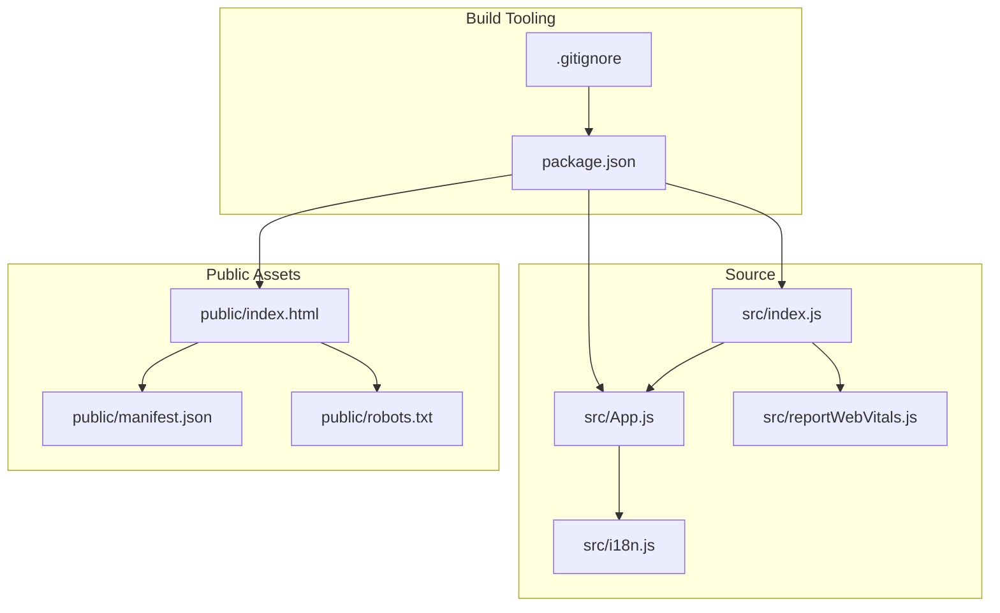
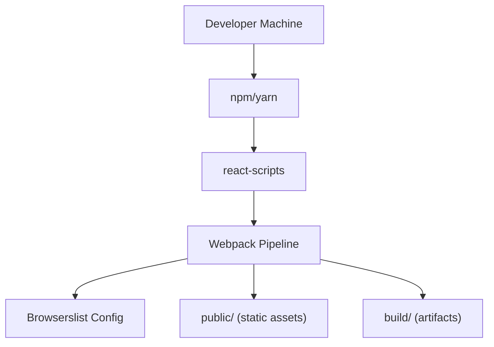
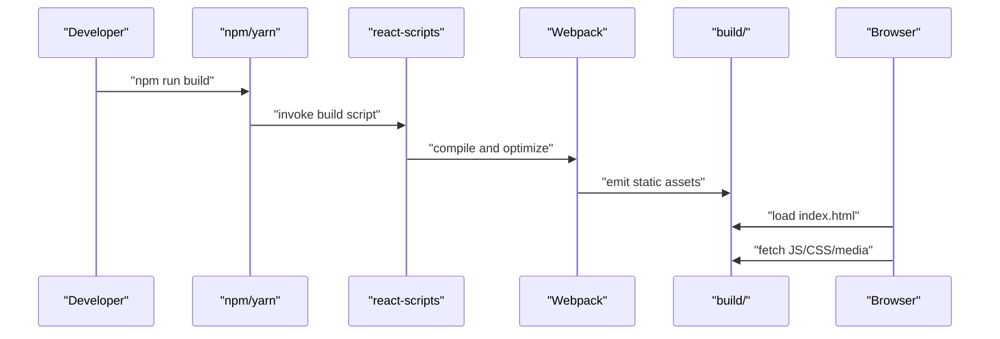
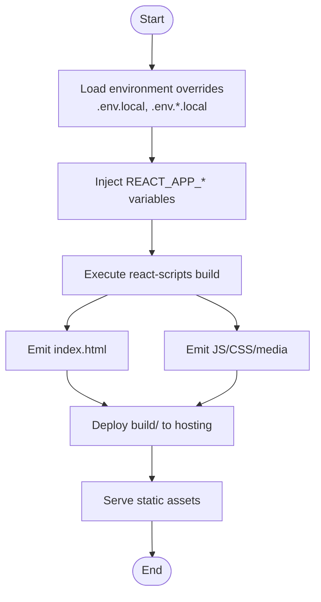
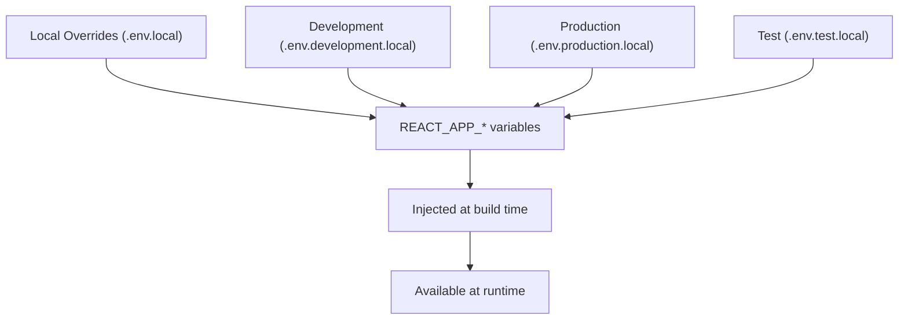
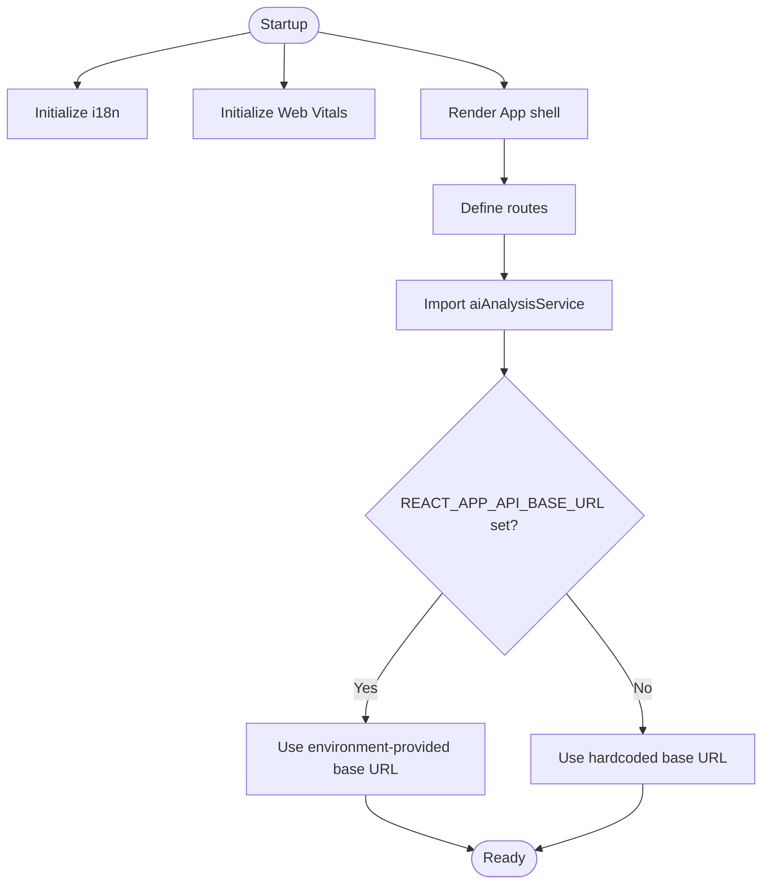
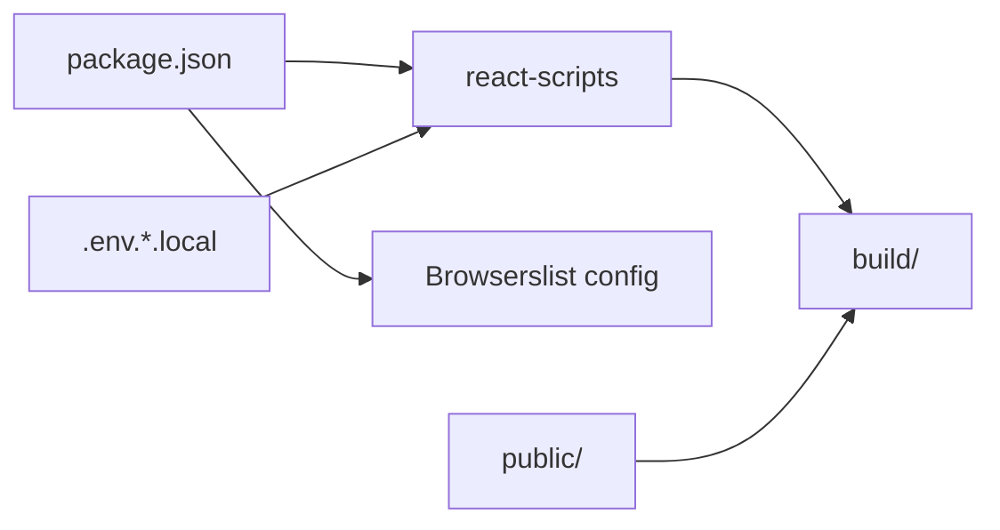

# Build and Deployment

<cite>
**Referenced Files in This Document**
- [package.json](file://package.json)
- [public/index.html](file://public/index.html)
- [public/manifest.json](file://public/manifest.json)
- [public/robots.txt](file://public/robots.txt)
- [src/index.js](file://src/index.js)
- [src/App.js](file://src/App.js)
- [src/reportWebVitals.js](file://src/reportWebVitals.js)
- [.gitignore](file://.gitignore)
- [src/services/aiAnalysisService.js](file://src/services/aiAnalysisService.js)
- [src/i18n.js](file://src/i18n.js)
</cite>

## Table of Contents
1. [Introduction](#introduction)
2. [Project Structure](#project-structure)
3. [Core Components](#core-components)
4. [Architecture Overview](#architecture-overview)
5. [Detailed Component Analysis](#detailed-component-analysis)
6. [Dependency Analysis](#dependency-analysis)
7. [Performance Considerations](#performance-considerations)
8. [Troubleshooting Guide](#troubleshooting-guide)
9. [Conclusion](#conclusion)
10. [Appendices](#appendices)

## Introduction
This document explains the SmartPorta build and deployment process. It covers the production build configuration using React Scripts, environment variable management, asset optimization, deployment pipeline setup, build artifacts preparation, hosting considerations, HTML template configuration, static asset management, browser compatibility settings, build scripts, optimization techniques, and performance considerations. It also provides examples of build commands, environment configuration, and deployment workflows for different environments.

## Project Structure
SmartPorta is a Create React App (CRA) project configured with react-scripts. The build system relies on CRA’s defaults with minimal customization. Key areas:
- Application entry point and rendering lifecycle
- Routing and application shell
- Static assets under the public directory
- Browser support configuration via Browserslist
- Environment variable handling and local overrides

**Diagram sources**
- [src/index.js:1-19](file://src/index.js#L1-L19)
- [src/App.js:1-74](file://src/App.js#L1-L74)
- [src/i18n.js:1-64](file://src/i18n.js#L1-L64)
- [src/reportWebVitals.js:1-14](file://src/reportWebVitals.js#L1-L14)
- [public/index.html:1-44](file://public/index.html#L1-L44)
- [public/manifest.json:1-26](file://public/manifest.json#L1-L26)
- [public/robots.txt:1-4](file://public/robots.txt#L1-L4)
- [package.json:1-49](file://package.json#L1-L49)
- [.gitignore:1-24](file://.gitignore#L1-L24)

**Section sources**
- [package.json:1-49](file://package.json#L1-L49)
- [public/index.html:1-44](file://public/index.html#L1-L44)
- [public/manifest.json:1-26](file://public/manifest.json#L1-L26)
- [public/robots.txt:1-4](file://public/robots.txt#L1-L4)
- [src/index.js:1-19](file://src/index.js#L1-L19)
- [src/App.js:1-74](file://src/App.js#L1-L74)
- [src/reportWebVitals.js:1-14](file://src/reportWebVitals.js#L1-L14)
- [.gitignore:1-24](file://.gitignore#L1-L24)

## Core Components
- Build scripts: The project defines standard CRA scripts for development, production build, testing, and ejecting. Production builds are generated via the build script.
- HTML template: The HTML file serves as the root template for the app and references static assets located under the public directory.
- Manifest and robots: Web app manifest and robots configuration are provided under public.
- Browser compatibility: Browserslist configuration defines supported browsers for production and development.
- Internationalization: i18n initialization is wired at startup.
- Performance metrics: Web Vitals reporting is wired at startup.

**Section sources**
- [package.json:24-29](file://package.json#L24-L29)
- [package.json:36-47](file://package.json#L36-L47)
- [public/index.html:1-44](file://public/index.html#L1-L44)
- [public/manifest.json:1-26](file://public/manifest.json#L1-L26)
- [public/robots.txt:1-4](file://public/robots.txt#L1-L4)
- [src/i18n.js:1-64](file://src/i18n.js#L1-L64)
- [src/reportWebVitals.js:1-14](file://src/reportWebVitals.js#L1-L14)

## Architecture Overview
The build and runtime architecture centers on CRA’s webpack-based pipeline. The production build compiles source code, optimizes assets, and emits static files into the build directory. The HTML template injects the built bundles and references static assets from the public directory. Browserslist determines transpilation and polyfill needs. Environment variables are injected at build time.

**Diagram sources**
- [package.json:19](file://package.json#L19)
- [package.json:36-47](file://package.json#L36-L47)
- [public/index.html:1-44](file://public/index.html#L1-L44)

## Detailed Component Analysis

### Build Scripts and Commands
- Development server: Starts the CRA dev server.
- Production build: Generates optimized static assets for deployment.
- Test runner: Executes tests with CRA’s Jest configuration.
- Eject: Removes the CRA abstraction to expose underlying configuration.

Examples:
- Run development server: npm start
- Build for production: npm run build
- Run tests: npm test
- Eject (irreversible): npm run eject

Notes:
- The build command produces artifacts in the build directory.
- The eject command exposes webpack and related configurations.

**Section sources**
- [package.json:24-29](file://package.json#L24-L29)
- [.gitignore:11-12](file://.gitignore#L11-L12)

### Environment Variables and Local Overrides
- Supported local override files: .env.local, .env.development.local, .env.production.local, .env.test.local.
- These files are ignored by Git and intended for local secrets and overrides.
- CRA injects environment variables prefixed with REACT_APP_ at build time.

Guidelines:
- Place environment-specific overrides in the appropriate .env.*.local file.
- Keep sensitive data out of version control.
- Use uppercase with underscores for naming consistency.

**Section sources**
- [.gitignore:16-19](file://.gitignore#L16-L19)
- [package.json:1-49](file://package.json#L1-L49)

### HTML Template and Static Assets
- The HTML template is located under public/index.html and acts as the root template.
- Static assets (images, icons, manifests) live under public/.
- Public assets are copied as-is into the build output and referenced via %PUBLIC_URL%.

Key points:
- Use %PUBLIC_URL% in templates to resolve asset paths correctly for both root and subpath deployments.
- The manifest and robots files are referenced from the HTML template.

**Section sources**
- [public/index.html:1-44](file://public/index.html#L1-L44)
- [public/manifest.json:1-26](file://public/manifest.json#L1-L26)
- [public/robots.txt:1-4](file://public/robots.txt#L1-L4)

### Browser Compatibility Settings
- Browserslist configuration defines supported browsers for production and development.
- Production targets a wide set of modern browsers with “not dead” and excludes Opera Mini.
- Development targets the latest Chrome, Firefox, and Safari versions.

Implications:
- Transpilation and polyfills are inferred from Browserslist.
- Choose polyfills carefully to balance bundle size and compatibility.

**Section sources**
- [package.json:36-47](file://package.json#L36-L47)

### Asset Optimization and Build Artifacts
- CRA performs minification, tree-shaking, and code splitting automatically during production builds.
- Static assets under public/ are copied verbatim into build/.
- CSS and JS bundles are emitted into build/static/.

Artifacts:
- build/static/css/*
- build/static/js/*
- build/static/media/* (copied from public/images, public/avatars, etc.)
- build/index.html
- build/manifest.json
- build/robots.txt

**Section sources**
- [package.json:26](file://package.json#L26)
- [public/index.html:1-44](file://public/index.html#L1-L44)
- [public/manifest.json:1-26](file://public/manifest.json#L1-L26)
- [public/robots.txt:1-4](file://public/robots.txt#L1-L4)

### Internationalization and Startup Initialization
- i18n is initialized at application startup and sets the default language and fallback.
- This affects runtime behavior but does not alter build-time configuration.

**Section sources**
- [src/i18n.js:1-64](file://src/i18n.js#L1-L64)
- [src/index.js:1-19](file://src/index.js#L1-L19)

### Performance Metrics Integration
- Web Vitals reporting is wired at startup to measure Core Web Vitals.
- This enables performance monitoring in deployed environments.

**Section sources**
- [src/reportWebVitals.js:1-14](file://src/reportWebVitals.js#L1-L14)
- [src/index.js:15-18](file://src/index.js#L15-L18)

### Routing and Application Shell
- The application uses React Router for navigation and guards routes based on authentication state.
- The App component orchestrates routing and transitions.

**Section sources**
- [src/App.js:1-74](file://src/App.js#L1-L74)

### API Base URL and Environment Considerations
- The AI analysis service uses a hardcoded base URL for local development.
- For production, override this value via environment variables using the REACT_APP_ prefix.

Recommendations:
- Define REACT_APP_API_BASE_URL in environment files.
- Reference the variable in the service to switch endpoints per environment.

**Section sources**
- [src/services/aiAnalysisService.js:1-37](file://src/services/aiAnalysisService.js#L1-L37)
- [package.json:1-49](file://package.json#L1-L49)

## Architecture Overview

**Diagram sources**
- [package.json:24-29](file://package.json#L24-L29)
- [package.json:19](file://package.json#L19)
- [public/index.html:1-44](file://public/index.html#L1-L44)

## Detailed Component Analysis

### Build and Runtime Flow

**Diagram sources**
- [.gitignore:16-19](file://.gitignore#L16-L19)
- [package.json:19](file://package.json#L19)
- [public/index.html:1-44](file://public/index.html#L1-L44)

### Environment Variable Management

**Diagram sources**
- [.gitignore:16-19](file://.gitignore#L16-L19)
- [package.json:1-49](file://package.json#L1-L49)

### API Endpoint Configuration Example

**Diagram sources**
- [src/i18n.js:1-64](file://src/i18n.js#L1-L64)
- [src/reportWebVitals.js:1-14](file://src/reportWebVitals.js#L1-L14)
- [src/App.js:1-74](file://src/App.js#L1-L74)
- [src/services/aiAnalysisService.js:1-37](file://src/services/aiAnalysisService.js#L1-L37)
- [package.json:1-49](file://package.json#L1-L49)

## Dependency Analysis
- Build toolchain: react-scripts is the primary dependency driving the build pipeline.
- Browserslist: Defines target browsers for transpilation and polyfills.
- Static assets: public/ directory is the source of truth for static assets.
- Environment variables: Injected at build time via CRA’s environment handling.

**Diagram sources**
- [package.json:19](file://package.json#L19)
- [package.json:36-47](file://package.json#L36-L47)
- [public/index.html:1-44](file://public/index.html#L1-L44)
- [.gitignore:16-19](file://.gitignore#L16-L19)

**Section sources**
- [package.json:1-49](file://package.json#L1-L49)
- [public/index.html:1-44](file://public/index.html#L1-L44)
- [.gitignore:16-19](file://.gitignore#L16-L19)

## Performance Considerations
- Enable production builds for performance-sensitive environments.
- Keep static assets under public/ small and optimized.
- Use lazy loading for heavy components and routes to reduce initial bundle size.
- Monitor Core Web Vitals in production using the integrated reporting hook.
- Consider code splitting and dynamic imports for large feature modules.

[No sources needed since this section provides general guidance]

## Troubleshooting Guide
Common issues and resolutions:
- Missing environment variables: Ensure REACT_APP_* variables are defined in the appropriate .env.*.local file and re-run the build.
- Incorrect asset paths: Verify %PUBLIC_URL% usage in public/index.html and confirm assets exist under public/.
- Unexpected polyfills or transpilation: Adjust Browserslist configuration to match target environments.
- Build artifacts not updating: Clear node_modules and reinstall dependencies if necessary, then rebuild.

**Section sources**
- [.gitignore:16-19](file://.gitignore#L16-L19)
- [public/index.html:1-44](file://public/index.html#L1-L44)
- [package.json:36-47](file://package.json#L36-L47)

## Conclusion
SmartPorta leverages CRA’s react-scripts to produce optimized, production-ready builds. The build pipeline is straightforward: environment variables are injected at build time, assets are compiled and emitted to build/, and the HTML template references public assets. Browserslist governs compatibility, while static assets remain untouched. By following the outlined environment configuration and deployment workflows, teams can reliably build, test, and deploy SmartPorta across environments.

[No sources needed since this section summarizes without analyzing specific files]

## Appendices

### Build Commands Reference
- Development: npm start
- Production build: npm run build
- Tests: npm test
- Eject: npm run eject

**Section sources**
- [package.json:24-29](file://package.json#L24-L29)

### Environment Configuration Examples
- Local overrides: .env.local, .env.development.local, .env.production.local, .env.test.local
- Prefix variables with REACT_APP_ to inject at build time

**Section sources**
- [.gitignore:16-19](file://.gitignore#L16-L19)
- [package.json:1-49](file://package.json#L1-L49)

### Hosting Considerations
- Deploy the entire build/ directory to your static host.
- Ensure %PUBLIC_URL%-based asset references resolve correctly.
- Configure caching headers for static assets (JS/CSS/media) and set long-lived cache policies where appropriate.

**Section sources**
- [public/index.html:1-44](file://public/index.html#L1-L44)