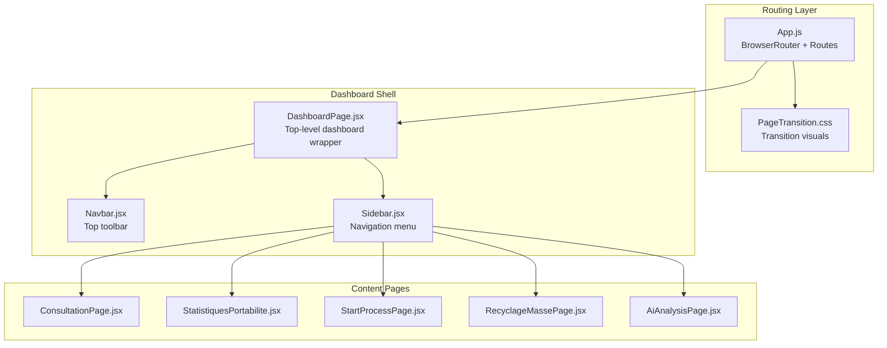
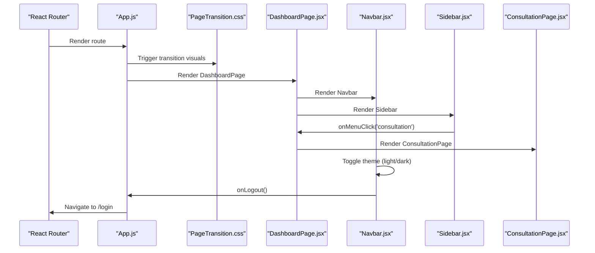
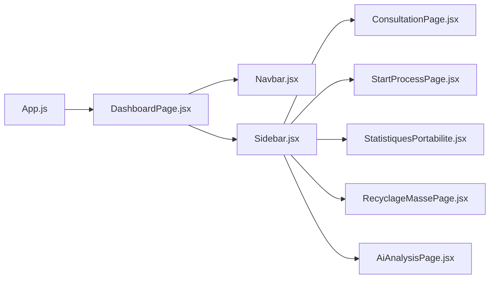

# Dashboard Interface

<cite>
**Referenced Files in This Document**
- [Dashboard.jsx](file://src/components/dashboard/Dashboard.jsx)
- [Dashboard.css](file://src/components/dashboard/Dashboard.css)
- [Sidebar.jsx](file://src/components/layout/Sidebar.jsx)
- [Sidebar.css](file://src/components/layout/Sidebar.css)
- [Navbar.jsx](file://src/components/layout/Navbar.jsx)
- [Navbar.css](file://src/components/layout/Navbar.css)
- [DashboardPage.jsx](file://src/pages/DashboardPage.jsx)
- [App.js](file://src/App.js)
- [PageTransition.css](file://src/components/PageTransition.css)
- [ConsultationPage.jsx](file://src/components/ConsultationPage.jsx)
- [StatistiquesPortabilite.jsx](file://src/components/StatistiquesPortabilite.jsx)
- [StartProcessPage.jsx](file://src/components/StartProcessPage.jsx)
- [RecyclageMassePage.jsx](file://src/components/RecyclageMassePage.jsx)
- [AiAnalysisPage.jsx](file://src/components/AiAnalysisPage.jsx)
- [App.css](file://src/App.css)
</cite>

## Table of Contents
1. [Introduction](#introduction)
2. [Project Structure](#project-structure)
3. [Core Components](#core-components)
4. [Architecture Overview](#architecture-overview)
5. [Detailed Component Analysis](#detailed-component-analysis)
6. [Dependency Analysis](#dependency-analysis)
7. [Performance Considerations](#performance-considerations)
8. [Troubleshooting Guide](#troubleshooting-guide)
9. [Conclusion](#conclusion)

## Introduction
This document describes the SmartPorta dashboard interface system. It covers the main dashboard component architecture, the navigation sidebar with menu-driven content switching, and the navbar functionality including theme switching and user controls. It explains component composition patterns, context-aware rendering, loading states, and transition effects. It also documents styling approaches, responsive design implementation, and user interaction patterns. Finally, it outlines the relationship between dashboard components and page-level features, state management for navigation, and integration with the routing system.

## Project Structure
The dashboard interface is composed of:
- A top-level routing system that manages authentication and transitions
- A dashboard shell that hosts the navbar, sidebar, and content area
- A sidebar that drives navigation and supports nested menus
- A navbar that provides theme switching, notifications, and user profile controls
- Multiple page-level components rendered by the dashboard based on navigation selection

**Diagram sources**
- [App.js:34-71](file://src/App.js#L34-L71)
- [DashboardPage.jsx:36-50](file://src/pages/DashboardPage.jsx#L36-L50)
- [Sidebar.jsx:19-166](file://src/components/layout/Sidebar.jsx#L19-L166)
- [Navbar.jsx:36-123](file://src/components/layout/Navbar.jsx#L36-L123)

**Section sources**
- [App.js:9-72](file://src/App.js#L9-L72)
- [DashboardPage.jsx:10-51](file://src/pages/DashboardPage.jsx#L10-L51)

## Core Components
- Dashboard shell: orchestrates loading states, maintains active menu state, and renders the appropriate page component based on navigation.
- Sidebar: provides primary and secondary navigation with active state highlighting and submenu toggling.
- Navbar: centralizes theme switching, notifications, and user profile actions.
- Page components: consultation, statistics, process initiation, mass recycling, and AI analysis.

Key behaviors:
- Loading state: initial spinner while transitioning into the dashboard.
- Menu-driven content switching: centralized state in the dashboard shell controls which page is shown.
- Theme synchronization: navbar updates document body classes to reflect light/dark mode.

**Section sources**
- [Dashboard.jsx:8-70](file://src/components/dashboard/Dashboard.jsx#L8-L70)
- [Sidebar.jsx:4-167](file://src/components/layout/Sidebar.jsx#L4-L167)
- [Navbar.jsx:7-124](file://src/components/layout/Navbar.jsx#L7-L124)

## Architecture Overview
The dashboard follows a composition pattern:
- App.js sets up routing and authentication state.
- DashboardPage wraps the dashboard shell and injects the navbar and sidebar.
- Sidebar emits menu change events to the dashboard shell.
- Dashboard shell maintains current menu state and renders the matching page component.
- Navbar handles theme switching and user actions.

**Diagram sources**
- [App.js:34-71](file://src/App.js#L34-L71)
- [PageTransition.css:1-35](file://src/components/PageTransition.css#L1-L35)
- [DashboardPage.jsx:36-50](file://src/pages/DashboardPage.jsx#L36-L50)
- [Sidebar.jsx:11-17](file://src/components/layout/Sidebar.jsx#L11-L17)
- [ConsultationPage.jsx:1-419](file://src/components/ConsultationPage.jsx#L1-L419)
- [Navbar.jsx:29-32](file://src/components/layout/Navbar.jsx#L29-L32)

## Detailed Component Analysis

### Dashboard Shell (DashboardPage)
Responsibilities:
- Hosts the navbar and sidebar.
- Manages active tab state and delegates page rendering.
- Integrates with routing to pass username and logout handlers.

Composition pattern:
- Uses props to receive username, logout handler, and default page.
- Maintains local state for active tab and switches content accordingly.
- Renders page components conditionally based on active tab.

State management:
- Active tab state is controlled locally within the dashboard shell.
- Navigation changes propagate from the sidebar to the dashboard shell.

Rendering:
- Content area is a simple wrapper around the selected page component.

**Section sources**
- [DashboardPage.jsx:10-51](file://src/pages/DashboardPage.jsx#L10-L51)

### Sidebar Navigation
Responsibilities:
- Provides primary navigation items (consultation, statistics, mass recycling, start process).
- Implements a collapsible submenu under "Start Process" for portability in/out.
- Highlights the active menu item and reflects active submenu selection.

Interaction model:
- Clicking a primary item triggers a callback with the selected menu identifier.
- Clicking "Start Process" toggles the submenu and selects the default child menu.
- Submenu items update the active menu state when clicked.

Styling:
- Fixed position with gradient dark background.
- Hover and active states use accent color branding.
- Responsive transform for mobile layouts.

**Section sources**
- [Sidebar.jsx:4-167](file://src/components/layout/Sidebar.jsx#L4-L167)
- [Sidebar.css:1-254](file://src/components/layout/Sidebar.css#L1-L254)

### Navbar Controls
Responsibilities:
- Theme switching between light and dark modes.
- Notification dropdown with badge count.
- User profile dropdown with avatar and logout action.

State management:
- Tracks current theme and dropdown visibility states.
- Applies theme classes to the document body for global effect.
- Selects avatar based on agent name.

User interactions:
- Theme toggle opens a dropdown with two theme options.
- Notifications dropdown lists recent items.
- Profile dropdown shows role and username, with logout button.

**Section sources**
- [Navbar.jsx:7-124](file://src/components/layout/Navbar.jsx#L7-L124)
- [Navbar.css:1-243](file://src/components/layout/Navbar.css#L1-L243)

### Page-Level Components and Content Switching
The dashboard shell renders different page components based on the active menu:
- Consultation: search, filtering, pagination, export to CSV/PDF, and modal details.
- Statistics: charts, drill-down, CSV export for non-ok instances.
- Start Process: form for initiating portability in/out with SOAP submission.
- Mass Recycling: bulk task filtering, selection, and recycle action.
- AI Analysis: KIE server connection, error analysis, reports, and suggestions.

Context-aware rendering:
- The dashboard shell switches content based on the active menu identifier.
- Some pages share common styling via theme variables and shared CSS utilities.

**Section sources**
- [Dashboard.jsx:31-56](file://src/components/dashboard/Dashboard.jsx#L31-L56)
- [ConsultationPage.jsx:7-419](file://src/components/ConsultationPage.jsx#L7-L419)
- [StatistiquesPortabilite.jsx:12-301](file://src/components/StatistiquesPortabilite.jsx#L12-L301)
- [StartProcessPage.jsx:80-268](file://src/components/StartProcessPage.jsx#L80-L268)
- [RecyclageMassePage.jsx:6-382](file://src/components/RecyclageMassePage.jsx#L6-L382)
- [AiAnalysisPage.jsx:363-800](file://src/components/AiAnalysisPage.jsx#L363-L800)

### Loading States and Transitions
- Initial app transition: a full-screen transition overlay animates during login-to-dashboard transitions.
- Dashboard shell: a short loading delay simulates initialization before rendering content.
- Page components: individual pages manage their own loading states for data fetching and processing.

Visual feedback:
- Spinner animations and progress indicators are used consistently across components.
- Theme transitions apply smooth color and background changes.

**Section sources**
- [PageTransition.css:1-35](file://src/components/PageTransition.css#L1-L35)
- [Dashboard.jsx:12-14](file://src/components/dashboard/Dashboard.jsx#L12-L14)
- [ConsultationPage.jsx:20-70](file://src/components/ConsultationPage.jsx#L20-L70)
- [StatistiquesPortabilite.jsx:16-63](file://src/components/StatistiquesPortabilite.jsx#L16-L63)
- [RecyclageMassePage.jsx:69-86](file://src/components/RecyclageMassePage.jsx#L69-L86)
- [AiAnalysisPage.jsx:380-408](file://src/components/AiAnalysisPage.jsx#L380-L408)

### Styling Approaches and Theme System
- CSS custom properties define theme variables for backgrounds, borders, text, and accents.
- Navbar and sidebar use theme variables to adapt to light/dark modes.
- Dashboard content areas leverage theme variables for consistent color schemes.
- Global body classes are toggled to apply theme changes across the application.

Responsive design:
- Sidebar transforms off-canvas on small screens.
- Content areas adjust padding and spacing for smaller viewports.
- Charts and tables adapt to available space.

**Section sources**
- [Dashboard.css:5-31](file://src/components/dashboard/Dashboard.css#L5-L31)
- [Dashboard.css:135-139](file://src/components/dashboard/Dashboard.css#L135-L139)
- [Sidebar.css:119-130](file://src/components/layout/Sidebar.css#L119-L130)
- [Navbar.css:290-307](file://src/App.css#L290-L307)

### Routing Integration and State Management
- App.js manages authentication state and routes to either the login or dashboard.
- DashboardPage receives username and logout handler from App.js.
- Sidebar callbacks update the dashboard shell’s active tab, which determines the rendered page.
- Default page selection is passed down to maintain continuity after login.

**Section sources**
- [App.js:9-72](file://src/App.js#L9-L72)
- [DashboardPage.jsx:10-15](file://src/pages/DashboardPage.jsx#L10-L15)
- [Sidebar.jsx:11-17](file://src/components/layout/Sidebar.jsx#L11-L17)

## Dependency Analysis
The dashboard components depend on each other as follows:
- App.js depends on DashboardPage and PageTransition for routing and transitions.
- DashboardPage depends on Navbar and Sidebar for UI scaffolding.
- Sidebar depends on DashboardPage to update active menu state.
- DashboardPage depends on page components for content rendering.
- Navbar depends on App.js for logout handling.

**Diagram sources**
- [App.js:34-71](file://src/App.js#L34-L71)
- [DashboardPage.jsx:36-50](file://src/pages/DashboardPage.jsx#L36-L50)
- [Sidebar.jsx:19-166](file://src/components/layout/Sidebar.jsx#L19-L166)

**Section sources**
- [App.js:34-71](file://src/App.js#L34-L71)
- [DashboardPage.jsx:36-50](file://src/pages/DashboardPage.jsx#L36-L50)

## Performance Considerations
- Minimize unnecessary re-renders by keeping navigation state local to the dashboard shell.
- Debounce or throttle search/filter operations in page components to avoid excessive API calls.
- Lazy-load heavy chart libraries only when their respective pages are mounted.
- Use CSS custom properties for theme switching to reduce layout thrashing.
- Avoid blocking the main thread during transitions; keep animations lightweight.

## Troubleshooting Guide
Common issues and resolutions:
- Theme not applying globally: ensure the navbar updates the document body classes and that CSS variables are defined for both themes.
- Sidebar not reflecting active state: verify that the active menu prop is passed correctly and that the active class is applied conditionally.
- Page content not updating: confirm that the sidebar callback updates the dashboard shell state and that the render switch statement matches the menu identifiers.
- Login-to-dashboard transition not working: check the transition overlay classes and the trigger state in App.js.

**Section sources**
- [Navbar.jsx:19-27](file://src/components/layout/Navbar.jsx#L19-L27)
- [Sidebar.jsx:52-57](file://src/components/layout/Sidebar.jsx#L52-L57)
- [Dashboard.jsx:31-56](file://src/components/dashboard/Dashboard.jsx#L31-L56)
- [App.js:15-31](file://src/App.js#L15-L31)

## Conclusion
The SmartPorta dashboard interface employs a clean, modular architecture centered on a dashboard shell that coordinates navigation, theming, and content rendering. The sidebar and navbar provide cohesive navigation and user controls, while page components encapsulate feature-specific logic and data handling. The theme system leverages CSS custom properties for seamless light/dark mode transitions, and responsive design ensures usability across devices. Together, these patterns deliver a scalable and maintainable dashboard experience.