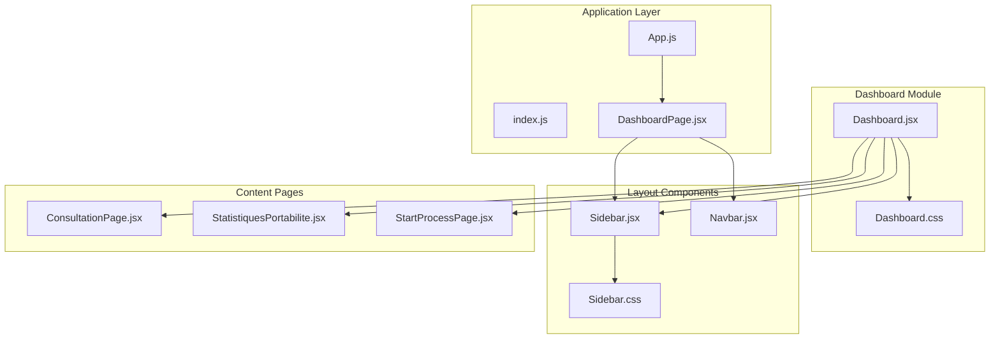
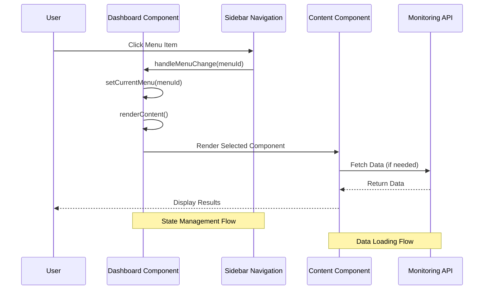
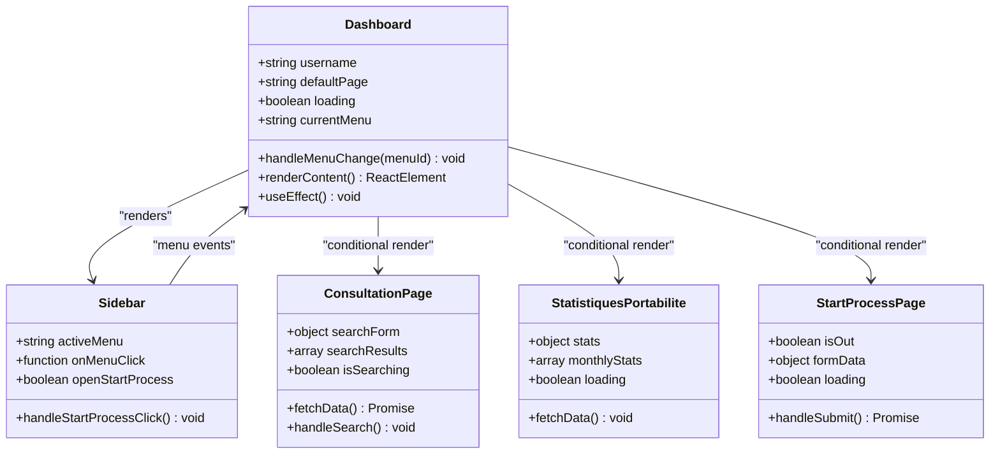
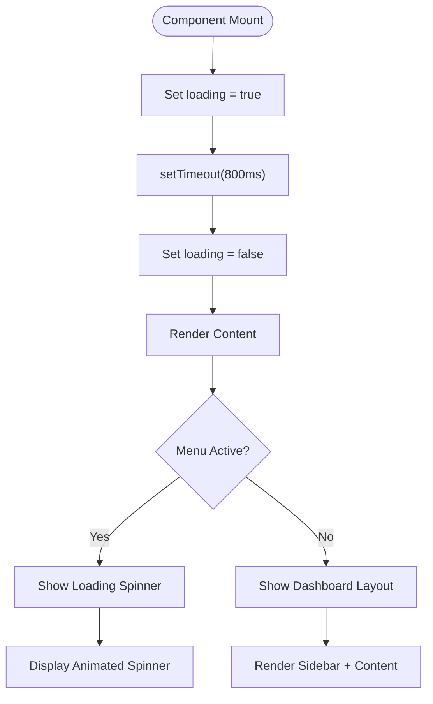
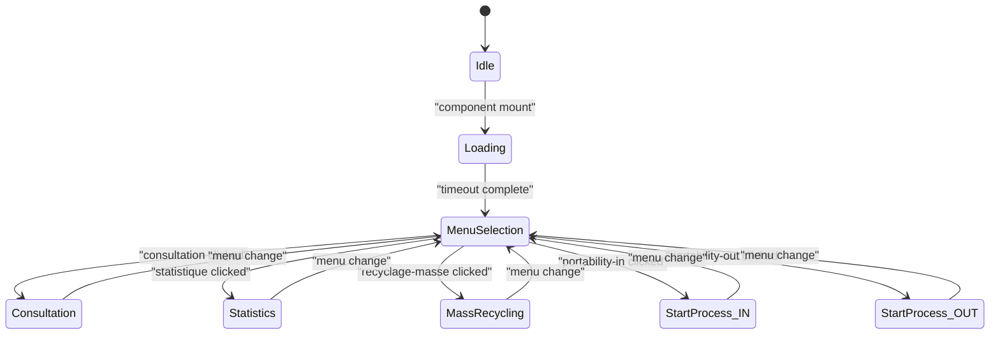
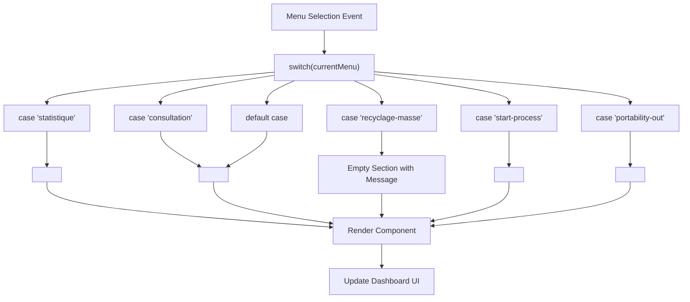
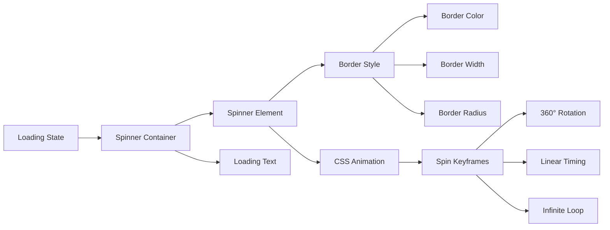
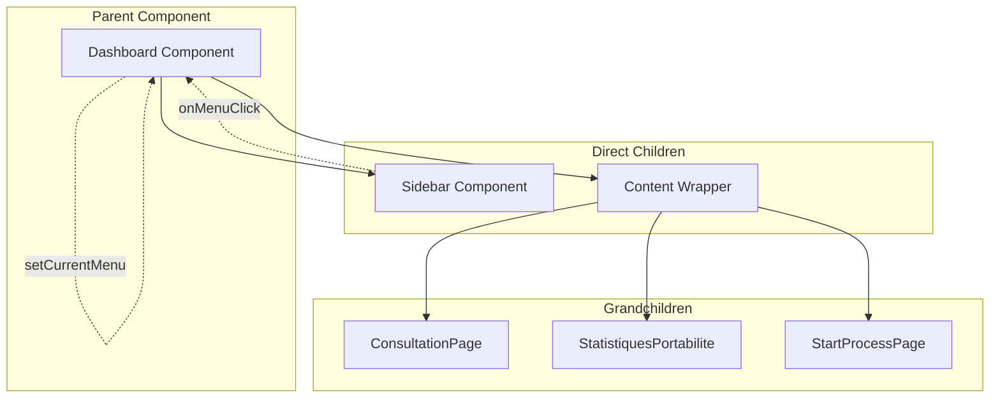
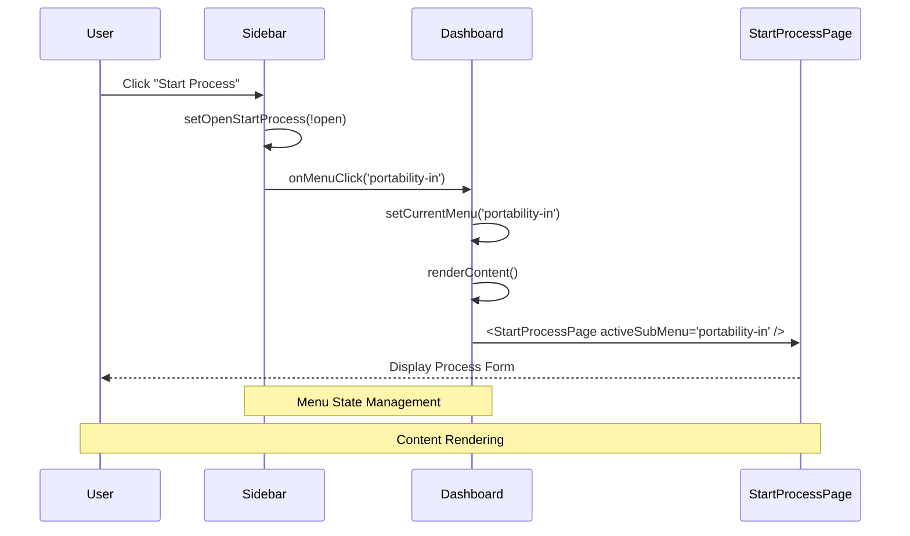

# Main Dashboard Component

<cite>
**Referenced Files in This Document**
- [Dashboard.jsx](file://src/components/dashboard/Dashboard.jsx)
- [DashboardPage.jsx](file://src/pages/DashboardPage.jsx)
- [Sidebar.jsx](file://src/components/layout/Sidebar.jsx)
- [Navbar.jsx](file://src/components/layout/Navbar.jsx)
- [Dashboard.css](file://src/components/dashboard/Dashboard.css)
- [Sidebar.css](file://src/components/layout/Sidebar.css)
- [ConsultationPage.jsx](file://src/components/ConsultationPage.jsx)
- [StatistiquesPortabilite.jsx](file://src/components/StatistiquesPortabilite.jsx)
- [StartProcessPage.jsx](file://src/components/StartProcessPage.jsx)
- [App.js](file://src/App.js)
- [index.js](file://src/index.js)
</cite>

## Table of Contents
1. [Introduction](#introduction)
2. [Project Structure](#project-structure)
3. [Core Components](#core-components)
4. [Architecture Overview](#architecture-overview)
5. [Detailed Component Analysis](#detailed-component-analysis)
6. [State Management Analysis](#state-management-analysis)
7. [Dynamic Content Rendering](#dynamic-content-rendering)
8. [Loading States Implementation](#loading-states-implementation)
9. [Component Composition Pattern](#component-composition-pattern)
10. [Integration with Navigation](#integration-with-navigation)
11. [Performance Considerations](#performance-considerations)
12. [Troubleshooting Guide](#troubleshooting-guide)
13. [Conclusion](#conclusion)

## Introduction

The Main Dashboard Component is the central hub of the monitoring front-end application, providing a comprehensive interface for managing portability processes. This component orchestrates multiple specialized pages including consultation, statistics, mass recycling, and process initiation capabilities. The dashboard implements a sophisticated state management system with loading states, menu tracking, and dynamic content rendering based on user selections.

The component follows modern React patterns with clear separation of concerns, reusable layout components, and responsive design principles. It integrates seamlessly with the application's routing system and provides a cohesive user experience across different functional areas.

## Project Structure

The dashboard component is organized within a modular architecture that promotes code reusability and maintainability:

**Diagram sources**
- [Dashboard.jsx:1-70](file://src/components/dashboard/Dashboard.jsx#L1-L70)
- [Sidebar.jsx:1-167](file://src/components/layout/Sidebar.jsx#L1-L167)
- [App.js:1-74](file://src/App.js#L1-L74)

**Section sources**
- [Dashboard.jsx:1-70](file://src/components/dashboard/Dashboard.jsx#L1-L70)
- [Sidebar.jsx:1-167](file://src/components/layout/Sidebar.jsx#L1-L167)
- [App.js:1-74](file://src/App.js#L1-L74)

## Core Components

The dashboard architecture consists of several interconnected components that work together to provide a comprehensive monitoring interface:

### Primary Dashboard Component
The main dashboard serves as the container component that manages state, handles loading states, and coordinates content rendering based on user navigation.

### Sidebar Navigation
Provides hierarchical navigation with collapsible sections for process initiation, allowing users to access different functional areas through a structured menu system.

### Content Pages
Specialized components for different functional areas:
- **Consultation Page**: Real-time monitoring and search capabilities
- **Statistics Page**: Performance metrics and analytical dashboards
- **Start Process Page**: Form-based process initiation with SOAP integration

### Layout Integration
The dashboard integrates with the global navbar for authentication and theming controls, providing a consistent user experience across the application.

**Section sources**
- [Dashboard.jsx:8-70](file://src/components/dashboard/Dashboard.jsx#L8-L70)
- [Sidebar.jsx:4-167](file://src/components/layout/Sidebar.jsx#L4-L167)
- [ConsultationPage.jsx:7-419](file://src/components/ConsultationPage.jsx#L7-L419)

## Architecture Overview

The dashboard implements a component composition pattern that emphasizes separation of concerns and reusability:

**Diagram sources**
- [Dashboard.jsx:16-56](file://src/components/dashboard/Dashboard.jsx#L16-L56)
- [Sidebar.jsx:11-17](file://src/components/layout/Sidebar.jsx#L11-L17)

The architecture follows these key principles:
- **State Hoisting**: Menu state is managed at the dashboard level
- **Component Composition**: Child components receive props for data and callbacks
- **Event Delegation**: Sidebar events bubble up to the dashboard for centralized handling
- **Conditional Rendering**: Content selection based on menu state

**Section sources**
- [Dashboard.jsx:8-70](file://src/components/dashboard/Dashboard.jsx#L8-L70)
- [Sidebar.jsx:19-167](file://src/components/layout/Sidebar.jsx#L19-L167)

## Detailed Component Analysis

### Dashboard Component Architecture

The main dashboard component implements a clean separation between presentation and logic:

**Diagram sources**
- [Dashboard.jsx:8-70](file://src/components/dashboard/Dashboard.jsx#L8-L70)
- [Sidebar.jsx:4-167](file://src/components/layout/Sidebar.jsx#L4-L167)
- [ConsultationPage.jsx:7-419](file://src/components/ConsultationPage.jsx#L7-L419)
- [StatistiquesPortabilite.jsx:12-301](file://src/components/StatistiquesPortabilite.jsx#L12-L301)
- [StartProcessPage.jsx:80-268](file://src/components/StartProcessPage.jsx#L80-L268)

### Component Props and State Management

The dashboard component manages its state through React hooks with clear separation of concerns:

| State Property | Type | Purpose | Initial Value |
|----------------|------|---------|---------------|
| `loading` | boolean | Controls loading state display | true |
| `currentMenu` | string | Tracks active navigation menu | defaultPage prop |
| `username` | string | User identification for display | passed from parent |
| `defaultPage` | string | Initial menu selection | 'consultation' |

**Section sources**
- [Dashboard.jsx:9-18](file://src/components/dashboard/Dashboard.jsx#L9-L18)
- [Dashboard.jsx:8](file://src/components/dashboard/Dashboard.jsx#L8)

## State Management Analysis

### Loading State Implementation

The dashboard implements a sophisticated loading mechanism that enhances user experience during initialization:

**Diagram sources**
- [Dashboard.jsx:12-29](file://src/components/dashboard/Dashboard.jsx#L12-L29)

The loading state serves multiple purposes:
- Provides immediate feedback during component initialization
- Prevents content flickering during data fetching
- Maintains consistent user experience across navigation

### Menu State Tracking

The dashboard maintains menu state through a centralized approach:

**Diagram sources**
- [Dashboard.jsx:16-18](file://src/components/dashboard/Dashboard.jsx#L16-L18)
- [Sidebar.jsx:30-142](file://src/components/layout/Sidebar.jsx#L30-L142)

**Section sources**
- [Dashboard.jsx:12-29](file://src/components/dashboard/Dashboard.jsx#L12-L29)
- [Sidebar.jsx:8-17](file://src/components/layout/Sidebar.jsx#L8-L17)

## Dynamic Content Rendering

### Conditional Rendering Logic

The `renderContent` method implements sophisticated conditional logic for dynamic content switching:

**Diagram sources**
- [Dashboard.jsx:31-56](file://src/components/dashboard/Dashboard.jsx#L31-L56)

### Content Switching Behavior

The dashboard demonstrates intelligent content switching with the following characteristics:

| Menu Option | Component | Props | Special Handling |
|-------------|-----------|-------|------------------|
| consultation | ConsultationPage | None | Real-time data fetching |
| statistique | StatistiquesPortabilite | None | API-driven statistics |
| recyclage-masse | Empty Section | None | Development placeholder |
| start-process | StartProcessPage | activeSubMenu='portability-in' | Process initiation |
| portability-out | StartProcessPage | activeSubMenu='portability-out' | Process initiation |

**Section sources**
- [Dashboard.jsx:31-56](file://src/components/dashboard/Dashboard.jsx#L31-L56)
- [StartProcessPage.jsx:80](file://src/components/StartProcessPage.jsx#L80)

## Loading States Implementation

### Spinner Animation Details

The loading spinner implementation utilizes CSS animations for smooth transitions:

**Diagram sources**
- [Dashboard.css:112-133](file://src/components/dashboard/Dashboard.css#L112-L133)

### Loading State Lifecycle

The loading state follows a predictable lifecycle:

1. **Initialization**: Component mounts with loading=true
2. **Timeout**: 800ms delay for perceived performance
3. **State Reset**: loading=false triggers content rendering
4. **User Interaction**: Menu changes update currentMenu state

**Section sources**
- [Dashboard.css:112-133](file://src/components/dashboard/Dashboard.css#L112-L133)
- [Dashboard.jsx:12-14](file://src/components/dashboard/Dashboard.jsx#L12-L14)

## Component Composition Pattern

### Parent-Child Relationship Structure

The dashboard exemplifies effective component composition through well-defined parent-child relationships:

**Diagram sources**
- [Dashboard.jsx:58-69](file://src/components/dashboard/Dashboard.jsx#L58-L69)
- [Sidebar.jsx:60-64](file://src/components/layout/Sidebar.jsx#L60-L64)

### Prop Drilling Strategy

The component implements efficient prop drilling with minimal overhead:

| Prop | Source | Destination | Purpose |
|------|--------|-------------|---------|
| `activeMenu` | Dashboard | Sidebar | Current selection state |
| `onMenuClick` | Dashboard | Sidebar | Event callback handler |
| `username` | App | Dashboard | User identification |
| `defaultPage` | App | Dashboard | Initial menu selection |

**Section sources**
- [Dashboard.jsx:60-64](file://src/components/dashboard/Dashboard.jsx#L60-L64)
- [Sidebar.jsx:4-7](file://src/components/layout/Sidebar.jsx#L4-L7)

## Integration with Navigation

### Sidebar Navigation System

The sidebar implements a hierarchical navigation system with collapsible sections:

**Diagram sources**
- [Sidebar.jsx:11-17](file://src/components/layout/Sidebar.jsx#L11-L17)
- [Dashboard.jsx:16-18](file://src/components/dashboard/Dashboard.jsx#L16-L18)

### Menu State Synchronization

The navigation system ensures consistent state synchronization across components:

| Action | Sidebar | Dashboard | Content |
|--------|---------|-----------|---------|
| Menu Click | Updates local state | Updates currentMenu | Renders new component |
| Submenu Click | Toggles visibility | Updates currentMenu | Renders process form |
| Default Page | No action | Uses defaultPage prop | Renders consultation |

**Section sources**
- [Sidebar.jsx:11-17](file://src/components/layout/Sidebar.jsx#L11-L17)
- [Dashboard.jsx:16-18](file://src/components/dashboard/Dashboard.jsx#L16-L18)

## Performance Considerations

### State Management Efficiency

The dashboard implements several performance optimization strategies:

1. **Minimal Re-renders**: State updates are scoped to necessary components
2. **Lazy Loading**: Content components are rendered only when selected
3. **Efficient Props**: Minimal prop drilling reduces unnecessary re-renders
4. **CSS Animations**: Hardware-accelerated loading spinner

### Memory Management

The component follows React best practices for memory management:
- Proper cleanup of event listeners
- Efficient state updates using setState batching
- Component unmount cleanup for timers and subscriptions

## Troubleshooting Guide

### Common Issues and Solutions

| Issue | Symptoms | Solution |
|-------|----------|----------|
| Loading Spinner Never Disappears | White screen with spinner | Check timeout function in useEffect |
| Menu Changes Not Reflecting | Clicking menu has no effect | Verify onMenuClick prop passing |
| Content Not Loading | Blank content area | Check renderContent switch statements |
| Sidebar Active State Incorrect | Wrong menu highlighted | Verify activeMenu prop binding |

### Debugging State Issues

To debug state-related issues:

1. **Console Logging**: Add console.log statements in handleMenuChange
2. **React DevTools**: Monitor component state updates
3. **Network Inspection**: Verify API calls for content components
4. **Prop Validation**: Ensure proper prop types are passed

**Section sources**
- [Dashboard.jsx:12-14](file://src/components/dashboard/Dashboard.jsx#L12-L14)
- [Dashboard.jsx:16-18](file://src/components/dashboard/Dashboard.jsx#L16-L18)

## Conclusion

The Main Dashboard Component represents a well-architected solution for managing complex monitoring interfaces. Its implementation demonstrates key React patterns including state hoisting, component composition, and conditional rendering. The component successfully balances functionality with maintainability through clear separation of concerns and thoughtful design decisions.

The dashboard's state management system provides robust handling of loading states and menu tracking, while the dynamic content rendering ensures optimal user experience across different functional areas. The integration with sidebar navigation creates an intuitive workflow that scales effectively as new features are added.

Key strengths of the implementation include:
- Clean component boundaries and prop interfaces
- Efficient state management with minimal re-renders
- Responsive design with theme support
- Comprehensive error handling and loading states
- Extensible architecture for future enhancements

This component serves as an excellent foundation for building scalable React applications with complex UI requirements.