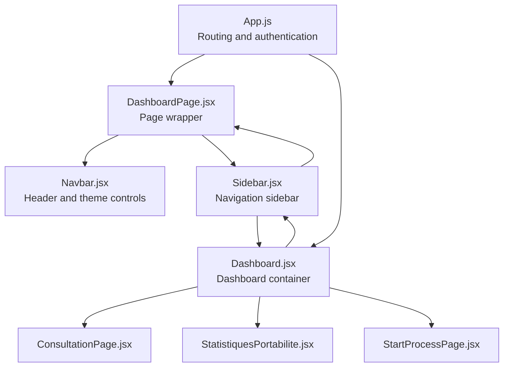
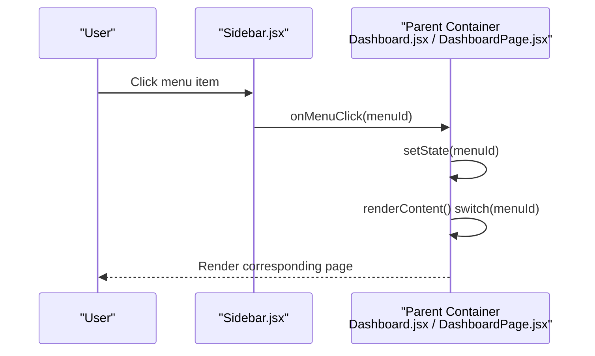
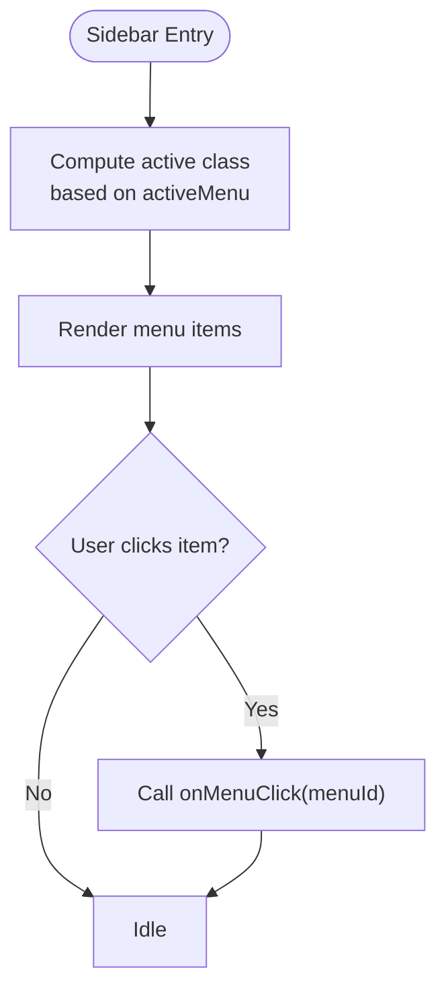
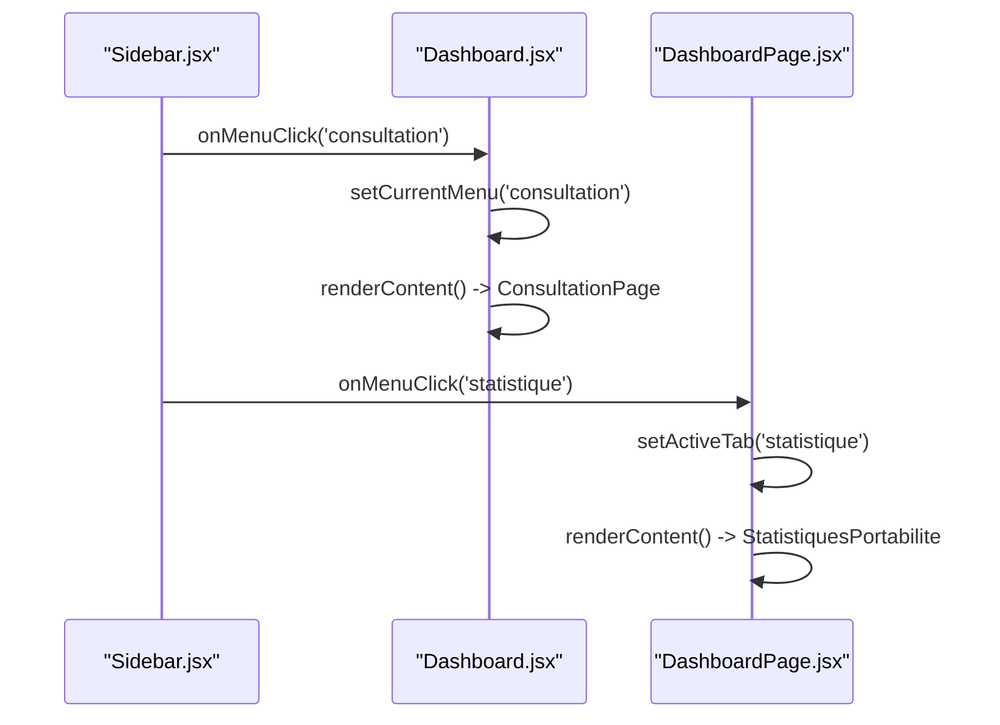
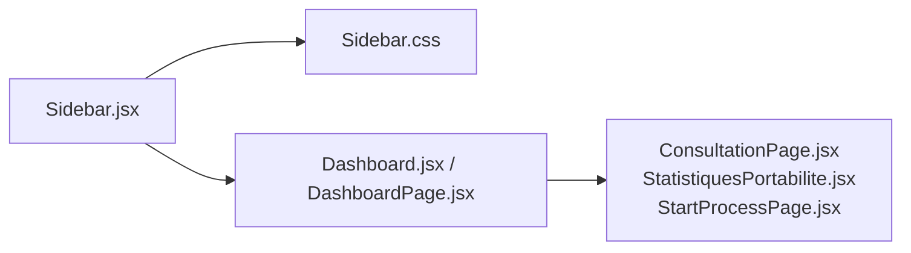

# Navigation Sidebar

<cite>
**Referenced Files in This Document**
- [Sidebar.jsx](file://src/components/layout/Sidebar.jsx)
- [Sidebar.css](file://src/components/layout/Sidebar.css)
- [Dashboard.jsx](file://src/components/dashboard/Dashboard.jsx)
- [DashboardPage.jsx](file://src/pages/DashboardPage.jsx)
- [Navbar.jsx](file://src/components/layout/Navbar.jsx)
- [ConsultationPage.jsx](file://src/components/ConsultationPage.jsx)
- [StatistiquesPortabilite.jsx](file://src/components/StatistiquesPortabilite.jsx)
- [StartProcessPage.jsx](file://src/components/StartProcessPage.jsx)
- [App.js](file://src/App.js)
</cite>

## Table of Contents
1. [Introduction](#introduction)
2. [Project Structure](#project-structure)
3. [Core Components](#core-components)
4. [Architecture Overview](#architecture-overview)
5. [Detailed Component Analysis](#detailed-component-analysis)
6. [Dependency Analysis](#dependency-analysis)
7. [Performance Considerations](#performance-considerations)
8. [Troubleshooting Guide](#troubleshooting-guide)
9. [Conclusion](#conclusion)

## Introduction
This document provides comprehensive documentation for the navigation sidebar component used in the monitoring dashboard. It explains the sidebar’s menu structure, active state management, click event handling, menu item configuration, icon usage, visual indicators for active selections, styling approach, responsive behavior, and integration with the parent dashboard component. It also documents the menu change callback mechanism and how the sidebar communicates with the main dashboard to update content.

## Project Structure
The sidebar is part of the layout components and integrates with the dashboard and page-level containers. The primary files involved are:
- Sidebar component and its stylesheet
- Dashboard container that manages active menu state and renders content
- Dashboard page wrapper that also manages active tab state
- Navbar component that provides the header and theme controls
- Content pages that are rendered based on the active menu selection

**Diagram sources**
- [App.js:33-71](file://src/App.js#L33-L71)
- [DashboardPage.jsx:10-50](file://src/pages/DashboardPage.jsx#L10-L50)
- [Dashboard.jsx:8-69](file://src/components/dashboard/Dashboard.jsx#L8-L69)
- [Sidebar.jsx:4-167](file://src/components/layout/Sidebar.jsx#L4-L167)
- [Navbar.jsx:7-123](file://src/components/layout/Navbar.jsx#L7-L123)

**Section sources**
- [App.js:33-71](file://src/App.js#L33-L71)
- [DashboardPage.jsx:10-50](file://src/pages/DashboardPage.jsx#L10-L50)
- [Dashboard.jsx:8-69](file://src/components/dashboard/Dashboard.jsx#L8-L69)
- [Sidebar.jsx:4-167](file://src/components/layout/Sidebar.jsx#L4-L167)
- [Navbar.jsx:7-123](file://src/components/layout/Navbar.jsx#L7-L123)

## Core Components
- Sidebar component: Renders the navigation menu, handles clicks, toggles submenu visibility, and applies active state classes.
- Dashboard container: Manages the current active menu state and renders the corresponding content page.
- Dashboard page wrapper: Alternative container that also manages active tab state and renders content pages.
- Navbar component: Provides the header with theme controls and profile/logout actions.

Key responsibilities:
- Menu structure definition and click handling
- Active state computation and visual feedback
- Submenu toggle and arrow indicators
- Integration with parent dashboard for content updates

**Section sources**
- [Sidebar.jsx:4-167](file://src/components/layout/Sidebar.jsx#L4-L167)
- [Dashboard.jsx:8-69](file://src/components/dashboard/Dashboard.jsx#L8-L69)
- [DashboardPage.jsx:10-50](file://src/pages/DashboardPage.jsx#L10-L50)
- [Navbar.jsx:7-123](file://src/components/layout/Navbar.jsx#L7-L123)

## Architecture Overview
The sidebar participates in a two-layer navigation model:
- Parent-level container (Dashboard or DashboardPage) maintains the active menu state and decides which content to render.
- Sidebar receives the active menu identifier and the callback to notify when a user selects a different menu item.

**Diagram sources**
- [Sidebar.jsx:30-34](file://src/components/layout/Sidebar.jsx#L30-L34)
- [Sidebar.jsx:48-53](file://src/components/layout/Sidebar.jsx#L48-L53)
- [Sidebar.jsx:67-72](file://src/components/layout/Sidebar.jsx#L67-L72)
- [Sidebar.jsx:89-92](file://src/components/layout/Sidebar.jsx#L89-L92)
- [Sidebar.jsx:117-121](file://src/components/layout/Sidebar.jsx#L117-L121)
- [Sidebar.jsx:133-137](file://src/components/layout/Sidebar.jsx#L133-L137)
- [Sidebar.jsx:151-156](file://src/components/layout/Sidebar.jsx#L151-L156)
- [Dashboard.jsx:16-18](file://src/components/dashboard/Dashboard.jsx#L16-L18)
- [DashboardPage.jsx:13-15](file://src/pages/DashboardPage.jsx#L13-L15)

## Detailed Component Analysis

### Sidebar Component
The sidebar defines the menu structure and handles user interactions:
- Menu items: Consultation, Statistics, Mass Recycling, Start Process (with submenu), AI Analysis.
- Icons: Emojis and inline SVG icons are used for visual cues.
- Active state: Determined by comparing the incoming activeMenu prop with the item’s menu identifier.
- Submenu: Start Process toggles a submenu with Portability IN and Portability OUT items.
- Event handling: Each menu item triggers onMenuClick with a specific menu identifier.

**Diagram sources**
- [Sidebar.jsx:23-40](file://src/components/layout/Sidebar.jsx#L23-L40)
- [Sidebar.jsx:42-59](file://src/components/layout/Sidebar.jsx#L42-L59)
- [Sidebar.jsx:61-78](file://src/components/layout/Sidebar.jsx#L61-L78)
- [Sidebar.jsx:80-105](file://src/components/layout/Sidebar.jsx#L80-L105)
- [Sidebar.jsx:107-142](file://src/components/layout/Sidebar.jsx#L107-L142)
- [Sidebar.jsx:144-162](file://src/components/layout/Sidebar.jsx#L144-L162)

Implementation highlights:
- Active state class application for both main items and submenu items.
- Submenu arrow indicator reflects open/closed state.
- Menu identifiers used in onMenuClick calls match the keys handled by the parent container.

**Section sources**
- [Sidebar.jsx:4-167](file://src/components/layout/Sidebar.jsx#L4-L167)

### Active State Management
Active state is computed in the sidebar using the activeMenu prop:
- Main items compare activeMenu against their identifiers (e.g., consultation, statistique, recyclage-masse, ai-analysis).
- Submenu items compare activeMenu against portability-in or portability-out.
- Start Process item marks itself active when either portability-in or portability-out is active.

Visual indicators:
- Left border highlight and orange accent for active items.
- Hover effects adjust background and text color.
- Submenu items inherit the active class when their identifier matches.

**Section sources**
- [Sidebar.jsx:23-40](file://src/components/layout/Sidebar.jsx#L23-L40)
- [Sidebar.jsx:42-59](file://src/components/layout/Sidebar.jsx#L42-L59)
- [Sidebar.jsx:61-78](file://src/components/layout/Sidebar.jsx#L61-L78)
- [Sidebar.jsx:80-105](file://src/components/layout/Sidebar.jsx#L80-L105)
- [Sidebar.jsx:107-142](file://src/components/layout/Sidebar.jsx#L107-L142)
- [Sidebar.jsx:144-162](file://src/components/layout/Sidebar.jsx#L144-L162)

### Click Event Handling
Each menu item triggers onMenuClick with a specific menu identifier:
- Consultation: onMenuClick('consultation')
- Statistics: onMenuClick('statistique')
- Mass Recycling: onMenuClick('recyclage-masse')
- Start Process: toggles submenu and calls onMenuClick('portability-in')
- Portability IN: onMenuClick('portability-in')
- Portability OUT: onMenuClick('portability-out')
- AI Analysis: onMenuClick('ai-analysis')

The callback propagates up to the parent container, which updates its internal state and re-renders the appropriate content page.

**Section sources**
- [Sidebar.jsx:30-34](file://src/components/layout/Sidebar.jsx#L30-L34)
- [Sidebar.jsx:48-53](file://src/components/layout/Sidebar.jsx#L48-L53)
- [Sidebar.jsx:67-72](file://src/components/layout/Sidebar.jsx#L67-L72)
- [Sidebar.jsx:89-92](file://src/components/layout/Sidebar.jsx#L89-L92)
- [Sidebar.jsx:117-121](file://src/components/layout/Sidebar.jsx#L117-L121)
- [Sidebar.jsx:133-137](file://src/components/layout/Sidebar.jsx#L133-L137)
- [Sidebar.jsx:151-156](file://src/components/layout/Sidebar.jsx#L151-L156)

### Menu Items Configuration and Icons
Menu items are configured as buttons with:
- Icon spans for emoji icons (🔍, 📊, ♻️, ➕, 🤖).
- Inline SVG icons for Start Process submenu items (phone IN/OUT).
- Text labels for menu item names.
- Conditional rendering for submenu visibility.

Submenu configuration:
- Start Process button toggles openStartProcess state.
- Submenu displays Portability IN and Portability OUT items when open.

**Section sources**
- [Sidebar.jsx:36-38](file://src/components/layout/Sidebar.jsx#L36-L38)
- [Sidebar.jsx:55-57](file://src/components/layout/Sidebar.jsx#L55-L57)
- [Sidebar.jsx:74-76](file://src/components/layout/Sidebar.jsx#L74-L76)
- [Sidebar.jsx:94-96](file://src/components/layout/Sidebar.jsx#L94-L96)
- [Sidebar.jsx:158-160](file://src/components/layout/Sidebar.jsx#L158-L160)
- [Sidebar.jsx:108-142](file://src/components/layout/Sidebar.jsx#L108-L142)

### Visual Indicators and Styling Approach
Styling emphasizes:
- Dark gradient background with subtle borders.
- Left border highlight for active items with orange accent.
- Hover states with light background and text color changes.
- Submenu indentation and left border highlighting.
- Responsive behavior with slide-in/out on small screens.

CSS classes:
- sidebar-item, submenu-item, submenu, submenu-arrow.
- Theme-aware hover and active states.

**Section sources**
- [Sidebar.css:1-254](file://src/components/layout/Sidebar.css#L1-L254)

### Responsive Behavior
On small screens:
- Sidebar translates off-screen to the left.
- Adding an 'open' class to the sidebar element reveals it with a smooth transition.
- This pattern allows the sidebar to be toggled via external controls (e.g., a mobile menu button).

**Section sources**
- [Sidebar.css:119-130](file://src/components/layout/Sidebar.css#L119-L130)

### Integration with Parent Dashboard Component
Two integration patterns are present:

Pattern 1: Dashboard container
- Maintains currentMenu state and passes it to Sidebar via activeMenu prop.
- Handles onMenuClick by updating currentMenu.
- Renders content based on currentMenu using a switch statement.

Pattern 2: Dashboard page wrapper
- Maintains activeTab state and passes it to Sidebar via activeMenu prop.
- Handles onMenuClick by updating activeTab.
- Renders content based on activeTab using a switch statement.

Both patterns ensure that:
- Sidebar receives the active menu identifier.
- Sidebar triggers onMenuClick with a specific menu identifier.
- Parent container updates its state and re-renders the appropriate page.

**Diagram sources**
- [Dashboard.jsx:16-18](file://src/components/dashboard/Dashboard.jsx#L16-L18)
- [Dashboard.jsx:31-56](file://src/components/dashboard/Dashboard.jsx#L31-L56)
- [DashboardPage.jsx:13-15](file://src/pages/DashboardPage.jsx#L13-L15)
- [DashboardPage.jsx:17-34](file://src/pages/DashboardPage.jsx#L17-L34)

**Section sources**
- [Dashboard.jsx:8-69](file://src/components/dashboard/Dashboard.jsx#L8-L69)
- [DashboardPage.jsx:10-50](file://src/pages/DashboardPage.jsx#L10-L50)

### Menu Change Callback Mechanism
The callback mechanism ensures bidirectional communication:
- Sidebar emits onMenuClick(menuId) on user interaction.
- Parent container updates its internal state (currentMenu or activeTab).
- Parent container re-renders content based on the updated state.

State synchronization patterns:
- Dashboard container uses useState to manage currentMenu and setState on callback.
- Dashboard page wrapper uses useState to manage activeTab and setState on callback.
- Both containers pass the active identifier down to Sidebar as activeMenu.

**Section sources**
- [Sidebar.jsx:30-34](file://src/components/layout/Sidebar.jsx#L30-L34)
- [Sidebar.jsx:48-53](file://src/components/layout/Sidebar.jsx#L48-L53)
- [Sidebar.jsx:67-72](file://src/components/layout/Sidebar.jsx#L67-L72)
- [Sidebar.jsx:89-92](file://src/components/layout/Sidebar.jsx#L89-L92)
- [Sidebar.jsx:117-121](file://src/components/layout/Sidebar.jsx#L117-L121)
- [Sidebar.jsx:133-137](file://src/components/layout/Sidebar.jsx#L133-L137)
- [Sidebar.jsx:151-156](file://src/components/layout/Sidebar.jsx#L151-L156)
- [Dashboard.jsx:16-18](file://src/components/dashboard/Dashboard.jsx#L16-L18)
- [DashboardPage.jsx:13-15](file://src/pages/DashboardPage.jsx#L13-L15)

### Example Menu Item Definitions and State Synchronization
Example definitions:
- Consultation: menuId 'consultation'
- Statistics: menuId 'statistique'
- Mass Recycling: menuId 'recyclage-masse'
- Start Process: menuId 'portability-in' (also toggles submenu)
- Portability IN: menuId 'portability-in'
- Portability OUT: menuId 'portability-out'
- AI Analysis: menuId 'ai-analysis'

State synchronization:
- Parent container stores the active menu identifier.
- Sidebar compares activeMenu with each item’s menuId to compute active class.
- Parent container switches content based on the active identifier.

**Section sources**
- [Sidebar.jsx:23-40](file://src/components/layout/Sidebar.jsx#L23-L40)
- [Sidebar.jsx:42-59](file://src/components/layout/Sidebar.jsx#L42-L59)
- [Sidebar.jsx:61-78](file://src/components/layout/Sidebar.jsx#L61-L78)
- [Sidebar.jsx:80-105](file://src/components/layout/Sidebar.jsx#L80-L105)
- [Sidebar.jsx:107-142](file://src/components/layout/Sidebar.jsx#L107-L142)
- [Sidebar.jsx:144-162](file://src/components/layout/Sidebar.jsx#L144-L162)
- [Dashboard.jsx:31-56](file://src/components/dashboard/Dashboard.jsx#L31-L56)
- [DashboardPage.jsx:17-34](file://src/pages/DashboardPage.jsx#L17-L34)

## Dependency Analysis
The sidebar depends on:
- Parent container for active state and callback handling.
- CSS module for styling and responsive behavior.
- Content pages for rendering based on active menu.

**Diagram sources**
- [Sidebar.jsx:1-2](file://src/components/layout/Sidebar.jsx#L1-L2)
- [Sidebar.css:1-254](file://src/components/layout/Sidebar.css#L1-L254)
- [Dashboard.jsx:2-6](file://src/components/dashboard/Dashboard.jsx#L2-L6)
- [DashboardPage.jsx:2-8](file://src/pages/DashboardPage.jsx#L2-L8)

**Section sources**
- [Sidebar.jsx:1-2](file://src/components/layout/Sidebar.jsx#L1-L2)
- [Sidebar.css:1-254](file://src/components/layout/Sidebar.css#L1-L254)
- [Dashboard.jsx:2-6](file://src/components/dashboard/Dashboard.jsx#L2-L6)
- [DashboardPage.jsx:2-8](file://src/pages/DashboardPage.jsx#L2-L8)

## Performance Considerations
- Minimal re-renders: The sidebar computes active state based on props, avoiding unnecessary state churn.
- Efficient callbacks: onMenuClick is invoked only on user interaction.
- CSS transitions: Smooth transforms for responsive sidebar reveal without heavy JavaScript animations.
- Content switching: Parent containers use a simple switch to render content, minimizing overhead.

## Troubleshooting Guide
Common issues and resolutions:
- Active state not updating: Verify that the parent container updates its state on onMenuClick and passes the updated activeMenu prop to the sidebar.
- Submenu not toggling: Ensure openStartProcess state is toggled and the submenu is conditionally rendered based on this state.
- Incorrect menu identifier: Confirm that onMenuClick is called with the correct menuId and that the parent container handles this identifier in its render switch.
- Styling conflicts: Check that CSS classes for active and hover states are applied and that theme-related CSS variables are correctly set.

**Section sources**
- [Sidebar.jsx:8-17](file://src/components/layout/Sidebar.jsx#L8-L17)
- [Sidebar.jsx:108-142](file://src/components/layout/Sidebar.jsx#L108-L142)
- [Sidebar.jsx:16-17](file://src/components/layout/Sidebar.jsx#L16-L17)
- [Sidebar.css:52-57](file://src/components/layout/Sidebar.css#L52-L57)
- [Sidebar.css:109-112](file://src/components/layout/Sidebar.css#L109-L112)

## Conclusion
The navigation sidebar component provides a clean, configurable, and responsive navigation interface. It integrates seamlessly with parent dashboard containers through a straightforward callback mechanism, enabling robust state synchronization and dynamic content updates. Its styling emphasizes clarity and usability, with clear visual indicators for active selections and responsive behavior for smaller screens.