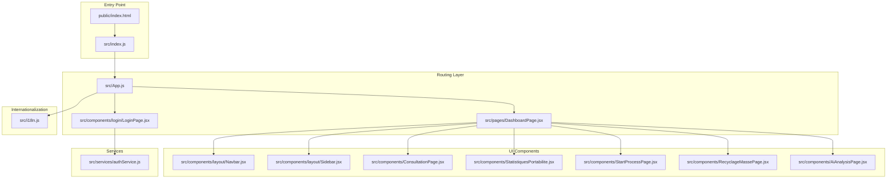

# Getting Started

<cite>
**Referenced Files in This Document**
- [package.json](file://package.json)
- [README.md](file://README.md)
- [index.html](file://public/index.html)
- [index.js](file://src/index.js)
- [App.js](file://src/App.js)
- [authService.js](file://src/services/authService.js)
- [LoginPage.jsx](file://src/components/login/LoginPage.jsx)
- [DashboardPage.jsx](file://src/pages/DashboardPage.jsx)
- [Navbar.jsx](file://src/components/layout/Navbar.jsx)
- [.gitignore](file://.gitignore)
- [i18n.js](file://src/i18n.js)
- [setupTests.js](file://src/setupTests.js)
- [reportWebVitals.js](file://src/reportWebVitals.js)
</cite>

## Table of Contents
1. [Introduction](#introduction)
2. [Prerequisites](#prerequisites)
3. [Installation](#installation)
4. [Development Environment Setup](#development-environment-setup)
5. [Environment Variables](#environment-variables)
6. [Running the Application](#running-the-application)
7. [Build Configuration](#build-configuration)
8. [Basic Usage](#basic-usage)
9. [Architecture Overview](#architecture-overview)
10. [Troubleshooting](#troubleshooting)
11. [Verification Steps](#verification-steps)
12. [Conclusion](#conclusion)

## Introduction
This guide helps you quickly set up and run the SmartPorta application locally. SmartPorta is a React-based frontend application that provides a dashboard for portability management, including user authentication, navigation, and various operational views. The application uses Create React App tooling for development and build processes.

## Prerequisites
- Node.js: The project requires Node.js version 14.0.0 or higher. This requirement is enforced by the react-scripts dependency.
- npm: The project uses npm as the package manager.
- Git: Recommended for cloning the repository and managing changes.

Why Node.js 14+ is required:
- The react-scripts package specifies a minimum Node.js version of 14.0.0 in its engines field.

**Section sources**
- [package.json:14503-14505](file://package.json#L14503-L14505)

## Installation
Follow these steps to install the application locally:

1. Clone the repository to your local machine.
2. Open a terminal in the project directory.
3. Install dependencies using npm:
   ```bash
   npm install
   ```
   This command reads the dependencies from package.json and installs them into the node_modules directory.

What gets installed:
- React runtime and DOM bindings
- Routing via react-router-dom
- Internationalization via i18next and react-i18next
- Charting via recharts
- PDF generation via jspdf and jspdf-autotable
- Excel export via xlsx
- HTTP client via axios
- Testing libraries for unit and integration testing
- Development and build toolchain via react-scripts

**Section sources**
- [package.json:5-23](file://package.json#L5-L23)

## Development Environment Setup
After installing dependencies, you can start the development server:

1. Start the development server:
   ```bash
   npm start
   ```
   This launches the Create React App development server, which:
   - Serves the application at http://localhost:3000
   - Enables hot reloading when you modify files
   - Provides live error reporting in the browser console

2. The development server uses webpack-dev-server under the hood and supports modern JavaScript features with Babel transpilation.

**Section sources**
- [README.md:9-15](file://README.md#L9-L15)
- [package.json:24-29](file://package.json#L24-L29)

## Environment Variables
The project includes a .gitignore file that lists environment variable files commonly used in development. These files are intentionally ignored by Git to prevent sensitive data from being committed.

Files ignored by Git:
- .env.local
- .env.development.local
- .env.test.local
- .env.production.local

Important note:
- The application does not currently define any environment-specific variables in the provided configuration.
- If you need to add environment variables, create the appropriate .env.*.local files in the project root and add your variables there.

**Section sources**
- [.gitignore:16-19](file://.gitignore#L16-L19)

## Running the Application
Once the development server is running:

1. Open your browser and navigate to http://localhost:3000
2. The application will display the login screen by default.
3. Authentication flow:
   - Enter a username and click Next
   - Enter a password and click Login
   - Successful login redirects to the dashboard

Key behaviors:
- The application uses react-router-dom for client-side routing
- Navigation components are provided by Navbar and Sidebar
- Internationalization is configured for French and English

**Section sources**
- [index.html:12](file://public/index.html#L12)
- [App.js:34-71](file://src/App.js#L34-L71)
- [LoginPage.jsx:9-57](file://src/components/login/LoginPage.jsx#L9-L57)

## Build Configuration
The project uses Create React App's build configuration:

1. Production build:
   ```bash
   npm run build
   ```
   This creates an optimized production bundle in the build directory, including:
   - Minified JavaScript and CSS
   - Asset hashing for cache busting
   - Optimized static assets

2. Build targets:
   - Modern browsers: >0.2%, not dead, not op_mini all
   - Development browsers: last 1 chrome/firefox/safari version

3. Testing:
   ```bash
   npm test
   ```
   Launches the test runner in interactive watch mode using Jest and @testing-library.

**Section sources**
- [README.md:22-30](file://README.md#L22-L30)
- [package.json:24-29](file://package.json#L24-L29)
- [package.json:36-47](file://package.json#L36-L47)

## Basic Usage
After successful login, you will land on the dashboard page. The dashboard provides:

1. Navigation:
   - Navbar with theme switching, notifications, and profile controls
   - Sidebar with menu items for different functional areas

2. Functional areas available:
   - Consultation
   - Statistics
   - Mass Recycling
   - Portability In/Out processes
   - AI Analysis

3. Theme support:
   - Light and dark themes
   - Persistent theme preference via CSS classes on the document body

**Section sources**
- [DashboardPage.jsx:10-34](file://src/pages/DashboardPage.jsx#L10-L34)
- [Navbar.jsx:7-32](file://src/components/layout/Navbar.jsx#L7-L32)

## Architecture Overview
The application follows a standard Create React App structure with modular components and services:



**Diagram sources**
- [index.js:1-19](file://src/index.js#L1-L19)
- [App.js:1-74](file://src/App.js#L1-L74)
- [LoginPage.jsx:1-94](file://src/components/login/LoginPage.jsx#L1-L94)
- [DashboardPage.jsx:1-51](file://src/pages/DashboardPage.jsx#L1-L51)
- [Navbar.jsx:1-124](file://src/components/layout/Navbar.jsx#L1-L124)
- [authService.js:1-19](file://src/services/authService.js#L1-L19)
- [i18n.js:1-64](file://src/i18n.js#L1-L64)

## Troubleshooting
Common setup and runtime issues:

1. Port already in use
   - Issue: Cannot start development server on port 3000
   - Solution: Stop the process using port 3000 or configure a different port
   - Command: `netstat -ano | findstr :3000` (Windows)

2. Node.js version compatibility
   - Issue: npm install fails with engine requirements
   - Solution: Upgrade Node.js to version 14.0.0 or higher
   - Verify: `node --version`

3. Missing dependencies
   - Issue: Application fails to start after fresh clone
   - Solution: Run `npm install` to install all dependencies
   - Verify: Check that node_modules directory exists

4. Authentication failures
   - Issue: Login attempts fail
   - Cause: Backend service not running at http://localhost:8081
   - Solution: Ensure the backend service is running on port 8081

5. Build failures
   - Issue: npm run build fails
   - Solution: Fix any TypeScript/JavaScript errors reported by the compiler
   - Check: Review console output for specific error messages

6. Internationalization issues
   - Issue: Content appears in unexpected language
   - Solution: Check the default language setting in i18n configuration

**Section sources**
- [authService.js:1](file://src/services/authService.js#L1)
- [package.json:14503-14505](file://package.json#L14503-L14505)

## Verification Steps
To confirm a successful installation and setup:

1. Dependency installation verification
   - Confirm node_modules directory exists
   - Verify package-lock.json is present

2. Development server verification
   - Start server with `npm start`
   - Browser opens automatically to http://localhost:3000
   - Application loads without JavaScript errors in console

3. Authentication flow verification
   - Navigate to login page
   - Test username validation (required field)
   - Test password validation (required field)
   - Verify redirect to dashboard after login

4. Build verification
   - Run `npm run build`
   - Confirm build directory is created with optimized assets
   - No build errors in console

5. Internationalization verification
   - Check that UI text appears in expected language
   - Verify language switching functionality works

6. Testing framework verification
   - Run `npm test`
   - Confirm test runner starts in watch mode
   - Verify existing tests pass

**Section sources**
- [README.md:9-30](file://README.md#L9-L30)
- [index.html:12](file://public/index.html#L12)
- [i18n.js:55-62](file://src/i18n.js#L55-L62)

## Conclusion
You now have the SmartPorta application running locally with a working development environment. The application provides a complete dashboard interface with authentication, internationalization, and responsive design. For further customization, you can modify components, add new routes, or integrate additional services as needed.

Key takeaways:
- Node.js 14+ is required for development
- Use npm scripts for all standard operations
- The application follows React best practices with Create React App
- Internationalization and theming are built-in features
- Testing and performance monitoring are integrated