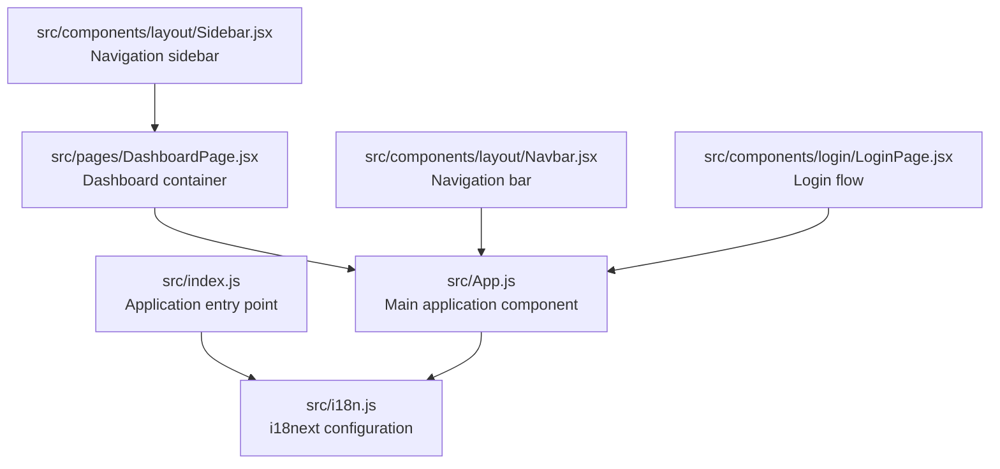
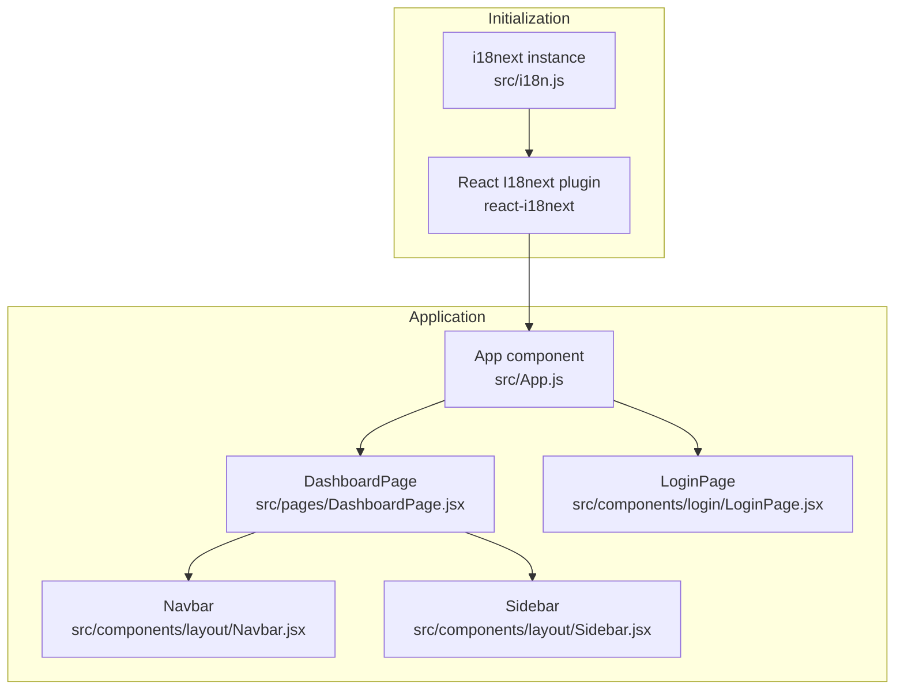
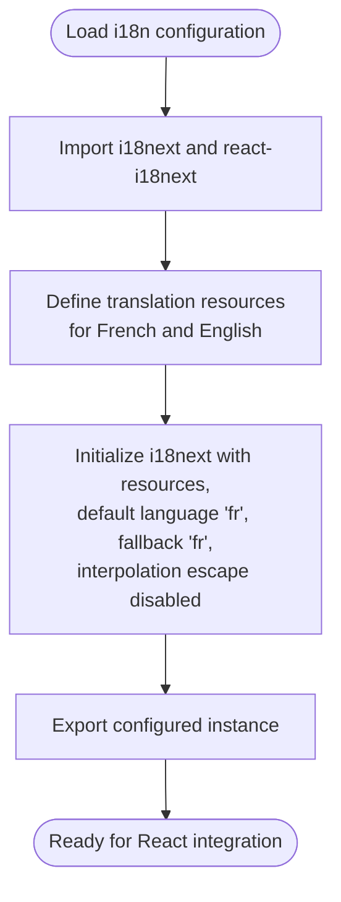
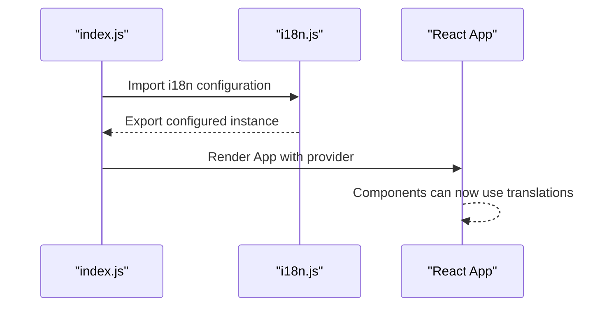
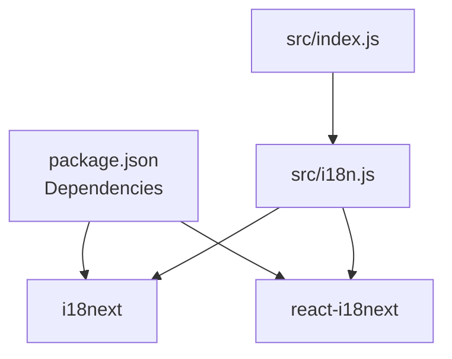

# Internationalization System

<cite>
**Referenced Files in This Document**
- [i18n.js](file://src/i18n.js)
- [index.js](file://src/index.js)
- [package.json](file://package.json)
- [App.js](file://src/App.js)
- [DashboardPage.jsx](file://src/pages/DashboardPage.jsx)
- [Navbar.jsx](file://src/components/layout/Navbar.jsx)
- [Sidebar.jsx](file://src/components/layout/Sidebar.jsx)
- [LoginPage.jsx](file://src/components/login/LoginPage.jsx)
</cite>

## Table of Contents
1. [Introduction](#introduction)
2. [Project Structure](#project-structure)
3. [Core Components](#core-components)
4. [Architecture Overview](#architecture-overview)
5. [Detailed Component Analysis](#detailed-component-analysis)
6. [Dependency Analysis](#dependency-analysis)
7. [Performance Considerations](#performance-considerations)
8. [Troubleshooting Guide](#troubleshooting-guide)
9. [Conclusion](#conclusion)

## Introduction
This document describes the internationalization (i18n) system for SmartPorta, focusing on the i18next implementation, translation resource management, and language switching mechanisms. The system currently supports French and English, with translation keys organized under a single namespace. The implementation integrates with React components via react-i18next, enabling localized rendering across the application. While the current setup initializes static translation resources, the architecture is designed to accommodate dynamic language loading and pluralization in future enhancements.

## Project Structure
The i18n system is initialized at the application root and consumed by React components through the react-i18next provider. The following diagram illustrates the relationship between the initialization module and the main application entry point.

**Diagram sources**
- [index.js:1-19](file://src/index.js#L1-L19)
- [i18n.js:1-64](file://src/i18n.js#L1-L64)
- [App.js:1-74](file://src/App.js#L1-L74)
- [DashboardPage.jsx:1-51](file://src/pages/DashboardPage.jsx#L1-L51)
- [Navbar.jsx:1-124](file://src/components/layout/Navbar.jsx#L1-L124)
- [Sidebar.jsx:1-167](file://src/components/layout/Sidebar.jsx#L1-L167)
- [LoginPage.jsx:1-94](file://src/components/login/LoginPage.jsx#L1-L94)

**Section sources**
- [index.js:1-19](file://src/index.js#L1-L19)
- [i18n.js:1-64](file://src/i18n.js#L1-L64)
- [App.js:1-74](file://src/App.js#L1-L74)

## Core Components
- i18next configuration and resource definition: Defines translation resources for French and English, sets the default language, and configures interpolation.
- React integration: Initializes the i18next instance with react-i18next to provide translation capabilities to components.
- Application bootstrap: Imports the i18n configuration during application startup to ensure global availability.

Key characteristics:
- Static resource loading: Translation keys are bundled statically in the configuration.
- Single namespace: All keys are grouped under a single namespace for simplicity.
- Default and fallback language: French is configured as both default and fallback language.

**Section sources**
- [i18n.js:1-64](file://src/i18n.js#L1-L64)
- [index.js:6](file://src/index.js#L6)

## Architecture Overview
The i18n architecture follows a centralized initialization pattern. The i18next instance is created once and shared across the application via react-i18next. Components consume translations through hooks or HOCs provided by react-i18next. The current implementation does not include dynamic language switching or pluralization features; these would require extending the configuration and adding appropriate UI controls.

**Diagram sources**
- [i18n.js:1-64](file://src/i18n.js#L1-L64)
- [App.js:1-74](file://src/App.js#L1-L74)
- [DashboardPage.jsx:1-51](file://src/pages/DashboardPage.jsx#L1-L51)
- [Navbar.jsx:1-124](file://src/components/layout/Navbar.jsx#L1-L124)
- [Sidebar.jsx:1-167](file://src/components/layout/Sidebar.jsx#L1-L167)
- [LoginPage.jsx:1-94](file://src/components/login/LoginPage.jsx#L1-L94)

## Detailed Component Analysis

### i18next Configuration and Resource Management
The configuration defines translation resources for two locales and initializes the i18next instance with react-i18next. It sets the default language and fallback language to French and disables HTML escaping in interpolation.

Implementation highlights:
- Resource structure: Keys are grouped under a single namespace with values for French and English.
- Initialization options: Default language, fallback language, and interpolation settings.
- Export: The configured instance is exported for consumption by the application.

**Diagram sources**
- [i18n.js:1-64](file://src/i18n.js#L1-L64)

**Section sources**
- [i18n.js:1-64](file://src/i18n.js#L1-L64)

### React Integration and Provider Setup
The application imports the i18n configuration at startup, ensuring the provider is available globally. Components can then use react-i18next to access translation functions and localized content.

Integration steps:
- Import the i18n module in the application entry point.
- Ensure the provider wraps the root component tree.

**Diagram sources**
- [index.js:1-19](file://src/index.js#L1-L19)
- [i18n.js:1-64](file://src/i18n.js#L1-L64)

**Section sources**
- [index.js:1-19](file://src/index.js#L1-L19)

### Translation Key Organization
Translation keys are organized under a single namespace and include common UI terms such as navigation labels, status indicators, and action buttons. The current set covers functional areas like consultation, statistics, mass recycling, and process actions.

Supported keys:
- Navigation and UI labels
- Status and metrics
- Action verbs and prompts

**Section sources**
- [i18n.js:4-53](file://src/i18n.js#L4-L53)

### Language Switching Mechanisms
The current implementation does not include explicit language switching controls. To enable runtime language switching, the system would require:
- A mechanism to update the active language (e.g., a selector component).
- Optional dynamic loading of additional resources for new languages.
- Consistent updates to the default language setting and persisted preferences.

[No sources needed since this section provides general guidance]

### Dynamic Language Loading
Dynamic loading is not implemented in the current setup. If needed, the system could be extended to load resources on demand for additional languages while preserving existing keys.

[No sources needed since this section provides general guidance]

### Integration with React Components
Components integrate with the i18n system by consuming the provider. The current components demonstrate static text usage and do not yet leverage translation functions. To implement translations:
- Wrap components with the react-i18next provider.
- Use translation hooks or HOCs to access localized strings.
- Apply keys consistently across components.

Current component roles:
- App: Orchestrates routing and authentication state.
- DashboardPage: Hosts navigation and content areas.
- Navbar: Provides user controls and profile actions.
- Sidebar: Offers primary navigation and submenu toggles.
- LoginPage: Manages authentication steps.

**Section sources**
- [App.js:1-74](file://src/App.js#L1-L74)
- [DashboardPage.jsx:1-51](file://src/pages/DashboardPage.jsx#L1-L51)
- [Navbar.jsx:1-124](file://src/components/layout/Navbar.jsx#L1-L124)
- [Sidebar.jsx:1-167](file://src/components/layout/Sidebar.jsx#L1-L167)
- [LoginPage.jsx:1-94](file://src/components/login/LoginPage.jsx#L1-L94)

### Translation Function Usage
The system is prepared to use translation functions via react-i18next. Typical usage involves:
- Accessing translated strings through hooks or HOCs.
- Passing keys to retrieve localized content.
- Handling missing keys gracefully with fallback behavior.

[No sources needed since this section provides general guidance]

### Locale-Specific Formatting
Locale-specific formatting (e.g., dates, numbers, currencies) is not implemented in the current setup. Future enhancements could integrate formatters aligned with the active locale.

[No sources needed since this section provides general guidance]

### Supported Languages
The system currently supports:
- French (default and fallback)
- English

These languages are defined in the translation resources and can be expanded by adding new locales to the configuration.

**Section sources**
- [i18n.js:4-53](file://src/i18n.js#L4-L53)

### Translation Workflow
The translation workflow in the current implementation:
- Define keys and values in the i18n configuration.
- Reference keys in components during rendering.
- Maintain consistency across languages.

[No sources needed since this section provides general guidance]

### Maintenance Procedures
Maintenance tasks include:
- Adding or updating translation keys for new features.
- Ensuring parity between languages.
- Reviewing and refining key naming conventions.
- Planning for dynamic loading and pluralization extensions.

[No sources needed since this section provides general guidance]

## Dependency Analysis
External dependencies for internationalization:
- i18next: Core internationalization library.
- react-i18next: React integration for i18next.

Internal dependencies:
- Application entry point imports the i18n configuration.
- Components rely on the provider for translation access.

**Diagram sources**
- [package.json:1-49](file://package.json#L1-L49)
- [index.js:1-19](file://src/index.js#L1-L19)
- [i18n.js:1-64](file://src/i18n.js#L1-L64)

**Section sources**
- [package.json:1-49](file://package.json#L1-L49)
- [index.js:1-19](file://src/index.js#L1-L19)
- [i18n.js:1-64](file://src/i18n.js#L1-L64)

## Performance Considerations
- Static resource loading keeps bundle size predictable but prevents lazy-loading benefits.
- Consider dynamic imports for additional languages if the number of resources grows substantially.
- Minimize unnecessary re-renders by using translation hooks efficiently and avoiding frequent language switches.

[No sources needed since this section provides general guidance]

## Troubleshooting Guide
Common issues and resolutions:
- Missing translations: Verify that keys exist in both languages and are correctly referenced in components.
- Incorrect language display: Confirm the default and fallback languages are set appropriately.
- Provider not available: Ensure the i18n configuration is imported before rendering the root component.

[No sources needed since this section provides general guidance]

## Conclusion
SmartPorta's internationalization system is built on i18next with react-i18next integration. The current implementation provides static translation resources for French and English, with a centralized configuration and global provider setup. While language switching and pluralization are not yet implemented, the architecture supports future enhancements to improve scalability and user experience across languages.