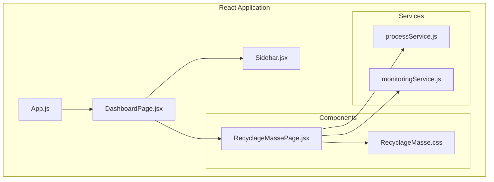
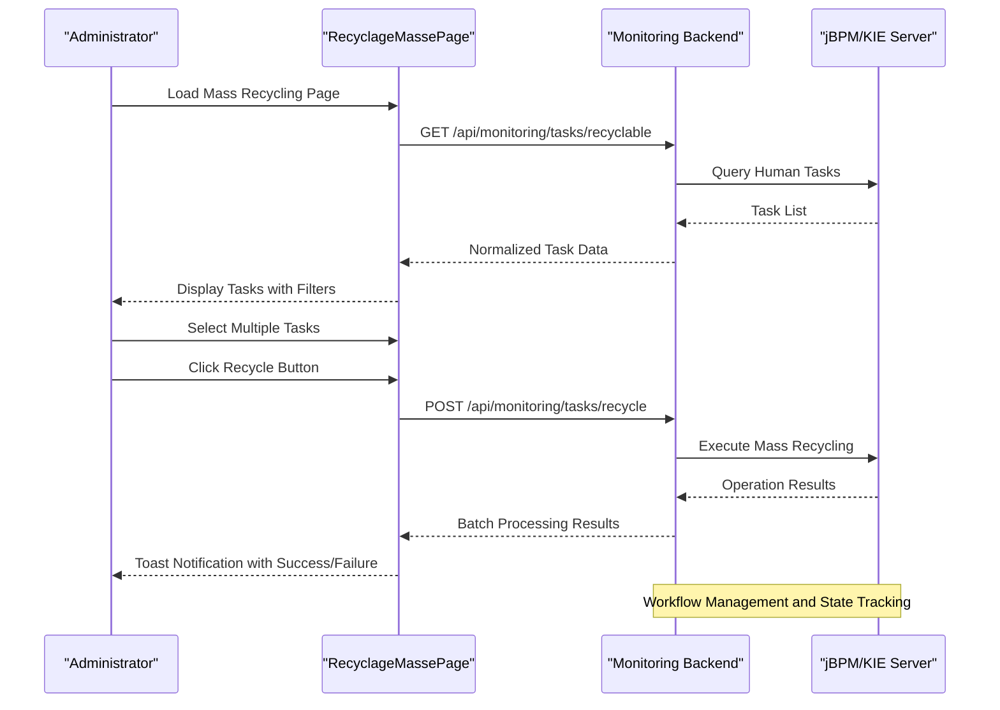
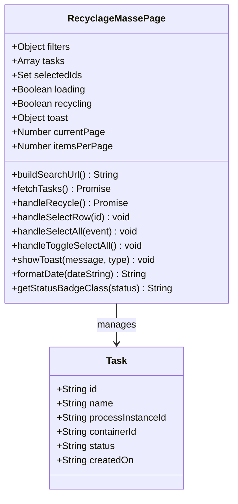
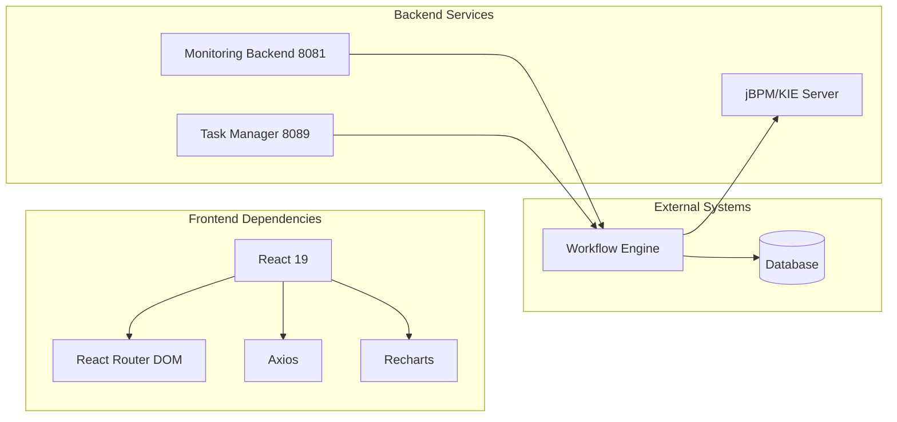

# Mass Recycling Operations

<cite>
**Referenced Files in This Document**
- [RecyclageMassePage.jsx](file://src/components/RecyclageMassePage.jsx)
- [RecyclageMasse.css](file://src/components/RecyclageMasse.css)
- [DashboardPage.jsx](file://src/pages/DashboardPage.jsx)
- [Sidebar.jsx](file://src/components/layout/Sidebar.jsx)
- [processService.js](file://src/services/processService.js)
- [monitoringService.js](file://src/services/monitoringService.js)
- [App.js](file://src/App.js)
- [package.json](file://package.json)
</cite>

## Table of Contents
1. [Introduction](#introduction)
2. [Project Structure](#project-structure)
3. [Core Components](#core-components)
4. [Architecture Overview](#architecture-overview)
5. [Detailed Component Analysis](#detailed-component-analysis)
6. [Dependency Analysis](#dependency-analysis)
7. [Performance Considerations](#performance-considerations)
8. [Troubleshooting Guide](#troubleshooting-guide)
9. [Conclusion](#conclusion)

## Introduction
This document provides comprehensive documentation for the mass recycling operations functionality implemented in the monitoring front-end application. The focus is on the RecyclageMassePage component, which enables administrators to manage and operate on multiple workflow tasks simultaneously. The implementation covers batch operation handling, administrative controls, bulk process management, and integration with backend services for workflow monitoring and state tracking.

The mass recycling workflow allows users to:
- Filter and search recyclable human tasks
- Select multiple tasks for batch operations
- Execute mass recycling operations
- Monitor task status and progress
- Receive real-time feedback through toast notifications

## Project Structure
The mass recycling functionality is organized within the React application structure with dedicated components and services:

**Diagram sources**
- [App.js:1-74](file://src/App.js#L1-L74)
- [DashboardPage.jsx:1-51](file://src/pages/DashboardPage.jsx#L1-L51)
- [Sidebar.jsx:1-167](file://src/components/layout/Sidebar.jsx#L1-L167)
- [RecyclageMassePage.jsx:1-382](file://src/components/RecyclageMassePage.jsx#L1-L382)
- [processService.js:1-38](file://src/services/processService.js#L1-L38)
- [monitoringService.js:1-24](file://src/services/monitoringService.js#L1-L24)

**Section sources**
- [App.js:1-74](file://src/App.js#L1-L74)
- [DashboardPage.jsx:1-51](file://src/pages/DashboardPage.jsx#L1-L51)
- [Sidebar.jsx:1-167](file://src/components/layout/Sidebar.jsx#L1-L167)

## Core Components
The mass recycling functionality centers around several key components that work together to provide a comprehensive administrative interface:

### RecyclageMassePage Component
The primary component responsible for mass recycling operations, featuring:
- Advanced filtering capabilities for task search
- Batch selection and management
- Real-time task status monitoring
- Administrative controls for bulk operations
- Pagination support for large datasets

### Dashboard Integration
The component integrates seamlessly with the dashboard system:
- Sidebar navigation with dedicated "Recyclages en masse" menu item
- Tab-based content switching within the dashboard layout
- Consistent styling and user experience

### Service Layer
Two specialized services handle different aspects of the mass recycling workflow:
- Process service for general monitoring operations
- Monitoring service for demand and process instance searches

**Section sources**
- [RecyclageMassePage.jsx:6-382](file://src/components/RecyclageMassePage.jsx#L6-L382)
- [DashboardPage.jsx:17-34](file://src/pages/DashboardPage.jsx#L17-L34)
- [Sidebar.jsx:61-78](file://src/components/layout/Sidebar.jsx#L61-L78)

## Architecture Overview
The mass recycling architecture follows a client-server pattern with React frontend components communicating with backend services:

**Diagram sources**
- [RecyclageMassePage.jsx:47-155](file://src/components/RecyclageMassePage.jsx#L47-L155)

The architecture implements several key patterns:
- **Component Composition**: Modular React components with clear separation of concerns
- **Service Layer Pattern**: Dedicated services for different API endpoints
- **State Management**: React hooks for local component state and lifecycle management
- **Error Handling**: Comprehensive error handling with user feedback mechanisms

## Detailed Component Analysis

### RecyclageMassePage Implementation
The RecyclageMassePage component serves as the central hub for mass recycling operations:

#### State Management
The component maintains several critical state variables:
- **Filters**: Container ID, date range, and process instance ID filters
- **Task List**: Complete dataset of recyclable human tasks
- **Selection State**: Track selected task IDs for batch operations
- **Loading States**: Loading indicators for user feedback
- **Pagination**: Current page and items per page configuration

#### Filtering and Search Logic
The component implements sophisticated filtering capabilities:
- **Container-based Filtering**: Process type selection with predefined options
- **Date Range Filtering**: Start and end date constraints
- **Process Instance Filtering**: Direct instance ID search
- **Dynamic URL Building**: Constructed URLs with proper query parameters

#### Batch Operation Handling
The mass recycling functionality includes robust batch processing:
- **Multi-selection**: Checkbox-based selection with select-all functionality
- **Batch Validation**: Pre-operation validation of selected items
- **Concurrent Processing**: Single API call with array of task IDs
- **Result Aggregation**: Success/failure tracking for individual operations

#### User Interface Design
The component features a comprehensive UI with:
- **Filter Form**: Structured form with validation and submission handling
- **Interactive Table**: Sortable columns with status badges
- **Selection Controls**: Individual and bulk selection options
- **Pagination System**: Efficient navigation for large datasets
- **Visual Feedback**: Toast notifications for operation results

**Diagram sources**
- [RecyclageMassePage.jsx:6-178](file://src/components/RecyclageMassePage.jsx#L6-L178)

**Section sources**
- [RecyclageMassePage.jsx:6-382](file://src/components/RecyclageMassePage.jsx#L6-L382)

### Service Integration Patterns
The component integrates with multiple services for different aspects of mass recycling:

#### Process Service Integration
The process service handles general monitoring operations:
- **Parameter Building**: Dynamic URL construction with pagination
- **Filter Application**: Support for various search criteria
- **Error Propagation**: Comprehensive error handling

#### Monitoring Service Integration
The monitoring service focuses on demand and process instance searches:
- **Flexible Parameter Handling**: Dynamic query parameter construction
- **Axios Integration**: Standardized HTTP client usage
- **Error Management**: Consistent error handling patterns

**Section sources**
- [processService.js:3-37](file://src/services/processService.js#L3-L37)
- [monitoringService.js:5-23](file://src/services/monitoringService.js#L5-L23)

### Administrative Controls and User Interface
The component provides comprehensive administrative controls:

#### Navigation Integration
Seamless integration with the dashboard navigation system:
- **Sidebar Menu Item**: Dedicated "Recyclages en masse" button
- **Tab Management**: Automatic content switching based on selection
- **Icon Integration**: ♻️ icon representing recycling operations

#### Filter Controls
Advanced filtering capabilities:
- **Process Type Selection**: Dropdown with predefined process options
- **Date Range Inputs**: Calendar-based date selection
- **Instance ID Search**: Direct process instance filtering
- **Reset Functionality**: Toggle selection for quick operations

#### Batch Operation Interface
Intuitive batch operation controls:
- **Selection Count Display**: Real-time count of selected items
- **Bulk Actions**: Single-click batch recycling operations
- **Progress Indicators**: Loading states during operations
- **Validation Feedback**: Disabled states during processing

**Section sources**
- [Sidebar.jsx:61-78](file://src/components/layout/Sidebar.jsx#L61-L78)
- [RecyclageMassePage.jsx:200-379](file://src/components/RecyclageMassePage.jsx#L200-L379)

## Dependency Analysis
The mass recycling functionality relies on several key dependencies and external systems:

### Frontend Dependencies
The application uses modern React patterns with essential libraries:
- **React 19**: Latest React version with concurrent features
- **React Router DOM**: Client-side routing for navigation
- **Axios**: HTTP client for API communications
- **i18n**: Internationalization support
- **Chart Libraries**: Data visualization capabilities

### Backend Integration Points
The component communicates with two distinct backend services:
- **Monitoring Backend (Port 8081)**: General monitoring and search operations
- **Task Management Backend (Port 8089)**: Human task management and recycling

### API Endpoint Patterns
The component implements standardized API patterns:
- **GET /api/monitoring/tasks/recyclable**: Task retrieval with filtering
- **POST /api/monitoring/tasks/recycle**: Batch recycling operations
- **Standardized Response Formats**: Consistent JSON structures

**Diagram sources**
- [package.json:5-22](file://package.json#L5-L22)
- [RecyclageMassePage.jsx:4](file://src/components/RecyclageMassePage.jsx#L4)

**Section sources**
- [package.json:1-49](file://package.json#L1-L49)
- [RecyclageMassePage.jsx:4](file://src/components/RecyclageMassePage.jsx#L4)

## Performance Considerations
The mass recycling implementation incorporates several performance optimization strategies:

### Client-Side Pagination
The component implements efficient client-side pagination:
- **Items Per Page**: Configurable limit of 10 items per page
- **Slice Operations**: Efficient array slicing for current page display
- **Memory Management**: Controlled memory usage for large datasets

### API Optimization
Several strategies optimize API communication:
- **Batch Requests**: Single request for multiple operations
- **Filter Optimization**: Reduced payload sizes through filtering
- **Caching Strategies**: Local state caching for improved responsiveness

### User Experience Optimizations
The interface includes several UX improvements:
- **Loading States**: Visual feedback during operations
- **Disabled States**: Prevent duplicate submissions
- **Real-time Updates**: Immediate UI updates after operations

## Troubleshooting Guide

### Common Issues and Solutions

#### API Connection Problems
**Issue**: Cannot connect to monitoring backend
**Symptoms**: Empty task lists, connection errors
**Solutions**:
- Verify backend service availability on port 8081
- Check network connectivity between frontend and backend
- Review CORS configuration if applicable

#### Authentication and Authorization
**Issue**: Access denied for mass recycling operations
**Symptoms**: 401/403 errors, restricted access
**Solutions**:
- Verify user permissions for administrative operations
- Check session validity and expiration
- Review role-based access controls

#### Data Filtering Issues
**Issue**: Incorrect or incomplete task filtering
**Symptoms**: Wrong task results, empty search results
**Solutions**:
- Validate filter parameters format
- Check date range boundaries
- Verify process instance ID format

#### Batch Operation Failures
**Issue**: Partial or complete batch operation failures
**Symptoms**: Mixed success/failure results
**Solutions**:
- Review individual task statuses
- Check workflow engine connectivity
- Examine backend logs for detailed errors

### Error Handling Patterns
The component implements comprehensive error handling:
- **Toast Notifications**: User-friendly error messages
- **Console Logging**: Detailed error information
- **Fallback States**: Graceful degradation on failures
- **Retry Mechanisms**: Automatic retry for transient failures

**Section sources**
- [RecyclageMassePage.jsx:79-85](file://src/components/RecyclageMassePage.jsx#L79-L85)
- [RecyclageMassePage.jsx:149-152](file://src/components/RecyclageMassePage.jsx#L149-L152)

## Conclusion
The mass recycling operations functionality provides a comprehensive solution for administrative workflow management. The implementation demonstrates strong architectural patterns with clear separation of concerns, robust error handling, and intuitive user interfaces.

Key strengths of the implementation include:
- **Scalable Design**: Efficient handling of large datasets through pagination
- **Administrative Control**: Comprehensive filtering and batch operation capabilities
- **Integration Patterns**: Clean separation between frontend and backend services
- **User Experience**: Responsive interface with real-time feedback mechanisms

The component successfully bridges the gap between workflow management systems and administrative user interfaces, enabling efficient mass operations while maintaining system stability and user confidence.

Future enhancements could include:
- Enhanced logging and audit trails
- Advanced reporting capabilities
- Additional filtering and sorting options
- Performance monitoring and analytics