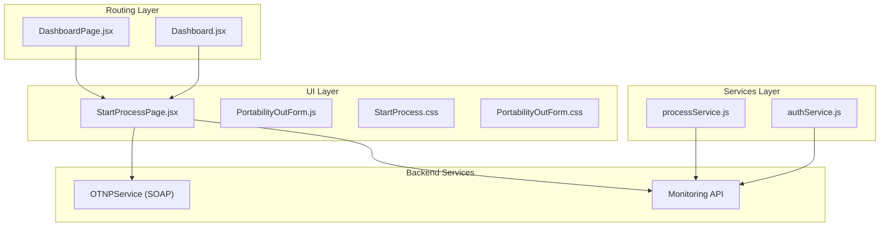
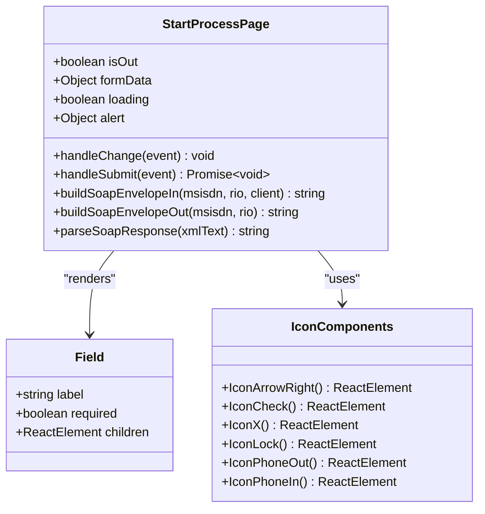
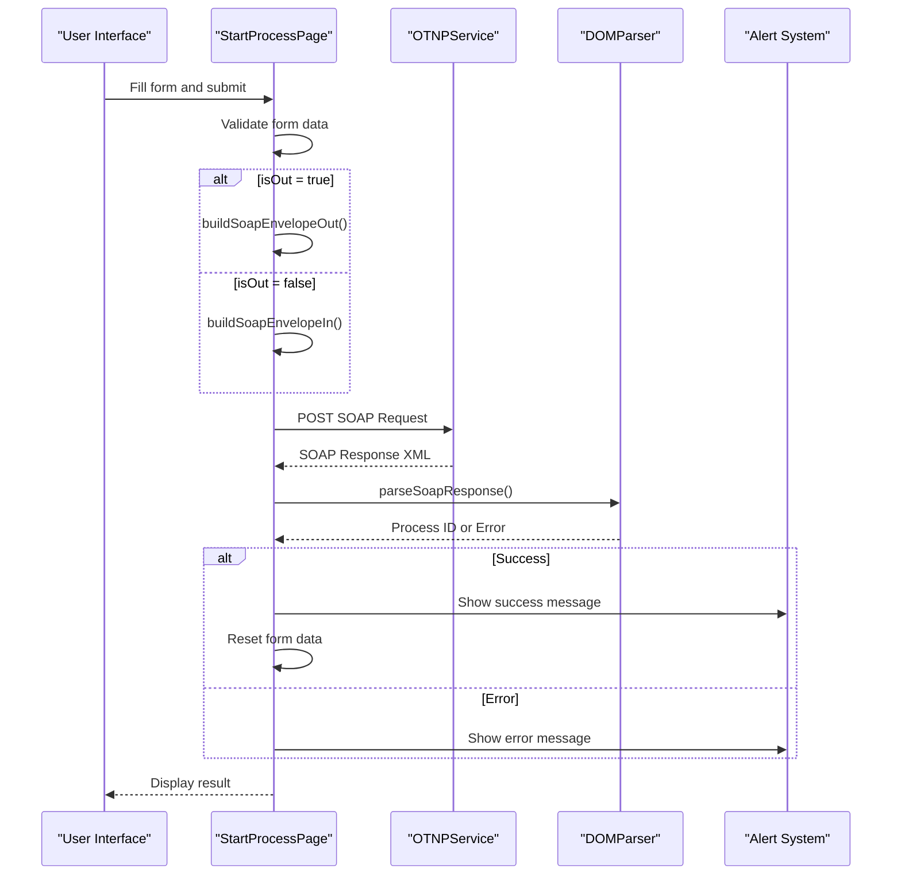
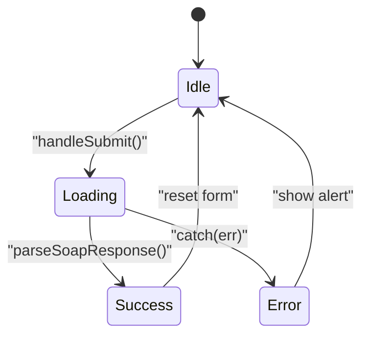
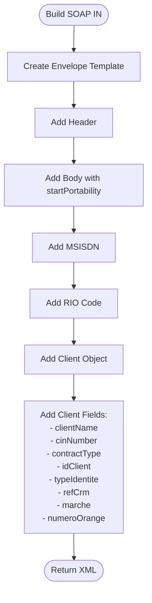
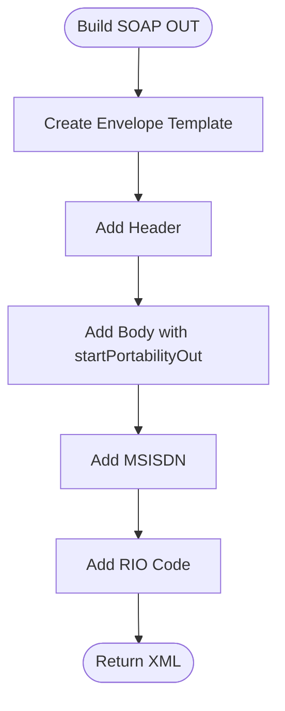
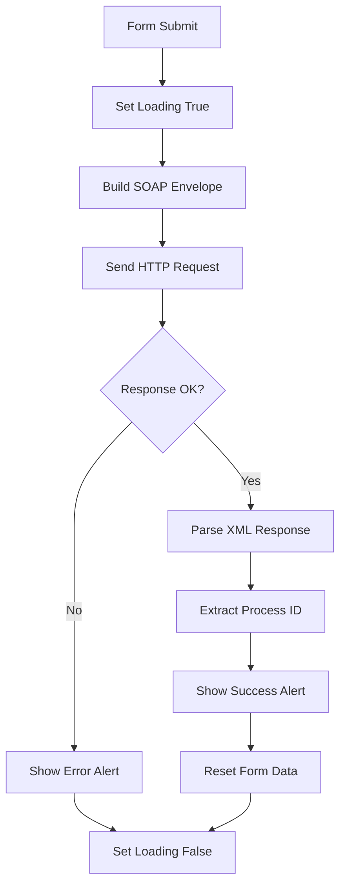
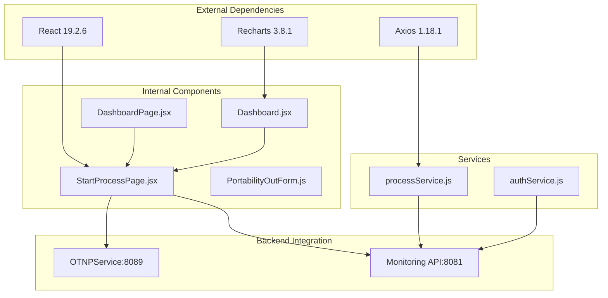
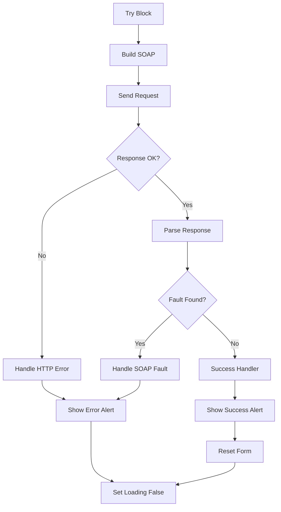

# Portability Initiation

<cite>
**Referenced Files in This Document**
- [StartProcessPage.jsx](file://src/components/StartProcessPage.jsx)
- [StartProcess.css](file://src/components/StartProcess.css)
- [PortabilityOutForm.js](file://src/PortabilityOutForm.js)
- [PortabilityOutForm.css](file://src/PortabilityOutForm.css)
- [DashboardPage.jsx](file://src/pages/DashboardPage.jsx)
- [Dashboard.jsx](file://src/components/dashboard/Dashboard.jsx)
- [processService.js](file://src/services/processService.js)
- [AuthService.js](file://src/services/authService.js)
</cite>

## Table of Contents
1. [Introduction](#introduction)
2. [Project Structure](#project-structure)
3. [Core Components](#core-components)
4. [Architecture Overview](#architecture-overview)
5. [Detailed Component Analysis](#detailed-component-analysis)
6. [Dependency Analysis](#dependency-analysis)
7. [Performance Considerations](#performance-considerations)
8. [Troubleshooting Guide](#troubleshooting-guide)
9. [Conclusion](#conclusion)

## Introduction
This document provides comprehensive technical documentation for the portability initiation system, focusing on the dual-mode portability workflows for both IN (incoming) and OUT (outgoing) processes. It covers the StartProcessPage component implementation, form handling, validation patterns, SOAP envelope construction, and the differences between IN and OUT workflows. The system operates as a React-based frontend that communicates with backend services via SOAP requests and integrates with monitoring APIs.

## Project Structure
The portability initiation system is primarily implemented within the components and services directories. The key files include the main StartProcessPage component, supporting CSS styles, a legacy PortabilityOutForm component, and integration points with the dashboard routing system.

**Diagram sources**
- [StartProcessPage.jsx:1-268](file://src/components/StartProcessPage.jsx#L1-L268)
- [DashboardPage.jsx:1-51](file://src/pages/DashboardPage.jsx#L1-L51)
- [processService.js:1-38](file://src/services/processService.js#L1-L38)

**Section sources**
- [StartProcessPage.jsx:1-268](file://src/components/StartProcessPage.jsx#L1-L268)
- [DashboardPage.jsx:1-51](file://src/pages/DashboardPage.jsx#L1-L51)

## Core Components
The portability initiation system centers around the StartProcessPage component, which serves as a unified interface for both IN and OUT portability workflows. The component implements dual-mode operation through the `isOut` prop, enabling dynamic form rendering and SOAP request construction.

### Component Architecture
The StartProcessPage component utilizes React hooks for state management and implements a structured form layout with validation patterns:

**Diagram sources**
- [StartProcessPage.jsx:71-77](file://src/components/StartProcessPage.jsx#L71-L77)
- [StartProcessPage.jsx:52-69](file://src/components/StartProcessPage.jsx#L52-L69)

**Section sources**
- [StartProcessPage.jsx:80-148](file://src/components/StartProcessPage.jsx#L80-L148)

## Architecture Overview
The portability initiation system follows a client-server architecture with SOAP-based communication for portability operations and REST-based communication for monitoring and authentication services.

**Diagram sources**
- [StartProcessPage.jsx:95-148](file://src/components/StartProcessPage.jsx#L95-L148)
- [StartProcessPage.jsx:41-49](file://src/components/StartProcessPage.jsx#L41-L49)

## Detailed Component Analysis

### StartProcessPage Component Implementation
The StartProcessPage component serves as the primary interface for portability initiation, implementing comprehensive form handling, validation, and SOAP communication.

#### Form State Management
The component maintains form state through React's useState hook, organizing data into logical sections:

**Diagram sources**
- [StartProcessPage.jsx:87-88](file://src/components/StartProcessPage.jsx#L87-L88)
- [StartProcessPage.jsx:95-148](file://src/components/StartProcessPage.jsx#L95-L148)

#### Dual-Mode Operation (`isOut` Prop)
The component implements dual-mode operation through the `isOut` prop, enabling dynamic behavior for both portability workflows:

| Mode | Purpose | Required Fields | Client Data |
|------|---------|----------------|-------------|
| IN (Incoming) | Transfer incoming number to operator | MSISDN, RIO, Client Identity | Full client profile |
| OUT (Outgoing) | Transfer number to another operator | MSISDN, RIO | Minimal client data |

**Section sources**
- [StartProcessPage.jsx:80-148](file://src/components/StartProcessPage.jsx#L80-L148)
- [DashboardPage.jsx:23-27](file://src/pages/DashboardPage.jsx#L23-L27)

#### SOAP Envelope Construction
The component generates SOAP envelopes tailored to each portability mode:

**IN Workflow SOAP Envelope Structure:**

**Diagram sources**
- [StartProcessPage.jsx:5-25](file://src/components/StartProcessPage.jsx#L5-L25)

**OUT Workflow SOAP Envelope Structure:**

**Diagram sources**
- [StartProcessPage.jsx:28-38](file://src/components/StartProcessPage.jsx#L28-L38)

#### Validation Patterns and Required Fields
The form implements structured validation through HTML5 required attributes and custom validation logic:

**Required Fields Matrix:**
| Section | Fields | Required for IN | Required for OUT |
|---------|--------|-----------------|------------------|
| Client Info | Nom, Prénom, ID Client | ✅ | ✅ |
| Client Info | Marché | ❌ | ❌ |
| Identity & Contract | Type d'identité | ❌ | ❌ |
| Identity & Contract | N° Identité | ❌ | ❌ |
| Identity & Contract | Référence CRM | ❌ | ❌ |
| Identity & Contract | Code Contrat | ❌ | ❌ |
| Identity & Contract | Numéro Orange | ❌ | ❌ |
| Portability Data | MSISDN | ✅ | ✅ |
| Portability Data | Code RIO | ✅ | ✅ |

**Section sources**
- [StartProcessPage.jsx:182-245](file://src/components/StartProcessPage.jsx#L182-L245)

#### Alert System and Loading States
The component implements a comprehensive alert system with distinct visual feedback for success and error states:

**Diagram sources**
- [StartProcessPage.jsx:95-148](file://src/components/StartProcessPage.jsx#L95-L148)

**Section sources**
- [StartProcessPage.jsx:168-174](file://src/components/StartProcessPage.jsx#L168-L174)
- [StartProcessPage.jsx:250-255](file://src/components/StartProcessPage.jsx#L250-L255)

### PortabilityOutForm Component
The PortabilityOutForm component provides a simplified interface for OUT portability requests, serving as a legacy implementation alongside the unified StartProcessPage.

**Section sources**
- [PortabilityOutForm.js:1-42](file://src/PortabilityOutForm.js#L1-L42)

## Dependency Analysis
The portability initiation system exhibits clear separation of concerns with well-defined dependencies between components and services.

**Diagram sources**
- [package.json:5-22](file://package.json#L5-L22)
- [StartProcessPage.jsx:119-123](file://src/components/StartProcessPage.jsx#L119-L123)
- [processService.js:1-38](file://src/services/processService.js#L1-L38)

**Section sources**
- [package.json:1-48](file://package.json#L1-L48)
- [StartProcessPage.jsx:119-123](file://src/components/StartProcessPage.jsx#L119-L123)

## Performance Considerations
The portability initiation system implements several performance optimizations:

### Network Efficiency
- **Single SOAP Request**: Each submission generates exactly one SOAP request to minimize network overhead
- **Efficient XML Parsing**: Uses native DOMParser for optimal XML processing performance
- **Minimal State Updates**: Form state updates trigger targeted re-renders only when necessary

### Memory Management
- **Component Cleanup**: Proper cleanup of event handlers and timers
- **State Optimization**: Minimal state footprint with focused data structures
- **Resource Cleanup**: Automatic cleanup of form data upon successful submission

### User Experience Optimizations
- **Loading States**: Visual feedback during processing prevents redundant submissions
- **Immediate Validation**: Real-time validation reduces server round trips
- **Responsive Design**: CSS Grid layout adapts to various screen sizes efficiently

## Troubleshooting Guide

### Common Issues and Solutions

#### SOAP Communication Problems
**Issue**: HTTP errors when submitting portability requests
**Solution**: Verify backend service availability and SOAP endpoint configuration

**Issue**: XML parsing failures
**Solution**: Check SOAP response format and ensure proper XML namespace declarations

#### Form Validation Errors
**Issue**: Required field validation not triggering
**Solution**: Ensure HTML5 required attributes are present and form submission uses preventDefault correctly

#### State Management Issues
**Issue**: Form data not resetting after successful submission
**Solution**: Verify state reset logic in success handler executes properly

**Section sources**
- [StartProcessPage.jsx:142-147](file://src/components/StartProcessPage.jsx#L142-L147)
- [StartProcessPage.jsx:136-140](file://src/components/StartProcessPage.jsx#L136-L140)

### Error Handling Strategies
The component implements comprehensive error handling across multiple layers:

**Diagram sources**
- [StartProcessPage.jsx:95-148](file://src/components/StartProcessPage.jsx#L95-L148)

**Section sources**
- [StartProcessPage.jsx:41-49](file://src/components/StartProcessPage.jsx#L41-L49)
- [StartProcessPage.jsx:142-147](file://src/components/StartProcessPage.jsx#L142-L147)

## Conclusion
The portability initiation system provides a robust, dual-mode solution for managing both incoming and outgoing portability requests. The StartProcessPage component demonstrates excellent architectural patterns with clear separation of concerns, comprehensive error handling, and efficient state management. The system's SOAP-based communication ensures secure and reliable integration with backend services while maintaining a responsive user experience through thoughtful UI/UX design and performance optimizations.

The implementation successfully balances functionality with maintainability, providing a solid foundation for future enhancements and extensions to the portability workflow system.