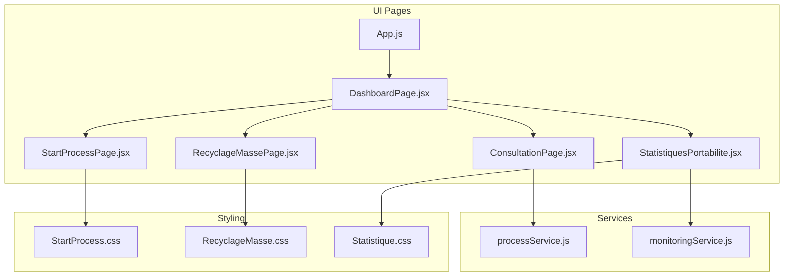
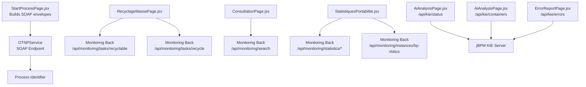
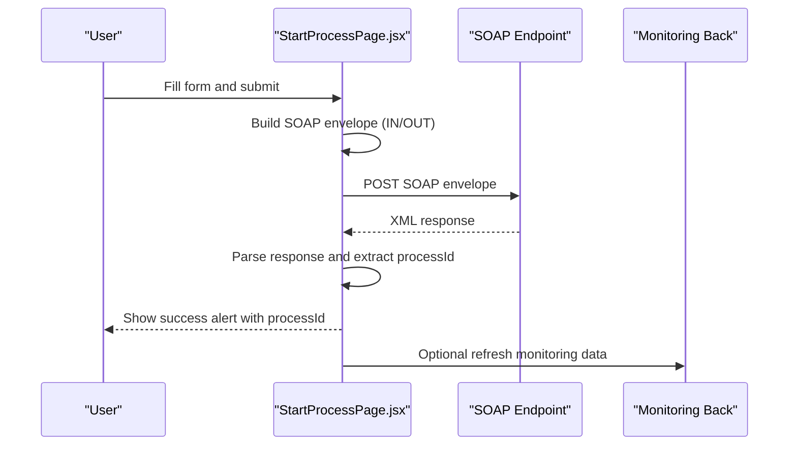
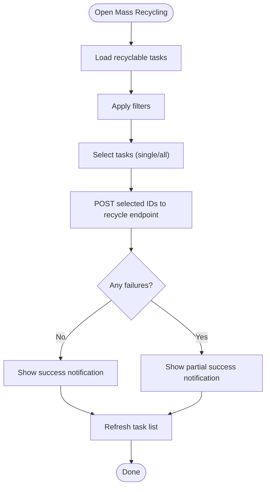
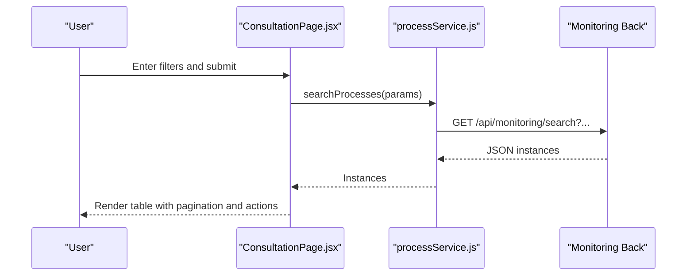
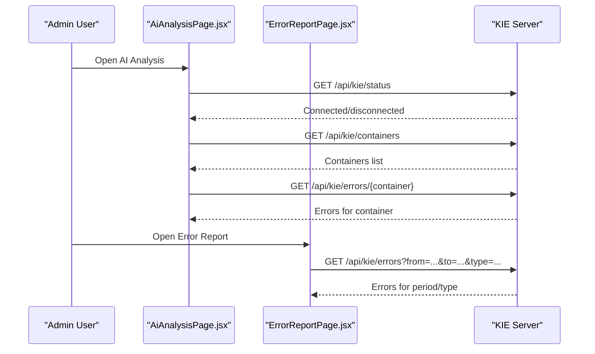
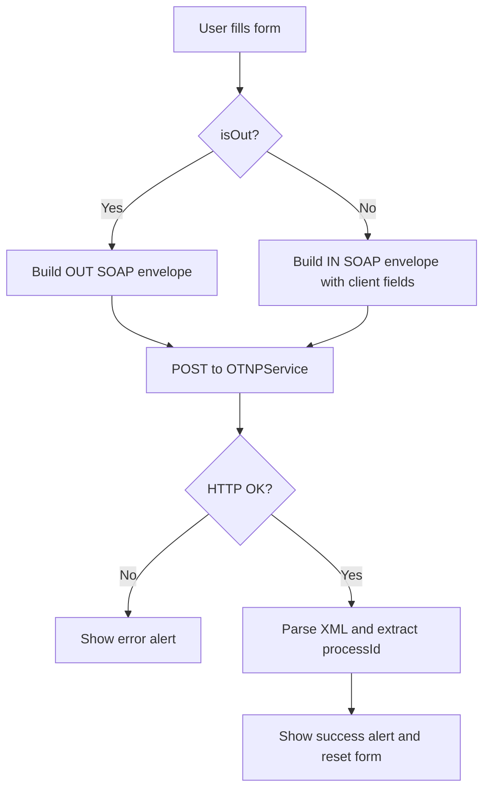
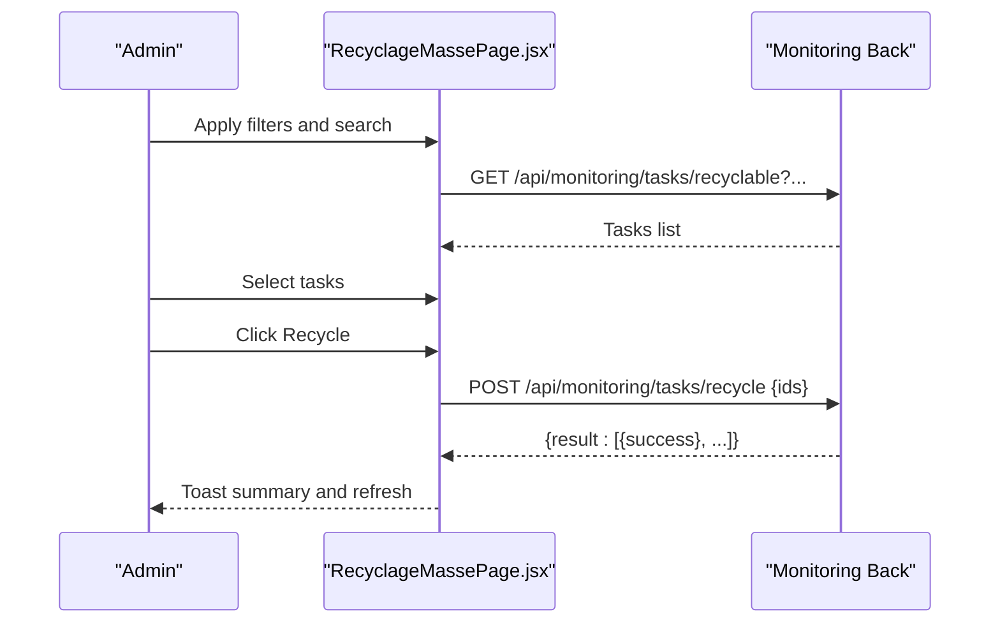
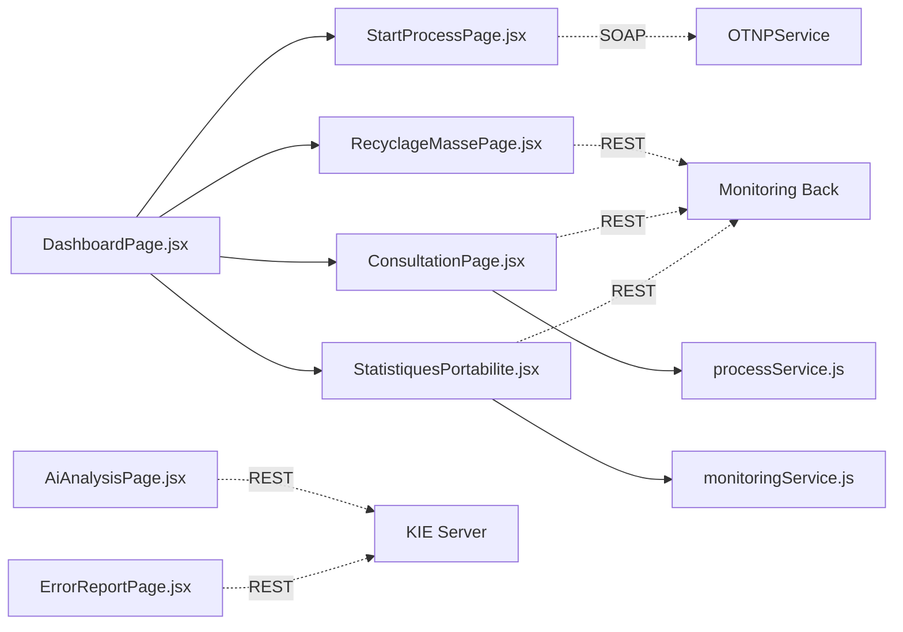

# Process Management

<cite>
**Referenced Files in This Document**
- [StartProcessPage.jsx](file://src/components/StartProcessPage.jsx)
- [StartProcess.css](file://src/components/StartProcess.css)
- [RecyclageMassePage.jsx](file://src/components/RecyclageMassePage.jsx)
- [RecyclageMasse.css](file://src/components/RecyclageMasse.css)
- [processService.js](file://src/services/processService.js)
- [monitoringService.js](file://src/services/monitoringService.js)
- [ConsultationPage.jsx](file://src/components/ConsultationPage.jsx)
- [StatistiquesPortabilite.jsx](file://src/components/StatistiquesPortabilite.jsx)
- [Statistique.css](file://src/components/Statistique.css)
- [DashboardPage.jsx](file://src/pages/DashboardPage.jsx)
- [App.js](file://src/App.js)
- [PortabilityOutForm.js](file://src/PortabilityOutForm.js)
</cite>

## Table of Contents
1. [Introduction](#introduction)
2. [Project Structure](#project-structure)
3. [Core Components](#core-components)
4. [Architecture Overview](#architecture-overview)
5. [Detailed Component Analysis](#detailed-component-analysis)
6. [Dependency Analysis](#dependency-analysis)
7. [Performance Considerations](#performance-considerations)
8. [Troubleshooting Guide](#troubleshooting-guide)
9. [Conclusion](#conclusion)
10. [Appendices](#appendices)

## Introduction
This document explains the SmartPorta process management capabilities implemented in the frontend. It covers:
- Portability IN/OUT initiation via dedicated forms and SOAP integration
- Mass recycling operations for human tasks
- Process instance lifecycle monitoring and reporting
- Integration with jBPM/KIE Server and monitoring backends
- Administrative controls and operational dashboards

The goal is to help both technical and non-technical users understand how to initiate processes, manage worklists, and monitor workflow health.

## Project Structure
SmartPorta’s process management UI is organized around reusable components and service modules:
- StartProcessPage: Unified form for IN/OUT initiation with dynamic field rendering
- RecyclageMassePage: Batch recycling of human tasks with filtering and selection
- ConsultationPage: Search and drill-down into process instances
- StatistiquesPortabilite: Operational statistics and instance monitoring
- Services: processService and monitoringService encapsulate backend communication
- DashboardPage and App: Routing and navigation across functional areas

**Diagram sources**
- [DashboardPage.jsx:17-34](file://src/pages/DashboardPage.jsx#L17-L34)
- [StartProcessPage.jsx:80-148](file://src/components/StartProcessPage.jsx#L80-L148)
- [RecyclageMassePage.jsx:6-86](file://src/components/RecyclageMassePage.jsx#L6-L86)
- [ConsultationPage.jsx:34-70](file://src/components/ConsultationPage.jsx#L34-L70)
- [StatistiquesPortabilite.jsx:28-63](file://src/components/StatistiquesPortabilite.jsx#L28-L63)
- [processService.js:3-37](file://src/services/processService.js#L3-L37)
- [monitoringService.js:5-23](file://src/services/monitoringService.js#L5-L23)

**Section sources**
- [DashboardPage.jsx:10-34](file://src/pages/DashboardPage.jsx#L10-L34)
- [App.js:33-71](file://src/App.js#L33-L71)

## Core Components
- StartProcessPage: Renders two forms in one component, switching behavior based on isOut flag. Handles client and portability data capture, builds SOAP envelopes, posts to OTNPService, parses responses, and displays alerts.
- RecyclageMassePage: Loads recyclable human tasks, supports filtering by container, dates, and process instance ID, allows bulk selection, and triggers batch recycling via monitoring backend.
- ConsultationPage: Provides search across process instances with pagination, export to CSV/PDF, and modal details.
- StatistiquesPortabilite: Displays performance metrics, drill-down by status, monthly trends, and exports problematic instances to CSV.
- Services: processService centralizes monitoring search queries; monitoringService offers CRM-centric search.

**Section sources**
- [StartProcessPage.jsx:80-148](file://src/components/StartProcessPage.jsx#L80-L148)
- [RecyclageMassePage.jsx:6-86](file://src/components/RecyclageMassePage.jsx#L6-L86)
- [ConsultationPage.jsx:34-70](file://src/components/ConsultationPage.jsx#L34-L70)
- [StatistiquesPortabilite.jsx:28-63](file://src/components/StatistiquesPortabilite.jsx#L28-L63)
- [processService.js:3-37](file://src/services/processService.js#L3-L37)
- [monitoringService.js:5-23](file://src/services/monitoringService.js#L5-L23)

## Architecture Overview
The frontend integrates with backend services to orchestrate portability processes and monitor workflow execution. The primary integration points are:
- OTNPService (SOAP): Initiates portability IN/OUT requests and returns process identifiers
- Monitoring Back (REST): Provides search, statistics, and instance lifecycle data
- KIE Server (REST): Status and error reporting for jBPM containers

**Diagram sources**
- [StartProcessPage.jsx:100-130](file://src/components/StartProcessPage.jsx#L100-L130)
- [RecyclageMassePage.jsx:69-86](file://src/components/RecyclageMassePage.jsx#L69-L86)
- [RecyclageMassePage.jsx:126-134](file://src/components/RecyclageMassePage.jsx#L126-L134)
- [ConsultationPage.jsx:60-70](file://src/components/ConsultationPage.jsx#L60-L70)
- [StatistiquesPortabilite.jsx:28-63](file://src/components/StatistiquesPortabilite.jsx#L28-L63)
- [monitoringService.js:5-23](file://src/services/monitoringService.js#L5-L23)

## Detailed Component Analysis

### Portability IN/OUT Initiation
This component manages both IN and OUT initiation through a single form with conditional rendering:
- Dynamic field sets for client info (IN only), identity and contract (IN only), and portability data (both)
- Builds separate SOAP envelopes for IN and OUT
- Posts to OTNPService endpoint and parses responses
- Displays success/error alerts and resets form on success

**Diagram sources**
- [StartProcessPage.jsx:100-130](file://src/components/StartProcessPage.jsx#L100-L130)

**Section sources**
- [StartProcessPage.jsx:80-148](file://src/components/StartProcessPage.jsx#L80-L148)
- [StartProcess.css:15-326](file://src/components/StartProcess.css#L15-L326)

### Mass Recycling Operations
The mass recycling page enables administrators to:
- Filter recyclable human tasks by container, date range, and process instance ID
- Paginate and select multiple tasks
- Trigger batch recycling and receive per-task results
- Receive toast notifications for success/failure outcomes

**Diagram sources**
- [RecyclageMassePage.jsx:47-86](file://src/components/RecyclageMassePage.jsx#L47-L86)
- [RecyclageMassePage.jsx:119-155](file://src/components/RecyclageMassePage.jsx#L119-L155)

**Section sources**
- [RecyclageMassePage.jsx:6-86](file://src/components/RecyclageMassePage.jsx#L6-L86)
- [RecyclageMassePage.jsx:119-155](file://src/components/RecyclageMassePage.jsx#L119-L155)
- [RecyclageMasse.css:1-336](file://src/components/RecyclageMasse.css#L1-L336)

### Process Instance Lifecycle Management
The lifecycle is observable through:
- ConsultationPage: Search, paginate, export, and inspect process instances
- StatistiquesPortabilite: Global status KPIs, drill-down by status/type, monthly trends, and CSV export of anomalies
- MonitoringService: CRM-centric search supporting CRM ID, MSISDN, phone number, contract code, and date range

**Diagram sources**
- [ConsultationPage.jsx:34-70](file://src/components/ConsultationPage.jsx#L34-L70)
- [processService.js:3-37](file://src/services/processService.js#L3-L37)

**Section sources**
- [ConsultationPage.jsx:34-70](file://src/components/ConsultationPage.jsx#L34-L70)
- [monitoringService.js:5-23](file://src/services/monitoringService.js#L5-L23)
- [StatistiquesPortabilite.jsx:28-63](file://src/components/StatistiquesPortabilite.jsx#L28-L63)
- [Statistique.css:1-698](file://src/components/Statistique.css#L1-L698)

### Administrative Controls and Workflow Monitoring
Administrative capabilities include:
- KIE Server connectivity checks and error listings
- Drill-down into jBPM errors by container and period
- Export of error reports and instance anomalies

**Diagram sources**
- [AiAnalysisPage.jsx:382-396](file://src/components/AiAnalysisPage.jsx#L382-L396)
- [AiAnalysisPage.jsx:398-401](file://src/components/AiAnalysisPage.jsx#L398-L401)
- [ErrorReportPage.jsx:359-370](file://src/components/ErrorReportPage.jsx#L359-L370)

**Section sources**
- [AiAnalysisPage.jsx:382-396](file://src/components/AiAnalysisPage.jsx#L382-L396)
- [AiAnalysisPage.jsx:398-401](file://src/components/AiAnalysisPage.jsx#L398-L401)
- [ErrorReportPage.jsx:359-370](file://src/components/ErrorReportPage.jsx#L359-L370)

### Start Process Page Functionality, Forms, Validation Patterns, and Workflow Initiation
- Form composition: Two sections (client info and portability data), with optional identity/contract fields for IN
- Validation pattern: Required fields enforced via HTML attributes; runtime alert feedback on success/error
- Workflow initiation: SOAP envelope construction and submission; response parsing for processId extraction

**Diagram sources**
- [StartProcessPage.jsx:100-148](file://src/components/StartProcessPage.jsx#L100-L148)

**Section sources**
- [StartProcessPage.jsx:80-148](file://src/components/StartProcessPage.jsx#L80-L148)
- [StartProcess.css:15-326](file://src/components/StartProcess.css#L15-L326)

### Mass Recycling Page Implementation, Batch Operation Handling, and Administrative Controls
- Filtering: containerId, processInstanceId, dateDebut/dateFin
- Selection: toggle all, individual checkboxes, and selection count
- Batch operation: POST selected IDs to recycle endpoint and show per-result summary
- Administrative controls: pagination, action footer, and toast notifications

**Diagram sources**
- [RecyclageMassePage.jsx:47-86](file://src/components/RecyclageMassePage.jsx#L47-L86)
- [RecyclageMassePage.jsx:119-155](file://src/components/RecyclageMassePage.jsx#L119-L155)

**Section sources**
- [RecyclageMassePage.jsx:6-86](file://src/components/RecyclageMassePage.jsx#L6-L86)
- [RecyclageMassePage.jsx:119-155](file://src/components/RecyclageMassePage.jsx#L119-L155)
- [RecyclageMasse.css:1-336](file://src/components/RecyclageMasse.css#L1-L336)

## Dependency Analysis
- DashboardPage routes to StartProcessPage (IN/OUT), RecyclageMassePage, ConsultationPage, and StatistiquesPortabilite
- StartProcessPage depends on local state and external SOAP endpoint
- RecyclageMassePage depends on monitoring backend for tasks and recycle operations
- ConsultationPage depends on processService for search and pagination
- StatistiquesPortabilite depends on monitoring backend for statistics and instance lists
- AiAnalysisPage and ErrorReportPage depend on KIE Server for status, containers, and errors

**Diagram sources**
- [DashboardPage.jsx:17-34](file://src/pages/DashboardPage.jsx#L17-L34)
- [StartProcessPage.jsx:119-123](file://src/components/StartProcessPage.jsx#L119-L123)
- [RecyclageMassePage.jsx:69-86](file://src/components/RecyclageMassePage.jsx#L69-L86)
- [ConsultationPage.jsx:60-70](file://src/components/ConsultationPage.jsx#L60-L70)
- [StatistiquesPortabilite.jsx:28-63](file://src/components/StatistiquesPortabilite.jsx#L28-L63)

**Section sources**
- [DashboardPage.jsx:17-34](file://src/pages/DashboardPage.jsx#L17-L34)
- [App.js:33-71](file://src/App.js#L33-L71)

## Performance Considerations
- Pagination: ConsultationPage and StatistiquesPortabilite use client-side pagination for manageable datasets; RecyclageMassePage fetches up to 500 tasks per page to reduce repeated polling.
- Network efficiency: processService appends only non-empty filters to avoid redundant parameters.
- UI responsiveness: Loading states and disabled buttons prevent concurrent submissions during SOAP or recycle operations.

[No sources needed since this section provides general guidance]

## Troubleshooting Guide
Common issues and remedies:
- SOAP errors: Verify endpoint availability and credentials; check alert messages for HTTP status and SOAP Fault details.
- Monitoring backends: Ensure MonitoringBackApplication (port 8081) and OTNPService (port 8089) are reachable; processService throws explicit errors on HTTP failure.
- KIE Server: Use AiAnalysisPage to check connection status and reconnect if needed; review error listings for container-specific issues.
- Mass recycling: Confirm at least one task is selected; inspect toast messages for partial successes and backend logs.

**Section sources**
- [StartProcessPage.jsx:142-147](file://src/components/StartProcessPage.jsx#L142-L147)
- [processService.js:30-34](file://src/services/processService.js#L30-L34)
- [AiAnalysisPage.jsx:382-396](file://src/components/AiAnalysisPage.jsx#L382-L396)
- [RecyclageMassePage.jsx:149-154](file://src/components/RecyclageMassePage.jsx#L149-L154)

## Conclusion
SmartPorta’s frontend provides a cohesive suite for initiating portability processes, managing human tasks at scale, and monitoring workflow health. By leveraging unified forms, robust search and statistics, and administrative dashboards, operators can streamline operations while maintaining visibility into jBPM/KIE Server execution.

[No sources needed since this section summarizes without analyzing specific files]

## Appendices

### Example Workflows

- Initiate Portability IN
  - Navigate to the IN form via the dashboard
  - Fill client, identity/contract, and portability fields
  - Submit; observe success alert with process identifier

- Initiate Portability OUT
  - Navigate to the OUT form via the dashboard
  - Fill client and portability fields
  - Submit; observe success alert with process identifier

- Mass Recycle Human Tasks
  - Open Mass Recycling page
  - Apply filters (container, dates, instance ID)
  - Select tasks (all or individually)
  - Click Recycle; review toast summary and refresh list

- Monitor Process Lifecycle
  - Use Consultation to search and export instances
  - Use Statistics to review KPIs and drill down by status
  - Use Ai Analysis to monitor KIE Server health and errors

[No sources needed since this section provides general guidance]