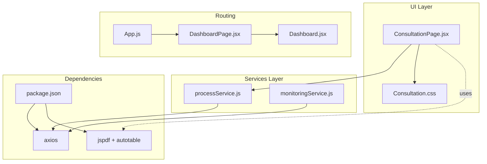
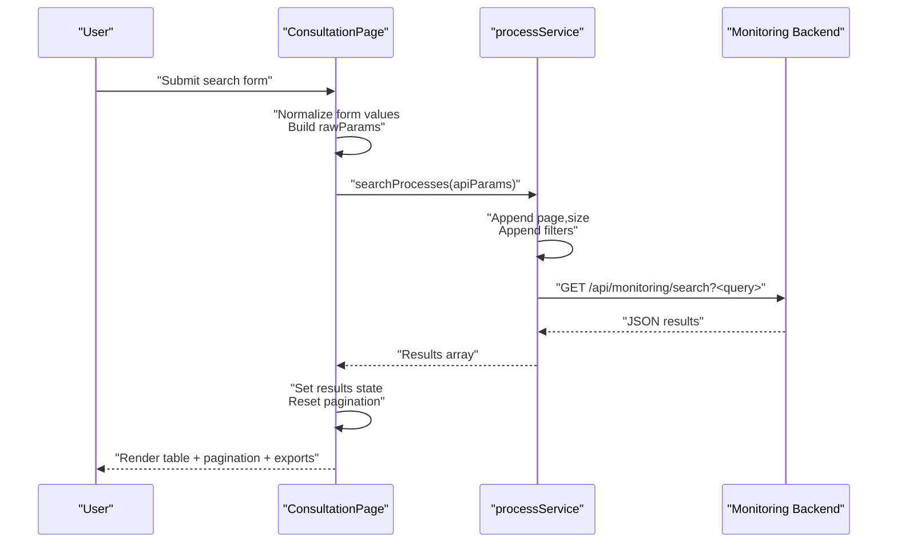
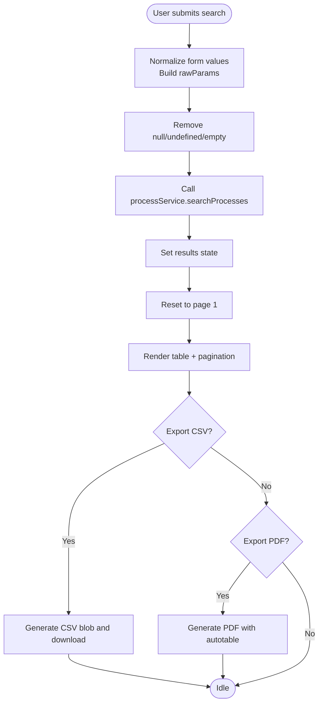
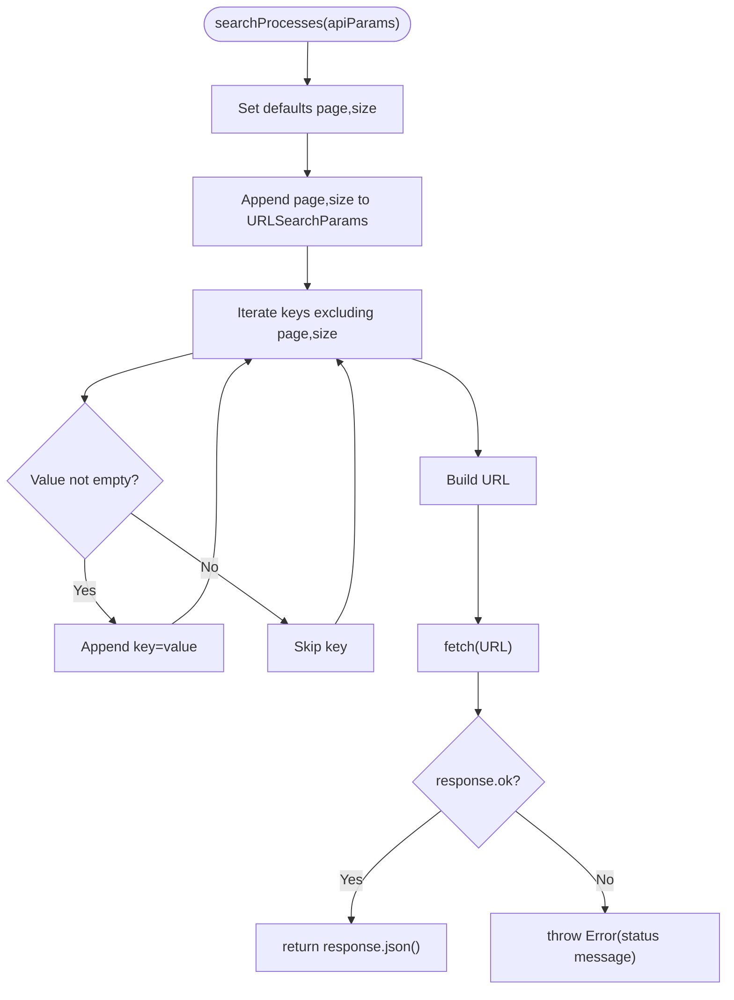
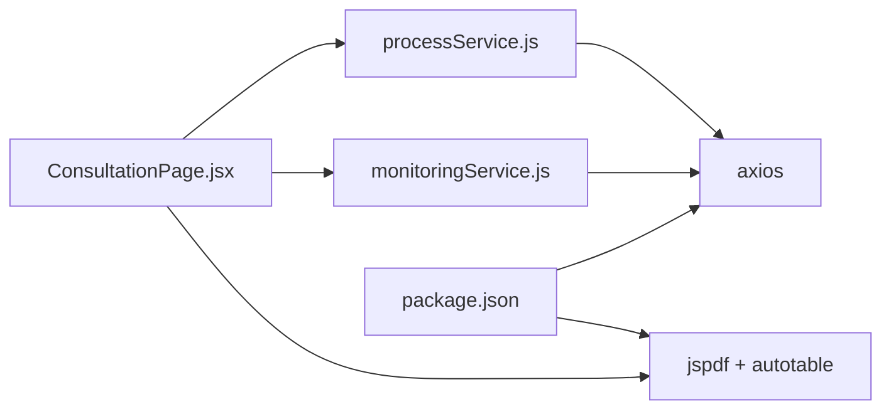

# Process Monitoring

<cite>
**Referenced Files in This Document**
- [ConsultationPage.jsx](file://src/components/ConsultationPage.jsx)
- [Consultation.css](file://src/components/Consultation.css)
- [processService.js](file://src/services/processService.js)
- [monitoringService.js](file://src/services/monitoringService.js)
- [Dashboard.jsx](file://src/components/dashboard/Dashboard.jsx)
- [DashboardPage.jsx](file://src/pages/DashboardPage.jsx)
- [App.js](file://src/App.js)
- [package.json](file://package.json)
</cite>

## Table of Contents
1. [Introduction](#introduction)
2. [Project Structure](#project-structure)
3. [Core Components](#core-components)
4. [Architecture Overview](#architecture-overview)
5. [Detailed Component Analysis](#detailed-component-analysis)
6. [Dependency Analysis](#dependency-analysis)
7. [Performance Considerations](#performance-considerations)
8. [Troubleshooting Guide](#troubleshooting-guide)
9. [Conclusion](#conclusion)
10. [Appendices](#appendices)

## Introduction
This document describes the SmartPorta process monitoring module focused on real-time process search and filtering, dynamic query parameter construction, pagination, and export capabilities. It explains the monitoring service architecture, API integration patterns, and data transformation utilities used in the consultation page. It also covers search form handling, result display patterns, user interaction workflows, error handling strategies, loading states, and performance optimization techniques. Examples of search queries, filter combinations, and export formats are included for practical use.

## Project Structure
The monitoring module centers around a dedicated consultation page that integrates with a process search service and exposes export functionality. The application routes and navigation integrate the consultation page into the broader dashboard.

**Diagram sources**
- [ConsultationPage.jsx:1-419](file://src/components/ConsultationPage.jsx#L1-L419)
- [Consultation.css:1-551](file://src/components/Consultation.css#L1-L551)
- [processService.js:1-38](file://src/services/processService.js#L1-L38)
- [monitoringService.js:1-24](file://src/services/monitoringService.js#L1-L24)
- [Dashboard.jsx:1-70](file://src/components/dashboard/Dashboard.jsx#L1-L70)
- [DashboardPage.jsx:1-51](file://src/pages/DashboardPage.jsx#L1-L51)
- [App.js:1-74](file://src/App.js#L1-L74)
- [package.json:1-49](file://package.json#L1-L49)

**Section sources**
- [ConsultationPage.jsx:1-419](file://src/components/ConsultationPage.jsx#L1-L419)
- [Consultation.css:1-551](file://src/components/Consultation.css#L1-L551)
- [processService.js:1-38](file://src/services/processService.js#L1-L38)
- [monitoringService.js:1-24](file://src/services/monitoringService.js#L1-L24)
- [Dashboard.jsx:1-70](file://src/components/dashboard/Dashboard.jsx#L1-L70)
- [DashboardPage.jsx:1-51](file://src/pages/DashboardPage.jsx#L1-L51)
- [App.js:1-74](file://src/App.js#L1-L74)
- [package.json:1-49](file://package.json#L1-L49)

## Core Components
- Consultation page: Manages search form state, triggers search, displays results, handles pagination, and provides export to CSV/PDF.
- Process search service: Builds dynamic query parameters and performs HTTP requests to the monitoring backend.
- Monitoring service: Alternative search utility using Axios for monitoring endpoints.
- Dashboard integration: Routes and renders the consultation page via routing and sidebar navigation.

Key responsibilities:
- Real-time search and filtering: Build query parameters dynamically from form inputs and backend filters.
- Dynamic query parameter construction: Normalize and append filters to URL search parameters.
- Pagination: Client-side slicing of results for a fixed item count per page.
- Export functionality: CSV and PDF generation from current results.
- Data transformation: Status labels, formatted dates, and CRM ID extraction from nested variables.

**Section sources**
- [ConsultationPage.jsx:7-217](file://src/components/ConsultationPage.jsx#L7-L217)
- [processService.js:3-37](file://src/services/processService.js#L3-L37)
- [monitoringService.js:5-23](file://src/services/monitoringService.js#L5-L23)
- [Dashboard.jsx:31-56](file://src/components/dashboard/Dashboard.jsx#L31-L56)
- [DashboardPage.jsx:17-33](file://src/pages/DashboardPage.jsx#L17-L33)

## Architecture Overview
The consultation page orchestrates user interactions and data fetching. It delegates network operations to the process search service, which constructs URL-encoded query parameters and communicates with the monitoring backend. Results are rendered in a paginated table with export controls. The application integrates the consultation page through routing and dashboard layouts.

**Diagram sources**
- [ConsultationPage.jsx:34-70](file://src/components/ConsultationPage.jsx#L34-L70)
- [processService.js:4-37](file://src/services/processService.js#L4-L37)

**Section sources**
- [ConsultationPage.jsx:34-70](file://src/components/ConsultationPage.jsx#L34-L70)
- [processService.js:4-37](file://src/services/processService.js#L4-L37)

## Detailed Component Analysis

### Consultation Page
The consultation page encapsulates the search UI, result rendering, pagination, and export features. It manages form state, loading states, and error messaging. It normalizes form inputs into typed parameters and delegates search to the process service.

Key behaviors:
- Search form handling: Controlled inputs for process ID, status, date range, MSISDN, phone number, CRM ID, and contract code.
- Dynamic parameter construction: Converts string inputs to integers where applicable and excludes empty values.
- Pagination: Computes visible slice of results and total pages; supports previous/next and numbered page buttons.
- Export: Generates CSV and PDF reports from current results with localized headers and formatted data.
- Details modal: Displays extended process metadata extracted from variables.

**Diagram sources**
- [ConsultationPage.jsx:34-112](file://src/components/ConsultationPage.jsx#L34-L112)
- [ConsultationPage.jsx:114-160](file://src/components/ConsultationPage.jsx#L114-L160)

**Section sources**
- [ConsultationPage.jsx:7-217](file://src/components/ConsultationPage.jsx#L7-L217)
- [ConsultationPage.jsx:34-112](file://src/components/ConsultationPage.jsx#L34-L112)
- [ConsultationPage.jsx:114-160](file://src/components/ConsultationPage.jsx#L114-L160)

### Process Search Service
The process search service builds URL-encoded query parameters from a flexible input object. It sets defaults for pagination and appends all non-empty filters. It validates HTTP responses and throws descriptive errors for troubleshooting.

Implementation highlights:
- Defaults: page=0, size=100 (or provided values).
- Parameter appending: Iterates keys and appends only non-empty values.
- URL composition: Constructs final endpoint with query string.
- Error handling: Throws a descriptive error on non-OK responses.

**Diagram sources**
- [processService.js:4-37](file://src/services/processService.js#L4-L37)

**Section sources**
- [processService.js:3-37](file://src/services/processService.js#L3-L37)

### Monitoring Service (Alternative)
The monitoring service provides an alternative Axios-based search utility that constructs query parameters from a filters object and hits the monitoring search endpoint. It logs errors and rethrows exceptions for upstream handling.

**Section sources**
- [monitoringService.js:5-23](file://src/services/monitoringService.js#L5-L23)

### Dashboard Integration
The consultation page is integrated into the application through routing and dashboard layouts. The dashboard composes the sidebar and content area, rendering the consultation page as part of the main content.

**Section sources**
- [Dashboard.jsx:31-56](file://src/components/dashboard/Dashboard.jsx#L31-L56)
- [DashboardPage.jsx:17-33](file://src/pages/DashboardPage.jsx#L17-L33)
- [App.js:33-68](file://src/App.js#L33-L68)

## Dependency Analysis
External libraries and their roles:
- Axios: HTTP client for search requests in both services.
- jsPDF + jspdf-autotable: Client-side PDF generation with automatic table rendering.
- react-scripts: Build and development toolchain.

**Diagram sources**
- [ConsultationPage.jsx:1-6](file://src/components/ConsultationPage.jsx#L1-L6)
- [processService.js:1](file://src/services/processService.js#L1)
- [monitoringService.js:1](file://src/services/monitoringService.js#L1)
- [package.json:10-22](file://package.json#L10-L22)

**Section sources**
- [package.json:10-22](file://package.json#L10-L22)

## Performance Considerations
- Client-side pagination: The consultation page slices results for a fixed page size, reducing DOM overhead but increasing memory usage for large datasets. Consider server-side pagination for very large result sets.
- Export generation: CSV/PDF generation occurs in the browser; large result sets may impact responsiveness. Consider limiting export size or implementing server-side export endpoints.
- Network requests: The process service sets default page and size values; tune size to balance latency and payload size. Consider debouncing search submissions for rapid typing.
- Rendering: The table uses compact rows and minimal styling; keep result arrays reasonably sized to maintain smooth scrolling and interaction.

[No sources needed since this section provides general guidance]

## Troubleshooting Guide
Common issues and remedies:
- Backend connectivity errors: The process service throws a descriptive error when the HTTP response is not OK. Verify backend availability on the expected ports and endpoint.
- Empty or invalid search results: Ensure filters are properly typed (e.g., numeric IDs) and that date formats match backend expectations.
- Export failures: Confirm that results exist before exporting and that the browser supports Blob URLs and automatic downloads.
- Loading states: The UI disables actions during search and shows a loading indicator; ensure proper error messages are displayed when requests fail.

**Section sources**
- [processService.js:30-34](file://src/services/processService.js#L30-L34)
- [ConsultationPage.jsx:63-69](file://src/components/ConsultationPage.jsx#L63-L69)

## Conclusion
The SmartPorta process monitoring module provides a robust, user-friendly interface for searching, filtering, paginating, and exporting process instances. Its architecture cleanly separates UI concerns from data access, enabling maintainable enhancements such as server-side pagination, advanced filtering, and additional export formats.

[No sources needed since this section summarizes without analyzing specific files]

## Appendices

### API Integration Patterns
- Endpoint: GET /api/monitoring/search
- Query parameters:
  - page: integer (default 0)
  - size: integer (default 100)
  - processInstanceId: integer (optional)
  - status: integer (optional)
  - dateDebut: string/date (optional)
  - dateFin: string/date (optional)
  - msisdn: string (optional)
  - phoneNumber: string (optional)
  - crmId: string (optional)
  - contractCode: string (optional)

**Section sources**
- [processService.js:4-25](file://src/services/processService.js#L4-L25)
- [ConsultationPage.jsx:39-50](file://src/components/ConsultationPage.jsx#L39-L50)

### Data Transformation Utilities
- Status labels: Maps numeric state to localized labels.
- Date formatting: Formats ISO dates to a readable locale-specific string.
- CRM ID extraction: Parses nested variables and fallbacks to alternative keys.

**Section sources**
- [ConsultationPage.jsx:203-217](file://src/components/ConsultationPage.jsx#L203-L217)
- [ConsultationPage.jsx:162-181](file://src/components/ConsultationPage.jsx#L162-L181)

### Export Formats
- CSV: Comma-separated values with localized headers and quoted fields.
- PDF: Landscape-oriented report with striped table styling and headers.

**Section sources**
- [ConsultationPage.jsx:84-112](file://src/components/ConsultationPage.jsx#L84-L112)
- [ConsultationPage.jsx:114-160](file://src/components/ConsultationPage.jsx#L114-L160)

### Example Search Queries and Filter Combinations
- Single filter: status=2
- Multiple filters: status=1&dateDebut=YYYY-MM-DD&dateFin=YYYY-MM-DD
- Numeric identifiers: processInstanceId=12345&status=3
- Text filters: msisdn=216XXXXXXXX&contractCode=CC-XXXX
- Date range: dateDebut=YYYY-MM-DD&dateFin=YYYY-MM-DD

**Section sources**
- [processService.js:14-23](file://src/services/processService.js#L14-L23)
- [ConsultationPage.jsx:39-50](file://src/components/ConsultationPage.jsx#L39-L50)