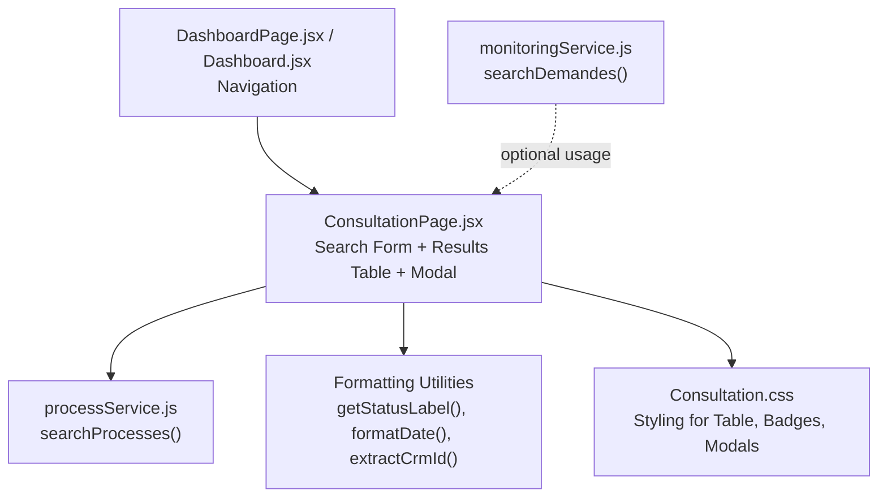
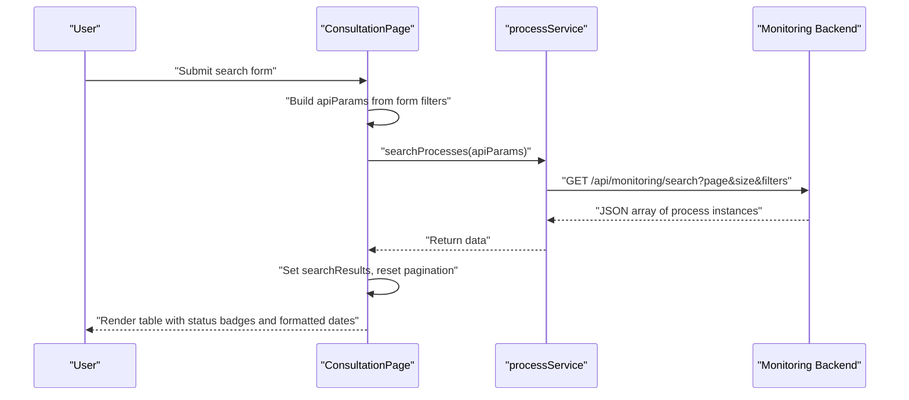
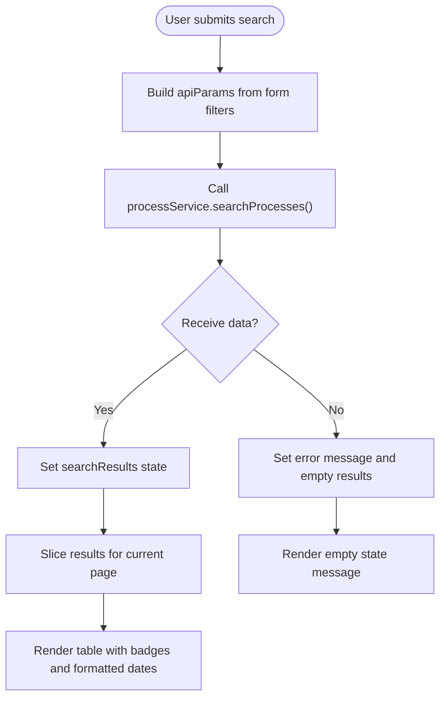
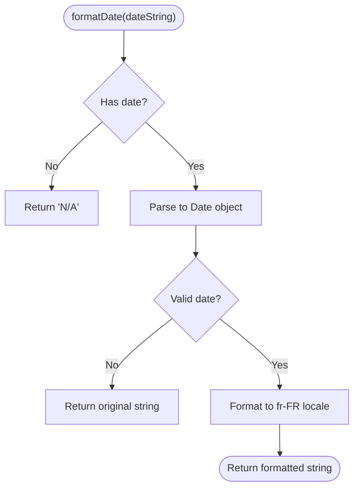
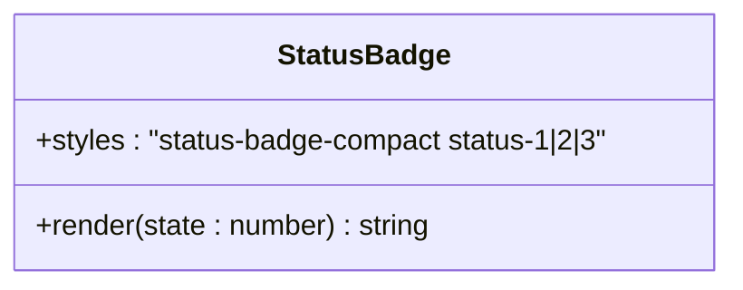
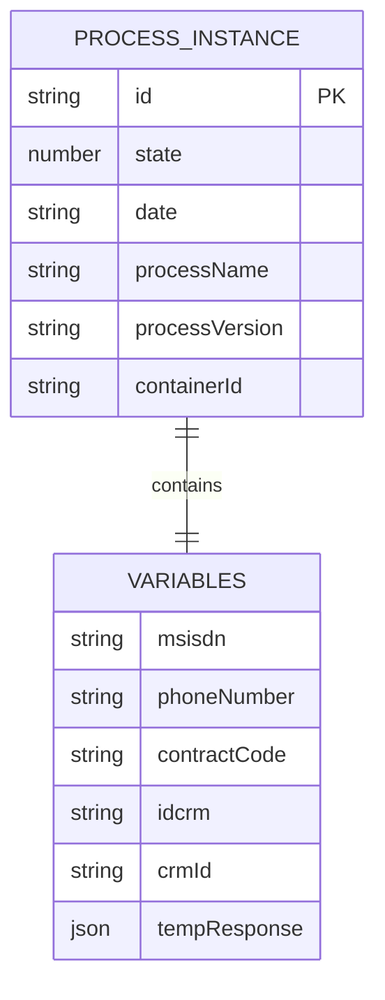
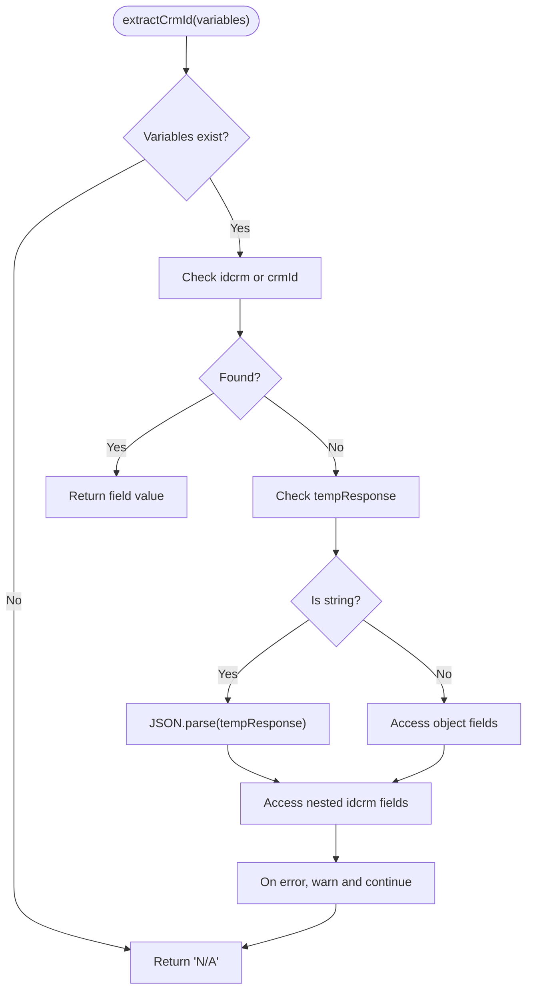
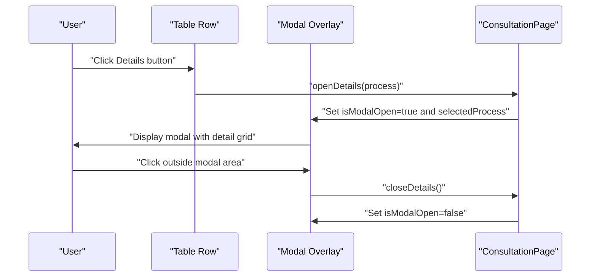
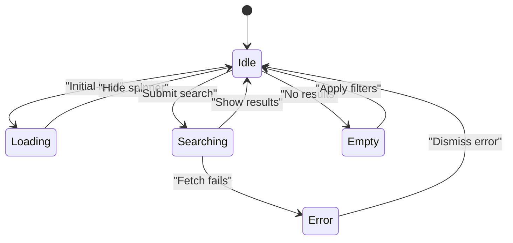
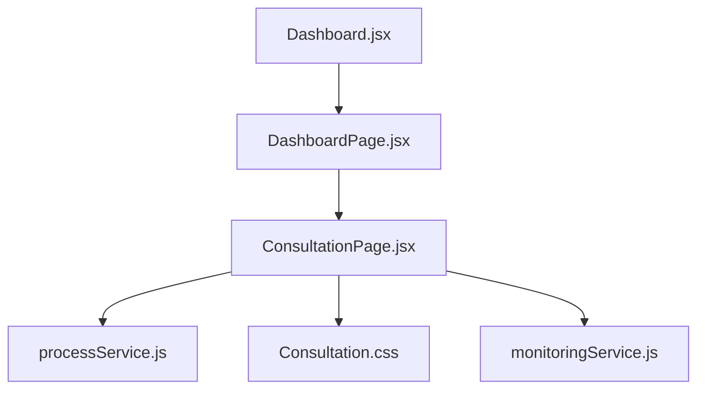

# Real-time Data Display

<cite>
**Referenced Files in This Document**
- [ConsultationPage.jsx](file://src/components/ConsultationPage.jsx)
- [Consultation.css](file://src/components/Consultation.css)
- [processService.js](file://src/services/processService.js)
- [monitoringService.js](file://src/services/monitoringService.js)
- [DashboardPage.jsx](file://src/pages/DashboardPage.jsx)
- [Dashboard.jsx](file://src/components/dashboard/Dashboard.jsx)
</cite>

## Table of Contents
1. [Introduction](#introduction)
2. [Project Structure](#project-structure)
3. [Core Components](#core-components)
4. [Architecture Overview](#architecture-overview)
5. [Detailed Component Analysis](#detailed-component-analysis)
6. [Dependency Analysis](#dependency-analysis)
7. [Performance Considerations](#performance-considerations)
8. [Troubleshooting Guide](#troubleshooting-guide)
9. [Conclusion](#conclusion)

## Introduction
This document provides comprehensive documentation for the real-time data display system in the process monitoring module. It focuses on the search results table implementation, data formatting functions, status badge rendering, process instance data structure, variable extraction utilities, date formatting functions, modal detail view, overlay handling, user interaction patterns, loading states, error messaging, and empty state handling. The system enables operators to monitor portability processes in real time with filtering, pagination, export capabilities, and detailed views.

## Project Structure
The real-time data display system spans several components and services:
- ConsultationPage: Main UI for displaying process instances, handling filters, pagination, exports, and modal details.
- processService: Encapsulates API interactions for retrieving process instances.
- monitoringService: Provides legacy search functionality for demandes with dynamic query parameters.
- DashboardPage and Dashboard: Navigation and routing to the consultation page.
- Consultation.css: Styles for the table, badges, modals, and responsive layouts.

**Diagram sources**
- [ConsultationPage.jsx:1-419](file://src/components/ConsultationPage.jsx#L1-L419)
- [processService.js:1-38](file://src/services/processService.js#L1-L38)
- [monitoringService.js:1-24](file://src/services/monitoringService.js#L1-L24)
- [Consultation.css:1-551](file://src/components/Consultation.css#L1-L551)
- [DashboardPage.jsx:1-51](file://src/pages/DashboardPage.jsx#L1-L51)
- [Dashboard.jsx:1-70](file://src/components/dashboard/Dashboard.jsx#L1-L70)

**Section sources**
- [ConsultationPage.jsx:1-419](file://src/components/ConsultationPage.jsx#L1-L419)
- [processService.js:1-38](file://src/services/processService.js#L1-L38)
- [monitoringService.js:1-24](file://src/services/monitoringService.js#L1-L24)
- [Consultation.css:1-551](file://src/components/Consultation.css#L1-L551)
- [DashboardPage.jsx:1-51](file://src/pages/DashboardPage.jsx#L1-L51)
- [Dashboard.jsx:1-70](file://src/components/dashboard/Dashboard.jsx#L1-L70)

## Core Components
- Search Results Table: Displays process instances with status badges, formatted dates, and CRM ID extraction. Supports pagination and export to CSV/PDF.
- Data Formatting Functions: Converts numeric status codes to human-readable labels, formats ISO dates to localized strings, and extracts CRM identifiers from nested variables.
- Status Badge Rendering: Renders compact status badges with distinct colors per state (en cours, terminé, annulé).
- Modal Detail View: Overlay modal showing detailed process information including variables and container metadata.
- Overlay Handling: Implements click-to-dismiss behavior and prevents event propagation inside the modal.
- User Interaction Patterns: Inline search form, refresh button, pagination controls, and export actions.
- Loading States: Spinner during initial load and disabled states during search operations.
- Error Messaging: Displays server connectivity errors and empty state messages.
- Empty State Handling: Shows a neutral message when no results match the current filters.

**Section sources**
- [ConsultationPage.jsx:1-419](file://src/components/ConsultationPage.jsx#L1-L419)
- [Consultation.css:184-208](file://src/components/Consultation.css#L184-L208)
- [Consultation.css:259-361](file://src/components/Consultation.css#L259-L361)

## Architecture Overview
The real-time data display follows a unidirectional data flow:
- UI captures user input via the search form.
- processService constructs API parameters and performs HTTP requests.
- ConsultationPage updates state with received data, applies pagination, and renders the table.
- Users can export data or open the modal for detailed inspection.

**Diagram sources**
- [ConsultationPage.jsx:34-70](file://src/components/ConsultationPage.jsx#L34-L70)
- [processService.js:4-37](file://src/services/processService.js#L4-L37)

## Detailed Component Analysis

### Search Results Table Implementation
- Filters: Process ID, CRM ID, Status, MSISDN, Phone Number, Contract Code, Start/End Dates.
- Pagination: Fixed items per page with navigation controls.
- Export Actions: CSV and PDF export using external libraries for PDF generation.
- Empty State: Single row spanning all columns indicating no data found.

**Diagram sources**
- [ConsultationPage.jsx:34-70](file://src/components/ConsultationPage.jsx#L34-L70)
- [ConsultationPage.jsx:295-337](file://src/components/ConsultationPage.jsx#L295-L337)

**Section sources**
- [ConsultationPage.jsx:240-293](file://src/components/ConsultationPage.jsx#L240-L293)
- [ConsultationPage.jsx:295-388](file://src/components/ConsultationPage.jsx#L295-L388)
- [Consultation.css:149-182](file://src/components/Consultation.css#L149-L182)

### Data Formatting Functions
- Status Label Mapping: Maps numeric state codes to localized labels.
- Date Formatting: Converts ISO date strings to localized French format (day/month/year, hours:minutes).
- CRM ID Extraction: Safely extracts CRM identifiers from variables, including nested structures and JSON-parsed responses.

**Diagram sources**
- [ConsultationPage.jsx:203-210](file://src/components/ConsultationPage.jsx#L203-L210)

**Section sources**
- [ConsultationPage.jsx:212-217](file://src/components/ConsultationPage.jsx#L212-L217)
- [ConsultationPage.jsx:203-210](file://src/components/ConsultationPage.jsx#L203-L210)
- [ConsultationPage.jsx:162-181](file://src/components/ConsultationPage.jsx#L162-L181)

### Status Badge Rendering
- Compact badges with state-specific colors.
- Applied to each row in the status column.

**Diagram sources**
- [Consultation.css:197-207](file://src/components/Consultation.css#L197-L207)
- [ConsultationPage.jsx:315-318](file://src/components/ConsultationPage.jsx#L315-L318)

**Section sources**
- [Consultation.css:197-207](file://src/components/Consultation.css#L197-L207)
- [ConsultationPage.jsx:315-318](file://src/components/ConsultationPage.jsx#L315-L318)

### Process Instance Data Structure
- Core fields: id, state, date, processName, processVersion, containerId.
- Variables: msisdn, phoneNumber, contractCode, and CRM identifiers.
- Pagination: Controlled client-side slicing of results.

**Diagram sources**
- [ConsultationPage.jsx:39-50](file://src/components/ConsultationPage.jsx#L39-L50)
- [ConsultationPage.jsx:162-181](file://src/components/ConsultationPage.jsx#L162-L181)

**Section sources**
- [ConsultationPage.jsx:39-50](file://src/components/ConsultationPage.jsx#L39-L50)
- [ConsultationPage.jsx:162-181](file://src/components/ConsultationPage.jsx#L162-L181)

### Variable Extraction Utilities
- extractCrmId handles multiple locations for CRM identifiers and safely parses JSON when present.

**Diagram sources**
- [ConsultationPage.jsx:162-181](file://src/components/ConsultationPage.jsx#L162-L181)

**Section sources**
- [ConsultationPage.jsx:162-181](file://src/components/ConsultationPage.jsx#L162-L181)

### Modal Detail View Implementation
- Overlay: Fullscreen semi-transparent backdrop enabling click-to-dismiss.
- Modal Content: Grid layout displaying key process attributes including CRM ID and formatted dates.
- Event Handling: Prevents clicks inside the modal from closing the overlay.

**Diagram sources**
- [ConsultationPage.jsx:193-201](file://src/components/ConsultationPage.jsx#L193-L201)
- [ConsultationPage.jsx:390-416](file://src/components/ConsultationPage.jsx#L390-L416)
- [Consultation.css:259-361](file://src/components/Consultation.css#L259-L361)

**Section sources**
- [ConsultationPage.jsx:390-416](file://src/components/ConsultationPage.jsx#L390-L416)
- [Consultation.css:259-361](file://src/components/Consultation.css#L259-L361)

### Overlay Handling and User Interaction Patterns
- Overlay behavior: Clicking the overlay closes the modal; clicks inside the modal do not propagate.
- Refresh button: Triggers a refetch of data with current filters.
- Pagination: Navigates between pages without losing filter context.
- Export buttons: Generate downloadable CSV/PDF reports.

**Section sources**
- [ConsultationPage.jsx:227-235](file://src/components/ConsultationPage.jsx#L227-L235)
- [ConsultationPage.jsx:344-387](file://src/components/ConsultationPage.jsx#L344-L387)
- [Consultation.css:259-361](file://src/components/Consultation.css#L259-L361)

### Loading States, Error Messaging, and Empty State Handling
- Initial Load: A brief loading state is shown while the dashboard initializes.
- During Search: Button states update to indicate ongoing operations.
- Error Messaging: Displays a user-friendly message when backend connectivity fails.
- Empty State: Neutral message when no results match the current filters.

**Diagram sources**
- [Dashboard.jsx:9-29](file://src/components/dashboard/Dashboard.jsx#L9-L29)
- [ConsultationPage.jsx:60-70](file://src/components/ConsultationPage.jsx#L60-L70)
- [ConsultationPage.jsx:297-334](file://src/components/ConsultationPage.jsx#L297-L334)

**Section sources**
- [Dashboard.jsx:9-29](file://src/components/dashboard/Dashboard.jsx#L9-L29)
- [ConsultationPage.jsx:60-70](file://src/components/ConsultationPage.jsx#L60-L70)
- [ConsultationPage.jsx:297-334](file://src/components/ConsultationPage.jsx#L297-L334)

## Dependency Analysis
- ConsultationPage depends on processService for data retrieval and on CSS for styling.
- processService builds URL parameters and performs fetch requests.
- monitoringService offers an alternative search endpoint for demandes with dynamic query construction.
- Navigation components route users to the consultation page.

**Diagram sources**
- [ConsultationPage.jsx:1-419](file://src/components/ConsultationPage.jsx#L1-L419)
- [processService.js:1-38](file://src/services/processService.js#L1-L38)
- [monitoringService.js:1-24](file://src/services/monitoringService.js#L1-L24)
- [DashboardPage.jsx:1-51](file://src/pages/DashboardPage.jsx#L1-L51)
- [Dashboard.jsx:1-70](file://src/components/dashboard/Dashboard.jsx#L1-L70)

**Section sources**
- [ConsultationPage.jsx:1-419](file://src/components/ConsultationPage.jsx#L1-L419)
- [processService.js:1-38](file://src/services/processService.js#L1-L38)
- [monitoringService.js:1-24](file://src/services/monitoringService.js#L1-L24)
- [DashboardPage.jsx:1-51](file://src/pages/DashboardPage.jsx#L1-L51)
- [Dashboard.jsx:1-70](file://src/components/dashboard/Dashboard.jsx#L1-L70)

## Performance Considerations
- Client-side pagination reduces backend load by limiting returned records per page.
- Export functions operate on the current dataset; large datasets may impact performance—consider server-side export for extensive queries.
- Date formatting and status mapping are lightweight operations; avoid unnecessary re-renders by keeping filter objects immutable.

## Troubleshooting Guide
- Backend Connectivity: If the monitoring backend is unreachable, an error message is displayed. Verify ports 8081/8089 are running.
- Empty Results: Adjust filters to broaden the search scope.
- Modal Not Closing: Ensure overlay click handlers are not blocked by parent containers; verify event propagation is prevented inside the modal.
- Date/Status Display Issues: Confirm date strings are valid ISO formats and state codes are within expected ranges.

**Section sources**
- [ConsultationPage.jsx:63-66](file://src/components/ConsultationPage.jsx#L63-L66)
- [ConsultationPage.jsx:390-416](file://src/components/ConsultationPage.jsx#L390-L416)

## Conclusion
The real-time data display system provides a robust, user-friendly interface for monitoring process instances. It combines efficient client-side pagination, flexible filtering, clear status indicators, and actionable exports. The modular design allows for easy maintenance and extension, while the modal detail view enhances transparency and operator productivity.