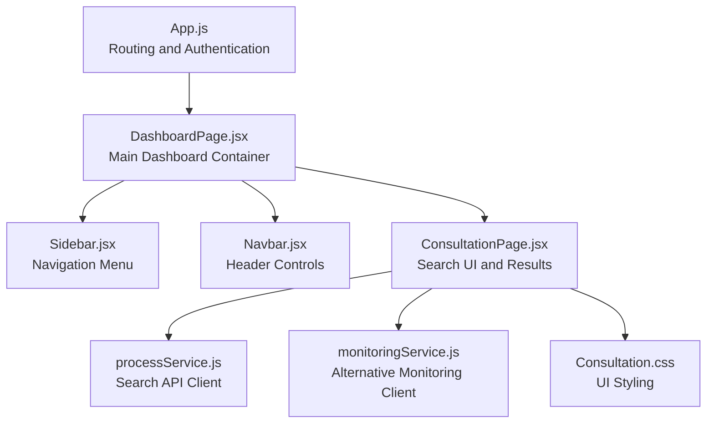
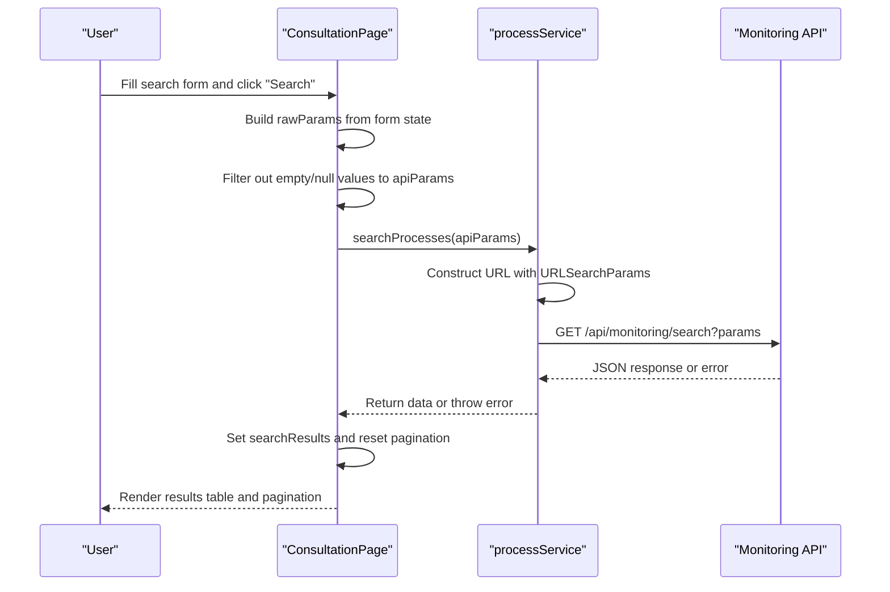
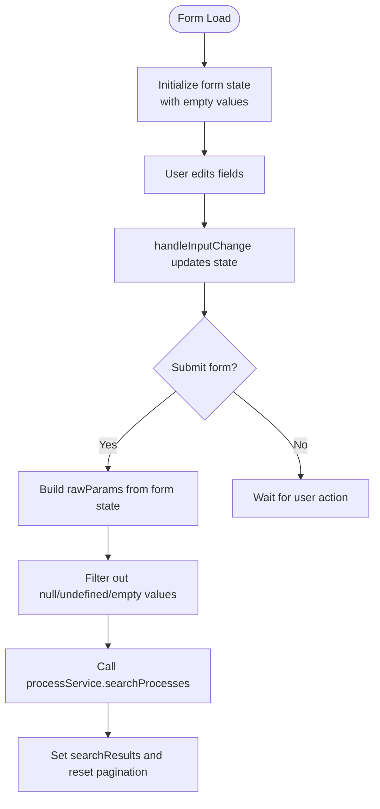
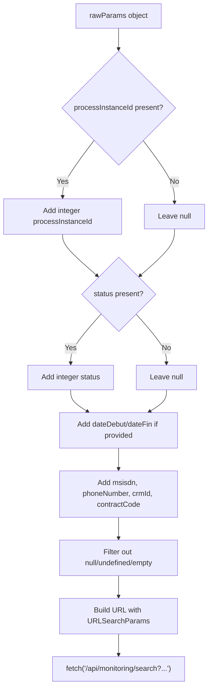
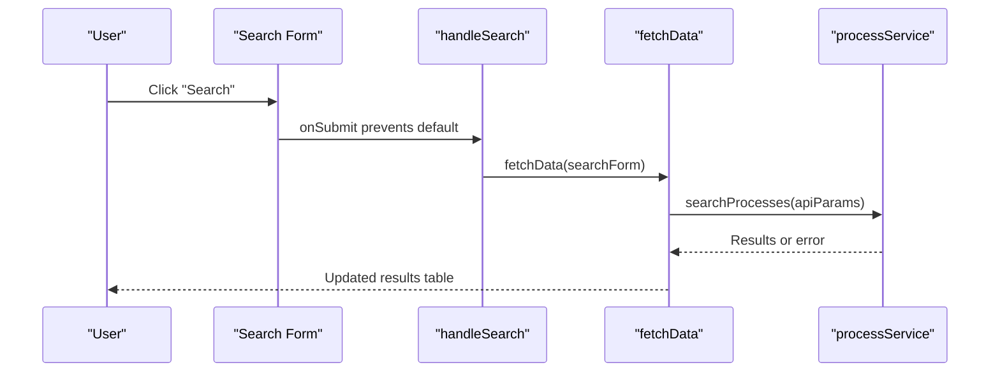
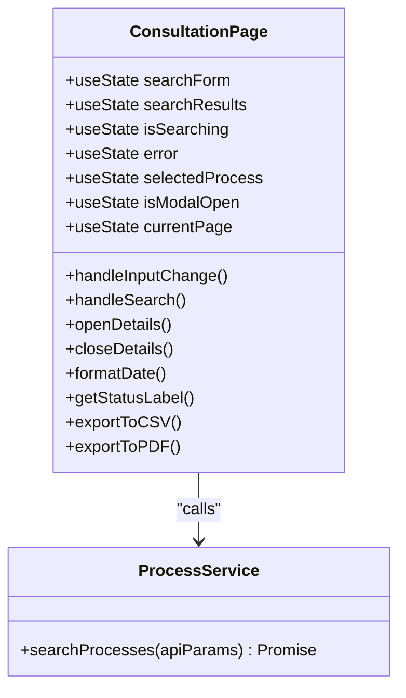
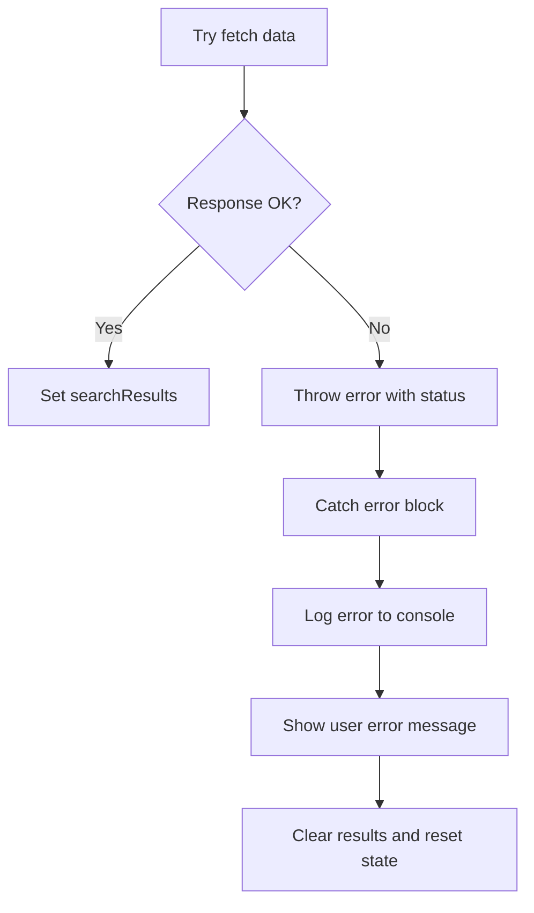
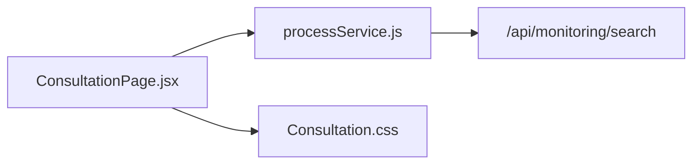

# Search and Filtering System

<cite>
**Referenced Files in This Document**
- [ConsultationPage.jsx](file://src/components/ConsultationPage.jsx)
- [Consultation.css](file://src/components/Consultation.css)
- [processService.js](file://src/services/processService.js)
- [monitoringService.js](file://src/services/monitoringService.js)
- [DashboardPage.jsx](file://src/pages/DashboardPage.jsx)
- [Navbar.jsx](file://src/components/layout/Navbar.jsx)
- [Sidebar.jsx](file://src/components/layout/Sidebar.jsx)
- [App.js](file://src/App.js)
</cite>

## Table of Contents
1. [Introduction](#introduction)
2. [Project Structure](#project-structure)
3. [Core Components](#core-components)
4. [Architecture Overview](#architecture-overview)
5. [Detailed Component Analysis](#detailed-component-analysis)
6. [Dependency Analysis](#dependency-analysis)
7. [Performance Considerations](#performance-considerations)
8. [Troubleshooting Guide](#troubleshooting-guide)
9. [Conclusion](#conclusion)

## Introduction
This document describes the process monitoring search and filtering system implemented in the frontend. It covers the multi-criteria search functionality (process ID, status, date range, MSISDN, phone number, CRM ID, and contract code), form state management, input validation, dynamic query parameter construction, UI components, user experience patterns, filter combination examples, result processing, error handling, search button functionality, form submission handling, and real-time search capabilities.

## Project Structure
The search and filtering system is centered around the Consultation page, which integrates with service modules for API communication and uses shared layout components for navigation and theming.

**Diagram sources**
- [App.js:1-74](file://src/App.js#L1-L74)
- [DashboardPage.jsx:1-51](file://src/pages/DashboardPage.jsx#L1-L51)
- [Sidebar.jsx:1-167](file://src/components/layout/Sidebar.jsx#L1-L167)
- [Navbar.jsx:1-124](file://src/components/layout/Navbar.jsx#L1-L124)
- [ConsultationPage.jsx:1-419](file://src/components/ConsultationPage.jsx#L1-L419)
- [processService.js:1-38](file://src/services/processService.js#L1-L38)
- [monitoringService.js:1-24](file://src/services/monitoringService.js#L1-L24)
- [Consultation.css:1-551](file://src/components/Consultation.css#L1-L551)

**Section sources**
- [App.js:1-74](file://src/App.js#L1-L74)
- [DashboardPage.jsx:1-51](file://src/pages/DashboardPage.jsx#L1-L51)
- [ConsultationPage.jsx:1-419](file://src/components/ConsultationPage.jsx#L1-L419)

## Core Components
- ConsultationPage: Implements the search form, state management, result rendering, pagination, and export functionality.
- processService: Builds and executes search queries with dynamic query parameters and handles HTTP errors.
- monitoringService: Alternative client supporting additional filters and URL parameter construction.
- Layout components: Navbar and Sidebar provide navigation and theming context for the search interface.

Key responsibilities:
- Form state management for all filter fields
- Dynamic query parameter construction excluding empty/null values
- Real-time search via form submission and refresh actions
- Result pagination and export to CSV/PDF
- Error handling and user feedback messaging

**Section sources**
- [ConsultationPage.jsx:7-20](file://src/components/ConsultationPage.jsx#L7-L20)
- [processService.js:3-38](file://src/services/processService.js#L3-L38)
- [monitoringService.js:5-24](file://src/services/monitoringService.js#L5-L24)

## Architecture Overview
The system follows a layered architecture:
- Presentation Layer: ConsultationPage manages UI state and user interactions.
- Service Layer: processService and monitoringService encapsulate API communication.
- Data Layer: Backend APIs provide process monitoring data.

**Diagram sources**
- [ConsultationPage.jsx:34-70](file://src/components/ConsultationPage.jsx#L34-L70)
- [processService.js:4-37](file://src/services/processService.js#L4-L37)

## Detailed Component Analysis

### Search Form UI and State Management
The search form captures seven filter criteria:
- Process ID (integer)
- Status (enum: 1=En cours, 2=Terminé, 3=Annulé)
- Date Range (startDate, endDate)
- MSISDN (string)
- Phone Number (string)
- CRM ID (string)
- Contract Code (string)

State management:
- Form state initialized with empty strings for all fields.
- Controlled inputs update state on change.
- Submission triggers search execution.

**Diagram sources**
- [ConsultationPage.jsx:8-17](file://src/components/ConsultationPage.jsx#L8-L17)
- [ConsultationPage.jsx:183-191](file://src/components/ConsultationPage.jsx#L183-L191)
- [ConsultationPage.jsx:39-58](file://src/components/ConsultationPage.jsx#L39-L58)

**Section sources**
- [ConsultationPage.jsx:8-17](file://src/components/ConsultationPage.jsx#L8-L17)
- [ConsultationPage.jsx:240-293](file://src/components/ConsultationPage.jsx#L240-L293)
- [Consultation.css:44-131](file://src/components/Consultation.css#L44-L131)

### Dynamic Query Parameter Construction
The system constructs query parameters dynamically:
- Converts numeric fields to integers when present.
- Excludes null, undefined, or empty string values.
- Uses URLSearchParams for robust encoding and avoids duplicates.

**Diagram sources**
- [ConsultationPage.jsx:39-58](file://src/components/ConsultationPage.jsx#L39-L58)
- [processService.js:4-23](file://src/services/processService.js#L4-L23)

**Section sources**
- [ConsultationPage.jsx:39-58](file://src/components/ConsultationPage.jsx#L39-L58)
- [processService.js:4-23](file://src/services/processService.js#L4-L23)

### Search Button Functionality and Form Submission
- The search form uses onSubmit to prevent default submission and trigger search.
- The search button is disabled during ongoing searches.
- A separate refresh button allows re-execution with current filters.

**Diagram sources**
- [ConsultationPage.jsx:188-191](file://src/components/ConsultationPage.jsx#L188-L191)
- [ConsultationPage.jsx:34-70](file://src/components/ConsultationPage.jsx#L34-L70)
- [processService.js:4-37](file://src/services/processService.js#L4-L37)

**Section sources**
- [ConsultationPage.jsx:188-191](file://src/components/ConsultationPage.jsx#L188-L191)
- [ConsultationPage.jsx:227-235](file://src/components/ConsultationPage.jsx#L227-L235)

### Real-Time Search Capabilities
Real-time-like behavior is achieved by:
- Immediate state updates on input changes.
- Search triggered on form submit or refresh button press.
- Pagination resets to the first page after each search.

**Section sources**
- [ConsultationPage.jsx:183-191](file://src/components/ConsultationPage.jsx#L183-L191)
- [ConsultationPage.jsx:37-38](file://src/components/ConsultationPage.jsx#L37-L38)

### Search Result Processing and Display
- Results are paginated (10 items per page).
- Status labels mapped to localized values.
- Date formatting applied consistently.
- Details modal displays extended process information, including CRM ID extraction logic.

**Diagram sources**
- [ConsultationPage.jsx:7-20](file://src/components/ConsultationPage.jsx#L7-L20)
- [ConsultationPage.jsx:183-217](file://src/components/ConsultationPage.jsx#L183-L217)
- [processService.js:3-38](file://src/services/processService.js#L3-L38)

**Section sources**
- [ConsultationPage.jsx:295-388](file://src/components/ConsultationPage.jsx#L295-L388)
- [ConsultationPage.jsx:162-181](file://src/components/ConsultationPage.jsx#L162-L181)

### Error Handling Strategies
- Network errors from the monitoring API surface a user-friendly message.
- Empty results display a neutral message.
- Disabled states prevent concurrent requests.
- Console logging aids debugging.

**Diagram sources**
- [processService.js:28-36](file://src/services/processService.js#L28-L36)
- [ConsultationPage.jsx:60-70](file://src/components/ConsultationPage.jsx#L60-L70)

**Section sources**
- [processService.js:28-36](file://src/services/processService.js#L28-L36)
- [ConsultationPage.jsx:60-70](file://src/components/ConsultationPage.jsx#L60-L70)

### Filter Combinations and Examples
Common filter combinations supported by the system:
- Single criterion: e.g., Process ID only
- Multi-criterion: e.g., Status + Date Range + MSISDN
- Full range: All seven filters combined
- No filters: Returns default page size of results

Behavior:
- Only non-empty values are included in the query.
- Numeric fields are converted to integers when present.
- Date range filters accept ISO date strings.

**Section sources**
- [ConsultationPage.jsx:39-58](file://src/components/ConsultationPage.jsx#L39-L58)
- [processService.js:14-23](file://src/services/processService.js#L14-L23)

### Export Functionality
- CSV export: Generates a downloadable CSV file with selected columns.
- PDF export: Creates a landscape-oriented PDF using jsPDF and autotable.

**Section sources**
- [ConsultationPage.jsx:84-160](file://src/components/ConsultationPage.jsx#L84-L160)

## Dependency Analysis
The ConsultationPage depends on processService for API interactions and uses CSS for styling. The service layer builds URL-encoded parameters and handles HTTP responses.

**Diagram sources**
- [ConsultationPage.jsx:1-6](file://src/components/ConsultationPage.jsx#L1-L6)
- [processService.js:1-38](file://src/services/processService.js#L1-L38)

**Section sources**
- [ConsultationPage.jsx:1-6](file://src/components/ConsultationPage.jsx#L1-L6)
- [processService.js:1-38](file://src/services/processService.js#L1-L38)

## Performance Considerations
- Default page size is set to 1000 to minimize pagination overhead while keeping client-side slicing efficient.
- Client-side pagination slices arrays; consider server-side pagination for very large datasets.
- URLSearchParams ensures proper encoding and avoids redundant parameters.
- Disable states prevent multiple concurrent requests.

## Troubleshooting Guide
Common issues and resolutions:
- Ports 8081/8089 unreachable: The service throws a descriptive error indicating backend availability.
- Empty results: Verify filter values and ensure at least one criterion is set.
- Date format errors: Ensure date inputs conform to ISO date strings.
- Numeric conversion warnings: Confirm numeric fields contain valid integers.

Actions:
- Check browser console for thrown errors.
- Validate network tab for API responses.
- Use the refresh button to retry with current filters.

**Section sources**
- [processService.js:30-34](file://src/services/processService.js#L30-L34)
- [ConsultationPage.jsx:64-66](file://src/components/ConsultationPage.jsx#L64-L66)

## Conclusion
The search and filtering system provides a robust, user-friendly interface for querying process monitoring data. It supports multi-criteria filtering, dynamic parameter construction, responsive UI, and export capabilities. The modular design separates concerns between presentation, service logic, and styling, enabling maintainability and extensibility.