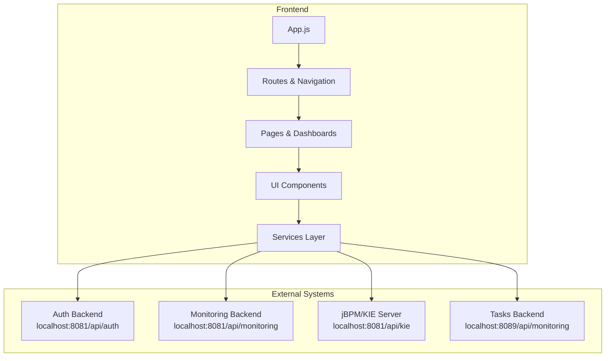
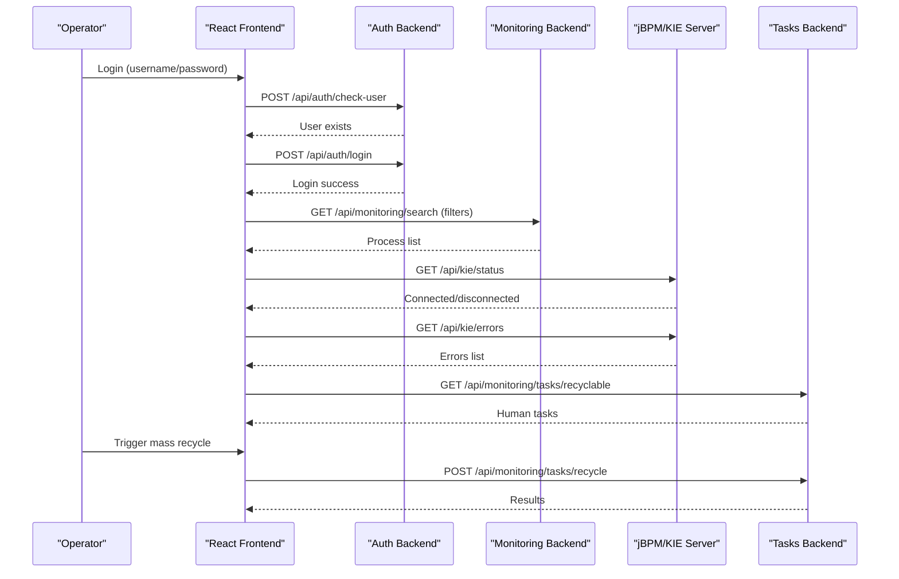
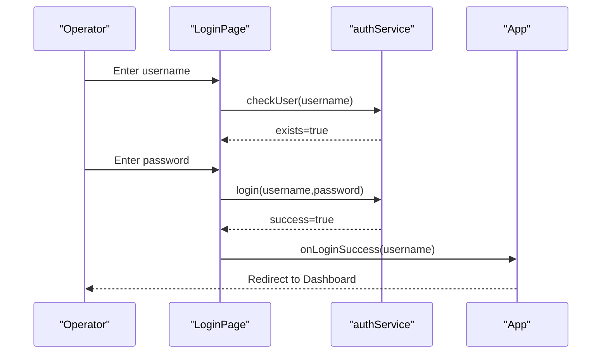
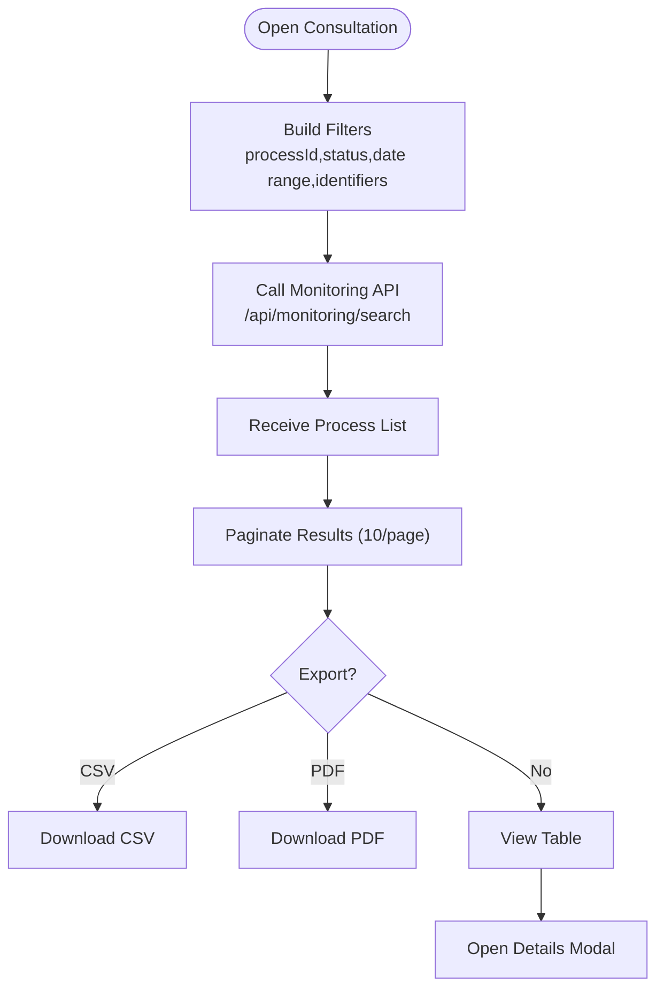
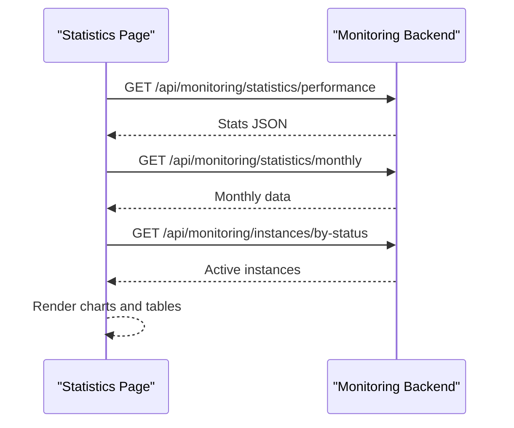
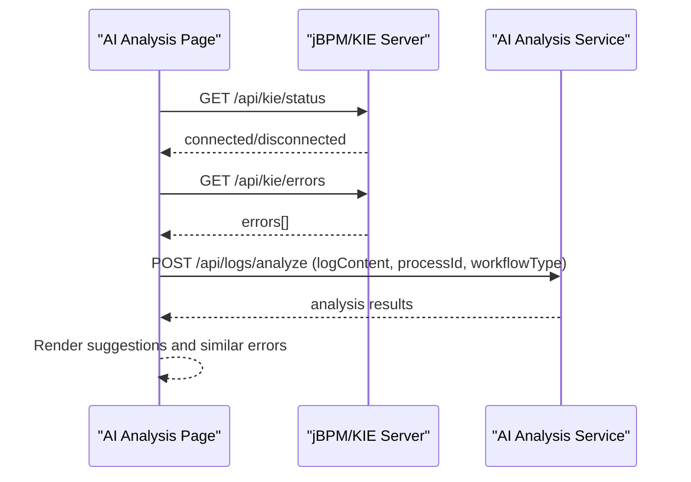
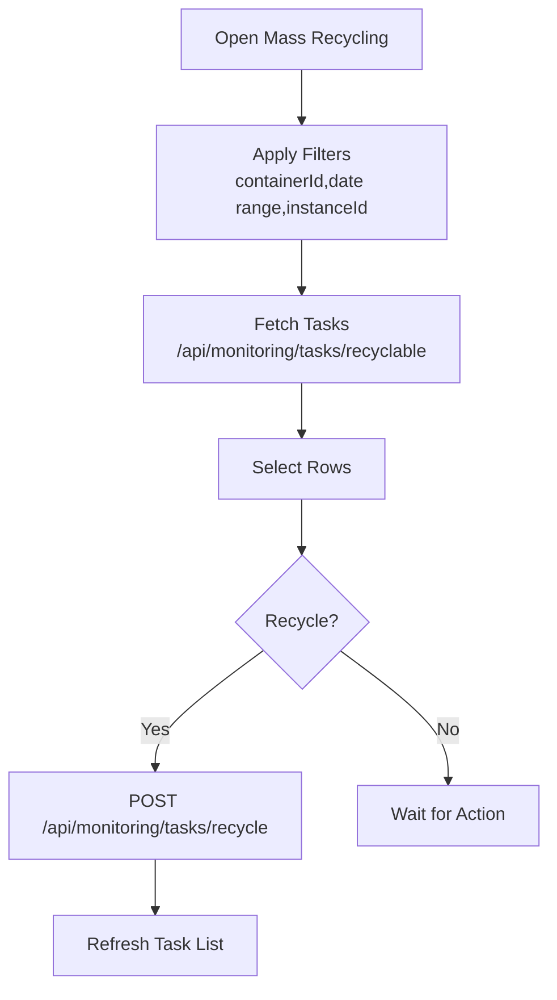
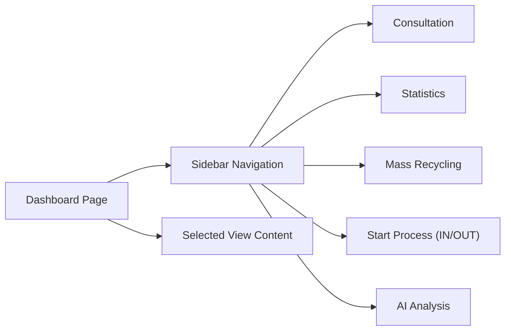
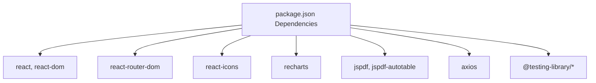

# Project Overview

<cite>
**Referenced Files in This Document**
- [README.md](file://README.md)
- [package.json](file://package.json)
- [App.js](file://src/App.js)
- [DashboardPage.jsx](file://src/pages/DashboardPage.jsx)
- [Dashboard.jsx](file://src/components/dashboard/Dashboard.jsx)
- [Sidebar.jsx](file://src/components/layout/Sidebar.jsx)
- [Navbar.jsx](file://src/components/layout/Navbar.jsx)
- [LoginPage.jsx](file://src/components/login/LoginPage.jsx)
- [authService.js](file://src/services/authService.js)
- [ConsultationPage.jsx](file://src/components/ConsultationPage.jsx)
- [processService.js](file://src/services/processService.js)
- [monitoringService.js](file://src/services/monitoringService.js)
- [StatistiquesPortabilite.jsx](file://src/components/StatistiquesPortabilite.jsx)
- [RecyclageMassePage.jsx](file://src/components/RecyclageMassePage.jsx)
- [AiAnalysisPage.jsx](file://src/components/AiAnalysisPage.jsx)
- [aiAnalysisService.js](file://src/services/aiAnalysisService.js)
</cite>

## Table of Contents
1. [Introduction](#introduction)
2. [Project Structure](#project-structure)
3. [Core Components](#core-components)
4. [Architecture Overview](#architecture-overview)
5. [Detailed Component Analysis](#detailed-component-analysis)
6. [Dependency Analysis](#dependency-analysis)
7. [Performance Considerations](#performance-considerations)
8. [Troubleshooting Guide](#troubleshooting-guide)
9. [Conclusion](#conclusion)

## Introduction
SmartPorta is a telecommunications portability monitoring and management application designed to streamline the oversight of mobile number portability processes. It targets operators, administrators, and analysts who need real-time visibility into ongoing portability workflows, actionable insights from AI-driven error analysis, statistical reporting, and operational tools for mass task recycling.

The platform integrates with jBPM/KIE Server to monitor and manage workflow processes, enabling:
- Real-time process monitoring and drill-down into active instances
- AI-powered error analysis and remediation suggestions
- Statistical dashboards for performance and monthly trends
- Mass recycling operations for human tasks awaiting resolution

## Project Structure
SmartPorta is a React-based frontend application bootstrapped with Create React App. It organizes features by domain (authentication, monitoring, analytics, AI analysis, and mass recycling) and exposes a modular routing system to deliver a cohesive operator experience.

**Diagram sources**
- [App.js:33-71](file://src/App.js#L33-L71)
- [DashboardPage.jsx:10-50](file://src/pages/DashboardPage.jsx#L10-L50)
- [authService.js:1-19](file://src/services/authService.js#L1-L19)
- [processService.js:1-38](file://src/services/processService.js#L1-L38)
- [monitoringService.js:1-24](file://src/services/monitoringService.js#L1-L24)
- [aiAnalysisService.js:1-37](file://src/services/aiAnalysisService.js#L1-L37)

**Section sources**
- [README.md:1-71](file://README.md#L1-L71)
- [package.json:1-49](file://package.json#L1-L49)
- [App.js:33-71](file://src/App.js#L33-L71)

## Core Components
- Authentication and Access Control
  - Multi-step login flow with username validation and password verification against a dedicated authentication endpoint.
  - Avatar selection based on username to personalize the operator experience.
- Dashboard and Navigation
  - Centralized navigation sidebar offering quick access to Consultation, Statistics, Mass Recycling, Start Process (IN/OUT), and AI Analysis.
  - Dynamic content rendering based on selected menu items.
- Monitoring and Search
  - Process search with flexible filters (instance ID, status, MSISDN, phone number, CRM ID, contract code, date range).
  - Export to CSV/PDF for audit and reporting.
- Statistical Reporting
  - Performance KPIs, pie charts per direction (IN/OUT), monthly trends, and drill-down into active instances with CSV export.
- AI-Powered Error Analysis
  - Live connection to jBPM/KIE Server for error retrieval and analysis.
  - Manual log analysis submission with structured suggestions and similarity insights.
- Mass Recycling Operations
  - Bulk selection and recycling of human tasks with progress feedback and post-operation refresh.

**Section sources**
- [LoginPage.jsx:9-94](file://src/components/login/LoginPage.jsx#L9-L94)
- [authService.js:1-19](file://src/services/authService.js#L1-L19)
- [Dashboard.jsx:8-70](file://src/components/dashboard/Dashboard.jsx#L8-L70)
- [Sidebar.jsx:4-167](file://src/components/layout/Sidebar.jsx#L4-L167)
- [ConsultationPage.jsx:7-419](file://src/components/ConsultationPage.jsx#L7-L419)
- [processService.js:1-38](file://src/services/processService.js#L1-L38)
- [monitoringService.js:1-24](file://src/services/monitoringService.js#L1-L24)
- [StatistiquesPortabilite.jsx:12-301](file://src/components/StatistiquesPortabilite.jsx#L12-L301)
- [AiAnalysisPage.jsx:363-860](file://src/components/AiAnalysisPage.jsx#L363-L860)
- [aiAnalysisService.js:1-37](file://src/services/aiAnalysisService.js#L1-L37)
- [RecyclageMassePage.jsx:6-382](file://src/components/RecyclageMassePage.jsx#L6-L382)

## Architecture Overview
SmartPorta’s runtime architecture connects the React frontend to multiple backend services:
- Authentication service for secure access
- Monitoring service for process search and statistics
- jBPM/KIE server for workflow status, errors, and AI analysis
- Tasks service for mass recycling operations

**Diagram sources**
- [authService.js:1-19](file://src/services/authService.js#L1-L19)
- [processService.js:1-38](file://src/services/processService.js#L1-L38)
- [monitoringService.js:1-24](file://src/services/monitoringService.js#L1-L24)
- [aiAnalysisService.js:1-37](file://src/services/aiAnalysisService.js#L1-L37)
- [RecyclageMassePage.jsx:69-155](file://src/components/RecyclageMassePage.jsx#L69-L155)

## Detailed Component Analysis

### Authentication and Access Control
- Multi-step login validates the username against the backend and transitions to password entry.
- Successful login triggers a dashboard redirect and stores session state for downstream routes.

**Diagram sources**
- [LoginPage.jsx:16-51](file://src/components/login/LoginPage.jsx#L16-L51)
- [authService.js:3-18](file://src/services/authService.js#L3-L18)
- [App.js:15-31](file://src/App.js#L15-L31)

**Section sources**
- [LoginPage.jsx:9-94](file://src/components/login/LoginPage.jsx#L9-L94)
- [authService.js:1-19](file://src/services/authService.js#L1-L19)
- [App.js:9-31](file://src/App.js#L9-L31)

### Process Monitoring and Search
- Flexible search across process instances with pagination and export capabilities.
- Rich filtering by status, dates, identifiers, and network attributes.

**Diagram sources**
- [ConsultationPage.jsx:34-70](file://src/components/ConsultationPage.jsx#L34-L70)
- [processService.js:4-37](file://src/services/processService.js#L4-L37)

**Section sources**
- [ConsultationPage.jsx:7-419](file://src/components/ConsultationPage.jsx#L7-L419)
- [processService.js:1-38](file://src/services/processService.js#L1-L38)
- [monitoringService.js:5-23](file://src/services/monitoringService.js#L5-L23)

### Statistical Reporting
- Aggregates performance metrics and visualizes distribution across statuses for IN/OUT directions.
- Provides drill-down into active instances and exports to CSV.

**Diagram sources**
- [StatistiquesPortabilite.jsx:28-63](file://src/components/StatistiquesPortabilite.jsx#L28-L63)

**Section sources**
- [StatistiquesPortabilite.jsx:12-301](file://src/components/StatistiquesPortabilite.jsx#L12-L301)

### AI-Powered Error Analysis
- Connects to jBPM/KIE Server to fetch live errors and analyze them via AI.
- Supports manual log analysis submission and generates structured suggestions and similar error references.

**Diagram sources**
- [AiAnalysisPage.jsx:382-449](file://src/components/AiAnalysisPage.jsx#L382-L449)
- [aiAnalysisService.js:7-14](file://src/services/aiAnalysisService.js#L7-L14)

**Section sources**
- [AiAnalysisPage.jsx:363-860](file://src/components/AiAnalysisPage.jsx#L363-L860)
- [aiAnalysisService.js:1-37](file://src/services/aiAnalysisService.js#L1-L37)

### Mass Recycling Operations
- Searches recyclable human tasks filtered by container, date range, and process instance.
- Allows bulk selection and recycling with immediate feedback and refresh.

**Diagram sources**
- [RecyclageMassePage.jsx:47-86](file://src/components/RecyclageMassePage.jsx#L47-L86)
- [RecyclageMassePage.jsx:119-155](file://src/components/RecyclageMassePage.jsx#L119-L155)

**Section sources**
- [RecyclageMassePage.jsx:6-382](file://src/components/RecyclageMassePage.jsx#L6-L382)

### Navigation and Dashboard
- Sidebar-based navigation with collapsible submenus for Start Process (IN/OUT).
- Dashboard composes multiple views: Consultation, Statistics, Mass Recycling, Start Process, and AI Analysis.

**Diagram sources**
- [Sidebar.jsx:4-167](file://src/components/layout/Sidebar.jsx#L4-L167)
- [DashboardPage.jsx:10-50](file://src/pages/DashboardPage.jsx#L10-L50)

**Section sources**
- [Sidebar.jsx:4-167](file://src/components/layout/Sidebar.jsx#L4-L167)
- [Dashboard.jsx:8-70](file://src/components/dashboard/Dashboard.jsx#L8-L70)
- [DashboardPage.jsx:10-50](file://src/pages/DashboardPage.jsx#L10-L50)

## Dependency Analysis
SmartPorta’s frontend depends on:
- React ecosystem (router, icons, charts, PDF generation)
- Axios for HTTP requests
- Localhost endpoints for authentication, monitoring, jBPM/KIE, and tasks

**Diagram sources**
- [package.json:5-22](file://package.json#L5-L22)

**Section sources**
- [package.json:1-49](file://package.json#L1-L49)

## Performance Considerations
- Pagination reduces payload sizes for process lists and active instances, improving responsiveness.
- Export operations (CSV/PDF) are client-side and optimized for readability; large datasets may benefit from server-side generation.
- AI analysis results are cached per error ID to avoid redundant calls during a session.
- Network-bound operations (KIE status, task fetching) should be monitored for latency; consider retry/backoff strategies for transient failures.

## Troubleshooting Guide
Common issues and resolutions:
- Authentication failures
  - Verify backend availability on the configured port and that credentials are correct.
  - Check network connectivity and CORS settings if applicable.
- Monitoring API errors
  - Confirm the monitoring backend is reachable and serving the search endpoint with the expected parameters.
  - Review query parameter construction and default values.
- jBPM/KIE Server connectivity
  - Ensure the KIE server is running and accessible; the AI page checks status and lists containers.
  - Validate error endpoints and analyze-error route permissions.
- Mass recycling failures
  - Confirm selected task IDs are valid and the recycle endpoint returns success indicators.
  - Refresh the task list after recycling to reflect updated statuses.

**Section sources**
- [processService.js:25-37](file://src/services/processService.js#L25-L37)
- [monitoringService.js:18-23](file://src/services/monitoringService.js#L18-L23)
- [AiAnalysisPage.jsx:382-408](file://src/components/AiAnalysisPage.jsx#L382-L408)
- [RecyclageMassePage.jsx:119-155](file://src/components/RecyclageMassePage.jsx#L119-L155)

## Conclusion
SmartPorta delivers a comprehensive solution for monitoring and managing mobile number portability workflows. Its integration with jBPM/KIE Server enables real-time visibility and intelligent error remediation, while its statistical and operational tools support efficient day-to-day management. The modular React architecture ensures maintainability and extensibility for future enhancements.