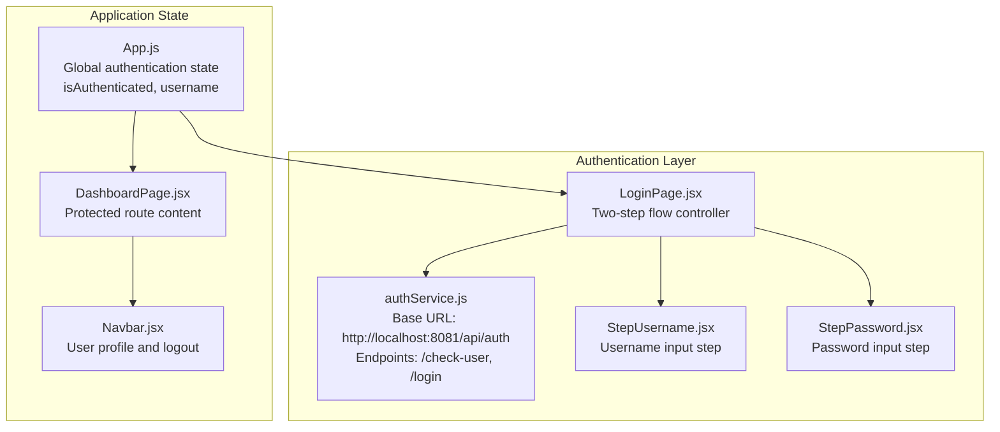
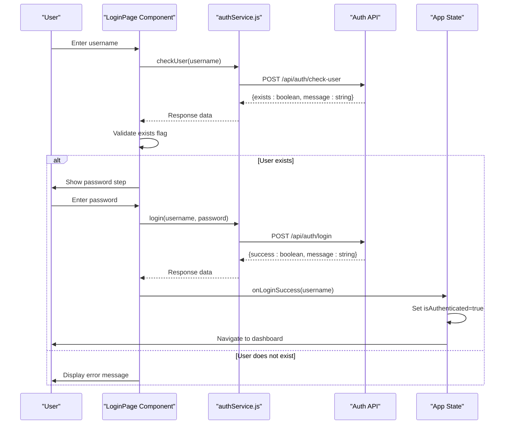
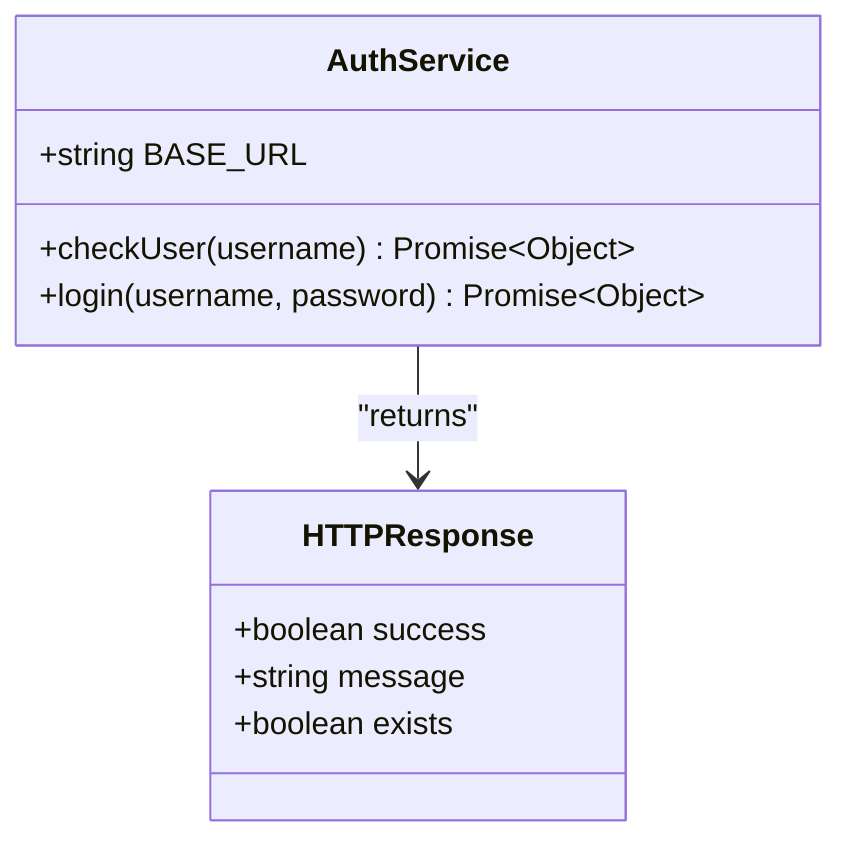
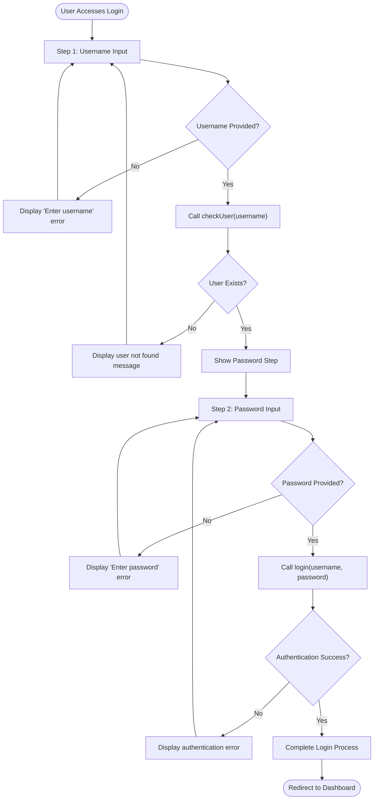
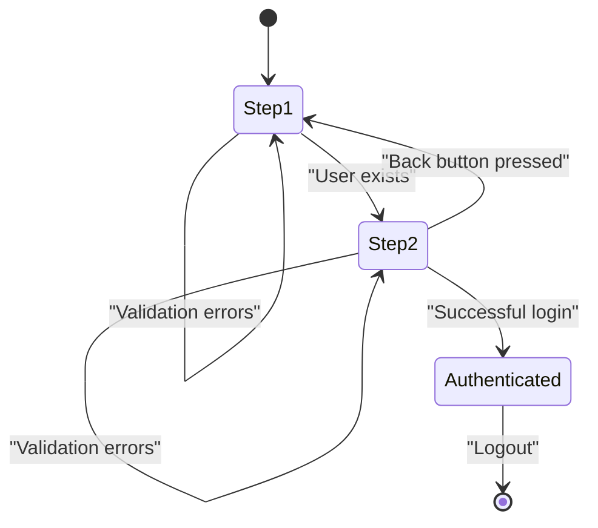
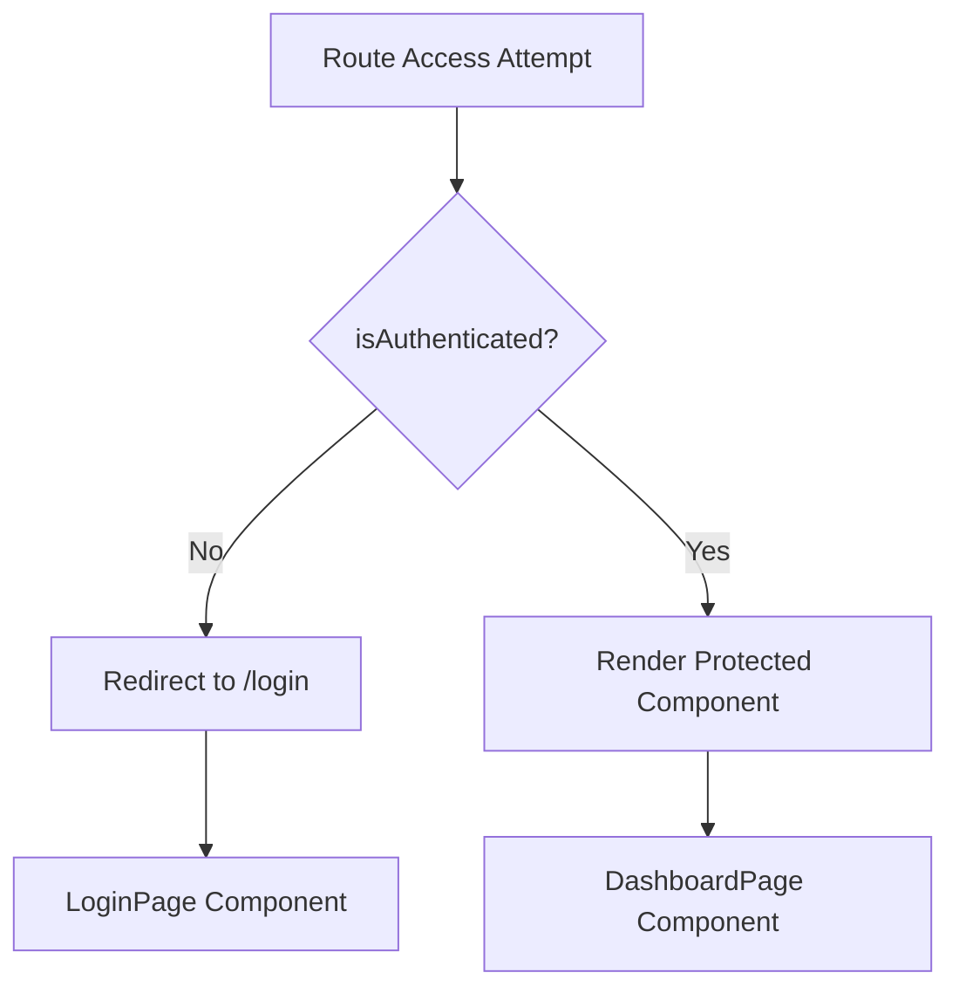
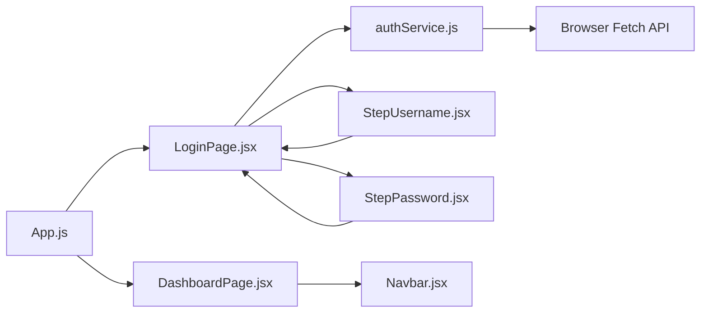
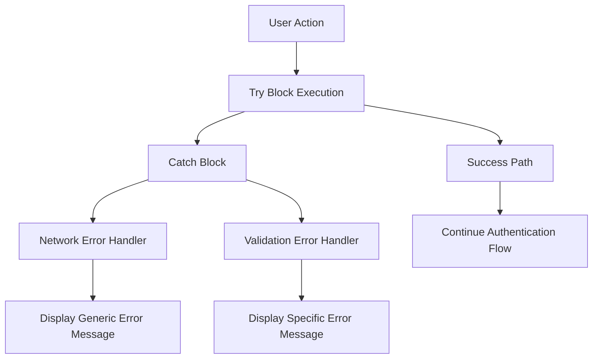
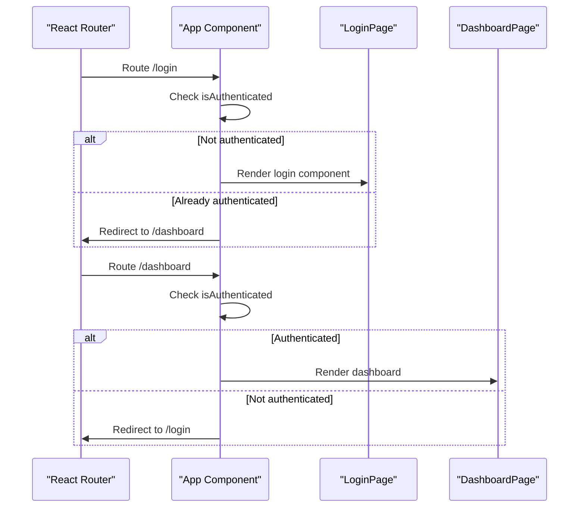

# Authentication Service

<cite>
**Referenced Files in This Document**
- [authService.js](file://src/services/authService.js)
- [LoginPage.jsx](file://src/components/login/LoginPage.jsx)
- [StepUsername.jsx](file://src/components/login/StepUsername.jsx)
- [StepPassword.jsx](file://src/components/login/StepPassword.jsx)
- [App.js](file://src/App.js)
- [Navbar.jsx](file://src/components/layout/Navbar.jsx)
- [DashboardPage.jsx](file://src/pages/DashboardPage.jsx)
- [package.json](file://package.json)
</cite>

## Table of Contents
1. [Introduction](#introduction)
2. [Project Structure](#project-structure)
3. [Core Components](#core-components)
4. [Architecture Overview](#architecture-overview)
5. [Detailed Component Analysis](#detailed-component-analysis)
6. [Dependency Analysis](#dependency-analysis)
7. [Performance Considerations](#performance-considerations)
8. [Troubleshooting Guide](#troubleshooting-guide)
9. [Security Considerations](#security-considerations)
10. [Integration Examples](#integration-examples)
11. [Conclusion](#conclusion)

## Introduction
This document provides comprehensive documentation for the authentication service layer of the monitoring front-end application. It covers the authentication API endpoints, HTTP request patterns, response handling, the two-step authentication flow, user validation processes, and token management. It also includes error handling strategies, integration examples with React state management, and security considerations.

## Project Structure
The authentication service layer is organized around a dedicated service module and login components that orchestrate the two-step authentication flow. The service communicates with a backend API using HTTP POST requests with JSON payloads.



**Diagram sources**
- [authService.js:1-19](file://src/services/authService.js#L1-L19)
- [LoginPage.jsx:1-94](file://src/components/login/LoginPage.jsx#L1-L94)
- [App.js:1-74](file://src/App.js#L1-L74)

**Section sources**
- [authService.js:1-19](file://src/services/authService.js#L1-L19)
- [LoginPage.jsx:1-94](file://src/components/login/LoginPage.jsx#L1-L94)
- [App.js:1-74](file://src/App.js#L1-L74)

## Core Components
The authentication service layer consists of three primary components:

### Authentication Service Module
The service module defines the base URL and exports two asynchronous functions for authentication operations:
- `checkUser(username)`: Validates user existence via POST request to `/api/auth/check-user`
- `login(username, password)`: Authenticates users via POST request to `/api/auth/login`

Both functions use JSON content-type headers and serialize request bodies containing username and password fields.

### Login Page Component
The login page implements a two-step authentication flow:
- Step 1: Username validation using the checkUser endpoint
- Step 2: Password submission using the login endpoint

The component manages local state for step progression, user credentials, error messages, and avatar selection based on username validation.

### Step Components
- StepUsername: Handles username input with validation and Enter key support
- StepPassword: Manages password input, visibility toggle, remember-me option, and form submission

**Section sources**
- [authService.js:1-19](file://src/services/authService.js#L1-L19)
- [LoginPage.jsx:9-57](file://src/components/login/LoginPage.jsx#L9-L57)
- [StepUsername.jsx:1-23](file://src/components/login/StepUsername.jsx#L1-L23)
- [StepPassword.jsx:1-57](file://src/components/login/StepPassword.jsx#L1-L57)

## Architecture Overview
The authentication architecture follows a client-side service pattern with React component orchestration and centralized state management.



**Diagram sources**
- [LoginPage.jsx:16-51](file://src/components/login/LoginPage.jsx#L16-L51)
- [authService.js:3-18](file://src/services/authService.js#L3-L18)
- [App.js:15-24](file://src/App.js#L15-L24)

## Detailed Component Analysis

### Authentication Service Implementation
The authentication service implements a straightforward HTTP client with JSON serialization:



**Diagram sources**
- [authService.js:1-19](file://src/services/authService.js#L1-L19)

Key implementation characteristics:
- Base URL configuration: `http://localhost:8081/api/auth`
- Request method: POST for both endpoints
- Content-Type header: application/json
- Payload formatting: JSON stringification of username/password objects
- Response handling: JSON parsing with automatic deserialization

**Section sources**
- [authService.js:1-19](file://src/services/authService.js#L1-L19)

### Two-Step Authentication Flow
The login page orchestrates a progressive disclosure authentication flow:



**Diagram sources**
- [LoginPage.jsx:16-51](file://src/components/login/LoginPage.jsx#L16-L51)

**Section sources**
- [LoginPage.jsx:9-57](file://src/components/login/LoginPage.jsx#L9-L57)

### Component State Management
The authentication flow integrates with React's useState hook for managing component state:



**Diagram sources**
- [LoginPage.jsx:10-14](file://src/components/login/LoginPage.jsx#L10-L14)

**Section sources**
- [LoginPage.jsx:10-14](file://src/components/login/LoginPage.jsx#L10-L14)

### Protected Route Implementation
The application uses route protection based on authentication state:



**Diagram sources**
- [App.js:39-63](file://src/App.js#L39-L63)

**Section sources**
- [App.js:39-63](file://src/App.js#L39-L63)

## Dependency Analysis
The authentication service layer has minimal external dependencies and clear internal relationships:



**Diagram sources**
- [authService.js:1-19](file://src/services/authService.js#L1-L19)
- [LoginPage.jsx:1-8](file://src/components/login/LoginPage.jsx#L1-L8)
- [App.js:1-8](file://src/App.js#L1-L8)

**Section sources**
- [authService.js:1-19](file://src/services/authService.js#L1-L19)
- [package.json:10](file://package.json#L10)

## Performance Considerations
Current implementation characteristics:
- Network requests are synchronous per step, avoiding concurrent authentication attempts
- JSON serialization occurs on every request, which is efficient for small payloads
- No caching mechanism is implemented for user validation responses
- Error handling includes basic try-catch blocks but lacks retry logic

Optimization opportunities:
- Implement request deduplication for concurrent identical username checks
- Add exponential backoff for failed authentication attempts
- Introduce response caching for validated usernames within session duration
- Consider implementing request cancellation to prevent race conditions

## Troubleshooting Guide

### Common Authentication Errors
The system handles several categories of authentication failures:

**Network Connectivity Issues**
- Symptom: "Server connection error" message appears
- Cause: Network timeout or server unavailability
- Resolution: Verify backend service availability and network connectivity

**Invalid Credentials**
- Symptom: Specific error message returned from authentication endpoint
- Cause: Incorrect username/password combination
- Resolution: Prompt user to verify credentials and retry

**Username Validation Failures**
- Symptom: "User not found" message during username validation step
- Cause: Non-existent username or database synchronization issues
- Resolution: Verify username exists in system or contact administrator

**Frontend State Management Issues**
- Symptom: Navigation problems after successful authentication
- Cause: State not properly updated in App component
- Resolution: Ensure onLoginSuccess callback updates authentication state

**Section sources**
- [LoginPage.jsx:17-33](file://src/components/login/LoginPage.jsx#L17-L33)
- [LoginPage.jsx:37-50](file://src/components/login/LoginPage.jsx#L37-L50)

### Error Handling Implementation
The authentication flow implements layered error handling:



**Diagram sources**
- [LoginPage.jsx:21-33](file://src/components/login/LoginPage.jsx#L21-L33)
- [LoginPage.jsx:41-50](file://src/components/login/LoginPage.jsx#L41-L50)

**Section sources**
- [LoginPage.jsx:21-33](file://src/components/login/LoginPage.jsx#L21-L33)
- [LoginPage.jsx:41-50](file://src/components/login/LoginPage.jsx#L41-L50)

## Security Considerations
Current security posture and recommendations:

### Implemented Security Measures
- Password trimming to remove accidental whitespace
- JSON content-type headers for proper request formatting
- Progressive disclosure of password field (hidden by default)
- Basic input validation for required fields

### Security Recommendations
- **Transport Security**: Implement HTTPS for all authentication endpoints
- **Input Sanitization**: Add comprehensive input validation and sanitization
- **Rate Limiting**: Implement client-side rate limiting to prevent brute force attacks
- **CSRF Protection**: Add CSRF tokens for form submissions
- **Secure Storage**: Consider secure cookie storage for authentication tokens
- **Audit Logging**: Implement logging for authentication attempts
- **Password Policies**: Enforce strong password requirements server-side

### Token Management
The current implementation does not implement token-based session management. For production systems, consider:

- JWT token storage in secure HTTP-only cookies
- Automatic token refresh mechanisms
- Secure token validation on each protected request
- Proper token expiration and cleanup on logout

## Integration Examples

### Service Usage in Components
The authentication service is integrated into the login workflow as follows:

**Basic Integration Pattern**
```javascript
// Import service functions
import { checkUser, login } from '../../services/authService';

// Use in component lifecycle
const userData = await checkUser(username);
const authResult = await login(username, password);
```

**State Management Integration**
The App component manages global authentication state:
- `isAuthenticated`: Controls route protection
- `username`: Passed to dashboard components
- `handleLoginSuccess`: Updates state after successful authentication

**Section sources**
- [LoginPage.jsx:4](file://src/components/login/LoginPage.jsx#L4)
- [App.js:15-24](file://src/App.js#L15-L24)

### React Router Integration
The authentication state drives route protection:



**Diagram sources**
- [App.js:39-63](file://src/App.js#L39-L63)

**Section sources**
- [App.js:39-63](file://src/App.js#L39-L63)

## Conclusion
The authentication service layer provides a clean, modular implementation of a two-step authentication flow with clear separation of concerns between service logic, component orchestration, and state management. The current implementation effectively handles user validation and authentication while maintaining simplicity and readability.

Key strengths include:
- Clear API boundaries with the authService module
- Progressive authentication flow reducing cognitive load
- Centralized error handling with user-friendly messaging
- Clean integration with React's state management patterns

Areas for enhancement include:
- Token-based session management for production deployments
- Enhanced security measures including HTTPS and input validation
- Improved error handling with retry logic and user feedback
- Performance optimizations for concurrent requests and caching

The modular design allows for easy extension of authentication features while maintaining the existing two-step flow and error handling patterns.