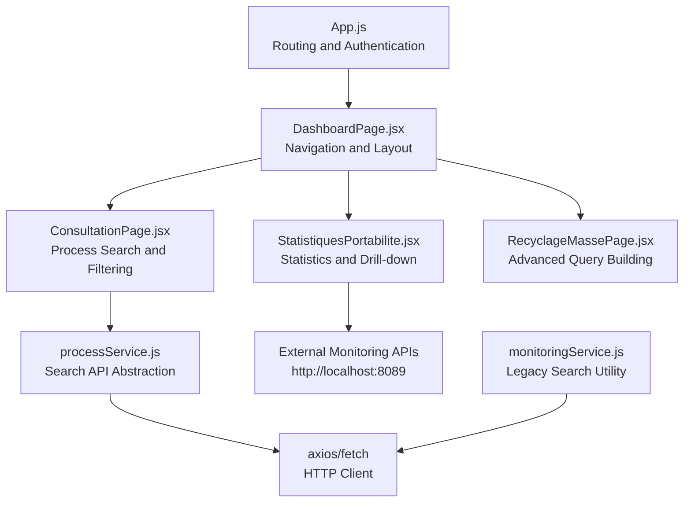
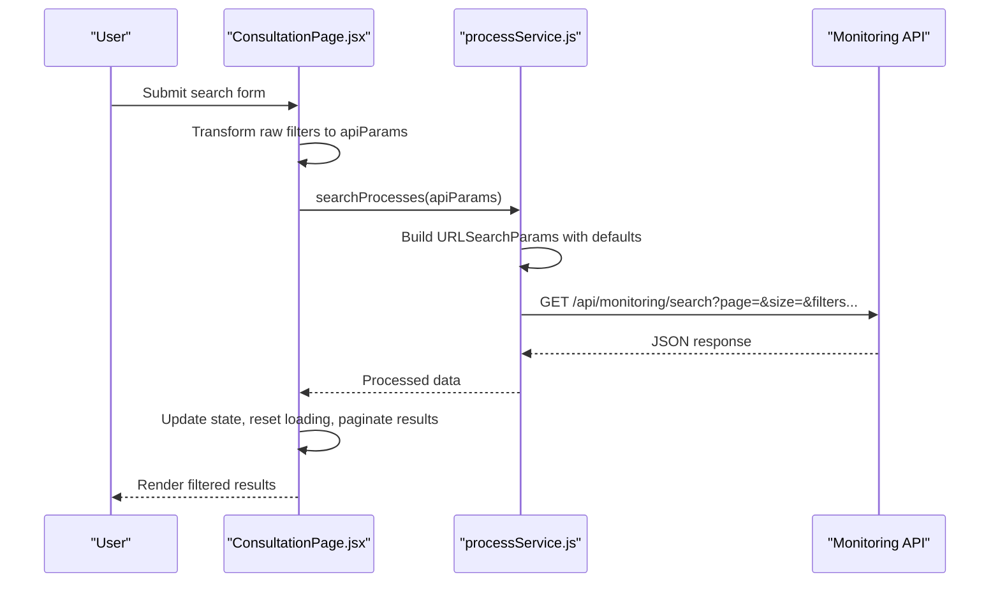
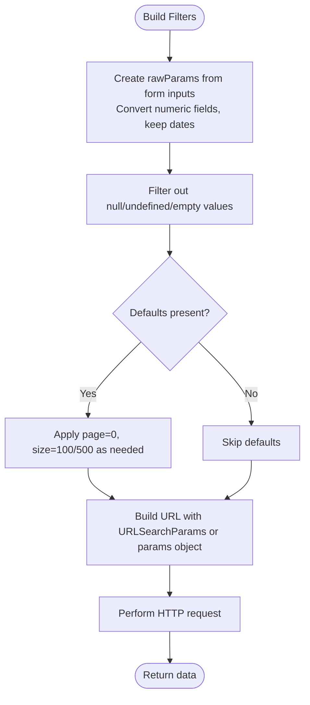
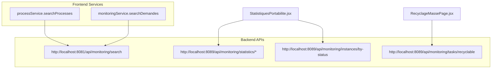
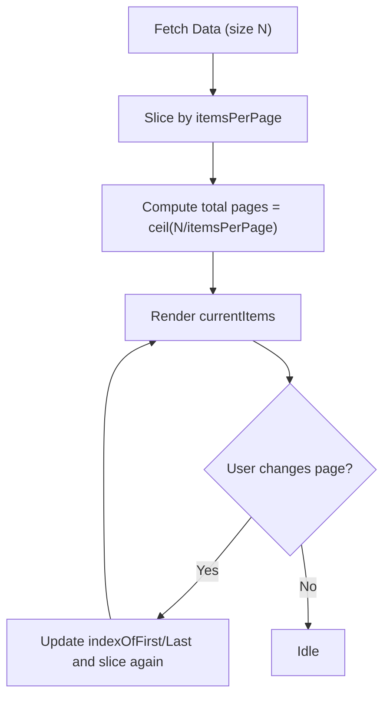
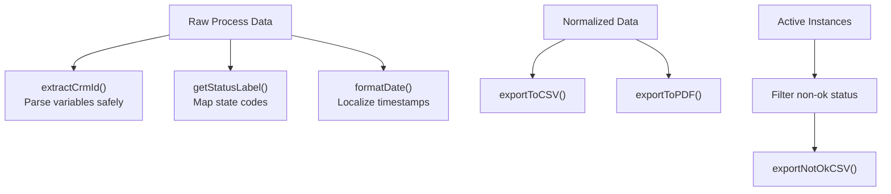
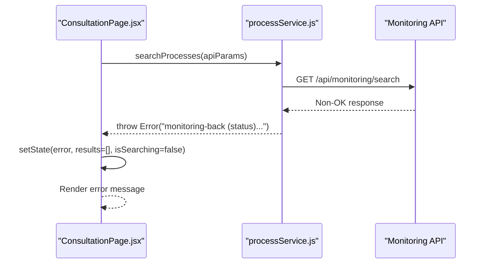
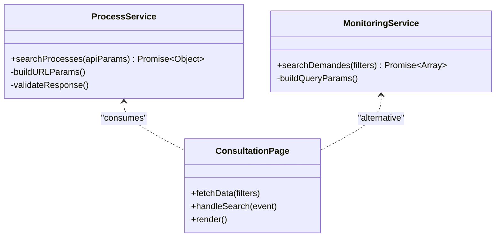
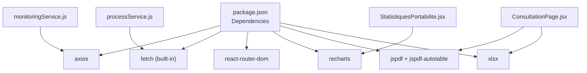

# Process Monitoring Service

<cite>
**Referenced Files in This Document**
- [monitoringService.js](file://src/services/monitoringService.js)
- [processService.js](file://src/services/processService.js)
- [ConsultationPage.jsx](file://src/components/ConsultationPage.jsx)
- [StatistiquesPortabilite.jsx](file://src/components/StatistiquesPortabilite.jsx)
- [DashboardPage.jsx](file://src/pages/DashboardPage.jsx)
- [App.js](file://src/App.js)
- [RecyclageMassePage.jsx](file://src/components/RecyclageMassePage.jsx)
</cite>

## Table of Contents
1. [Introduction](#introduction)
2. [Project Structure](#project-structure)
3. [Core Components](#core-components)
4. [Architecture Overview](#architecture-overview)
5. [Detailed Component Analysis](#detailed-component-analysis)
6. [Dependency Analysis](#dependency-analysis)
7. [Performance Considerations](#performance-considerations)
8. [Troubleshooting Guide](#troubleshooting-guide)
9. [Conclusion](#conclusion)

## Introduction
This document provides comprehensive documentation for the process monitoring service, focusing on dynamic query parameter construction, API endpoint definitions for process search and filtering, pagination handling, data transformation utilities, error handling strategies, and API abstraction patterns. It also covers integration with monitoring components, loading states management, and error propagation to UI layers, with practical usage examples for real-time process monitoring.

## Project Structure
The monitoring service spans several frontend components and services:
- Services: processService.js and monitoringService.js encapsulate API communication and parameter building.
- Components: ConsultationPage.jsx handles search, filtering, pagination, and data presentation; StatistiquesPortabilite.jsx manages statistics and drill-down views; RecyclageMassePage.jsx demonstrates advanced query parameter handling; DashboardPage.jsx orchestrates navigation and loading states.
- Routing: App.js coordinates authentication, transitions, and route rendering.

**Diagram sources**
- [App.js:1-74](file://src/App.js#L1-L74)
- [DashboardPage.jsx:1-51](file://src/pages/DashboardPage.jsx#L1-L51)
- [ConsultationPage.jsx:1-419](file://src/components/ConsultationPage.jsx#L1-L419)
- [processService.js:1-38](file://src/services/processService.js#L1-L38)
- [monitoringService.js:1-24](file://src/services/monitoringService.js#L1-L24)
- [StatistiquesPortabilite.jsx:1-301](file://src/components/StatistiquesPortabilite.jsx#L1-L301)
- [RecyclageMassePage.jsx:47-67](file://src/components/RecyclageMassePage.jsx#L47-L67)

**Section sources**
- [App.js:1-74](file://src/App.js#L1-L74)
- [DashboardPage.jsx:1-51](file://src/pages/DashboardPage.jsx#L1-L51)

## Core Components
- processService.searchProcesses: Builds URL query parameters dynamically, applies default pagination, and performs HTTP requests to the monitoring API.
- monitoringService.searchDemandes: Legacy utility for constructing query parameters and fetching monitoring data via axios.
- ConsultationPage: Orchestrates search form submission, transforms raw parameters, handles loading/error states, and manages client-side pagination.
- StatistiquesPortabilite: Integrates with external monitoring endpoints for statistics and drill-down views.
- RecyclageMassePage: Demonstrates advanced query parameter construction with URLSearchParams and explicit pagination controls.

**Section sources**
- [processService.js:1-38](file://src/services/processService.js#L1-L38)
- [monitoringService.js:1-24](file://src/services/monitoringService.js#L1-L24)
- [ConsultationPage.jsx:34-70](file://src/components/ConsultationPage.jsx#L34-L70)
- [StatistiquesPortabilite.jsx:28-63](file://src/components/StatistiquesPortabilite.jsx#L28-L63)
- [RecyclageMassePage.jsx:47-67](file://src/components/RecyclageMassePage.jsx#L47-L67)

## Architecture Overview
The monitoring architecture follows a layered pattern:
- UI Layer: Components manage user interactions, loading states, and rendering.
- Service Layer: Services abstract API calls, parameter construction, and error handling.
- Backend Integration: Services communicate with monitoring backends on ports 8081 and 8089.

**Diagram sources**
- [ConsultationPage.jsx:34-70](file://src/components/ConsultationPage.jsx#L34-L70)
- [processService.js:4-37](file://src/services/processService.js#L4-L37)

## Detailed Component Analysis

### Dynamic Query Parameter Construction
- ConsultationPage builds apiParams by converting form inputs to numeric types where applicable and excluding empty values. It sets default pagination parameters (page=0, size=1000) to fetch sufficient records for client-side pagination.
- processService constructs URLSearchParams, ensuring page and size have sensible defaults and other filters are appended only if non-empty.
- monitoringService creates a plain object for query parameters and uses axios.get with the params option.
- RecyclageMassePage uses URLSearchParams to append containerId, processInstanceId, and date range filters, explicitly setting page and size for controlled pagination.

**Diagram sources**
- [ConsultationPage.jsx:39-58](file://src/components/ConsultationPage.jsx#L39-L58)
- [processService.js:5-23](file://src/services/processService.js#L5-L23)
- [monitoringService.js:8-16](file://src/services/monitoringService.js#L8-L16)
- [RecyclageMassePage.jsx:47-66](file://src/components/RecyclageMassePage.jsx#L47-L66)

**Section sources**
- [ConsultationPage.jsx:39-58](file://src/components/ConsultationPage.jsx#L39-L58)
- [processService.js:5-23](file://src/services/processService.js#L5-L23)
- [monitoringService.js:8-16](file://src/services/monitoringService.js#L8-L16)
- [RecyclageMassePage.jsx:47-66](file://src/components/RecyclageMassePage.jsx#L47-L66)

### API Endpoint Definitions for Process Search and Filtering
- processService.searchProcesses targets http://localhost:8081/api/monitoring/search with query parameters for pagination and filters.
- monitoringService.searchDemandes targets http://localhost:8081/api/monitoring/search for legacy search functionality.
- StatistiquesPortabilite integrates with http://localhost:8089 endpoints for statistics and per-status instance retrieval.
- RecyclageMassePage constructs URLs under http://localhost:8089/api/monitoring/tasks/recyclable with containerId and date range filters.

**Diagram sources**
- [processService.js:25](file://src/services/processService.js#L25)
- [monitoringService.js:3](file://src/services/monitoringService.js#L3)
- [StatistiquesPortabilite.jsx:34-41](file://src/components/StatistiquesPortabilite.jsx#L34-L41)
- [RecyclageMassePage.jsx:66](file://src/components/RecyclageMassePage.jsx#L66)

**Section sources**
- [processService.js:25](file://src/services/processService.js#L25)
- [monitoringService.js:3](file://src/services/monitoringService.js#L3)
- [StatistiquesPortabilite.jsx:34-41](file://src/components/StatistiquesPortabilite.jsx#L34-L41)
- [RecyclageMassePage.jsx:66](file://src/components/RecyclageMassePage.jsx#L66)

### Pagination Handling
- ConsultationPage implements client-side pagination with 10 items per page, calculating currentItems slice and total pages based on fetched data length.
- processService enforces server-side pagination defaults (page=0, size=100) and allows overriding via apiParams.
- RecyclageMassePage explicitly sets page=0 and size=500 for bulk retrieval and local pagination.
- StatistiquesPortabilite uses server-side pagination with page=0 and size=50 for drill-down views.

**Diagram sources**
- [ConsultationPage.jsx:72-82](file://src/components/ConsultationPage.jsx#L72-L82)
- [processService.js:8-12](file://src/services/processService.js#L8-L12)
- [RecyclageMassePage.jsx:64-66](file://src/components/RecyclageMassePage.jsx#L64-L66)
- [StatistiquesPortabilite.jsx:73](file://src/components/StatistiquesPortabilite.jsx#L73)

**Section sources**
- [ConsultationPage.jsx:72-82](file://src/components/ConsultationPage.jsx#L72-L82)
- [processService.js:8-12](file://src/services/processService.js#L8-L12)
- [RecyclageMassePage.jsx:64-66](file://src/components/RecyclageMassePage.jsx#L64-L66)
- [StatistiquesPortabilite.jsx:73](file://src/components/StatistiquesPortabilite.jsx#L73)

### Data Transformation Utilities
- ConsultationPage.extractCrmId parses variables to derive CRM identifiers, handling both stringified and object forms with safe fallbacks.
- ConsultationPage.getStatusLabel maps numeric state codes to human-readable labels.
- ConsultationPage.formatDate converts timestamps to localized strings with fallbacks for invalid dates.
- ConsultationPage.exportToCSV and exportToPDF transform normalized data into downloadable formats.
- StatistiquesPortabilite.exportNotOkCSV filters and exports non-ok instances for operational reporting.

**Diagram sources**
- [ConsultationPage.jsx:162-181](file://src/components/ConsultationPage.jsx#L162-L181)
- [ConsultationPage.jsx:212-217](file://src/components/ConsultationPage.jsx#L212-L217)
- [ConsultationPage.jsx:203-210](file://src/components/ConsultationPage.jsx#L203-L210)
- [ConsultationPage.jsx:85-160](file://src/components/ConsultationPage.jsx#L85-L160)
- [StatistiquesPortabilite.jsx:107-135](file://src/components/StatistiquesPortabilite.jsx#L107-L135)

**Section sources**
- [ConsultationPage.jsx:162-181](file://src/components/ConsultationPage.jsx#L162-L181)
- [ConsultationPage.jsx:212-217](file://src/components/ConsultationPage.jsx#L212-L217)
- [ConsultationPage.jsx:203-210](file://src/components/ConsultationPage.jsx#L203-L210)
- [ConsultationPage.jsx:85-160](file://src/components/ConsultationPage.jsx#L85-L160)
- [StatistiquesPortabilite.jsx:107-135](file://src/components/StatistiquesPortabilite.jsx#L107-L135)

### Error Handling Strategies
- processService.searchProcesses validates response.ok and throws a descriptive error indicating backend connectivity and port checks.
- ConsultationPage catches errors during search, displays a user-friendly message, resets results, and clears loading states.
- StatistiquesPortabilite and other components use try/catch blocks around fetch calls, logging errors and managing loading states.
- monitoringService.searchDemandes wraps axios.get in try/catch, logs errors, and rethrows for upstream handling.

**Diagram sources**
- [processService.js:30-34](file://src/services/processService.js#L30-L34)
- [ConsultationPage.jsx:60-70](file://src/components/ConsultationPage.jsx#L60-L70)

**Section sources**
- [processService.js:30-34](file://src/services/processService.js#L30-L34)
- [ConsultationPage.jsx:60-70](file://src/components/ConsultationPage.jsx#L60-L70)
- [monitoringService.js:20-23](file://src/services/monitoringService.js#L20-L23)

### API Abstraction Patterns
- processService centralizes URL construction, parameter normalization, and response handling, enabling consistent consumption across components.
- monitoringService provides a lightweight abstraction for legacy search scenarios.
- StatistiquesPortabilite demonstrates direct fetch usage for external endpoints, complementing the service-layer approach.

**Diagram sources**
- [processService.js:3-37](file://src/services/processService.js#L3-L37)
- [monitoringService.js:5-23](file://src/services/monitoringService.js#L5-L23)
- [ConsultationPage.jsx:34-70](file://src/components/ConsultationPage.jsx#L34-L70)

**Section sources**
- [processService.js:3-37](file://src/services/processService.js#L3-L37)
- [monitoringService.js:5-23](file://src/services/monitoringService.js#L5-L23)
- [ConsultationPage.jsx:34-70](file://src/components/ConsultationPage.jsx#L34-L70)

### Examples of Search Queries, Filter Configurations, and Response Processing
- Example search query: processInstanceId=12345&status=1&dateDebut=2023-01-01&dateFin=2023-12-31&page=0&size=1000
- Filter configuration: ConsultationPage maps form fields to apiParams, converting numeric fields and preserving date ranges.
- Response processing: ConsultationPage normalizes results, computes pagination slices, and renders status badges and formatted dates.

**Section sources**
- [ConsultationPage.jsx:39-58](file://src/components/ConsultationPage.jsx#L39-L58)
- [ConsultationPage.jsx:72-82](file://src/components/ConsultationPage.jsx#L72-L82)

### Integration with Monitoring Components and Loading States Management
- DashboardPage and DashboardPage.jsx manage initial loading states and menu-driven content switching.
- ConsultationPage maintains isSearching, error, and searchResults states, updating UI accordingly and disabling actions during loading.
- StatistiquesPortabilite uses loading and error states for statistics and drill-down views, with pagination for active instances.

**Section sources**
- [DashboardPage.jsx:10-15](file://src/pages/DashboardPage.jsx#L10-L15)
- [ConsultationPage.jsx:19-21](file://src/components/ConsultationPage.jsx#L19-L21)
- [ConsultationPage.jsx:34-70](file://src/components/ConsultationPage.jsx#L34-L70)
- [StatistiquesPortabilite.jsx:14-18](file://src/components/StatistiquesPortabilite.jsx#L14-L18)

### Error Propagation to UI Layers
- processService.searchProcesses throws descriptive errors for non-OK responses, enabling UI components to catch and display user-friendly messages.
- ConsultationPage propagates errors to state, clears results, and ensures loading indicators are reset.
- monitoringService.searchDemandes logs and rethrows errors for upstream handling.

**Section sources**
- [processService.js:30-34](file://src/services/processService.js#L30-L34)
- [ConsultationPage.jsx:60-70](file://src/components/ConsultationPage.jsx#L60-L70)
- [monitoringService.js:20-23](file://src/services/monitoringService.js#L20-L23)

## Dependency Analysis
The monitoring service depends on:
- axios for HTTP requests in monitoringService.js
- fetch for HTTP requests in processService.js and other components
- react-router-dom for routing and navigation
- recharts for statistical visualizations in StatistiquesPortabilite.jsx
- jspdf and xlsx for export capabilities in ConsultationPage.jsx and ErrorReportPage.jsx

**Diagram sources**
- [package.json:5-27](file://package.json#L5-L27)
- [monitoringService.js:1](file://src/services/monitoringService.js#L1)
- [processService.js:1](file://src/services/processService.js#L1)
- [StatistiquesPortabilite.jsx:1-7](file://src/components/StatistiquesPortabilite.jsx#L1-L7)
- [ConsultationPage.jsx:4-5](file://src/components/ConsultationPage.jsx#L4-L5)

**Section sources**
- [package.json:5-27](file://package.json#L5-L27)

## Performance Considerations
- Client-side pagination reduces server load but increases memory usage; consider server-side pagination for large datasets.
- URLSearchParams usage in processService.js and RecyclageMassePage.jsx ensures clean, efficient query construction.
- Export operations (CSV/PDF) should be throttled or triggered after data loads to avoid blocking UI updates.
- Consider caching frequently accessed statistics endpoints to minimize repeated network calls.

## Troubleshooting Guide
Common issues and resolutions:
- Backend connectivity errors: Verify MonitoringBackApplication is running on port 8081 and the WS on port 8089; processService.searchProcesses provides descriptive error messages for non-OK responses.
- Empty or unexpected results: Ensure filters are properly set and apiParams excludes empty values; consult ConsultationPage's parameter transformation logic.
- Export failures: Confirm jspdf and xlsx dependencies are installed and functional; check browser console for errors.
- Pagination anomalies: Validate itemsPerPage and total count calculations; confirm server-side defaults match client expectations.

**Section sources**
- [processService.js:30-34](file://src/services/processService.js#L30-L34)
- [ConsultationPage.jsx:60-70](file://src/components/ConsultationPage.jsx#L60-L70)

## Conclusion
The process monitoring service provides a robust foundation for real-time process monitoring through dynamic query parameter construction, consistent API abstractions, and comprehensive error handling. By leveraging service-layer abstractions and component-driven UI patterns, the system supports flexible search, filtering, and pagination while maintaining responsive user experiences and clear error propagation to UI layers.