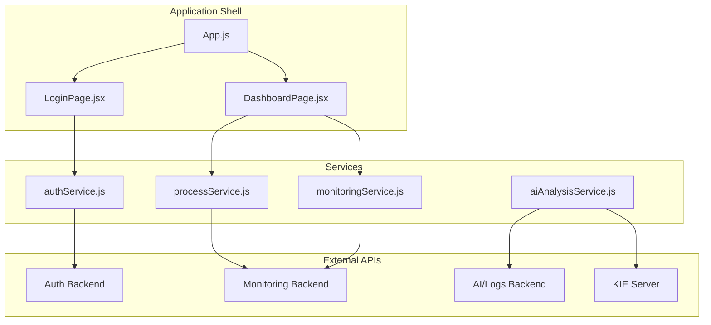
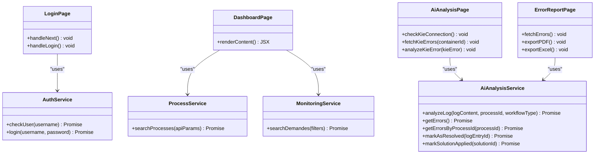
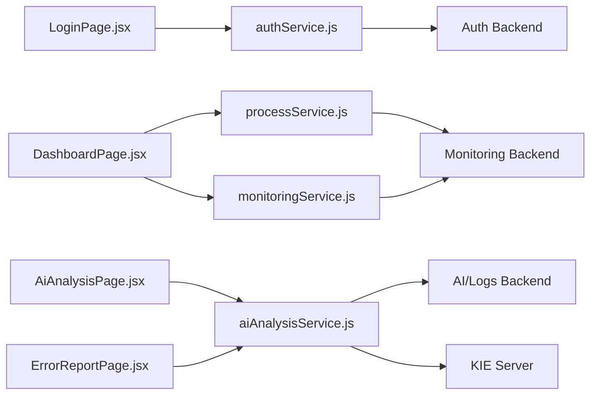

# Service Layer Architecture

<cite>
**Referenced Files in This Document**
- [authService.js](file://src/services/authService.js)
- [processService.js](file://src/services/processService.js)
- [aiAnalysisService.js](file://src/services/aiAnalysisService.js)
- [monitoringService.js](file://src/services/monitoringService.js)
- [App.js](file://src/App.js)
- [LoginPage.jsx](file://src/components/login/LoginPage.jsx)
- [DashboardPage.jsx](file://src/pages/DashboardPage.jsx)
- [AiAnalysisPage.jsx](file://src/components/AiAnalysisPage.jsx)
- [ErrorReportPage.jsx](file://src/components/ErrorReportPage.jsx)
- [Dashboard.jsx](file://src/components/dashboard/Dashboard.jsx)
- [package.json](file://package.json)
</cite>

## Table of Contents
1. [Introduction](#introduction)
2. [Project Structure](#project-structure)
3. [Core Components](#core-components)
4. [Architecture Overview](#architecture-overview)
5. [Detailed Component Analysis](#detailed-component-analysis)
6. [Dependency Analysis](#dependency-analysis)
7. [Performance Considerations](#performance-considerations)
8. [Troubleshooting Guide](#troubleshooting-guide)
9. [Conclusion](#conclusion)

## Introduction
This document describes the SmartPorta service layer architecture, focusing on API communication patterns, HTTP client configuration, error handling strategies, and data transformation utilities. It explains the separation of concerns across authentication, process monitoring, AI analysis, and monitoring services, and documents service composition patterns, dependency injection approaches, and state management integration. The document also outlines service layer abstractions, API endpoint definitions, and request/response handling, with practical examples of service usage and integration with component layers.

## Project Structure
The service layer is organized under the `src/services` directory with four primary service modules:
- Authentication service for user validation and login
- Process monitoring service for process search and filtering
- AI analysis service leveraging Axios for log analysis and error management
- Monitoring service for demand search with dynamic query parameters

These services are consumed by React components and pages routed via the application shell.

**Diagram sources**
- [App.js:1-74](file://src/App.js#L1-L74)
- [DashboardPage.jsx:1-51](file://src/pages/DashboardPage.jsx#L1-L51)
- [LoginPage.jsx:1-94](file://src/components/login/LoginPage.jsx#L1-L94)
- [authService.js:1-19](file://src/services/authService.js#L1-L19)
- [processService.js:1-38](file://src/services/processService.js#L1-L38)
- [aiAnalysisService.js:1-37](file://src/services/aiAnalysisService.js#L1-L37)
- [monitoringService.js:1-24](file://src/services/monitoringService.js#L1-L24)

**Section sources**
- [App.js:1-74](file://src/App.js#L1-L74)
- [DashboardPage.jsx:1-51](file://src/pages/DashboardPage.jsx#L1-L51)
- [authService.js:1-19](file://src/services/authService.js#L1-L19)
- [processService.js:1-38](file://src/services/processService.js#L1-L38)
- [aiAnalysisService.js:1-37](file://src/services/aiAnalysisService.js#L1-L37)
- [monitoringService.js:1-24](file://src/services/monitoringService.js#L1-L24)

## Core Components
This section details the four service modules and their roles:

- Authentication Service
  - Provides user existence checks and login operations
  - Uses native fetch with JSON payloads
  - Returns parsed JSON responses

- Process Monitoring Service
  - Implements robust parameter filtering and pagination
  - Builds URLSearchParams for flexible query construction
  - Throws descriptive errors on HTTP failures

- AI Analysis Service
  - Leverages Axios for structured HTTP requests
  - Exposes endpoints for log analysis, error retrieval, resolution marking, and solution application
  - Returns response.data for all operations

- Monitoring Service
  - Dynamically constructs query parameters from filters
  - Wraps Axios GET requests with try/catch error handling
  - Re-throws caught errors after logging

Key HTTP client configuration highlights:
- Native fetch is used for authentication and process monitoring
- Axios is configured globally via package.json and used by AI analysis and monitoring services
- Both clients support JSON content types and standard HTTP status handling

**Section sources**
- [authService.js:1-19](file://src/services/authService.js#L1-L19)
- [processService.js:1-38](file://src/services/processService.js#L1-L38)
- [aiAnalysisService.js:1-37](file://src/services/aiAnalysisService.js#L1-L37)
- [monitoringService.js:1-24](file://src/services/monitoringService.js#L1-L24)
- [package.json:10](file://package.json#L10)

## Architecture Overview
The service layer follows a clear separation of concerns:
- Authentication: Stateless user validation and login
- Process Monitoring: Search and filter processes with pagination
- AI Analysis: Log analysis, error management, and solution tracking
- Monitoring: Demand search with dynamic filters

**Diagram sources**
- [authService.js:1-19](file://src/services/authService.js#L1-L19)
- [processService.js:1-38](file://src/services/processService.js#L1-L38)
- [aiAnalysisService.js:1-37](file://src/services/aiAnalysisService.js#L1-L37)
- [monitoringService.js:1-24](file://src/services/monitoringService.js#L1-L24)
- [LoginPage.jsx:1-94](file://src/components/login/LoginPage.jsx#L1-L94)
- [DashboardPage.jsx:1-51](file://src/pages/DashboardPage.jsx#L1-L51)
- [AiAnalysisPage.jsx:1-860](file://src/components/AiAnalysisPage.jsx#L1-L860)
- [ErrorReportPage.jsx:1-673](file://src/components/ErrorReportPage.jsx#L1-L673)

## Detailed Component Analysis

### Authentication Service
The authentication service encapsulates user validation and login operations:
- checkUser: POST request to verify user existence
- login: POST request to authenticate user credentials

Communication pattern:
- Uses fetch with JSON Content-Type
- Sends username in request body
- Returns parsed JSON response

Error handling:
- No explicit HTTP status validation
- Caller handles potential network errors and server-side failure messages

Usage example:
- LoginPage invokes checkUser during username step
- LoginPage invokes login during password step

**Section sources**
- [authService.js:1-19](file://src/services/authService.js#L1-L19)
- [LoginPage.jsx:16-51](file://src/components/login/LoginPage.jsx#L16-L51)

### Process Monitoring Service
The process monitoring service provides flexible search capabilities:
- searchProcesses: Builds URL with page, size, and arbitrary filters
- Validates and appends non-empty parameters
- Throws descriptive error on HTTP failure

Communication pattern:
- Uses fetch with constructed URL
- Returns parsed JSON on success

Error handling:
- Checks response.ok and throws error with backend-specific message
- Includes guidance for verifying backend and WebSocket connectivity

Data transformation:
- Converts apiParams to URLSearchParams
- Applies default pagination values when missing

**Section sources**
- [processService.js:1-38](file://src/services/processService.js#L1-L38)

### AI Analysis Service
The AI analysis service leverages Axios for robust HTTP operations:
Endpoints:
- POST /api/logs/analyze: Analyzes log content with processId and workflowType
- GET /api/logs/errors: Retrieves all errors
- GET /api/logs/errors/process/:id: Filters errors by processId
- PUT /api/logs/:id/resolve: Marks error as resolved
- PUT /api/logs/solutions/:id/apply: Marks solution as applied

Communication pattern:
- Axios POST/GET/PUT requests with JSON payloads
- Returns response.data for all operations

Error handling:
- Axios automatically rejects on HTTP error status
- Consumers should handle promise rejections

Integration points:
- AiAnalysisPage uses multiple endpoints for KIE connection, error fetching, and manual analysis
- ErrorReportPage integrates with KIE error endpoints for reporting

**Section sources**
- [aiAnalysisService.js:1-37](file://src/services/aiAnalysisService.js#L1-L37)
- [AiAnalysisPage.jsx:380-449](file://src/components/AiAnalysisPage.jsx#L380-L449)
- [ErrorReportPage.jsx:359-373](file://src/components/ErrorReportPage.jsx#L359-L373)

### Monitoring Service
The monitoring service provides dynamic demand search:
- searchDemandes: Constructs query parameters from filters object
- Uses Axios GET with params configuration
- Wraps request in try/catch, logs error, and rethrows

Communication pattern:
- Axios GET with dynamic query parameters
- Returns response.data

Error handling:
- Catches errors, logs to console, and rethrows for upstream handling

**Section sources**
- [monitoringService.js:1-24](file://src/services/monitoringService.js#L1-L24)

### Service Composition and State Management
The application composes services through React components:
- App manages global authentication state and routing
- DashboardPage orchestrates multiple services for different tabs
- LoginPage coordinates authentication service calls
- AiAnalysisPage integrates AI analysis and KIE endpoints
- ErrorReportPage consumes KIE error endpoints for reporting

State management integration:
- App maintains isAuthenticated, username, and transition state
- Components manage local state for forms, loading indicators, and results
- Services return data for components to update UI state

**Section sources**
- [App.js:10-31](file://src/App.js#L10-L31)
- [DashboardPage.jsx:10-34](file://src/pages/DashboardPage.jsx#L10-L34)
- [AiAnalysisPage.jsx:363-462](file://src/components/AiAnalysisPage.jsx#L363-L462)
- [ErrorReportPage.jsx:337-384](file://src/components/ErrorReportPage.jsx#L337-L384)

## Dependency Analysis
The service layer exhibits low coupling and high cohesion:
- Each service module encapsulates a single responsibility domain
- Components depend on service abstractions rather than raw HTTP calls
- Shared HTTP client configuration (Axios) enables consistent request handling

**Diagram sources**
- [authService.js:1-19](file://src/services/authService.js#L1-L19)
- [processService.js:1-38](file://src/services/processService.js#L1-L38)
- [aiAnalysisService.js:1-37](file://src/services/aiAnalysisService.js#L1-L37)
- [monitoringService.js:1-24](file://src/services/monitoringService.js#L1-L24)
- [LoginPage.jsx:1-94](file://src/components/login/LoginPage.jsx#L1-L94)
- [DashboardPage.jsx:1-51](file://src/pages/DashboardPage.jsx#L1-L51)
- [AiAnalysisPage.jsx:1-860](file://src/components/AiAnalysisPage.jsx#L1-L860)
- [ErrorReportPage.jsx:1-673](file://src/components/ErrorReportPage.jsx#L1-L673)

**Section sources**
- [package.json:10](file://package.json#L10)
- [authService.js:1-19](file://src/services/authService.js#L1-L19)
- [processService.js:1-38](file://src/services/processService.js#L1-L38)
- [aiAnalysisService.js:1-37](file://src/services/aiAnalysisService.js#L1-L37)
- [monitoringService.js:1-24](file://src/services/monitoringService.js#L1-L24)

## Performance Considerations
- Pagination defaults: Process monitoring sets page=0 and size=100 when parameters are missing, preventing unbounded queries
- Parameter filtering: Only non-empty values are appended to URLs, reducing unnecessary query overhead
- Axios configuration: Global Axios setup allows centralized interceptors and configuration for caching and retries if needed
- Component-level loading states: Services integrate with component loading indicators to improve perceived performance

## Troubleshooting Guide
Common error scenarios and handling patterns:

Authentication failures:
- checkUser/login may fail due to network issues or invalid credentials
- LoginPage displays user-friendly error messages and prevents navigation until successful

Process search errors:
- HTTP errors trigger descriptive exceptions with backend-specific guidance
- Verify backend availability and WebSocket connectivity when encountering errors

AI analysis errors:
- Axios rejections indicate HTTP-level failures
- Ensure AI/Logs backend and KIE server are reachable and responsive

Monitoring service errors:
- Try/catch blocks log errors and rethrow for upstream handling
- Validate filter parameters and backend endpoint availability

Diagnostic steps:
- Check browser network tab for failed requests
- Verify base URLs and endpoint paths in service files
- Confirm backend service status and CORS configuration

**Section sources**
- [LoginPage.jsx:16-51](file://src/components/login/LoginPage.jsx#L16-L51)
- [processService.js:30-34](file://src/services/processService.js#L30-L34)
- [monitoringService.js:20-23](file://src/services/monitoringService.js#L20-L23)

## Conclusion
The SmartPorta service layer demonstrates a clean separation of concerns with well-defined responsibilities for authentication, process monitoring, AI analysis, and monitoring. The architecture leverages both native fetch and Axios for HTTP communication, implements robust error handling strategies, and integrates seamlessly with React components through service composition patterns. The modular design supports maintainability, testability, and future extensibility while providing clear pathways for state management integration and cross-service coordination.