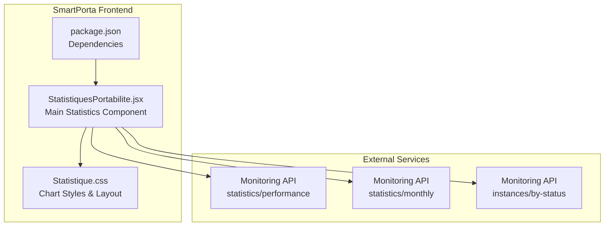
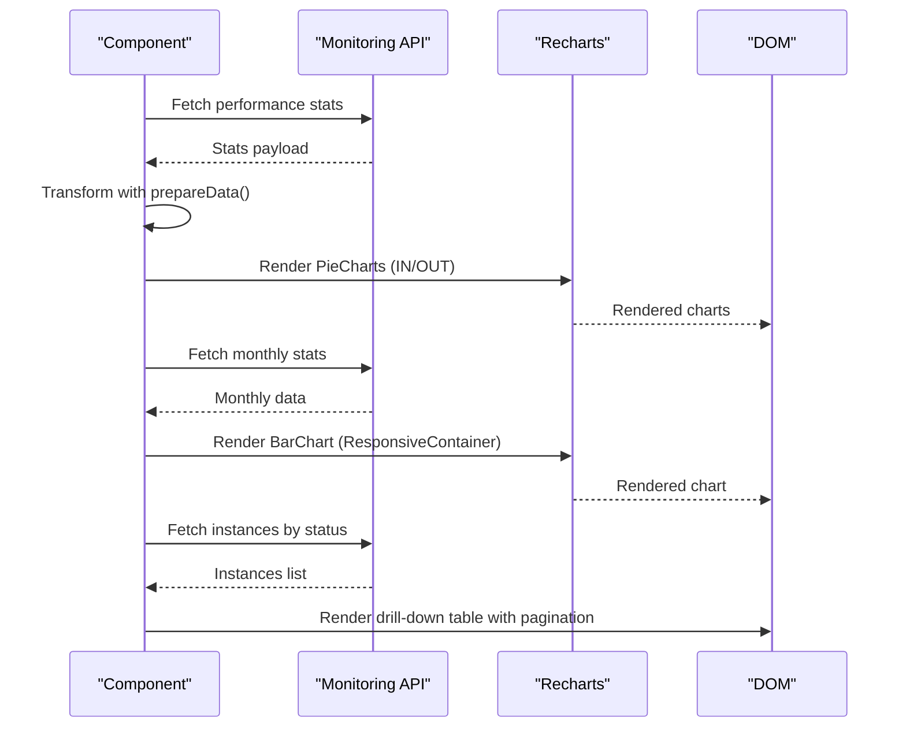
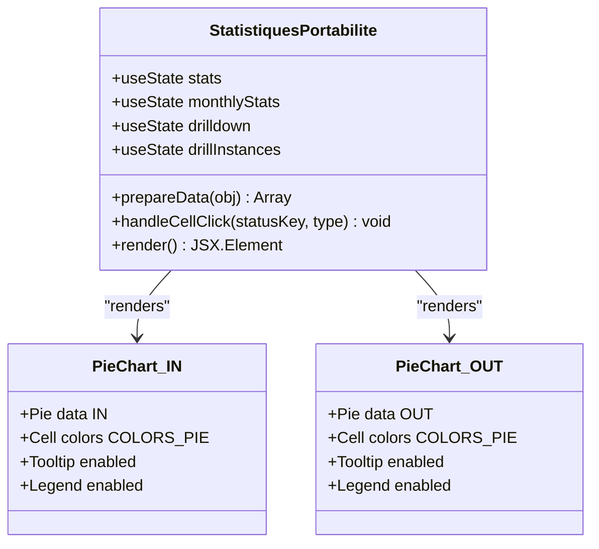
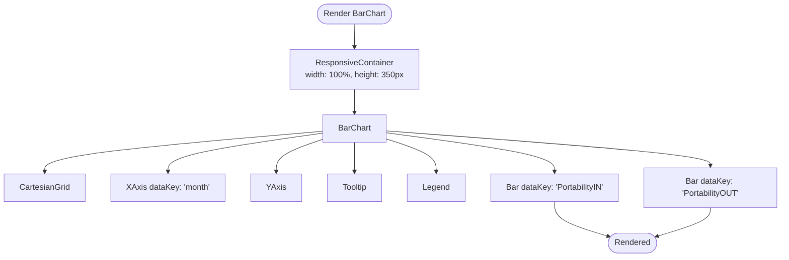
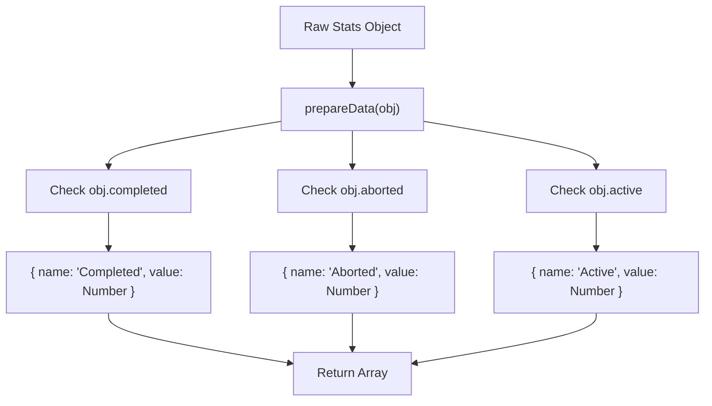
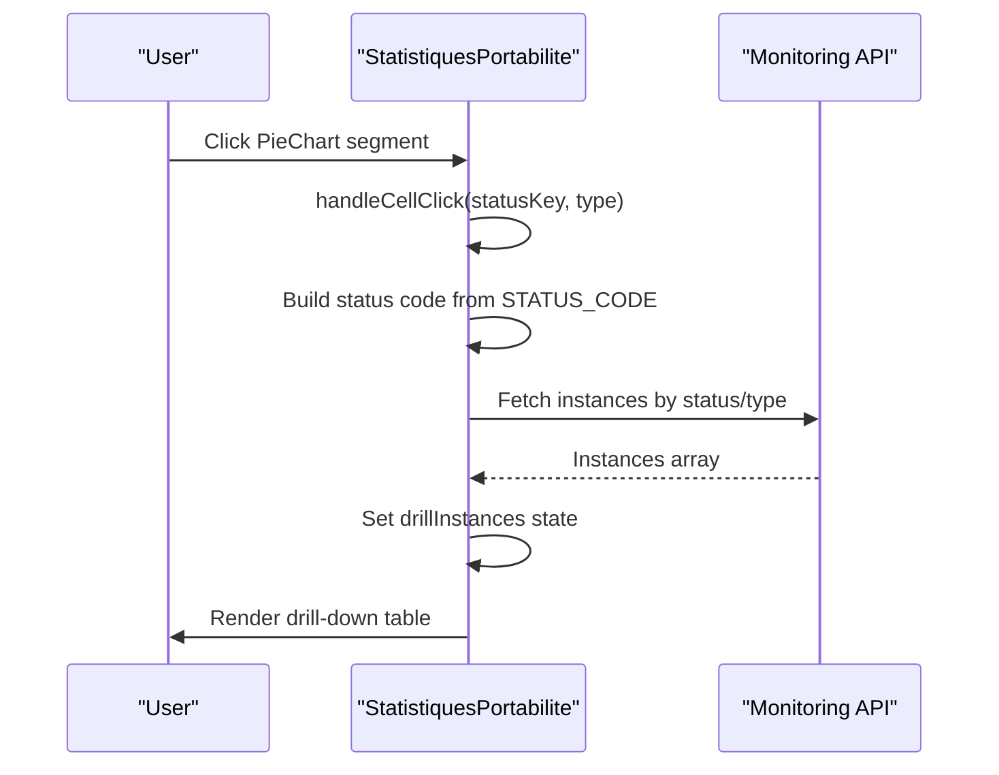
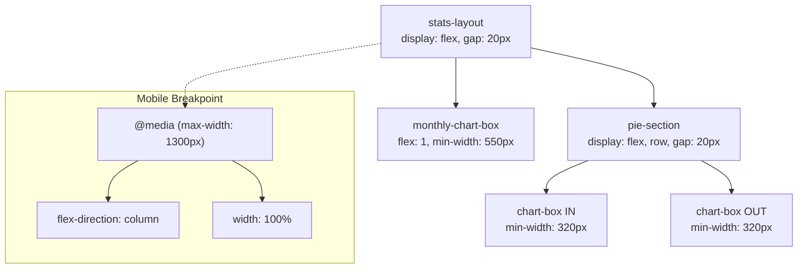
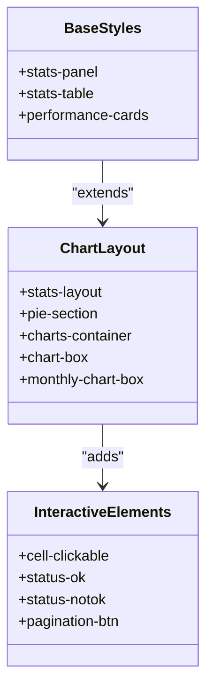
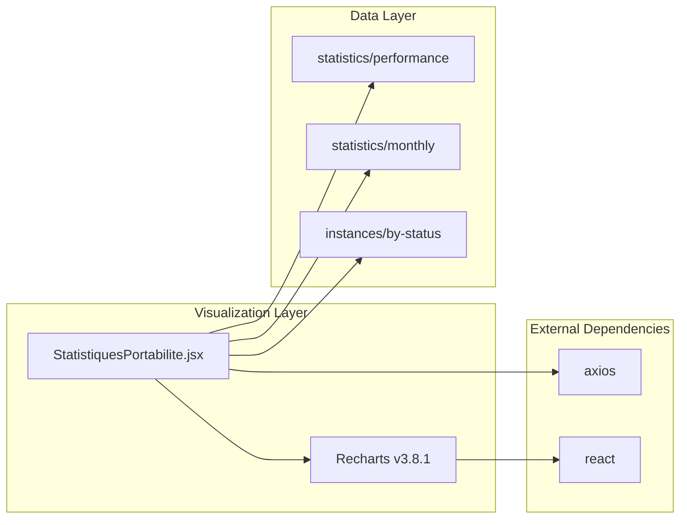

# Data Visualization Components

<cite>
**Referenced Files in This Document**
- [StatistiquesPortabilite.jsx](file://src/components/StatistiquesPortabilite.jsx)
- [Statistique.css](file://src/components/Statistique.css)
- [package.json](file://package.json)
</cite>

## Table of Contents
1. [Introduction](#introduction)
2. [Project Structure](#project-structure)
3. [Core Components](#core-components)
4. [Architecture Overview](#architecture-overview)
5. [Detailed Component Analysis](#detailed-component-analysis)
6. [Dependency Analysis](#dependency-analysis)
7. [Performance Considerations](#performance-considerations)
8. [Troubleshooting Guide](#troubleshooting-guide)
9. [Conclusion](#conclusion)

## Introduction
This document provides comprehensive documentation for the data visualization components in the SmartPorta statistical reporting system. It focuses on the Recharts integration within the portability statistics page, covering PieChart and BarChart implementations, responsive container usage, chart configuration patterns, color schemes, tooltip behaviors, legend positioning, data transformation functions, and styling approaches. It also includes examples of customization, interactivity patterns, and responsive design considerations.

## Project Structure
The data visualization features are implemented in a dedicated statistics component that integrates with external monitoring APIs to render performance metrics and drill-down capabilities.

**Diagram sources**
- [StatistiquesPortabilite.jsx:12-63](file://src/components/StatistiquesPortabilite.jsx#L12-L63)
- [Statistique.css:1-698](file://src/components/Statistique.css#L1-L698)
- [package.json:20](file://package.json#L20)

**Section sources**
- [StatistiquesPortabilite.jsx:12-63](file://src/components/StatistiquesPortabilite.jsx#L12-L63)
- [Statistique.css:1-698](file://src/components/Statistique.css#L1-L698)
- [package.json:20](file://package.json#L20)

## Core Components
The statistics page implements:
- Two PieCharts (IN and OUT) for status distribution
- One BarChart with monthly trend data
- Responsive container for adaptive sizing
- Status mapping constants and data transformation function
- Drill-down capability for filtered instance lists
- Pagination and CSV export for large datasets

Key implementation highlights:
- Recharts imports: PieChart, Pie, Cell, Tooltip, Legend, BarChart, Bar, XAxis, YAxis, CartesianGrid, ResponsiveContainer
- Color scheme: ['#00C49F', '#FF8042', '#0088FE']
- Status mapping: active → 1, completed → 2, aborted → 3
- Data transformation: prepareData() converts status counts to Recharts-compatible format

**Section sources**
- [StatistiquesPortabilite.jsx:2-6](file://src/components/StatistiquesPortabilite.jsx#L2-L6)
- [StatistiquesPortabilite.jsx:8-10](file://src/components/StatistiquesPortabilite.jsx#L8-L10)
- [StatistiquesPortabilite.jsx:81-85](file://src/components/StatistiquesPortabilite.jsx#L81-L85)

## Architecture Overview
The visualization architecture follows a data-driven pattern with clear separation between data fetching, transformation, and rendering.

**Diagram sources**
- [StatistiquesPortabilite.jsx:28-63](file://src/components/StatistiquesPortabilite.jsx#L28-L63)
- [StatistiquesPortabilite.jsx:182-230](file://src/components/StatistiquesPortabilite.jsx#L182-L230)

## Detailed Component Analysis

### PieChart Implementation (IN/OUT)
The component renders two PieCharts side-by-side, each representing status distribution for IN and OUT processes.

**Diagram sources**
- [StatistiquesPortabilite.jsx:182-213](file://src/components/StatistiquesPortabilite.jsx#L182-L213)
- [StatistiquesPortabilite.jsx:81-85](file://src/components/StatistiquesPortabilite.jsx#L81-L85)

Implementation details:
- Chart dimensions: width 300px, height 250px
- Outer radius: 80px
- Color mapping: ['#00C49F', '#FF8042', '#0088FE']
- Data prepared via prepareData() function
- Interactive elements: Tooltip and Legend enabled
- Click handling: handleCellClick triggers drill-down filtering

**Section sources**
- [StatistiquesPortabilite.jsx:182-213](file://src/components/StatistiquesPortabilite.jsx#L182-L213)
- [StatistiquesPortabilite.jsx:81-85](file://src/components/StatistiquesPortabilite.jsx#L81-L85)
- [StatistiquesPortabilite.jsx:65-77](file://src/components/StatistiquesPortabilite.jsx#L65-L77)

### BarChart Implementation (Monthly Trends)
The monthly BarChart displays trends across months for both IN and OUT processes.

**Diagram sources**
- [StatistiquesPortabilite.jsx:215-228](file://src/components/StatistiquesPortabilite.jsx#L215-L228)

Key characteristics:
- Responsive container ensures adaptivity across screen sizes
- Dual-series bars for IN and OUT comparisons
- Grid lines for readability
- Axis labels and legends for clarity

**Section sources**
- [StatistiquesPortabilite.jsx:215-228](file://src/components/StatistiquesPortabilite.jsx#L215-L228)

### Data Transformation and Status Mapping
The prepareData() function transforms raw statistics into Recharts-compatible arrays.

**Diagram sources**
- [StatistiquesPortabilite.jsx:81-85](file://src/components/StatistiquesPortabilite.jsx#L81-L85)

Status mapping constants:
- active → 1
- completed → 2
- aborted → 3

These mappings enable drill-down filtering and consistent status representation across the UI.

**Section sources**
- [StatistiquesPortabilite.jsx:81-85](file://src/components/StatistiquesPortabilite.jsx#L81-L85)
- [StatistiquesPortabilite.jsx:8-10](file://src/components/StatistiquesPortabilite.jsx#L8-L10)

### Drill-Down Interactivity Pattern
The component implements a drill-down pattern that filters instances by status and type.

**Diagram sources**
- [StatistiquesPortabilite.jsx:65-77](file://src/components/StatistiquesPortabilite.jsx#L65-L77)

Behavior:
- Translates status keys to numeric codes
- Constructs API endpoint with status and type parameters
- Loads up to 50 instances for immediate display
- Supports subsequent pagination for larger datasets

**Section sources**
- [StatistiquesPortabilite.jsx:65-77](file://src/components/StatistiquesPortabilite.jsx#L65-L77)

### Responsive Design and Layout
The component employs a responsive layout that adapts to different screen sizes.

**Diagram sources**
- [StatistiquesPortabilite.jsx:182-230](file://src/components/StatistiquesPortabilite.jsx#L182-L230)
- [Statistique.css:608-622](file://src/components/Statistique.css#L608-L622)

Layout features:
- Flexbox-based responsive grid
- Minimum width constraints for optimal readability
- Mobile-first breakpoint at 1300px
- Equal-height alignment for pie charts

**Section sources**
- [StatistiquesPortabilite.jsx:182-230](file://src/components/StatistiquesPortabilite.jsx#L182-L230)
- [Statistique.css:608-622](file://src/components/Statistique.css#L608-L622)

### Styling Approach and Customization
The component uses a layered CSS approach combining base styles with chart-specific overrides.

**Diagram sources**
- [Statistique.css:1-698](file://src/components/Statistique.css#L1-L698)

Styling patterns:
- Consistent card-based design with shadows and rounded corners
- Color-coded status indicators
- Hover effects for interactive elements
- Mobile-responsive breakpoints
- Typography hierarchy for chart titles and labels

**Section sources**
- [Statistique.css:1-698](file://src/components/Statistique.css#L1-L698)

## Dependency Analysis
The visualization component relies on Recharts for rendering and depends on external monitoring APIs for data.

**Diagram sources**
- [package.json:20](file://package.json#L20)
- [StatistiquesPortabilite.jsx:28-63](file://src/components/StatistiquesPortabilite.jsx#L28-L63)

Key dependencies:
- Recharts: ^3.8.1 for chart rendering
- React: for component lifecycle and state management
- Axios: for API communication
- CSS modules: for styling and responsive behavior

**Section sources**
- [package.json:20](file://package.json#L20)
- [StatistiquesPortabilite.jsx:28-63](file://src/components/StatistiquesPortabilite.jsx#L28-L63)

## Performance Considerations
- Data fetching: Uses Promise.all for concurrent API requests to minimize load time
- Memory management: Limits drill-down instance count to 50 per request
- Rendering optimization: Recharts handles efficient SVG updates automatically
- Responsive performance: CSS flexbox provides lightweight layout calculations
- Network efficiency: Single request per chart type with minimal payload processing

## Troubleshooting Guide
Common issues and solutions:

### Chart Rendering Problems
- Verify Recharts installation: Ensure recharts ^3.8.1 is installed
- Check data shape: prepareData() expects objects with completed, aborted, active properties
- Validate API responses: Confirm monitoring endpoints return expected JSON structures

### Responsive Issues
- Media query conflicts: Review @media (max-width: 1300px) rules
- Container sizing: Ensure parent containers have defined widths
- Flexbox fallbacks: Verify CSS fallbacks for older browsers

### Interactivity Problems
- Click handlers: Verify handleCellClick receives valid statusKey and type parameters
- State updates: Confirm drilldown state transitions trigger re-renders
- API connectivity: Test monitoring service availability and CORS configuration

**Section sources**
- [StatistiquesPortabilite.jsx:81-85](file://src/components/StatistiquesPortabilite.jsx#L81-L85)
- [StatistiquesPortabilite.jsx:65-77](file://src/components/StatistiquesPortabilite.jsx#L65-L77)
- [Statistique.css:608-622](file://src/components/Statistique.css#L608-L622)

## Conclusion
The SmartPorta statistical reporting system demonstrates robust data visualization implementation using Recharts. The component architecture effectively separates concerns between data fetching, transformation, and rendering while maintaining responsive design and interactive capabilities. The modular approach enables easy customization of colors, layouts, and data sources, making it adaptable to evolving monitoring requirements.