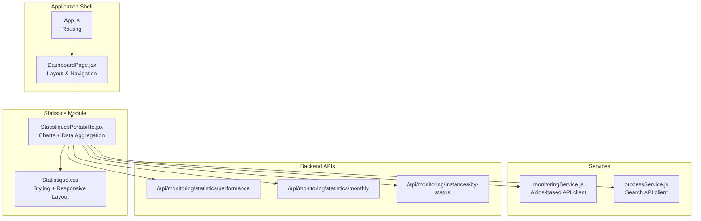
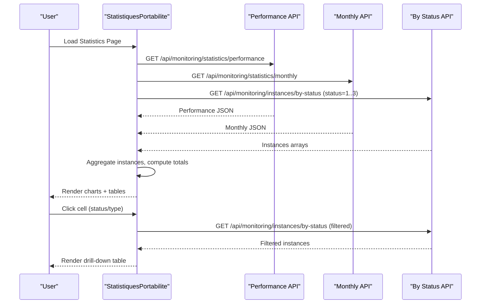
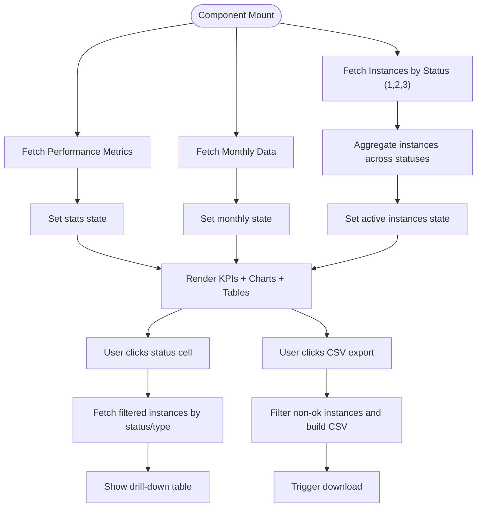
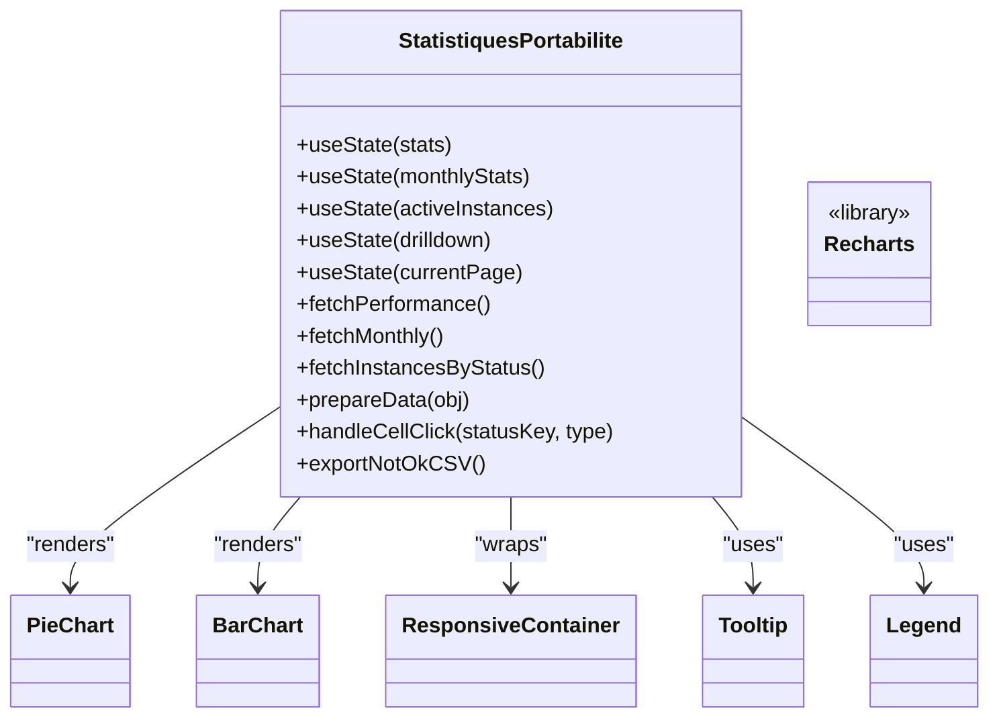
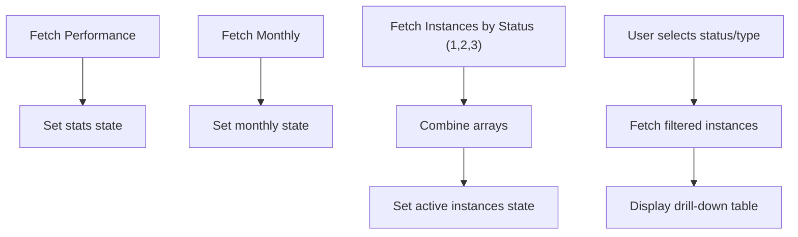
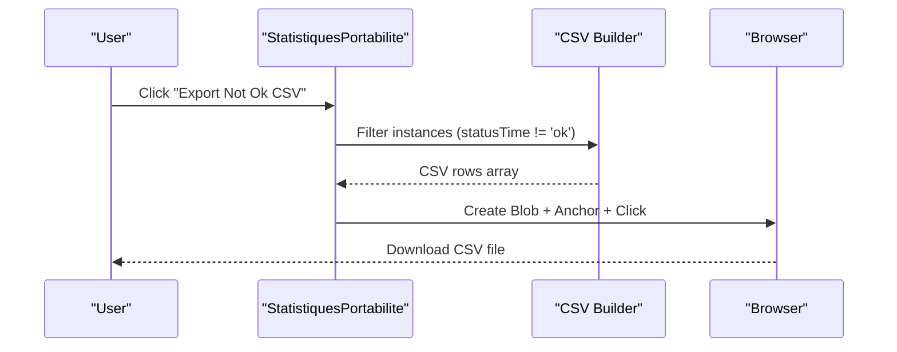
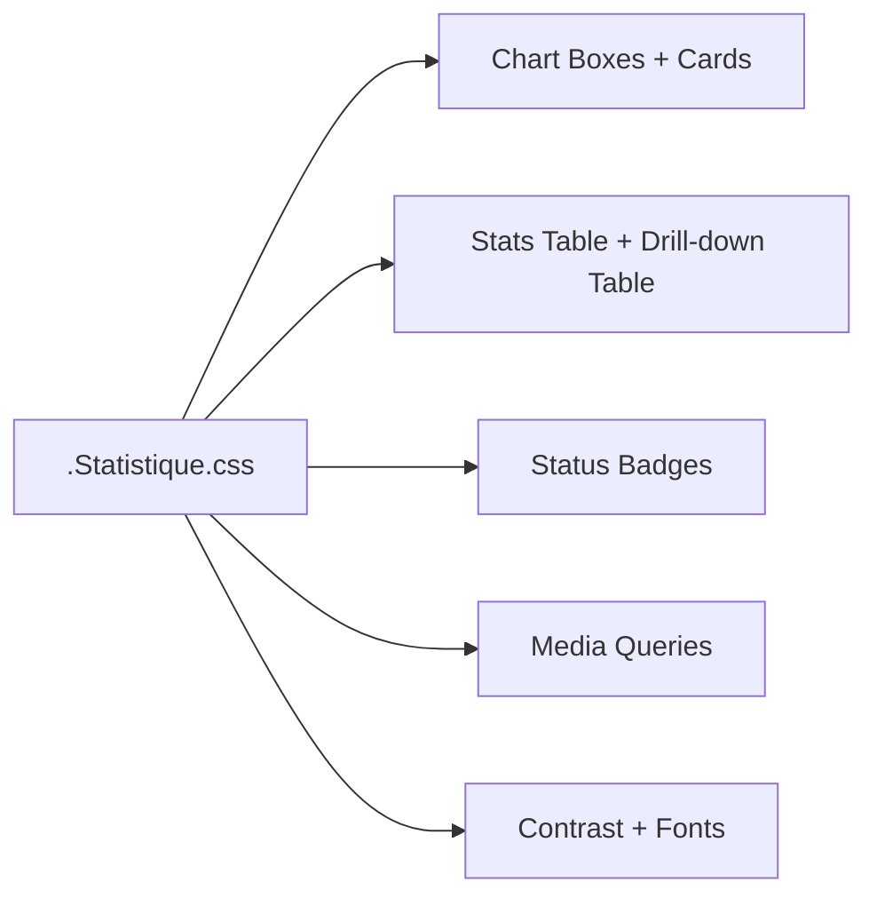
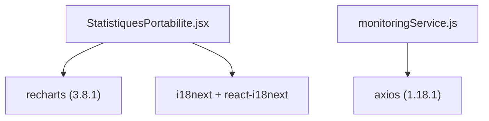

# Statistical Reporting

<cite>
**Referenced Files in This Document**
- [StatistiquesPortabilite.jsx](file://src/components/StatistiquesPortabilite.jsx)
- [Statistique.css](file://src/components/Statistique.css)
- [DashboardPage.jsx](file://src/pages/DashboardPage.jsx)
- [App.js](file://src/App.js)
- [monitoringService.js](file://src/services/monitoringService.js)
- [processService.js](file://src/services/processService.js)
- [package.json](file://package.json)
- [i18n.js](file://src/i18n.js)
</cite>

## Table of Contents
1. [Introduction](#introduction)
2. [Project Structure](#project-structure)
3. [Core Components](#core-components)
4. [Architecture Overview](#architecture-overview)
5. [Detailed Component Analysis](#detailed-component-analysis)
6. [Dependency Analysis](#dependency-analysis)
7. [Performance Considerations](#performance-considerations)
8. [Troubleshooting Guide](#troubleshooting-guide)
9. [Conclusion](#conclusion)
10. [Appendices](#appendices)

## Introduction
This document describes the SmartPorta statistical reporting system, focusing on data visualization components built with the Recharts library, chart configurations for performance metrics and status distributions, and daily request tracking implementations. It explains statistical data processing, chart rendering patterns, interactive visualization features, the statistics page implementation, data aggregation workflows, and report generation capabilities. It also documents the styling approach for charts and graphs, responsive design considerations, and accessibility features, along with examples of chart configurations, data formats, and reporting workflows.

## Project Structure
The statistical reporting system is implemented as a dedicated React component integrated into the application's dashboard. The component fetches real-time statistics from backend APIs, renders interactive charts using Recharts, and provides drill-down capabilities and CSV export functionality.

**Diagram sources**
- [App.js:34-71](file://src/App.js#L34-L71)
- [DashboardPage.jsx:10-34](file://src/pages/DashboardPage.jsx#L10-L34)
- [StatistiquesPortabilite.jsx:12-63](file://src/components/StatistiquesPortabilite.jsx#L12-L63)
- [monitoringService.js:1-24](file://src/services/monitoringService.js#L1-L24)
- [processService.js:1-38](file://src/services/processService.js#L1-L38)

**Section sources**
- [App.js:1-74](file://src/App.js#L1-L74)
- [DashboardPage.jsx:1-51](file://src/pages/DashboardPage.jsx#L1-L51)
- [StatistiquesPortabilite.jsx:1-301](file://src/components/StatistiquesPortabilite.jsx#L1-L301)

## Core Components
- Statistics Component: Implements the statistics page with performance KPIs, status distribution charts, monthly trends, and active instances table with pagination and CSV export.
- Chart Library Integration: Uses Recharts for pie charts, bar charts, tooltips, legends, and responsive containers.
- Data Services: Axios-based services for monitoring and process search APIs.
- Styling and Responsiveness: Comprehensive CSS for chart boxes, tables, badges, and responsive breakpoints.

Key responsibilities:
- Fetch performance and monthly statistics from backend endpoints.
- Aggregate active instances across statuses and render paginated tables.
- Provide drill-down capability by status and type.
- Export filtered datasets to CSV.

**Section sources**
- [StatistiquesPortabilite.jsx:12-63](file://src/components/StatistiquesPortabilite.jsx#L12-L63)
- [StatistiquesPortabilite.jsx:81-85](file://src/components/StatistiquesPortabilite.jsx#L81-L85)
- [StatistiquesPortabilite.jsx:107-135](file://src/components/StatistiquesPortabilite.jsx#L107-L135)
- [Statistique.css:149-230](file://src/components/Statistique.css#L149-L230)

## Architecture Overview
The statistics module follows a data-driven rendering pattern:
- Initialization: Component mounts and triggers parallel fetches for performance metrics and monthly data, plus active instances across statuses.
- Rendering: Displays KPI cards, status distribution pie charts, monthly bar chart, and active instances table.
- Interaction: Click handlers enable drill-down filtering and CSV export.
- Persistence: Pagination state maintained locally; drill-down modal state managed internally.

**Diagram sources**
- [StatistiquesPortabilite.jsx:28-63](file://src/components/StatistiquesPortabilite.jsx#L28-L63)
- [StatistiquesPortabilite.jsx:65-77](file://src/components/StatistiquesPortabilite.jsx#L65-L77)

## Detailed Component Analysis

### Statistics Component Implementation
The statistics component orchestrates data fetching, state management, and rendering of multiple visualization elements.

- State Management:
  - Performance metrics and monthly data fetched via useEffect.
  - Active instances aggregated across statuses.
  - Drill-down state for filtered views.
  - Pagination state for large instance lists.

- Data Preparation:
  - prepareData transforms status counts into Recharts-compatible format.
  - Rows for the status table include totals and clickable entries for drill-down.

- Rendering:
  - Performance KPI cards display average completion rates.
  - Pie charts show status distribution for IN and OUT.
  - Monthly bar chart displays trend data.
  - Active instances table with status badges and pagination.
  - CSV export button for filtered non-ok instances.

- Interactions:
  - handleCellClick initiates drill-down by status and type.
  - Pagination controls navigate through large instance sets.
  - CSV export generates downloadable CSV for non-ok instances.

**Diagram sources**
- [StatistiquesPortabilite.jsx:28-63](file://src/components/StatistiquesPortabilite.jsx#L28-L63)
- [StatistiquesPortabilite.jsx:65-77](file://src/components/StatistiquesPortabilite.jsx#L65-L77)
- [StatistiquesPortabilite.jsx:107-135](file://src/components/StatistiquesPortabilite.jsx#L107-L135)

**Section sources**
- [StatistiquesPortabilite.jsx:12-63](file://src/components/StatistiquesPortabilite.jsx#L12-L63)
- [StatistiquesPortabilite.jsx:81-85](file://src/components/StatistiquesPortabilite.jsx#L81-L85)
- [StatistiquesPortabilite.jsx:107-135](file://src/components/StatistiquesPortabilite.jsx#L107-L135)
- [StatistiquesPortabilite.jsx:232-299](file://src/components/StatistiquesPortabilite.jsx#L232-L299)

### Chart Configurations and Rendering Patterns
The component uses Recharts to render:
- Pie Charts: Status distribution for IN and OUT with tooltips and legends.
- Bar Chart: Monthly trends with Cartesian grid, axes, tooltip, and legend.
- Responsive Containers: Charts adapt to container width and height.

Rendering patterns:
- prepareData ensures consistent data shape for pie charts.
- ResponsiveContainer wraps bar chart for dynamic sizing.
- Color palette and status mapping define visual semantics.

**Diagram sources**
- [StatistiquesPortabilite.jsx:12-63](file://src/components/StatistiquesPortabilite.jsx#L12-L63)
- [StatistiquesPortabilite.jsx:188-227](file://src/components/StatistiquesPortabilite.jsx#L188-L227)

**Section sources**
- [StatistiquesPortabilite.jsx:188-227](file://src/components/StatistiquesPortabilite.jsx#L188-L227)
- [StatistiquesPortabilite.jsx:81-85](file://src/components/StatistiquesPortabilite.jsx#L81-L85)

### Data Aggregation Workflows
- Performance Metrics: Fetched once and stored in state for immediate rendering.
- Monthly Trends: Fetched once and passed to the bar chart.
- Active Instances: Fetched across statuses and combined into a single list for unified display and pagination.
- Drill-Down Filtering: On cell click, filtered instances are fetched and displayed in a separate table.

**Diagram sources**
- [StatistiquesPortabilite.jsx:28-63](file://src/components/StatistiquesPortabilite.jsx#L28-L63)
- [StatistiquesPortabilite.jsx:65-77](file://src/components/StatistiquesPortabilite.jsx#L65-L77)

**Section sources**
- [StatistiquesPortabilite.jsx:28-63](file://src/components/StatistiquesPortabilite.jsx#L28-L63)
- [StatistiquesPortabilite.jsx:65-77](file://src/components/StatistiquesPortabilite.jsx#L65-L77)

### Report Generation Capabilities
- CSV Export: Generates a CSV file containing filtered non-ok instances with selected fields.
- Export Mechanism: Creates a Blob, constructs a temporary anchor element, triggers download, and revokes the object URL.

**Diagram sources**
- [StatistiquesPortabilite.jsx:107-135](file://src/components/StatistiquesPortabilite.jsx#L107-L135)

**Section sources**
- [StatistiquesPortabilite.jsx:107-135](file://src/components/StatistiquesPortabilite.jsx#L107-L135)

### Styling Approach and Responsive Design
- Chart Boxes: Consistent card-like styling with shadows, rounded corners, and hover effects.
- Tables: Distinct styles for statistics and drill-down tables with hover states and badges.
- Responsive Breakpoints: Media queries adjust layout for smaller screens, converting horizontal chart layout to vertical stacking.
- Accessibility: Semantic HTML, readable fonts, sufficient contrast, and keyboard-friendly controls.

**Diagram sources**
- [Statistique.css:149-230](file://src/components/Statistique.css#L149-L230)
- [Statistique.css:607-622](file://src/components/Statistique.css#L607-L622)

**Section sources**
- [Statistique.css:149-230](file://src/components/Statistique.css#L149-L230)
- [Statistique.css:607-622](file://src/components/Statistique.css#L607-L622)

### Interactive Visualization Features
- Tooltips and Legends: Provided by Recharts for enhanced readability.
- Clickable Cells: Enable drill-down filtering by status and type.
- Pagination: Efficiently browse large instance lists.
- Status Coloring: Visual indicators for instance status in tables.

**Section sources**
- [StatistiquesPortabilite.jsx:188-227](file://src/components/StatistiquesPortabilite.jsx#L188-L227)
- [StatistiquesPortabilite.jsx:65-77](file://src/components/StatistiquesPortabilite.jsx#L65-L77)
- [StatistiquesPortabilite.jsx:232-299](file://src/components/StatistiquesPortabilite.jsx#L232-L299)

## Dependency Analysis
External libraries and internal services:
- Recharts: Provides charting primitives and responsive containers.
- Axios: Used by monitoring service for HTTP requests.
- i18n: Internationalization support for labels and messages.

**Diagram sources**
- [package.json:20](file://package.json#L20)
- [package.json:10](file://package.json#L10)
- [package.json:11](file://package.json#L11)
- [StatistiquesPortabilite.jsx:1-6](file://src/components/StatistiquesPortabilite.jsx#L1-L6)
- [monitoringService.js:1](file://src/services/monitoringService.js#L1)

**Section sources**
- [package.json:1-49](file://package.json#L1-L49)
- [StatistiquesPortabilite.jsx:1-6](file://src/components/StatistiquesPortabilite.jsx#L1-L6)
- [monitoringService.js:1-24](file://src/services/monitoringService.js#L1-L24)

## Performance Considerations
- Parallel Data Fetching: The component uses Promise.all to fetch performance metrics, monthly data, and active instances concurrently, reducing total load time.
- Local State Management: Pagination and drill-down state are handled locally, minimizing unnecessary re-fetches.
- CSV Generation: CSV creation occurs client-side; consider server-side export for very large datasets.
- Responsive Containers: Recharts’ ResponsiveContainer ensures efficient rendering across screen sizes.

[No sources needed since this section provides general guidance]

## Troubleshooting Guide
Common issues and resolutions:
- Network Errors: The component sets an error state when API calls fail; display an error message and provide retry mechanisms.
- Empty Data: Guard against missing or null data by checking stats presence and defaulting numeric values.
- Large Instance Lists: Pagination prevents rendering overhead; ensure itemsPerPage is tuned for device capabilities.
- CSV Export Failures: Verify Blob creation and anchor element behavior; confirm browser supports downloads.

**Section sources**
- [StatistiquesPortabilite.jsx:87-89](file://src/components/StatistiquesPortabilite.jsx#L87-L89)
- [StatistiquesPortabilite.jsx:107-135](file://src/components/StatistiquesPortabilite.jsx#L107-L135)

## Conclusion
The SmartPorta statistical reporting system integrates Recharts for intuitive data visualization, implements robust data aggregation and filtering, and provides practical reporting features such as CSV exports. The component’s modular structure, responsive design, and interactive elements deliver a comprehensive analytics experience tailored to portability monitoring workflows.

[No sources needed since this section summarizes without analyzing specific files]

## Appendices

### API Endpoints and Data Formats
- Performance Metrics Endpoint: Returns performance statistics including average completion rates and status counts.
- Monthly Trends Endpoint: Returns monthly aggregated counts for IN and OUT.
- Instances by Status Endpoint: Returns paginated instances filtered by status and type.

Data formats:
- Performance JSON includes keys for PortabilityIN and PortabilityOUT with counts for total, completed, aborted, and active.
- Monthly JSON includes month labels and series data for PortabilityIN and PortabilityOUT.
- Instances JSON includes fields such as id, processId, type, startDate, nodeName, and statusTime.

**Section sources**
- [StatistiquesPortabilite.jsx:28-63](file://src/components/StatistiquesPortabilite.jsx#L28-L63)

### Chart Configuration Examples
- Pie Charts: Configure dataKey, outerRadius, and Cell fills; enable Tooltip and Legend.
- Bar Chart: Configure CartesianGrid, XAxis, YAxis, Tooltip, Legend, and multiple Bar series.
- Responsive Container: Wrap bar chart to adapt to container dimensions.

**Section sources**
- [StatistiquesPortabilite.jsx:188-227](file://src/components/StatistiquesPortabilite.jsx#L188-L227)

### Reporting Workflows
- Drill-Down Workflow: Click a status cell to filter instances by status and type, then display filtered results.
- CSV Export Workflow: Filter non-ok instances and generate a downloadable CSV file.

**Section sources**
- [StatistiquesPortabilite.jsx:65-77](file://src/components/StatistiquesPortabilite.jsx#L65-L77)
- [StatistiquesPortabilite.jsx:107-135](file://src/components/StatistiquesPortabilite.jsx#L107-L135)