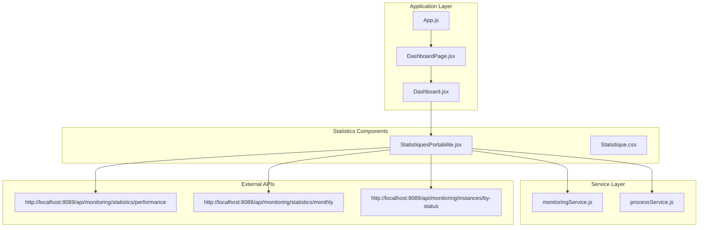
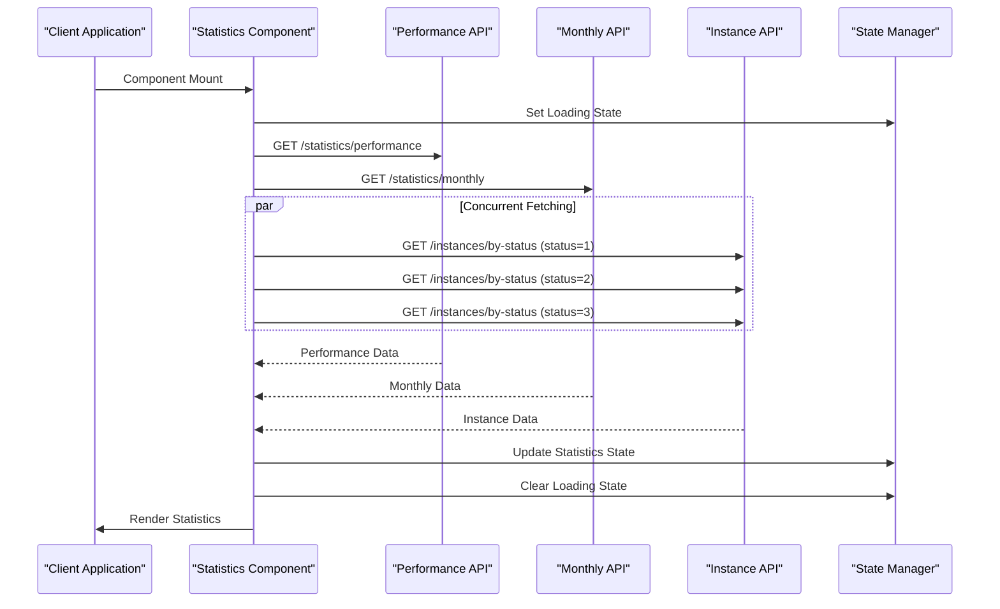
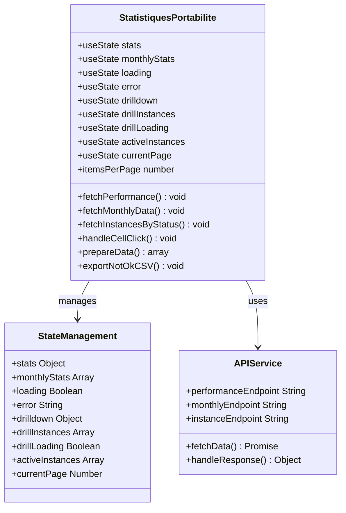
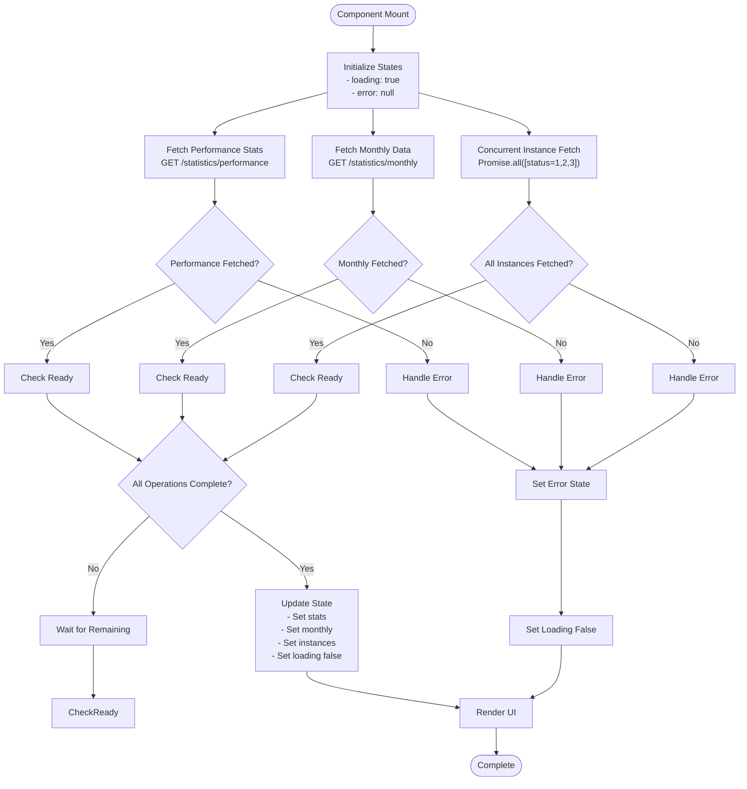
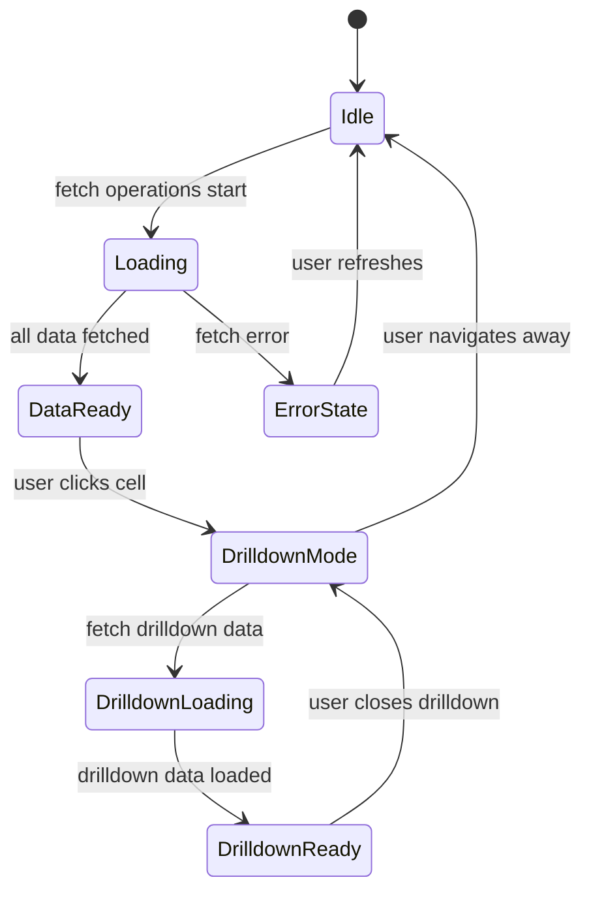
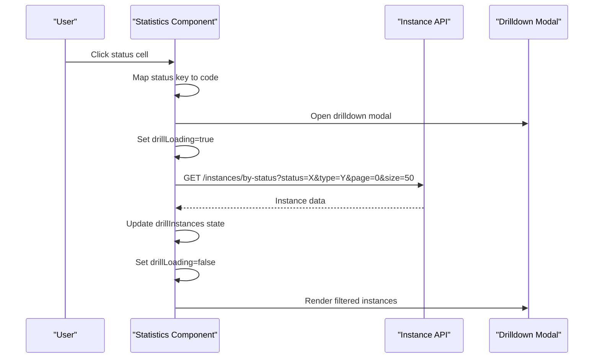
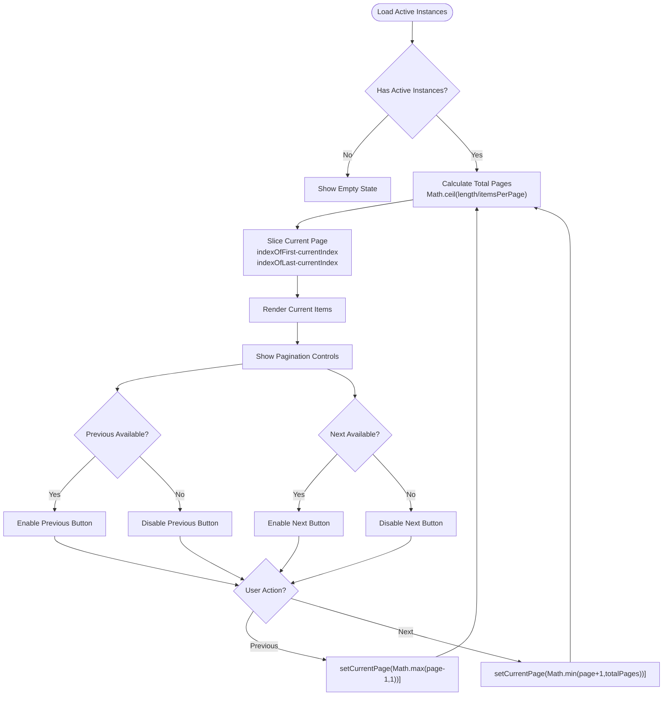
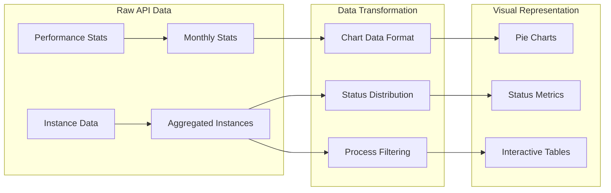
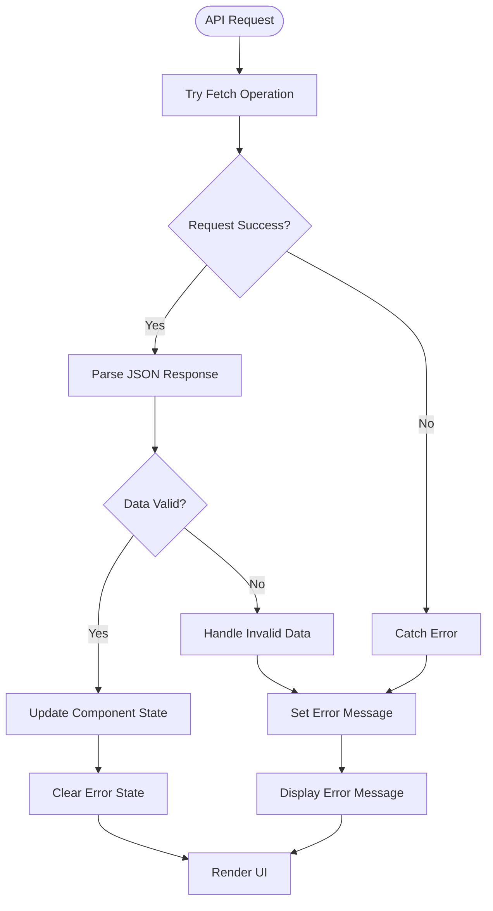
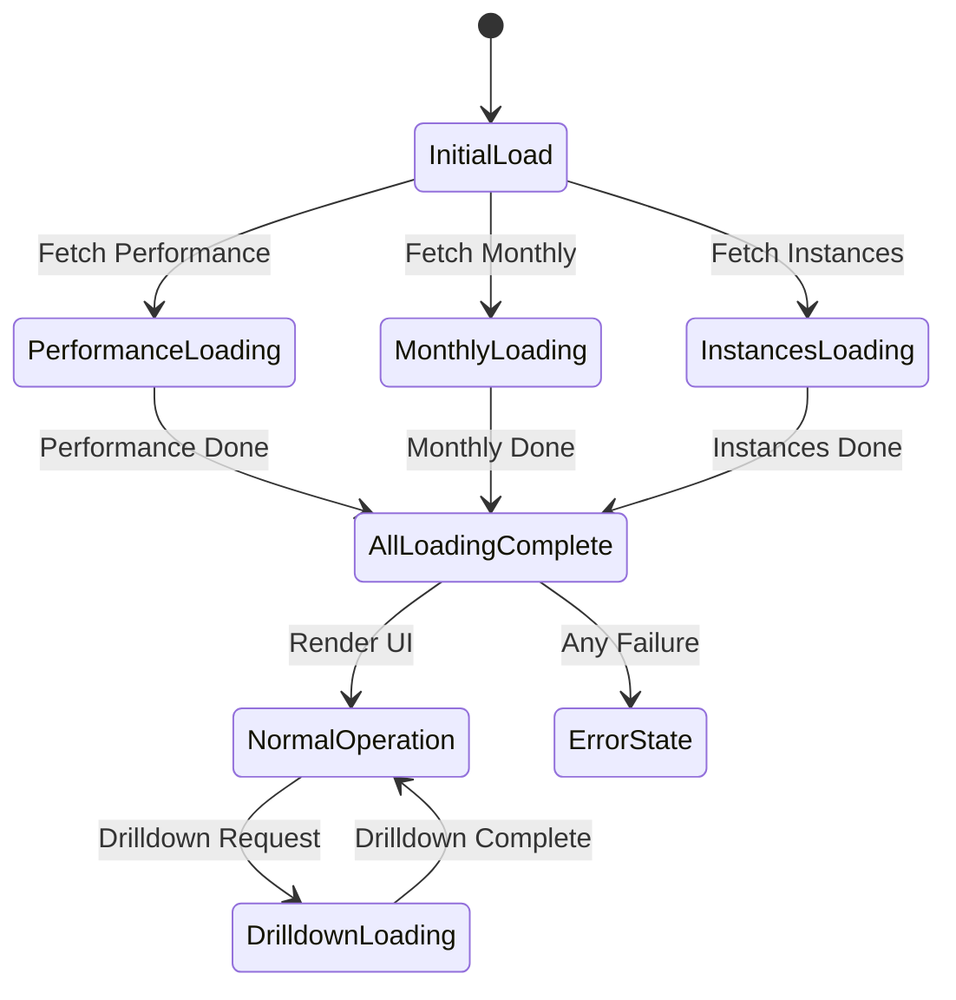

# Statistics API Integration

<cite>
**Referenced Files in This Document**
- [StatistiquesPortabilite.jsx](file://src/components/StatistiquesPortabilite.jsx)
- [Statistique.css](file://src/components/Statistique.css)
- [DashboardPage.jsx](file://src/pages/DashboardPage.jsx)
- [Dashboard.jsx](file://src/components/dashboard/Dashboard.jsx)
- [monitoringService.js](file://src/services/monitoringService.js)
- [processService.js](file://src/services/processService.js)
- [App.js](file://src/App.js)
</cite>

## Table of Contents
1. [Introduction](#introduction)
2. [Project Structure](#project-structure)
3. [Core Components](#core-components)
4. [Architecture Overview](#architecture-overview)
5. [Detailed Component Analysis](#detailed-component-analysis)
6. [API Endpoint Specifications](#api-endpoint-specifications)
7. [Concurrent Data Fetching Implementation](#concurrent-data-fetching-implementation)
8. [State Management](#state-management)
9. [Drilldown Functionality](#drilldown-functionality)
10. [Pagination Implementation](#pagination-implementation)
11. [Data Aggregation Patterns](#data-aggregation-patterns)
12. [Error Handling Strategies](#error-handling-strategies)
13. [Loading State Management](#loading-state-management)
14. [Performance Considerations](#performance-considerations)
15. [Troubleshooting Guide](#troubleshooting-guide)
16. [Conclusion](#conclusion)

## Introduction

The Statistics API Integration system is a comprehensive monitoring dashboard component designed to fetch, display, and analyze process statistics for portability operations. This system integrates with backend APIs to provide real-time performance metrics, historical trends, and drilldown capabilities for detailed instance analysis.

The system consists of three primary statistical domains:
- **Performance Statistics**: Real-time completion rates and success metrics
- **Monthly Data**: Historical trend analysis and reporting
- **Instance Status Queries**: Drilldown functionality for status-specific instance retrieval

## Project Structure

The statistics integration follows a modular React architecture with clear separation of concerns:



**Diagram sources**
- [App.js:1-74](file://src/App.js#L1-L74)
- [DashboardPage.jsx:1-51](file://src/pages/DashboardPage.jsx#L1-L51)
- [StatistiquesPortabilite.jsx:1-301](file://src/components/StatistiquesPortabilite.jsx#L1-L301)

**Section sources**
- [App.js:1-74](file://src/App.js#L1-L74)
- [DashboardPage.jsx:1-51](file://src/pages/DashboardPage.jsx#L1-L51)
- [StatistiquesPortabilite.jsx:1-301](file://src/components/StatistiquesPortabilite.jsx#L1-L301)

## Core Components

The statistics system comprises several key components working together to provide comprehensive monitoring capabilities:

### Primary Statistics Component
The main statistics component (`StatistiquesPortabilite.jsx`) serves as the central hub for all statistical operations, managing state, coordinating API calls, and rendering visualizations.

### Supporting Services
- **Monitoring Service**: Handles search operations and demandes retrieval
- **Process Service**: Manages process-related API interactions with configurable pagination

### Visual Presentation Layer
The CSS module provides comprehensive styling for charts, tables, and interactive elements, ensuring consistent user experience across different statistical views.

**Section sources**
- [StatistiquesPortabilite.jsx:12-63](file://src/components/StatistiquesPortabilite.jsx#L12-L63)
- [monitoringService.js:1-24](file://src/services/monitoringService.js#L1-L24)
- [processService.js:1-38](file://src/services/processService.js#L1-L38)

## Architecture Overview

The statistics API integration follows a client-side architecture pattern optimized for concurrent data fetching and real-time updates:



**Diagram sources**
- [StatistiquesPortabilite.jsx:28-63](file://src/components/StatistiquesPortabilite.jsx#L28-L63)

The architecture implements several key design patterns:

1. **Concurrent Data Fetching**: Utilizes Promise.all for simultaneous API calls
2. **State Management**: Centralized state handling for statistics, loading, and error states
3. **Modular Design**: Separation of concerns between data fetching, processing, and presentation
4. **Error Resilience**: Comprehensive error handling and fallback mechanisms

## Detailed Component Analysis

### Statistics Component Implementation

The main statistics component implements a sophisticated data fetching and visualization system:



**Diagram sources**
- [StatistiquesPortabilite.jsx:12-135](file://src/components/StatistiquesPortabilite.jsx#L12-L135)

#### Key Implementation Features

**State Management Architecture**:
- Centralized state management using React hooks
- Separate state slices for different statistical domains
- Coordinated loading states for concurrent operations

**Data Processing Pipeline**:
- Real-time data aggregation from multiple sources
- Dynamic chart data preparation
- Interactive drilldown capability

**Visual Components**:
- Performance cards for key metrics
- Pie charts for status distribution
- Bar charts for monthly trends
- Interactive tables with pagination

**Section sources**
- [StatistiquesPortabilite.jsx:12-135](file://src/components/StatistiquesPortabilite.jsx#L12-L135)

## API Endpoint Specifications

The statistics system interacts with three primary API endpoints, each serving specific statistical purposes:

### Performance Statistics Endpoint
**Endpoint**: `GET http://localhost:8089/api/monitoring/statistics/performance`

**Purpose**: Retrieves real-time performance metrics including completion rates and success percentages.

**Response Structure**:
```json
{
  "successRateIN": 95.5,
  "successRateOUT": 92.3,
  "PortabilityIN": {
    "total": 1500,
    "completed": 1425,
    "aborted": 75,
    "active": 0
  },
  "PortabilityOUT": {
    "total": 1200,
    "completed": 1152,
    "aborted": 48,
    "active": 0
  }
}
```

### Monthly Statistics Endpoint
**Endpoint**: `GET http://localhost:8089/api/monitoring/statistics/monthly`

**Purpose**: Provides historical monthly data for trend analysis and reporting.

**Response Structure**:
```json
[
  {
    "month": "2024-01",
    "PortabilityIN": 120,
    "PortabilityOUT": 95
  },
  {
    "month": "2024-02",
    "PortabilityIN": 135,
    "PortabilityOUT": 110
  }
]
```

### Instance Status Endpoint
**Endpoint**: `GET http://localhost:8089/api/monitoring/instances/by-status`

**Parameters**:
- `status`: Integer (1=Active, 2=Completed, 3=Aborted)
- `type`: String (filter by process type)
- `page`: Integer (pagination page number)
- `size`: Integer (number of items per page)

**Response Structure**:
```json
[
  {
    "id": "12345",
    "processId": 928,
    "type": "IN",
    "startDate": "2024-01-15T10:30:00Z",
    "nodeName": "node-01",
    "statusTime": "OK"
  }
]
```

**Section sources**
- [StatistiquesPortabilite.jsx:29-41](file://src/components/StatistiquesPortabilite.jsx#L29-L41)
- [StatistiquesPortabilite.jsx:73](file://src/components/StatistiquesPortabilite.jsx#L73)

## Concurrent Data Fetching Implementation

The system implements sophisticated concurrent data fetching using Promise.all to optimize performance and reduce total loading time:



**Diagram sources**
- [StatistiquesPortabilite.jsx:28-63](file://src/components/StatistiquesPortabilite.jsx#L28-L63)

### Implementation Details

**Promise.all Configuration**:
- Executes three instance status queries concurrently
- Uses status codes 1, 2, and 3 for Active, Completed, and Aborted respectively
- Employs large page sizes (1000) to minimize subsequent requests
- Aggregates results into unified instance collection

**Error Handling Strategy**:
- Individual error handling for each fetch operation
- Graceful degradation when partial data is available
- Centralized error state management

**Performance Optimization**:
- Eliminates sequential blocking calls
- Reduces total network latency
- Minimizes UI blocking during data loading

**Section sources**
- [StatistiquesPortabilite.jsx:38-61](file://src/components/StatistiquesPortabilite.jsx#L38-L61)

## State Management

The statistics system employs a comprehensive state management strategy covering all operational aspects:

### Core State Variables

| State Variable | Type | Purpose | Lifecycle |
|---------------|------|---------|-----------|
| `stats` | Object | Performance statistics data | Updated once, persists until refresh |
| `monthlyStats` | Array | Historical monthly data | Updated once, persists until refresh |
| `loading` | Boolean | Overall loading state | Toggled during fetch operations |
| `error` | String | Error messages | Set on failure, cleared on success |
| `drilldown` | Object | Current drilldown context | Managed by user interactions |
| `drillInstances` | Array | Drilldown instance results | Updated on drilldown selection |
| `drillLoading` | Boolean | Drilldown loading state | Toggled during drilldown fetch |
| `activeInstances` | Array | Aggregated active instances | Updated after initial fetch |

### State Update Patterns



**Diagram sources**
- [StatistiquesPortabilite.jsx:14-26](file://src/components/StatistiquesPortabilite.jsx#L14-L26)

### State Synchronization

The component maintains strict state synchronization between different statistical views:

1. **Initial Load**: All three data sources are fetched concurrently
2. **Drilldown Operations**: Separate loading states prevent UI conflicts
3. **Pagination**: Local state management ensures smooth navigation
4. **Error Recovery**: Partial data availability maintains system usability

**Section sources**
- [StatistiquesPortabilite.jsx:14-26](file://src/components/StatistiquesPortabilite.jsx#L14-L26)

## Drilldown Functionality

The drilldown system enables detailed analysis of specific status categories with comprehensive filtering capabilities:

### Drilldown Workflow



**Diagram sources**
- [StatistiquesPortabilite.jsx:65-77](file://src/components/StatistiquesPortabilite.jsx#L65-L77)

### Drilldown Configuration

**Status Mapping**:
- Active: status=1, label="Active"
- Completed: status=2, label="Completed"  
- Aborted: status=3, label="Aborted"

**Filtering Capabilities**:
- Status-based filtering using numeric codes
- Type-based filtering for process categorization
- Pagination support for large result sets
- Real-time loading indicators

**User Experience Features**:
- Modal overlay with backdrop blur
- Responsive modal sizing (up to 1200px width)
- Smooth transitions and animations
- Close functionality with escape key support

**Section sources**
- [StatistiquesPortabilite.jsx:65-77](file://src/components/StatistiquesPortabilite.jsx#L65-L77)

## Pagination Implementation

The system implements efficient pagination for managing large datasets of active instances:

### Pagination Logic



**Diagram sources**
- [StatistiquesPortabilite.jsx:101-104](file://src/components/StatistiquesPortabilite.jsx#L101-L104)

### Pagination Configuration

**Settings**:
- Items per page: 10 instances
- Page indexing: 0-based internally, 1-based for user interface
- Navigation controls: Previous/Next buttons with disabled states
- Page indicators: Current page and total pages display

**Performance Considerations**:
- Client-side slicing prevents unnecessary re-renders
- Efficient array operations using slice method
- Minimal state updates during navigation
- Responsive design adapts to different screen sizes

**Section sources**
- [StatistiquesPortabilite.jsx:101-104](file://src/components/StatistiquesPortabilite.jsx#L101-L104)

## Data Aggregation Patterns

The statistics system implements sophisticated data aggregation patterns to present meaningful insights from raw API responses:

### Statistical Data Preparation



**Diagram sources**
- [StatistiquesPortabilite.jsx:81-85](file://src/components/StatistiquesPortabilite.jsx#L81-L85)

### Aggregation Strategies

**Performance Metrics**:
- Success rate calculations using completion/total ratios
- Percentage formatting with one decimal place precision
- Color-coded displays for visual distinction (IN vs OUT)

**Status Distribution**:
- Dynamic chart data generation from raw statistics
- Color mapping for consistent visual representation
- Tooltips and legends for enhanced readability

**Instance Management**:
- Multi-source aggregation combining different status types
- Process ID filtering for specific instance identification
- Status validation with case-insensitive comparison

**Section sources**
- [StatistiquesPortabilite.jsx:81-85](file://src/components/StatistiquesPortabilite.jsx#L81-L85)

## Error Handling Strategies

The statistics system implements comprehensive error handling strategies to ensure robust operation under various failure scenarios:

### Error Handling Architecture



**Diagram sources**
- [StatistiquesPortabilite.jsx:29-37](file://src/components/StatistiquesPortabilite.jsx#L29-L37)

### Error Scenarios and Responses

**Network Failures**:
- Individual API failure isolation
- Graceful degradation with partial data
- User-friendly error messaging

**Data Validation Errors**:
- JSON parsing error handling
- Schema validation for expected structures
- Default value provision for missing fields

**UI Error States**:
- Dedicated error display components
- Loading state management during failures
- Automatic retry mechanisms where appropriate

**Section sources**
- [StatistiquesPortabilite.jsx:29-37](file://src/components/StatistiquesPortabilite.jsx#L29-L37)

## Loading State Management

The system implements sophisticated loading state management to provide responsive user feedback during data operations:

### Loading State Hierarchy



**Diagram sources**
- [StatistiquesPortabilite.jsx:16-21](file://src/components/StatistiquesPortabilite.jsx#L16-L21)

### Loading State Implementation

**Global Loading**:
- Single loading indicator for initial data fetch
- Combined state management for concurrent operations
- Progress indication during long-running requests

**Drilldown Loading**:
- Separate loading state for drilldown operations
- Prevents UI conflicts during nested operations
- Maintains context awareness during drilldown

**User Feedback**:
- Text-based loading indicators ("Chargement...")
- Visual cues for operation progress
- Immediate feedback on user interactions

**Section sources**
- [StatistiquesPortabilite.jsx:16-21](file://src/components/StatistiquesPortabilite.jsx#L16-L21)

## Performance Considerations

The statistics system incorporates several performance optimization strategies:

### Network Optimization
- **Concurrent Fetching**: Promise.all reduces total loading time
- **Efficient Payloads**: Large page sizes minimize request overhead
- **Caching Strategy**: Client-side caching of frequently accessed data

### Memory Management
- **State Cleanup**: Proper cleanup of event listeners and timers
- **Component Unmounting**: Prevention of memory leaks during navigation
- **Data Pruning**: Removal of unused data from state

### Rendering Optimization
- **Conditional Rendering**: Only renders when data is available
- **Pure Components**: Minimizes unnecessary re-renders
- **Virtual Scrolling**: Consideration for very large datasets

### Scalability Factors
- **API Rate Limiting**: Respectful request patterns
- **Error Boundaries**: Prevent cascading failures
- **Graceful Degradation**: Functional UI with partial data

## Troubleshooting Guide

### Common Issues and Solutions

**API Connectivity Problems**:
- Verify backend service availability on port 8089
- Check network connectivity between frontend and backend
- Monitor CORS configuration for cross-origin requests

**Data Display Issues**:
- Validate API response schemas match expected structures
- Check for timezone and date formatting inconsistencies
- Verify chart library compatibility and version requirements

**Performance Issues**:
- Monitor network request timing and response sizes
- Implement request debouncing for rapid user interactions
- Consider implementing request cancellation for route changes

**State Management Problems**:
- Verify proper state initialization and cleanup
- Check for race conditions in concurrent operations
- Validate state update patterns prevent infinite loops

### Debugging Tools and Techniques

**Console Logging**:
- Strategic logging of API responses and state changes
- Performance timing for critical operations
- Error stack traces for debugging failed requests

**Development Tools**:
- React Developer Tools for state inspection
- Network tab monitoring for API requests
- Performance tab for rendering optimization

**Section sources**
- [StatistiquesPortabilite.jsx:51-57](file://src/components/StatistiquesPortabilite.jsx#L51-L57)

## Conclusion

The Statistics API Integration system represents a comprehensive solution for monitoring and analyzing portability process statistics. Through its sophisticated implementation of concurrent data fetching, robust state management, and intuitive user interface, it provides valuable insights into system performance and operational health.

Key achievements include:

- **Optimized Performance**: Concurrent API operations reduce total loading time significantly
- **Robust Error Handling**: Comprehensive error management ensures system resilience
- **Scalable Architecture**: Modular design supports future enhancements and extensions
- **User-Centric Design**: Intuitive drilldown functionality and responsive interfaces

The system serves as a foundation for advanced monitoring capabilities and can be extended to support additional statistical measures, enhanced visualization options, and integration with other monitoring systems.