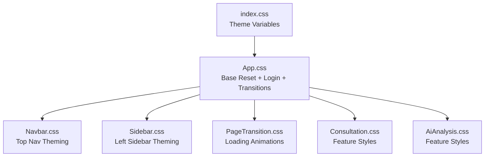
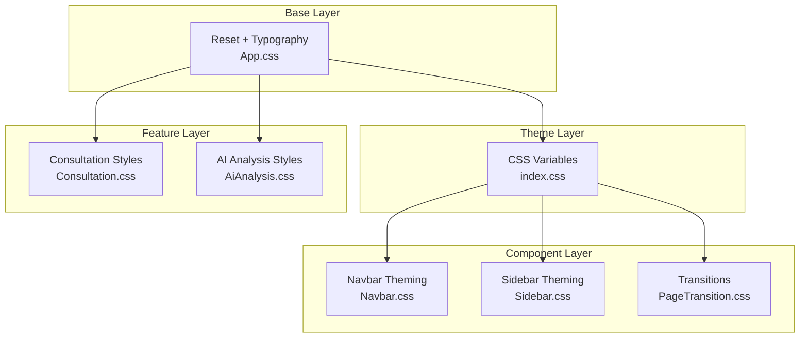
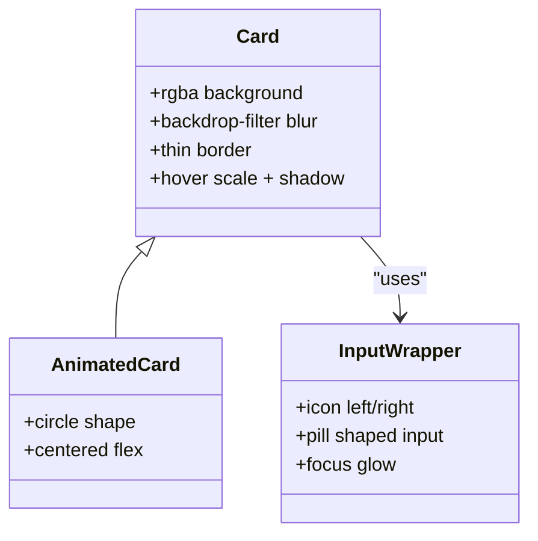
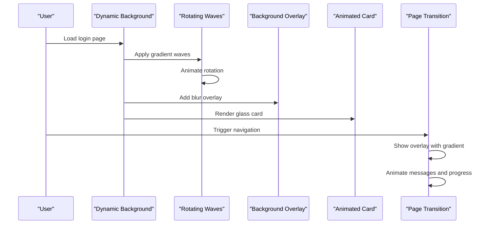
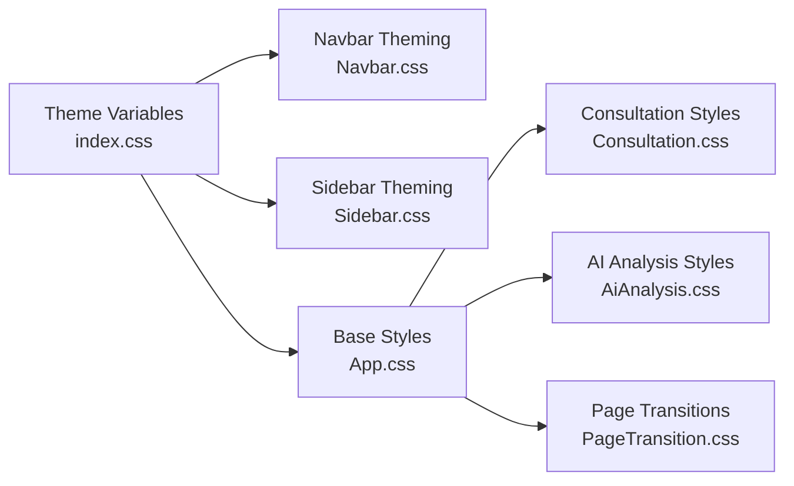

# Global Base Styles

<cite>
**Referenced Files in This Document**
- [App.css](file://src/App.css)
- [index.css](file://src/index.css)
- [PageTransition.css](file://src/components/PageTransition.css)
- [Navbar.css](file://src/components/layout/Navbar.css)
- [Sidebar.css](file://src/components/layout/Sidebar.css)
- [Consultation.css](file://src/components/Consultation.css)
- [AiAnalysis.css](file://src/components/AiAnalysis.css)
</cite>

## Table of Contents
1. [Introduction](#introduction)
2. [Project Structure](#project-structure)
3. [Core Components](#core-components)
4. [Architecture Overview](#architecture-overview)
5. [Detailed Component Analysis](#detailed-component-analysis)
6. [Dependency Analysis](#dependency-analysis)
7. [Performance Considerations](#performance-considerations)
8. [Troubleshooting Guide](#troubleshooting-guide)
9. [Conclusion](#conclusion)

## Introduction
This document describes the global base styles and foundational CSS architecture of SmartPorta. It covers the CSS reset system, typography defaults, dark theme foundation, glassmorphism design principles, responsive breakpoints, animation system, color palette and gradients, and reusable patterns that unify the application’s visual identity.

## Project Structure
SmartPorta organizes its foundational CSS across several key files:
- Global resets and base styles: [App.css](file://src/App.css)
- Theme variables and light/dark modes: [index.css](file://src/index.css)
- Page transitions and loading animations: [PageTransition.css](file://src/components/PageTransition.css)
- Navigation and sidebar theming: [Navbar.css](file://src/components/layout/Navbar.css), [Sidebar.css](file://src/components/layout/Sidebar.css)
- Feature-specific styles (examples): [Consultation.css](file://src/components/Consultation.css), [AiAnalysis.css](file://src/components/AiAnalysis.css)

**Diagram sources**
- [index.css:1-42](file://src/index.css#L1-L42)
- [App.css:1-13](file://src/App.css#L1-L13)
- [Navbar.css:1-243](file://src/components/layout/Navbar.css#L1-L243)
- [Sidebar.css:1-254](file://src/components/layout/Sidebar.css#L1-L254)
- [PageTransition.css:1-35](file://src/components/PageTransition.css#L1-L35)
- [Consultation.css:1-551](file://src/components/Consultation.css#L1-L551)
- [AiAnalysis.css:1-682](file://src/components/AiAnalysis.css#L1-L682)

**Section sources**
- [index.css:1-42](file://src/index.css#L1-L42)
- [App.css:1-13](file://src/App.css#L1-L13)

## Core Components
- CSS Reset and Base Typography
  - Universal box sizing and zero margins/paddings
  - Root font family and body min-height baseline
  - See [App.css:2-13](file://src/App.css#L2-L13)

- Dark Theme Foundation
  - CSS variables for light and dark themes
  - Body-level theme switching with transitions
  - See [index.css:5-38](file://src/index.css#L5-L38)

- Glassmorphism Design System
  - Backdrop blur, semi-transparent backgrounds, thin borders
  - Card hover transforms and shadows
  - See [App.css:80-105](file://src/App.css#L80-L105), [App.css:441-459](file://src/App.css#L441-L459)

- Wave Backgrounds and Page Transitions
  - Rotating blurred gradient waves behind login screens
  - Animated progress bars and pulsing dots during transitions
  - See [App.css:18-63](file://src/App.css#L18-L63), [App.css:312-439](file://src/App.css#L312-L439)

- Responsive Breakpoints
  - Mobile-first approach with media queries for cards, split layouts, and navigation
  - See [App.css:290-307](file://src/App.css#L290-L307), [App.css:601-615](file://src/App.css#L601-L615), [App.css:693-705](file://src/App.css#L693-L705), [App.css:855-863](file://src/App.css#L855-L863)

- Color Palette and Gradients
  - Primary brand orange (#ff6600) and complementary purple/pink tones
  - Gradient overlays for wave backgrounds and sidebar
  - See [App.css:35](file://src/App.css#L35), [App.css:407](file://src/App.css#L407), [Sidebar.css:8-11](file://src/components/layout/Sidebar.css#L8-L11)

- Reusable Patterns and Utility Classes
  - Input wrappers with icons, pill-shaped inputs, and focused states
  - Button variants with hover and disabled states
  - Status badges and compact pagination
  - See [App.css:173-203](file://src/App.css#L173-L203), [App.css:206-237](file://src/App.css#L206-L237), [Consultation.css:197-208](file://src/components/Consultation.css#L197-L208), [Consultation.css:212-250](file://src/components/Consultation.css#L212-L250)

**Section sources**
- [App.css:18-63](file://src/App.css#L18-L63)
- [App.css:80-105](file://src/App.css#L80-L105)
- [App.css:173-237](file://src/App.css#L173-L237)
- [index.css:5-38](file://src/index.css#L5-L38)
- [Sidebar.css:8-11](file://src/components/layout/Sidebar.css#L8-L11)
- [Consultation.css:197-250](file://src/components/Consultation.css#L197-L250)

## Architecture Overview
The CSS architecture follows a layered approach:
- Base layer: reset and typography in [App.css](file://src/App.css)
- Theme layer: CSS variables and theme switching in [index.css](file://src/index.css)
- Component layer: navigation, sidebar, and page transitions in [Navbar.css](file://src/components/layout/Navbar.css), [Sidebar.css](file://src/components/layout/Sidebar.css), [PageTransition.css](file://src/components/PageTransition.css)
- Feature layer: domain-specific styles in [Consultation.css](file://src/components/Consultation.css), [AiAnalysis.css](file://src/components/AiAnalysis.css)
- Login and transition layer: wave backgrounds and animated cards in [App.css](file://src/App.css)

**Diagram sources**
- [App.css:1-13](file://src/App.css#L1-L13)
- [index.css:5-38](file://src/index.css#L5-L38)
- [Navbar.css:1-243](file://src/components/layout/Navbar.css#L1-L243)
- [Sidebar.css:1-254](file://src/components/layout/Sidebar.css#L1-L254)
- [PageTransition.css:1-35](file://src/components/PageTransition.css#L1-L35)
- [Consultation.css:1-551](file://src/components/Consultation.css#L1-L551)
- [AiAnalysis.css:1-682](file://src/components/AiAnalysis.css#L1-L682)

## Detailed Component Analysis

### CSS Reset and Typography Defaults
- Applies universal box-sizing and removes default margins/paddings
- Sets a root font stack and ensures body min-height
- Establishes a consistent baseline for all components

**Section sources**
- [App.css:2-13](file://src/App.css#L2-L13)

### Dark Theme Foundation
- Defines CSS variables for light and dark modes
- Uses :root and body selectors to apply theme classes
- Provides smooth transitions for background and text color
- Navbar and dropdown theming leverage the same variables

**Section sources**
- [index.css:5-38](file://src/index.css#L5-L38)
- [Navbar.css:103-142](file://src/components/layout/Navbar.css#L103-L142)
- [Sidebar.css:135-190](file://src/components/layout/Sidebar.css#L135-L190)

### Glassmorphism Design Principles
- Cards use rgba backgrounds, backdrop-filter blur, and thin borders
- Hover states increase scale and shadow intensity
- Circular card variant for login with centered content
- Input wrappers integrate icons with pill-shaped inputs and focused glow

**Diagram sources**
- [App.css:80-105](file://src/App.css#L80-L105)
- [App.css:173-203](file://src/App.css#L173-L203)
- [App.css:441-459](file://src/App.css#L441-L459)

**Section sources**
- [App.css:80-105](file://src/App.css#L80-L105)
- [App.css:173-203](file://src/App.css#L173-L203)
- [App.css:441-459](file://src/App.css#L441-L459)

### Wave Backgrounds and Page Transitions
- Dynamic login background with rotating blurred gradient waves
- Overlay improves readability; animated messages and progress indicators
- Page transition container with gradient overlay and animated content

**Diagram sources**
- [App.css:18-75](file://src/App.css#L18-L75)
- [App.css:312-439](file://src/App.css#L312-L439)

**Section sources**
- [App.css:18-75](file://src/App.css#L18-L75)
- [App.css:312-439](file://src/App.css#L312-L439)

### Responsive Breakpoints and Layouts
- Mobile-first media queries adjust card sizes, form widths, and icon spacing
- Split layout for login adapts to tablet/mobile by hiding decorative imagery
- Sidebar transforms on small screens for mobile navigation

**Section sources**
- [App.css:290-307](file://src/App.css#L290-L307)
- [App.css:601-615](file://src/App.css#L601-L615)
- [App.css:693-705](file://src/App.css#L693-L705)
- [Sidebar.css:119-130](file://src/components/layout/Sidebar.css#L119-L130)

### Animation System
- Keyframe animations for wave rotation, floating lock, message appearance, progress fill, and dot pulse
- Fade-in animations for page transitions and welcome messages
- Consistent timing and easing across interactive states

**Section sources**
- [App.css:60-63](file://src/App.css#L60-L63)
- [App.css:594-598](file://src/App.css#L594-L598)
- [App.css:387-390](file://src/App.css#L387-L390)
- [App.css:413-416](file://src/App.css#L413-L416)
- [App.css:436-439](file://src/App.css#L436-L439)
- [App.css:963-966](file://src/App.css#L963-L966)

### Color Palette and Gradients
- Primary brand orange (#ff6600) used for buttons, highlights, and accents
- Complementary purple/pink gradients for wave backgrounds
- Sidebar uses deep violet-to-black gradient
- Status badges and action buttons reflect consistent color semantics

**Section sources**
- [App.css:35](file://src/App.css#L35)
- [App.css:407](file://src/App.css#L407)
- [Sidebar.css:8-11](file://src/components/layout/Sidebar.css#L8-L11)
- [Consultation.css:205-207](file://src/components/Consultation.css#L205-L207)

### Reusable Patterns and Utility Classes
- Input wrapper with left/right icons and pill-shaped inputs
- Button variants: primary, secondary, export actions, and action buttons
- Status badges and pagination controls
- Modal and detail panels with consistent spacing and shadows

**Section sources**
- [App.css:173-237](file://src/App.css#L173-L237)
- [Consultation.css:102-130](file://src/components/Consultation.css#L102-L130)
- [Consultation.css:197-250](file://src/components/Consultation.css#L197-L250)
- [Consultation.css:259-361](file://src/components/Consultation.css#L259-L361)

## Dependency Analysis
- Theme variables in [index.css](file://src/index.css) drive all component colors and backgrounds
- [App.css](file://src/App.css) defines foundational patterns consumed by feature pages
- Navigation and sidebar styles depend on theme variables and layout containers
- Page transitions rely on shared animation keyframes and overlay containers

**Diagram sources**
- [index.css:5-38](file://src/index.css#L5-L38)
- [Navbar.css:168-190](file://src/components/layout/Navbar.css#L168-L190)
- [Sidebar.css:135-190](file://src/components/layout/Sidebar.css#L135-L190)
- [App.css:1-13](file://src/App.css#L1-L13)
- [Consultation.css:1-551](file://src/components/Consultation.css#L1-L551)
- [AiAnalysis.css:1-682](file://src/components/AiAnalysis.css#L1-L682)
- [PageTransition.css:1-35](file://src/components/PageTransition.css#L1-L35)

**Section sources**
- [index.css:5-38](file://src/index.css#L5-L38)
- [App.css:1-13](file://src/App.css#L1-L13)

## Performance Considerations
- Prefer CSS transforms and opacity for animations to leverage GPU acceleration
- Use backdrop-filter judiciously; consider fallbacks for older browsers
- Minimize heavy blur effects on low-end devices; test with reduced blur on mobile
- Consolidate repeated animations and keyframes to reduce CSS size

## Troubleshooting Guide
- Theme not applying: ensure theme classes are present on the body element and CSS variables are defined
- Glass card not visible: verify backdrop-filter support and rgba values; confirm z-index stacking order
- Login layout broken on small screens: check media query breakpoints and ensure flex properties are preserved
- Page transition not animating: confirm overlay classes and keyframe animations are included

**Section sources**
- [index.css:5-38](file://src/index.css#L5-L38)
- [App.css:80-105](file://src/App.css#L80-L105)
- [App.css:290-307](file://src/App.css#L290-L307)
- [PageTransition.css:1-35](file://src/components/PageTransition.css#L1-L35)

## Conclusion
SmartPorta’s CSS foundation establishes a cohesive design system through a layered architecture: reset and typography, theme variables, glassmorphism patterns, wave backgrounds, and responsive layouts. The color palette and gradients reinforce brand identity, while reusable patterns ensure consistency across components and pages. This structure enables scalable development and easy maintenance of the application’s visual identity.