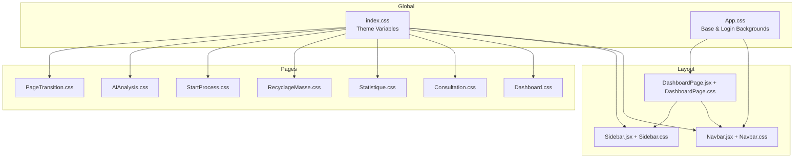
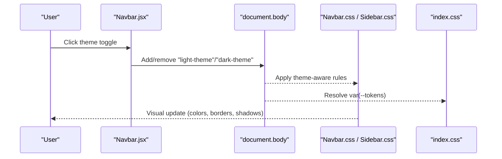
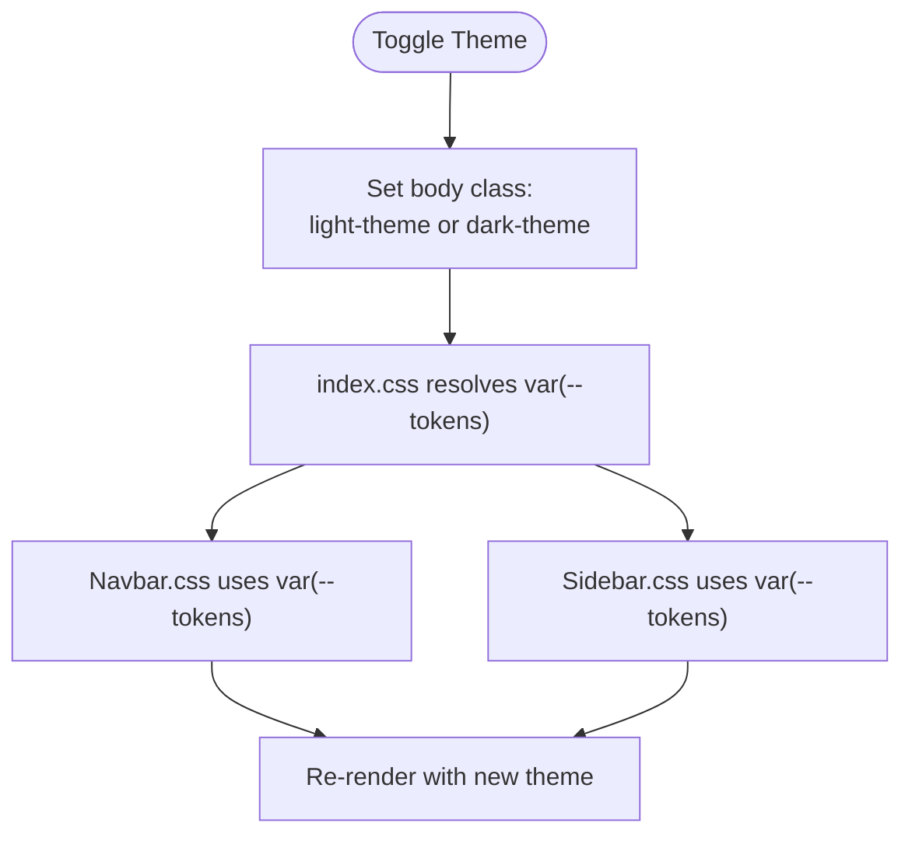
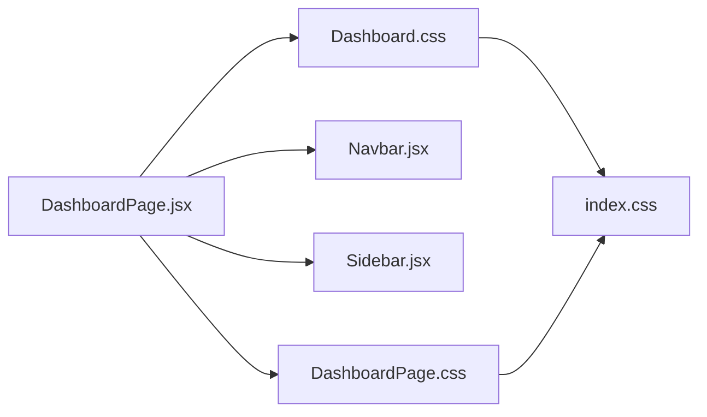
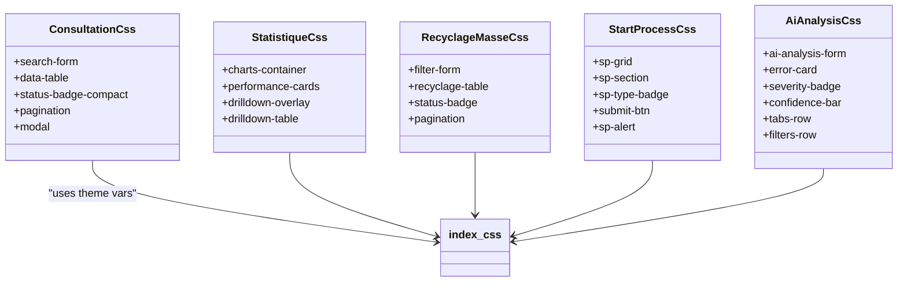
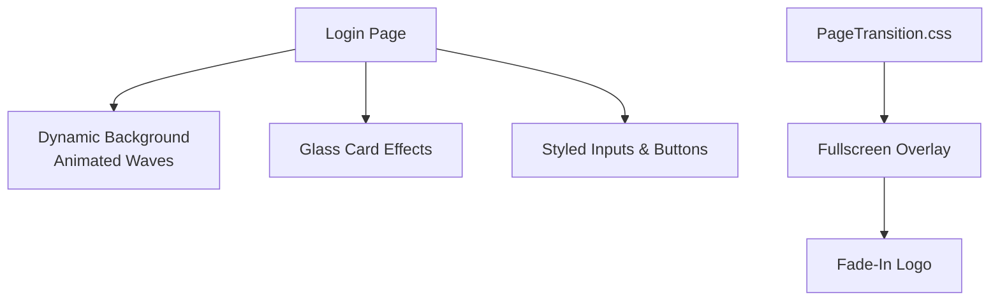
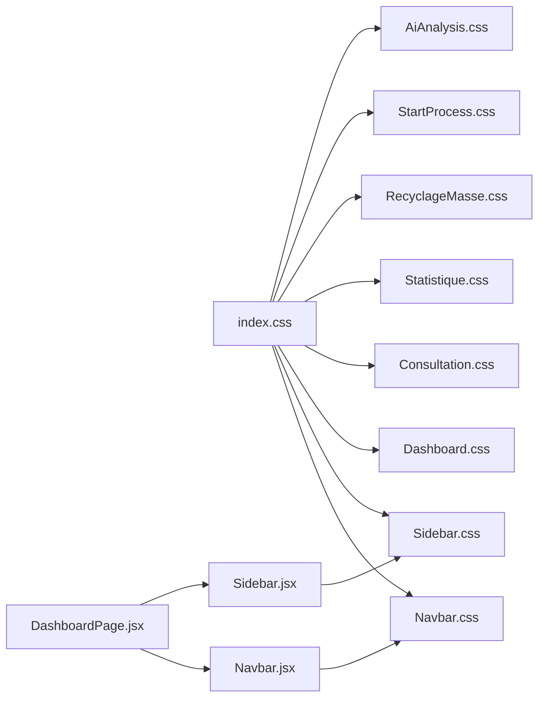

# Styling and Theming

<cite>
**Referenced Files in This Document**
- [App.css](file://src/App.css)
- [index.css](file://src/index.css)
- [Navbar.css](file://src/components/layout/Navbar.css)
- [Sidebar.css](file://src/components/layout/Sidebar.css)
- [Dashboard.css](file://src/components/dashboard/Dashboard.css)
- [DashboardPage.css](file://src/pages/DashboardPage.css)
- [AiAnalysis.css](file://src/components/AiAnalysis.css)
- [Consultation.css](file://src/components/Consultation.css)
- [Statistique.css](file://src/components/Statistique.css)
- [RecyclageMasse.css](file://src/components/RecyclageMasse.css)
- [StartProcess.css](file://src/components/StartProcess.css)
- [PageTransition.css](file://src/components/PageTransition.css)
- [App.js](file://src/App.js)
- [Navbar.jsx](file://src/components/layout/Navbar.jsx)
- [Sidebar.jsx](file://src/components/layout/Sidebar.jsx)
- [DashboardPage.jsx](file://src/pages/DashboardPage.jsx)
</cite>

## Table of Contents
1. [Introduction](#introduction)
2. [Project Structure](#project-structure)
3. [Core Components](#core-components)
4. [Architecture Overview](#architecture-overview)
5. [Detailed Component Analysis](#detailed-component-analysis)
6. [Dependency Analysis](#dependency-analysis)
7. [Performance Considerations](#performance-considerations)
8. [Troubleshooting Guide](#troubleshooting-guide)
9. [Conclusion](#conclusion)
10. [Appendices](#appendices)

## Introduction
This document explains the SmartPorta styling and theming system. It covers the CSS architecture, component-specific styling approaches, theme management, responsive design, and visual consistency guidelines. It also documents the theme switching mechanism, color scheme management, and practical customization strategies.

## Project Structure
SmartPorta organizes styles by feature and component. Global baseline styles live in the root stylesheet, while theme variables are centralized in the index stylesheet. Component-specific styles reside alongside their React components. The dashboard page composes the layout with a fixed navbar and collapsible sidebar.

**Diagram sources**
- [index.css:1-42](file://src/index.css#L1-L42)
- [App.css:1-967](file://src/App.css#L1-L967)
- [Navbar.jsx:1-124](file://src/components/layout/Navbar.jsx#L1-L124)
- [Navbar.css:1-243](file://src/components/layout/Navbar.css#L1-L243)
- [Sidebar.jsx:1-167](file://src/components/layout/Sidebar.jsx#L1-L167)
- [Sidebar.css:1-254](file://src/components/layout/Sidebar.css#L1-L254)
- [DashboardPage.jsx:1-51](file://src/pages/DashboardPage.jsx#L1-L51)
- [DashboardPage.css:1-91](file://src/pages/DashboardPage.css#L1-L91)
- [Dashboard.css:1-139](file://src/components/dashboard/Dashboard.css#L1-L139)
- [Consultation.css:1-551](file://src/components/Consultation.css#L1-L551)
- [Statistique.css:1-698](file://src/components/Statistique.css#L1-L698)
- [RecyclageMasse.css:1-336](file://src/components/RecyclageMasse.css#L1-L336)
- [StartProcess.css:1-326](file://src/components/StartProcess.css#L1-L326)
- [AiAnalysis.css:1-682](file://src/components/AiAnalysis.css#L1-L682)
- [PageTransition.css:1-35](file://src/components/PageTransition.css#L1-L35)

**Section sources**
- [App.js:1-74](file://src/App.js#L1-L74)
- [DashboardPage.jsx:1-51](file://src/pages/DashboardPage.jsx#L1-L51)

## Core Components
- Theme variables and base styles: Centralized in the index stylesheet using CSS custom properties for light/dark modes. Body inherits theme variables for background, text, borders, and shadows.
- Login and page transitions: App.css defines animated backgrounds, glass card effects, and page transition overlays.
- Layout: Navbar and Sidebar apply theme-aware colors and dropdowns; they toggle theme via body classes.
- Dashboard: Dashboard.css defines dashboard wrapper, content areas, tables, and loading states with theme variables.
- Feature pages: Each page component has its own stylesheet for typography, forms, tables, badges, and responsive adjustments.

Key styling patterns:
- CSS custom properties for theme tokens.
- Component-scoped selectors with minimal global leakage.
- Responsive breakpoints embedded per component.
- Visual consistency via shared tokens (colors, shadows, borders).

**Section sources**
- [index.css:1-42](file://src/index.css#L1-L42)
- [App.css:1-967](file://src/App.css#L1-L967)
- [Navbar.css:1-243](file://src/components/layout/Navbar.css#L1-L243)
- [Sidebar.css:1-254](file://src/components/layout/Sidebar.css#L1-L254)
- [Dashboard.css:1-139](file://src/components/dashboard/Dashboard.css#L1-L139)

## Architecture Overview
The theming system relies on:
- CSS custom properties declared in the index stylesheet.
- Runtime theme toggling in Navbar.jsx that updates the body’s theme class.
- Component styles consuming theme variables via var(--token).
- Optional component-level overrides for brand-specific palettes.

**Diagram sources**
- [Navbar.jsx:18-32](file://src/components/layout/Navbar.jsx#L18-L32)
- [Navbar.css:103-142](file://src/components/layout/Navbar.css#L103-L142)
- [Sidebar.css:135-190](file://src/components/layout/Sidebar.css#L135-L190)
- [index.css:5-25](file://src/index.css#L5-L25)

## Detailed Component Analysis

### Theme Management and Switching
- Theme tokens: Declared once in index.css with fallbacks for light and dark modes.
- Runtime switching: Navbar.jsx toggles body classes and reflects active selection in the theme dropdown.
- Component consumption: Navbar.css and Sidebar.css read theme variables for backgrounds, borders, and hover states.

**Diagram sources**
- [Navbar.jsx:18-32](file://src/components/layout/Navbar.jsx#L18-L32)
- [index.css:5-25](file://src/index.css#L5-L25)
- [Navbar.css:103-142](file://src/components/layout/Navbar.css#L103-L142)
- [Sidebar.css:135-190](file://src/components/layout/Sidebar.css#L135-L190)

**Section sources**
- [index.css:1-42](file://src/index.css#L1-L42)
- [Navbar.jsx:18-32](file://src/components/layout/Navbar.jsx#L18-L32)
- [Navbar.css:103-142](file://src/components/layout/Navbar.css#L103-L142)
- [Sidebar.css:135-190](file://src/components/layout/Sidebar.css#L135-L190)

### Dashboard Layout and Theming
- Dashboard.css defines wrapper, main content area, page content blocks, tables, and loading indicators using theme variables.
- DashboardPage.css positions the layout with fixed navbar and sidebar, and applies background accents.

**Diagram sources**
- [DashboardPage.jsx:10-51](file://src/pages/DashboardPage.jsx#L10-L51)
- [DashboardPage.css:1-91](file://src/pages/DashboardPage.css#L1-L91)
- [Dashboard.css:1-139](file://src/components/dashboard/Dashboard.css#L1-L139)
- [index.css:1-42](file://src/index.css#L1-L42)

**Section sources**
- [Dashboard.css:1-139](file://src/components/dashboard/Dashboard.css#L1-L139)
- [DashboardPage.css:1-91](file://src/pages/DashboardPage.css#L1-L91)

### Component-Specific Styling Approaches
- Consultation: Inline search form, compact table rows, pagination, modal, and responsive adjustments.
- Statistics: Charts container, performance cards, drilldown overlay, and responsive layout.
- Mass Recycling: Filters, table, status badges, pagination, and bordered cards.
- Start Process: Grid-based form sections, badges, submit button, spinner, alerts, and responsive adjustments.
- AI Analysis: NetWatch-aligned palette, form controls, severity badges, confidence bars, tabs, filters, and report actions.

**Diagram sources**
- [Consultation.css:1-551](file://src/components/Consultation.css#L1-L551)
- [Statistique.css:1-698](file://src/components/Statistique.css#L1-L698)
- [RecyclageMasse.css:1-336](file://src/components/RecyclageMasse.css#L1-L336)
- [StartProcess.css:1-326](file://src/components/StartProcess.css#L1-L326)
- [AiAnalysis.css:1-682](file://src/components/AiAnalysis.css#L1-L682)
- [index.css:1-42](file://src/index.css#L1-L42)

**Section sources**
- [Consultation.css:1-551](file://src/components/Consultation.css#L1-L551)
- [Statistique.css:1-698](file://src/components/Statistique.css#L1-L698)
- [RecyclageMasse.css:1-336](file://src/components/RecyclageMasse.css#L1-L336)
- [StartProcess.css:1-326](file://src/components/StartProcess.css#L1-L326)
- [AiAnalysis.css:1-682](file://src/components/AiAnalysis.css#L1-L682)

### Login and Page Transitions
- App.css defines animated wave backgrounds, glass card effects, form inputs, buttons, and responsive adjustments for the login page.
- PageTransition.css provides a full-screen transition overlay with fade-in logo and content.

**Diagram sources**
- [App.css:18-80](file://src/App.css#L18-L80)
- [App.css:290-307](file://src/App.css#L290-L307)
- [PageTransition.css:1-35](file://src/components/PageTransition.css#L1-L35)

**Section sources**
- [App.css:1-967](file://src/App.css#L1-L967)
- [PageTransition.css:1-35](file://src/components/PageTransition.css#L1-L35)

## Dependency Analysis
- Theme dependency chain: index.css declares tokens → Navbar.jsx toggles body classes → Navbar.css/Sidebar.css consume var(--tokens).
- Component isolation: Each page stylesheet is self-contained and consumes theme variables, minimizing cross-page coupling.
- Layout composition: DashboardPage.jsx composes Navbar and Sidebar; both depend on theme variables.

**Diagram sources**
- [index.css:1-42](file://src/index.css#L1-L42)
- [Navbar.jsx:1-124](file://src/components/layout/Navbar.jsx#L1-L124)
- [Sidebar.jsx:1-167](file://src/components/layout/Sidebar.jsx#L1-L167)
- [DashboardPage.jsx:1-51](file://src/pages/DashboardPage.jsx#L1-L51)
- [Navbar.css:1-243](file://src/components/layout/Navbar.css#L1-L243)
- [Sidebar.css:1-254](file://src/components/layout/Sidebar.css#L1-L254)
- [Dashboard.css:1-139](file://src/components/dashboard/Dashboard.css#L1-L139)
- [Consultation.css:1-551](file://src/components/Consultation.css#L1-L551)
- [Statistique.css:1-698](file://src/components/Statistique.css#L1-L698)
- [RecyclageMasse.css:1-336](file://src/components/RecyclageMasse.css#L1-L336)
- [StartProcess.css:1-326](file://src/components/StartProcess.css#L1-L326)
- [AiAnalysis.css:1-682](file://src/components/AiAnalysis.css#L1-L682)

**Section sources**
- [index.css:1-42](file://src/index.css#L1-L42)
- [Navbar.jsx:18-32](file://src/components/layout/Navbar.jsx#L18-L32)
- [DashboardPage.jsx:10-51](file://src/pages/DashboardPage.jsx#L10-L51)

## Performance Considerations
- Prefer CSS custom properties for theme tokens to avoid repeated reflows and repaints during theme switches.
- Keep component styles scoped to minimize cascade and reduce specificity wars.
- Use media queries locally within component stylesheets to avoid global responsive bloat.
- Avoid heavy animations on low-end devices; consider prefers-reduced-motion checks.

## Troubleshooting Guide
- Theme not applying:
  - Verify body classes are toggled by Navbar.jsx.
  - Ensure index.css variables are present and not overridden by local declarations.
- Dropdowns or menus not visible:
  - Confirm z-index stacking contexts and positioning rules in Navbar.css and Sidebar.css.
- Sidebar overlaps content:
  - Check main content margins and widths in DashboardPage.css and Dashboard.css.
- Login page visuals broken:
  - Review App.css responsive breakpoints and background gradients.

**Section sources**
- [Navbar.jsx:18-32](file://src/components/layout/Navbar.jsx#L18-L32)
- [Navbar.css:103-142](file://src/components/layout/Navbar.css#L103-L142)
- [Sidebar.css:135-190](file://src/components/layout/Sidebar.css#L135-L190)
- [DashboardPage.css:18-22](file://src/pages/DashboardPage.css#L18-L22)
- [Dashboard.css:135-139](file://src/components/dashboard/Dashboard.css#L135-L139)
- [App.css:290-307](file://src/App.css#L290-L307)

## Conclusion
SmartPorta’s styling system centers on a single source of truth for theme tokens, runtime theme switching via body classes, and component-scoped stylesheets. This approach ensures visual consistency, maintainability, and easy customization across pages and components.

## Appendices

### CSS Organization Strategy
- Global: index.css for theme variables and base resets.
- Layout: Navbar.css and Sidebar.css for navigation and sidebar theming.
- Pages: Dashboard.css, Consultation.css, Statistique.css, RecyclageMasse.css, StartProcess.css, AiAnalysis.css for feature-specific styles.
- Transitions: PageTransition.css for splash/transition visuals.

### Class Naming Conventions
- Component-scoped classes prefixed with component name (e.g., .consultation-, .stats-, .sp-).
- Utility-like classes for layout and behavior (e.g., .page-content, .main-content-wrapper).
- Theme-aware classes that react to body classes (e.g., .light-theme, .dark-theme).

### Modular Styling Approaches
- Use CSS custom properties for colors, shadows, and borders.
- Encapsulate component stylesheets to avoid global side effects.
- Employ media queries within component stylesheets for responsiveness.

### Theme Switching Functionality
- Toggle via Navbar.jsx; updates body classes and reflects active selection.
- Components consume theme variables via var(--tokens) for immediate visual updates.

**Section sources**
- [index.css:1-42](file://src/index.css#L1-L42)
- [Navbar.jsx:18-32](file://src/components/layout/Navbar.jsx#L18-L32)
- [Navbar.css:103-142](file://src/components/layout/Navbar.css#L103-L142)
- [Sidebar.css:135-190](file://src/components/layout/Sidebar.css#L135-L190)
- [Dashboard.css:1-139](file://src/components/dashboard/Dashboard.css#L1-L139)
- [Consultation.css:1-551](file://src/components/Consultation.css#L1-L551)
- [Statistique.css:1-698](file://src/components/Statistique.css#L1-L698)
- [RecyclageMasse.css:1-336](file://src/components/RecyclageMasse.css#L1-L336)
- [StartProcess.css:1-326](file://src/components/StartProcess.css#L1-L326)
- [AiAnalysis.css:1-682](file://src/components/AiAnalysis.css#L1-L682)
- [PageTransition.css:1-35](file://src/components/PageTransition.css#L1-L35)