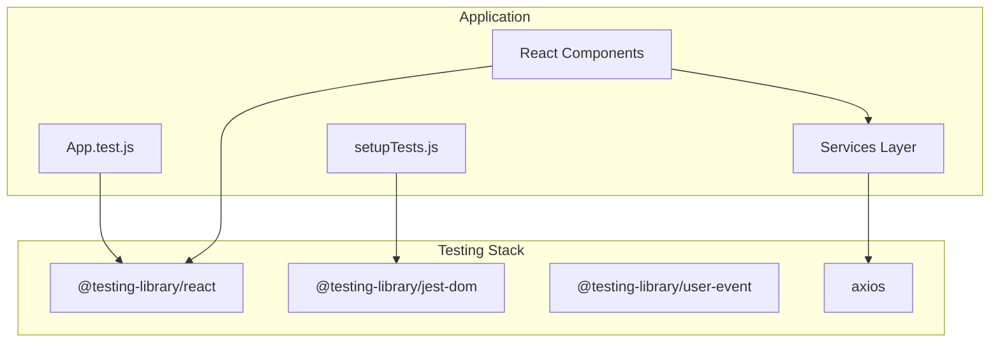
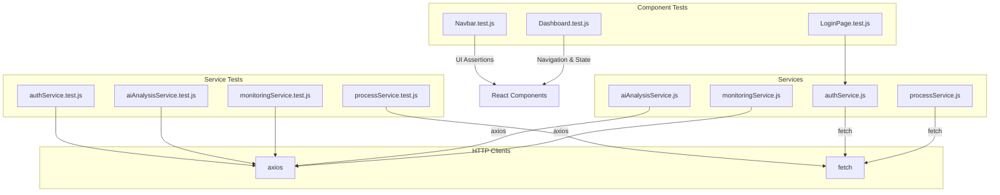
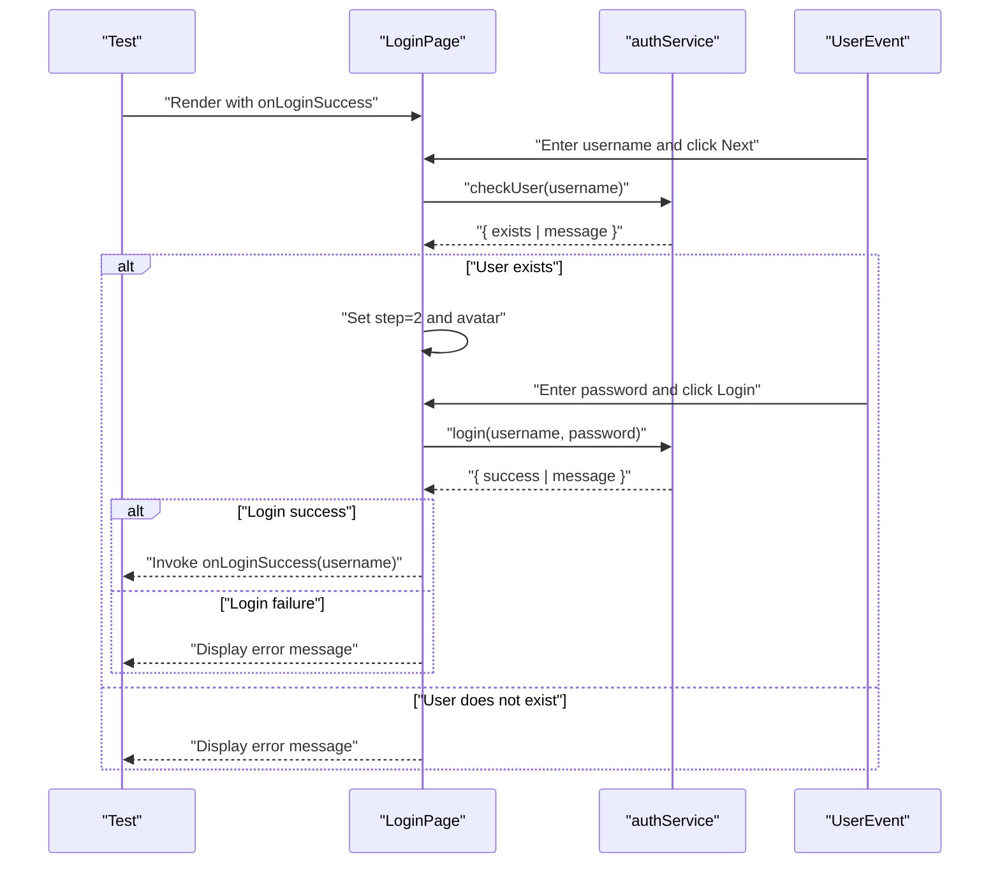
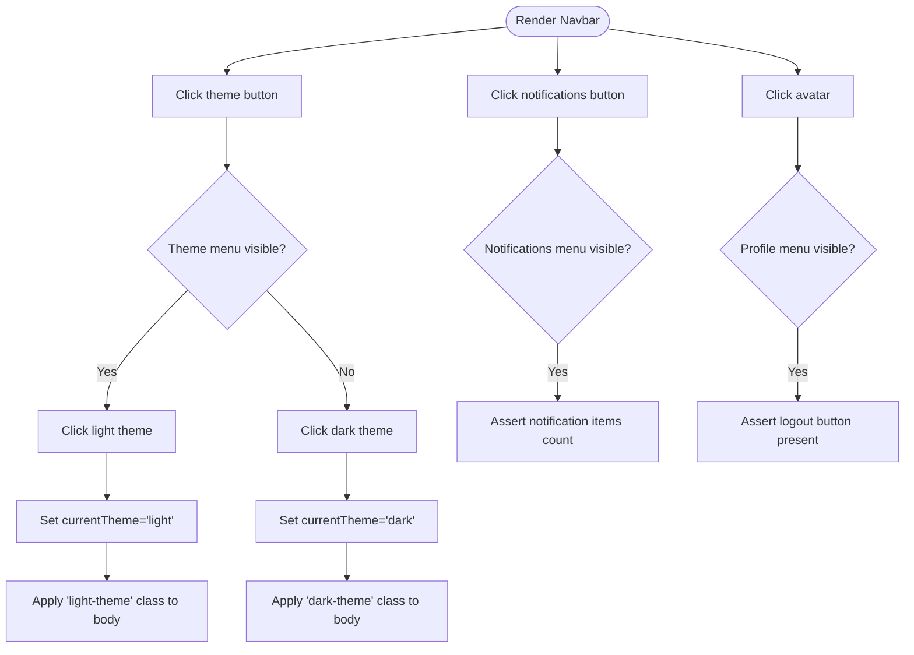
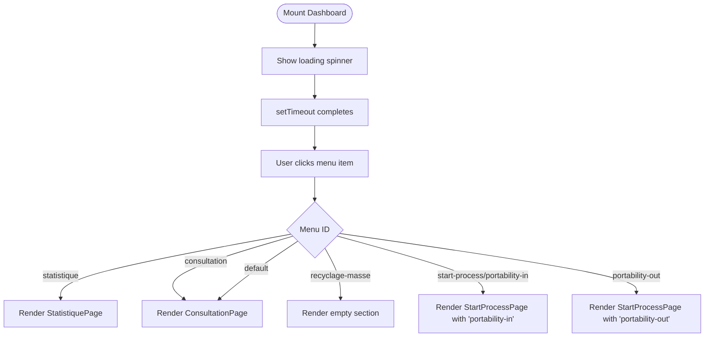
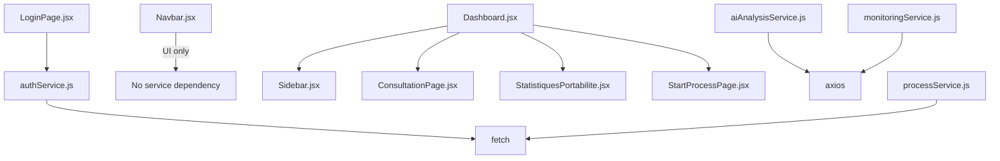

# Testing Strategy

<cite>
**Referenced Files in This Document**
- [package.json](file://package.json)
- [setupTests.js](file://src/setupTests.js)
- [App.test.js](file://src/App.test.js)
- [authService.js](file://src/services/authService.js)
- [aiAnalysisService.js](file://src/services/aiAnalysisService.js)
- [monitoringService.js](file://src/services/monitoringService.js)
- [processService.js](file://src/services/processService.js)
- [LoginPage.jsx](file://src/components/login/LoginPage.jsx)
- [Navbar.jsx](file://src/components/layout/Navbar.jsx)
- [Dashboard.jsx](file://src/components/dashboard/Dashboard.jsx)
</cite>

## Table of Contents
1. [Introduction](#introduction)
2. [Project Structure](#project-structure)
3. [Core Components](#core-components)
4. [Architecture Overview](#architecture-overview)
5. [Detailed Component Analysis](#detailed-component-analysis)
6. [Dependency Analysis](#dependency-analysis)
7. [Performance Considerations](#performance-considerations)
8. [Troubleshooting Guide](#troubleshooting-guide)
9. [Conclusion](#conclusion)
10. [Appendices](#appendices)

## Introduction
This document describes the SmartPorta testing strategy and implementation. It focuses on the testing framework setup using React Testing Library, component testing approaches, and service layer testing patterns. It explains test configuration, mock implementations, and assertion strategies. It also provides unit testing guidelines for React components, integration testing for services, and end-to-end testing considerations, along with testing utilities, helper functions, and test organization patterns.

## Project Structure
SmartPorta leverages Create React App's Jest configuration with React Testing Library. The testing stack includes:
- @testing-library/react for rendering and querying UI
- @testing-library/jest-dom for DOM assertions
- @testing-library/user-event for simulating user interactions
- axios for HTTP requests in services
- react-scripts test command for test execution

Key configuration and entry points:
- Test setup registers jest-dom matchers globally
- Root test file demonstrates basic component rendering and assertion
- Services encapsulate HTTP logic and are designed for testability via mocking

**Diagram sources**
- [package.json:1-49](file://package.json#L1-L49)
- [setupTests.js:1-6](file://src/setupTests.js#L1-L6)
- [App.test.js:1-9](file://src/App.test.js#L1-L9)

**Section sources**
- [package.json:1-49](file://package.json#L1-L49)
- [setupTests.js:1-6](file://src/setupTests.js#L1-L6)
- [App.test.js:1-9](file://src/App.test.js#L1-L9)

## Core Components
This section outlines the testing approach for the core application components and services.

- Component Testing
  - Render components under test using React Testing Library
  - Use screen queries to assert presence/absence of elements
  - Simulate user interactions with user-event
  - Assert state changes and side effects

- Service Testing
  - Mock external HTTP clients (axios/fetch) to isolate service logic
  - Verify request shapes, headers, and parameters
  - Validate returned data and error propagation

- Test Utilities
  - Global setup registers jest-dom matchers
  - Prefer deterministic timeouts and controlled async flows in tests

**Section sources**
- [setupTests.js:1-6](file://src/setupTests.js#L1-L6)
- [App.test.js:1-9](file://src/App.test.js#L1-L9)

## Architecture Overview
The testing architecture separates concerns between component-level and service-level tests. Components are tested in isolation with mocked services, while services are tested independently with mocked HTTP clients.

**Diagram sources**
- [authService.js:1-19](file://src/services/authService.js#L1-L19)
- [aiAnalysisService.js:1-37](file://src/services/aiAnalysisService.js#L1-L37)
- [monitoringService.js:1-24](file://src/services/monitoringService.js#L1-L24)
- [processService.js:1-38](file://src/services/processService.js#L1-L38)

## Detailed Component Analysis

### LoginPage Component Testing
LoginPage orchestrates a two-step login flow and interacts with authentication services. Recommended testing approach:
- Unit tests
  - Render LoginPage with onLoginSuccess callback
  - Simulate entering username and clicking Next; assert service call and avatar selection
  - Simulate entering password and clicking Login; assert success path and error handling
  - Validate error messages for empty inputs
- Mocking strategy
  - Mock checkUser and login from authService
  - Control resolved/rejected promises to exercise all branches
- Assertions
  - Use screen queries to assert rendered steps, avatar, and messages
  - Assert callback invocation on successful login

**Diagram sources**
- [LoginPage.jsx:1-94](file://src/components/login/LoginPage.jsx#L1-L94)
- [authService.js:1-19](file://src/services/authService.js#L1-L19)

**Section sources**
- [LoginPage.jsx:1-94](file://src/components/login/LoginPage.jsx#L1-L94)
- [authService.js:1-19](file://src/services/authService.js#L1-L19)

### Navbar Component Testing
Navbar renders theme controls, notifications, and profile actions. Recommended testing approach:
- Unit tests
  - Render Navbar with onLogout prop and agentName
  - Toggle theme menu and assert active theme class on document body
  - Toggle notification menu and assert notification items
  - Toggle profile menu and assert logout button presence
- Assertions
  - Use jest-dom matchers to assert theme classes on document body
  - Assert dropdown visibility and item rendering

**Diagram sources**
- [Navbar.jsx:1-124](file://src/components/layout/Navbar.jsx#L1-L124)

**Section sources**
- [Navbar.jsx:1-124](file://src/components/layout/Navbar.jsx#L1-L124)

### Dashboard Component Testing
Dashboard manages navigation between multiple subpages and loading states. Recommended testing approach:
- Unit tests
  - Render Dashboard with username and defaultPage
  - Assert loading spinner during initial mount
  - Simulate menu changes and assert corresponding subpage rendering
  - Validate default fallback to consultation page
- Assertions
  - Use screen queries to assert loading state and rendered subpage content

**Diagram sources**
- [Dashboard.jsx:1-70](file://src/components/dashboard/Dashboard.jsx#L1-L70)

**Section sources**
- [Dashboard.jsx:1-70](file://src/components/dashboard/Dashboard.jsx#L1-L70)

## Dependency Analysis
This section analyzes dependencies between components and services to inform testing strategies.

**Diagram sources**
- [LoginPage.jsx:1-94](file://src/components/login/LoginPage.jsx#L1-L94)
- [authService.js:1-19](file://src/services/authService.js#L1-L19)
- [aiAnalysisService.js:1-37](file://src/services/aiAnalysisService.js#L1-L37)
- [monitoringService.js:1-24](file://src/services/monitoringService.js#L1-L24)
- [processService.js:1-38](file://src/services/processService.js#L1-L38)

**Section sources**
- [LoginPage.jsx:1-94](file://src/components/login/LoginPage.jsx#L1-L94)
- [authService.js:1-19](file://src/services/authService.js#L1-L19)
- [aiAnalysisService.js:1-37](file://src/services/aiAnalysisService.js#L1-L37)
- [monitoringService.js:1-24](file://src/services/monitoringService.js#L1-L24)
- [processService.js:1-38](file://src/services/processService.js#L1-L38)

## Performance Considerations
- Prefer deterministic rendering and avoid unnecessary delays in tests
- Use minimal props and shallow rendering where appropriate to reduce overhead
- Mock network calls to eliminate flakiness and speed up tests
- Limit heavy DOM queries; rely on specific selectors and roles

## Troubleshooting Guide
Common issues and resolutions:
- Missing jest-dom matchers
  - Ensure global setup imports @testing-library/jest-dom
- Network flakiness
  - Mock axios/fetch in service tests to avoid real HTTP calls
- Asynchronous state updates
  - Use waitFor or screen queries that implicitly wait for elements
- Theme and DOM class assertions
  - Assert classes on document.body for theme toggles

**Section sources**
- [setupTests.js:1-6](file://src/setupTests.js#L1-L6)

## Conclusion
SmartPorta’s testing strategy centers on React Testing Library for component tests and isolated service tests with mocked HTTP clients. The approach emphasizes deterministic rendering, focused assertions, and clear separation between UI and service concerns. By following the guidelines and patterns outlined here, teams can maintain reliable, readable, and maintainable tests across the application.

## Appendices

### Test Execution Workflow
- Run tests with the test script configured in package.json
- Use watch mode for iterative development
- Leverage user-event for realistic user interactions
- Combine jest-dom matchers with React Testing Library queries for robust assertions

**Section sources**
- [package.json:24-29](file://package.json#L24-L29)